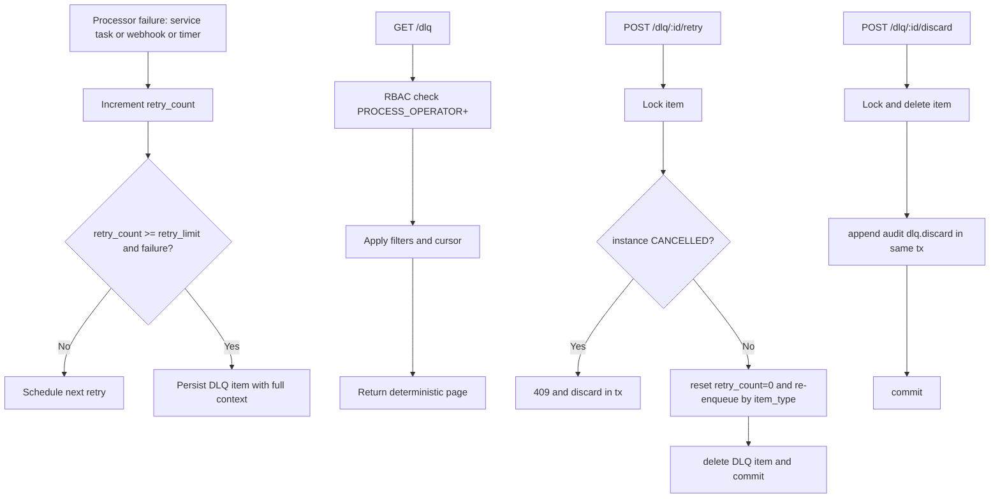
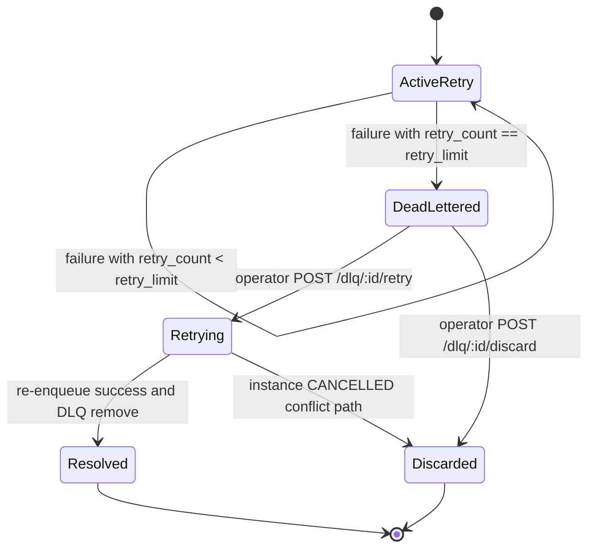

# Module: obs-05-dead-letter-queue

**Covers:** OBS-05 (Dead letter queue)
**Related:** EXT-01 (SERVICE_TASK failures), EXT-02 (webhook failures), SCH timers (timer firing failures), OBS-03 (audit on discard), API-06 (cursor pagination), API-08 and IDN RBAC (operator authorization), EE-10 (ERROR state resume path)
**Primary design targets:** src/dlq/store.zig, src/api/routes/dlq.zig, src/engine/retry_policy.zig, src/scheduler/scheduler.zig, src/webhook/dispatcher.zig, src/obs/audit.zig

## Module purpose

The OBS-05 module defines a durable dead letter queue (DLQ) for failed processing units that exceed retry budget N (configurable, default 3). It standardizes how SERVICE_TASK, webhook dispatch, and timer-firing failures are persisted with full forensic context, how operators inspect and page through items, and how retry/discard actions are performed with strict RBAC and transactional safety. It also defines deterministic recovery behavior for conflict states (including CANCELLED instances), idempotency boundaries, and audit integration for discard actions.

## Module boundaries

- src/dlq/store.zig
  - Owns DLQ persistence model, insert/list/load/delete operations, and transaction-safe state transitions for retry/discard.
- src/api/routes/dlq.zig
  - Owns GET and POST route contracts, filter parsing, API-06 pagination integration, RBAC enforcement, and HTTP error mapping.
- src/engine/retry_policy.zig
  - Owns retry budget accounting and transition-to-DLQ decision (`retry_count >= retry_limit`).
- src/scheduler/scheduler.zig
  - Produces timer-failure DLQ inserts when retries are exhausted.
- src/webhook/dispatcher.zig
  - Produces webhook-failure DLQ inserts when retries are exhausted.
- src/engine/service_task.zig
  - Produces service-task-failure DLQ inserts when retries are exhausted.
- src/obs/audit.zig
  - Receives mandatory audit append for discard action (`dlq.discard`) with actor/action conventions from OBS-03.

Out of scope:

- Alert thresholding and notification hooks (OBS-06).
- UI rendering behavior for DLQ pages (frontend concern).

## Public interface

### HTTP contract

1. GET /dlq
- AuthZ: role PROCESS_OPERATOR or PLATFORM_ADMIN.
- Query params:
  - cursor (optional, API-06 opaque cursor)
  - page_size (optional, default 50, max 200)
  - instance_id (optional UUID)
  - item_type (optional enum: SERVICE_TASK | WEBHOOK | TIMER)
- Ordering: deterministic newest-first by created_at DESC, tie-breaker dlq_id DESC.
- Response:

```json
{
  "items": [
    {
      "id": "2db341f7-59d3-4d4e-a8f6-f4eef7ca6f63",
      "instance_id": "6a6dcce0-a0f1-4f23-8bc5-04d4e247f4bf",
      "item_type": "SERVICE_TASK",
      "retry_count": 3,
      "retry_limit": 3,
      "original_payload": {"node_id": "charge_card", "input": {"amount": 150}},
      "error_chain": [
        {"code": "HTTP_TIMEOUT", "message": "timeout after 30000ms", "at": "2026-05-25T04:10:00Z"}
      ],
      "processor_metadata": {"source_module": "engine.service_task", "trace_id": "c91f..."},
      "first_failed_at": "2026-05-25T04:09:10Z",
      "last_failed_at": "2026-05-25T04:10:00Z",
      "created_at": "2026-05-25T04:10:00Z"
    }
  ],
  "next_cursor": "RExROjE3NDgxNDYyMDAwMDAwMDA6MmRiMzQxZjc",
  "count": 1
}
```

2. POST /dlq/:id/retry
- AuthZ: role PROCESS_OPERATOR or PLATFORM_ADMIN.
- Request body: empty object `{}`.
- Success: `202 Accepted` with resubmission metadata.
- Semantics:
  - Reset retry counter to 0 before re-enqueue/resubmission.
  - Resubmit according to item_type flow (defined below).
  - On successful resubmission transaction: remove item from DLQ.

3. POST /dlq/:id/discard
- AuthZ: role PROCESS_OPERATOR or PLATFORM_ADMIN.
- Request body: optional reason field.
- Success: `200 OK` with discarded id.
- Semantics:
  - Permanently remove item from DLQ.
  - Append mandatory OBS-03 audit record in the same transaction.

### Zig types

```zig
pub const DlqItemType = enum { SERVICE_TASK, WEBHOOK, TIMER };

pub const DlqErrorNode = struct {
    code: []const u8,
    message: []const u8,
    at_us: i64,
};

pub const DlqItem = struct {
    dlq_id: [16]u8,
    instance_id: ?[16]u8,
    item_type: DlqItemType,
    retry_count: u16,
    retry_limit: u16,
    original_payload_json: []const u8,
    error_chain_json: []const u8,
    processor_metadata_json: []const u8,
    first_failed_at_us: i64,
    last_failed_at_us: i64,
    created_at_us: i64,
};

pub const DlqListFilters = struct {
    cursor: ?[]const u8,
    page_size: ?u16,
    instance_id: ?[16]u8,
    item_type: ?DlqItemType,
};

pub const DlqStoreError = error{
    ItemNotFound,
    InvalidFilter,
    InvalidCursor,
    CursorExpired,
    Forbidden,
    InvalidState,
    InstanceCancelled,
    ResubmitFailed,
    AuditAppendFailed,
    PersistenceFailure,
    OutOfMemory,
};
```

### Zig functions

```zig
pub fn moveToDlqInTx(
    allocator: std.mem.Allocator,
    tx: *db.Tx,
    input: MoveToDlqInput,
) DlqStoreError!DlqItem;

pub fn listDlq(
    allocator: std.mem.Allocator,
    pool: *db.Pool,
    filters: DlqListFilters,
) DlqStoreError!pagination.PageResponse(DlqItem);

pub fn retryDlqItem(
    allocator: std.mem.Allocator,
    pool: *db.Pool,
    actor_id: [16]u8,
    dlq_id: [16]u8,
) DlqStoreError!RetryResult;

pub fn discardDlqItem(
    allocator: std.mem.Allocator,
    pool: *db.Pool,
    actor_id: [16]u8,
    dlq_id: [16]u8,
    reason: ?[]const u8,
) DlqStoreError!DiscardResult;
```

## Data model and full-context persistence

Required stored context for every DLQ item:

| Field | Type | Rule |
|---|---|---|
| dlq_id | UUID | Stable identifier for operator actions |
| instance_id | UUID nullable | Required for SERVICE_TASK and TIMER, optional for WEBHOOK system-level failures |
| item_type | enum | One of SERVICE_TASK, WEBHOOK, TIMER |
| retry_count | int | Equals exhausted count at DLQ insertion time |
| retry_limit | int | Effective configured N (default 3 if unset) |
| original_payload | JSON | Original processing payload/context (node config, timer id, webhook delivery payload) |
| error_chain | JSON array | Ordered causal chain from earliest to latest failure |
| processor_metadata | JSON | Source module, trace_id, token metadata, attempt timestamps |
| first_failed_at | timestamptz | Timestamp of first failed attempt in chain |
| last_failed_at | timestamptz | Timestamp of final failed attempt |
| created_at | timestamptz | DLQ insertion timestamp |

Persistence lifecycle:

1. Failure recorded by processor module (service task, webhook, timer).
2. Retry policy increments retry_count.
3. When retry_count reaches retry_limit and attempt fails, transaction writes DLQ item with full context.
4. Item remains until one terminal operator action:
  - retry success path removes item.
  - discard removes item and appends audit.

## Retry-limit transition rules

Rules:

1. Retry budget is configurable per processor input; fallback to default 3.
2. DLQ transition condition is `attempt_index == retry_limit` and attempt result is failure.
3. Transition to DLQ must occur in same transaction that records exhausted-failure outcome for the processor.
4. Duplicate move requests for same failure event are idempotent by unique source key `(item_type, source_ref, last_failed_at)`.

## Resubmission semantics by item type

Retry action pipeline:

1. Load DLQ item by id with row lock `FOR UPDATE`.
2. If not found: 404.
3. If linked instance exists and status is CANCELLED:
  - return HTTP 409 conflict.
  - discard the item in same transaction (edge-case requirement).
4. Else reset retry_count to 0 in resubmission envelope.
5. Re-enqueue by item_type:
  - SERVICE_TASK: recreate pending service invocation work item for original node/instance.
  - WEBHOOK: recreate outbound delivery job with original payload/subscription context.
  - TIMER: recreate timer firing command for original timer target.
6. If enqueue succeeds: delete DLQ item and commit.
7. If enqueue fails: rollback, keep DLQ item unchanged.

Idempotency constraints:

1. Client-level idempotency key is optional but supported via API middleware.
2. Server-side retry endpoint must be idempotent for repeated identical request while first retry is in-flight:
  - use row lock and operation token (`retry_op_id`) to avoid double enqueue.
3. Repeating POST /dlq/:id/retry after success returns 404 (item already removed) and does not duplicate work.

## Discard semantics and OBS-03 audit integration

Discard action pipeline:

1. Load DLQ item by id with row lock.
2. Delete DLQ item permanently.
3. Append OBS-03 audit row in same transaction:
  - resource_type: `dlq`
  - resource_id: `<dlq_id>`
  - action: `dlq.discard`
  - actor_id: authenticated operator id
  - before_state: serialized full DLQ item
  - after_state: null
4. Commit transaction.

Failure behavior:

1. If audit append fails, discard rolls back and item remains.
2. If delete fails, no audit row is written.

## API-06 pagination and ordering details for GET /dlq

Cursor format:

- Prefix: `DLQ:`
- Raw payload: `DLQ:{created_at_us}:{dlq_id}` base64url encoded
- Expiry: 24h (API-06)

Continuation predicate:

- Primary sort DESC by created_at
- Tie-break DESC by dlq_id
- Continuation filter:
  - `(created_at < :cursor_created_at)` OR
  - `(created_at = :cursor_created_at AND dlq_id < :cursor_dlq_id)`

Determinism guarantees:

1. No duplicates between pages for stable snapshots.
2. No missing rows within a cursor walk.
3. New inserts after first page appear only in future fresh query roots, not in an existing cursor stream.

## Security model

RBAC requirements:

1. GET /dlq, POST /dlq/:id/retry, POST /dlq/:id/discard require PROCESS_OPERATOR or PLATFORM_ADMIN.
2. TASK_WORKER and PROCESS_DESIGNER receive HTTP 403.
3. Unauthenticated requests receive HTTP 401.

Data protection requirements:

1. Sensitive payload fields in original_payload and error_chain are redacted at write time using existing secret-redaction policy.
2. No SQL string interpolation in DLQ queries; prepared statements only.
3. Actor identity is read from authenticated context only.

## Failure semantics and status mapping

| Condition | HTTP | Behavior |
|---|---|---|
| Missing DLQ item id | 404 | Return not found; no state change |
| Invalid query filter/cursor | 422 | RFC 9457 validation body |
| Expired cursor | 410 | RFC 9457 cursor-expired body |
| Forbidden role | 403 | Reject before data access |
| Retry on CANCELLED instance | 409 | Conflict response and discard item in same transaction |
| Retry enqueue failure | 500/503 | Rollback; keep DLQ item |
| Discard audit append failure | 500 | Rollback; keep DLQ item |

## Data flow diagram



## State transitions



## Dependencies and forbidden dependencies

Depends on:

1. src/api/pagination.zig for cursor/page rules.
2. src/api/middleware/auth.zig and src/api/middleware/rbac.zig for actor/role enforcement.
3. src/obs/audit.zig for discard audit append.
4. Processor modules (engine.service_task, webhook.dispatcher, scheduler) as producers.
5. Database table dead_letter_items and related retry source tables.

Must not depend on:

1. Frontend modules under web/.
2. src/engine/transition.zig for I/O (DLQ store is I/O boundary).
3. Direct logging side effects in persistence functions beyond returned typed errors.

## Key invariants

1. Every DLQ item contains full context fields required by OBS-05.
2. A DLQ item exists only for exhausted-retry failures.
3. Retry or discard is atomic: no partial state where item is deleted without corresponding enqueue/audit success.
4. Retry on CANCELLED instance always yields HTTP 409 and item discard.
5. GET /dlq ordering is deterministic with stable cursor semantics.

## Requirement-to-design traceability matrix

| OBS-05 criterion / edge case | Design element(s) | Module/function targets | Test obligations |
|---|---|---|---|
| AC1: exhausted retries move SERVICE_TASK/webhook/timer to DLQ with full context | Data model and full-context persistence; Retry-limit transition rules | src/engine/retry_policy.zig::onAttemptFailed, src/dlq/store.zig::moveToDlqInTx, src/webhook/dispatcher.zig, src/scheduler/scheduler.zig | Integration tests for each producer type asserting full context fields persisted |
| AC2: GET /dlq paginated, filterable by instance_id and item_type, operator role required | HTTP contract GET /dlq; API-06 pagination and ordering; Security model | src/api/routes/dlq.zig::handleListDlq, src/dlq/store.zig::listDlq | API tests for filter combos, cursor paging, deterministic order, 401/403 gating |
| AC3: POST /dlq/:id/retry resets retry counter to 0 and re-submits | Retry action pipeline and resubmission semantics by item type | src/api/routes/dlq.zig::handleRetryDlqItem, src/dlq/store.zig::retryDlqItem | Integration tests validate reset counter and re-enqueue for SERVICE_TASK/WEBHOOK/TIMER |
| AC4: POST /dlq/:id/discard permanently removes item and appends OBS-03 audit | Discard semantics and OBS-03 audit integration | src/api/routes/dlq.zig::handleDiscardDlqItem, src/dlq/store.zig::discardDlqItem, src/obs/audit.zig::insertAuditInTx | Integration tests assert item deletion plus audit action dlq.discard in same transaction |
| Edge: retry on CANCELLED instance rejected 409 and item discarded | Resubmission semantics by item type (CANCELLED branch); Failure semantics table | src/dlq/store.zig::retryDlqItem, instance status lookup path | Integration test for CANCELLED instance asserts 409 response and item removal |
| Edge: retry succeeds -> item removed and instance resumes | Resubmission semantics by item type; state transitions | src/dlq/store.zig::retryDlqItem, processor enqueue paths | Integration test asserts DLQ removal and downstream processing resumes |
| Contract detail: deterministic ordering with API-06 cursor stability | API-06 pagination and ordering details | src/dlq/store.zig::listDlq, src/api/pagination.zig | Pagination continuity test for duplicate/gap-free traversal |
| Contract detail: idempotency and no double enqueue on repeated retry request | Idempotency constraints section | src/dlq/store.zig::retryDlqItem | Concurrency test with repeated retry calls on same id |
| Contract detail: discard audit actor/action conventions from OBS-03 | Discard semantics and OBS-03 audit integration | src/obs/audit.zig, src/api/middleware/audit.zig mapping | Audit contract test for action=dlq.discard, resource_type=dlq |

## Open questions

1. For webhook-origin DLQ items not tied to a specific instance, confirm whether instance_id is nullable in API response or represented as a sentinel value.
2. Confirm whether 409 CANCELLED-retry response should include a body flag indicating discard already executed (`discarded: true`) for operator UX clarity.