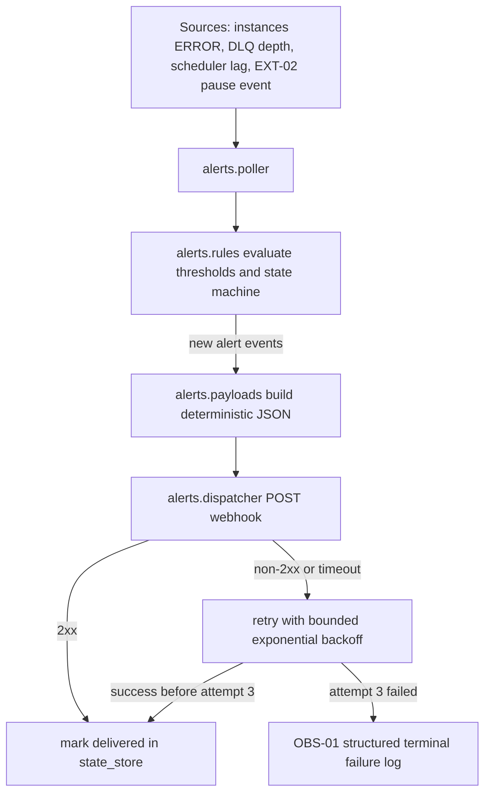
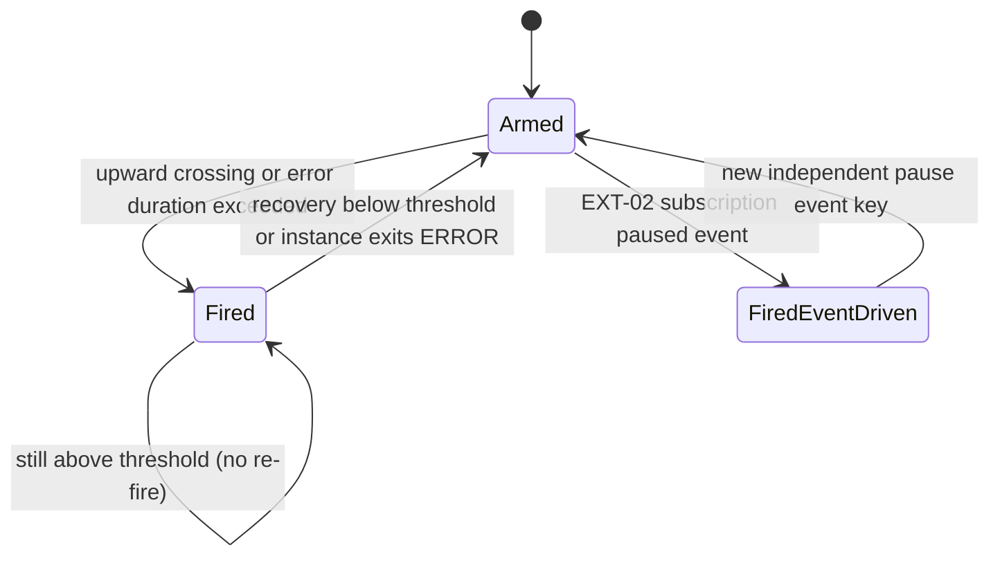

# Module: obs-06-alerting-hooks

**Covers:** OBS-06 (Alerting hooks)  
**Related:** OBS-01 (structured logging), OBS-05 (DLQ depth source), SCH-02 (scheduler lag source), EXT-02 (subscription pause alert), API-09 (trace propagation)

## Module purpose

The OBS-06 alerting-hooks module provides configurable webhook-based operational alerts for three required trigger families: instance stuck in ERROR for longer than a configured duration, DLQ depth threshold crossing, and scheduler lag threshold breach. The module guarantees deterministic one-shot threshold behavior (fire once while above threshold, re-arm only after recovery), bounded delivery retries (3 attempts with exponential backoff), and terminal structured logging for failed deliveries without unbounded retry loops.

## Module boundaries

- `src/obs/alerts/config.zig`
  - Owns validated alerting-hook configuration parsing and hot-reload-safe in-memory snapshot.
- `src/obs/alerts/rules.zig`
  - Owns trigger rule evaluation and one-shot/re-arm state machine semantics.
- `src/obs/alerts/state_store.zig`
  - Owns durable per-trigger state (armed/fired epoch, last crossing markers, dedupe keys).
- `src/obs/alerts/payloads.zig`
  - Owns deterministic webhook payload construction and correlation id composition.
- `src/obs/alerts/dispatcher.zig`
  - Owns outbound webhook delivery with retries, exponential backoff, and terminal failure logging.
- `src/obs/alerts/poller.zig`
  - Owns periodic source sampling (ERROR instances, DLQ depth, scheduler lag) and rule invocation.

Out of scope:

- Business workflow webhooks in EXT-02 primary dispatcher (OBS-06 only consumes its pause signal).
- UI dashboards or alert management frontend behavior.

## Public interface

### Zig types

```zig
pub const AlertType = enum {
    instance_error_stuck,
    dlq_depth_threshold,
    scheduler_lag_threshold,
    webhook_subscription_paused, // EXT-02 integration
};

pub const RetryPolicy = struct {
    max_attempts: u8, // must be 3 for OBS-06
    base_backoff_ms: u32, // default 1000
    max_backoff_ms: u32, // default 30000
    multiplier: f32, // default 2.0
};

pub const AlertHookConfig = struct {
    hook_id: []const u8,
    enabled: bool,
    destination_url: []const u8,
    timeout_ms: u32,
    auth_secret_ref: ?[]const u8,
    static_headers_json: []const u8, // validated map[string]string
    event_filter: []const AlertType,
    retry_policy: RetryPolicy,
};

pub const AlertThresholds = struct {
    error_stuck_minutes: u32,
    dlq_depth_threshold: u32,
    scheduler_lag_ms: u32,
};

pub const AlertEvaluationInput = struct {
    now_us: i64,
    thresholds: AlertThresholds,
    error_instances: []const ErrorInstanceSnapshot,
    dlq_depth: u64,
    scheduler_lag_ms: u64,
};

pub const AlertEvent = struct {
    alert_id: [16]u8,
    hook_id: []const u8,
    alert_type: AlertType,
    trigger_key: []const u8,
    correlation_id: []const u8,
    payload_json: []const u8,
    occurred_at_us: i64,
};

pub const AlertError = error{
    InvalidConfig,
    SecretResolutionFailed,
    StateReadFailed,
    StateWriteFailed,
    PayloadBuildFailed,
    DeliveryFailed,
    DeliveryTimeout,
    TerminalDeliveryFailure,
    OutOfMemory,
};
```

### Zig functions

```zig
pub fn loadAlertHookConfig(
    allocator: std.mem.Allocator,
    env: *const ConfigEnv,
) AlertError![]AlertHookConfig;

pub fn evaluateAlertRules(
    allocator: std.mem.Allocator,
    input: AlertEvaluationInput,
    state: *AlertStateStore,
) AlertError![]AlertEvent;

pub fn dispatchAlertEvent(
    allocator: std.mem.Allocator,
    client: *http.Client,
    logger: *obs.Logger,
    event: AlertEvent,
    hook: AlertHookConfig,
) AlertError!void;

pub fn buildAlertPayload(
    allocator: std.mem.Allocator,
    event: AlertEvent,
    source: AlertPayloadSource,
) AlertError![]const u8;

pub fn handleWebhookSubscriptionPaused(
    allocator: std.mem.Allocator,
    subscription: WebhookSubscriptionSnapshot,
    reason: []const u8,
    occurred_at_us: i64,
) AlertError!?AlertEvent;
```

### Configuration schema

```json
{
  "obs_alerting": {
    "enabled": true,
    "poll_interval_ms": 5000,
    "thresholds": {
      "error_stuck_minutes": 10,
      "dlq_depth_threshold": 100,
      "scheduler_lag_ms": 15000
    },
    "hooks": [
      {
        "hook_id": "ops-primary",
        "enabled": true,
        "destination_url": "https://alerts.example.com/bpm",
        "event_filter": [
          "instance_error_stuck",
          "dlq_depth_threshold",
          "scheduler_lag_threshold",
          "webhook_subscription_paused"
        ],
        "auth": {
          "type": "hmac_sha256",
          "secret_ref": "BPM_ALERT_HOOK_OPS_PRIMARY_SECRET"
        },
        "headers": {
          "X-BPM-Alert-Source": "bpm-platform"
        },
        "timeout_ms": 5000,
        "retry_policy": {
          "max_attempts": 3,
          "base_backoff_ms": 1000,
          "multiplier": 2,
          "max_backoff_ms": 30000
        }
      }
    ]
  }
}
```

Security handling rules:

1. `auth.secret_ref` is the only supported secret input; raw secrets are never stored in config files or logs.
2. Header values are validated and redacted in logs when key names match secret/token patterns.
3. Destination URLs must be absolute `https://` in production mode.

## Trigger semantics and one-shot state machine

### Trigger 1: instance stuck in ERROR > N minutes

1. Evaluate each instance with `status = ERROR` and known error entry time.
2. Fire alert when `error_duration_minutes > error_stuck_minutes` and trigger key `instance:<instance_id>:error_stuck` is armed.
3. One alert per instance while it remains in ERROR.
4. Re-arm only after instance exits ERROR (`ACTIVE`, `COMPLETED`, or `CANCELLED`) and enters ERROR again.

### Trigger 2: DLQ depth threshold crossing

1. Track previous depth sample and armed state for key `dlq:depth`.
2. Fire only on upward crossing: `prev_depth < threshold` and `current_depth >= threshold` while armed.
3. Do not re-fire while `current_depth >= threshold`.
4. Re-arm when `current_depth < threshold`.

### Trigger 3: scheduler lag threshold breach

1. Scheduler lag source is `actual_poll_interval_ms - configured_poll_interval_ms` from SCH-02 poll loop.
2. Fire on upward crossing for key `scheduler:lag`: `prev_lag < threshold` and `current_lag >= threshold` while armed.
3. Suppress duplicate alerts while lag stays above threshold.
4. Re-arm when lag drops below threshold.

### EXT-02 integration signal

When EXT-02 pauses a subscription after 5 failed deliveries, it emits `webhook_subscription_paused` to this module. This signal is event-driven (not threshold-based) and fires per paused subscription id.

## Payload contracts (deterministic)

All payloads are JSON objects with deterministic required keys and stable ordering in serializer tests.

Common envelope fields:

- `schema_version` (string)
- `alert_id` (uuid)
- `alert_type` (string enum)
- `hook_id` (string)
- `correlation_id` (string)
- `occurred_at` (ISO8601 UTC)
- `source_component` (string)
- `trace_id` (string, may be empty for background events)

### `instance_error_stuck` payload

- `instance_id` (uuid)
- `definition_id` (uuid)
- `error_reason` (string)
- `error_since` (ISO8601 UTC)
- `error_duration_minutes` (number)
- `status` = `ERROR`

### `dlq_depth_threshold` payload

- `threshold` (number)
- `current_depth` (number)
- `previous_depth` (number)
- `crossing_direction` = `upward`

### `scheduler_lag_threshold` payload

- `threshold_ms` (number)
- `current_lag_ms` (number)
- `previous_lag_ms` (number)
- `configured_poll_interval_ms` (number)

### `webhook_subscription_paused` payload

- `subscription_id` (uuid)
- `target_url` (string)
- `failure_count` (number, expected 5)
- `paused_at` (ISO8601 UTC)
- `pause_reason` (string)

Correlation id contract:

- Format: `obs06:<alert_type>:<trigger_key>:<occurred_at_epoch_ms>`
- Deterministic for the same emitted alert event.
- Used as outbound idempotency key via `X-BPM-Correlation-Id` header.

## Delivery guarantees and failure handling

1. Delivery guarantee: at-least-once per emitted alert event, bounded to max 3 attempts.
2. Retry schedule with defaults: attempt 1 immediate, attempt 2 after 1s, attempt 3 after 2s (`base_backoff_ms * multiplier^(attempt-1)`), clamped by `max_backoff_ms`.
3. Non-2xx or timeout counts as failure.
4. After 3 failed attempts, no further retries are scheduled.
5. Terminal failure emits OBS-01 structured ERROR log containing:
   - `component = "obs.alerts.dispatcher"`
   - `message = "alert webhook delivery exhausted retries"`
   - `trace_id`, `correlation_id`, `alert_type`, `destination_url`, `attempt_count = 3`, `last_error` (redacted as needed)

No unbounded retry loops are permitted in memory or persisted queues.

## Idempotency safeguards

1. Per-event dedupe key: `hash(hook_id + alert_type + trigger_key + crossing_epoch_bucket)`.
2. `state_store` persists last-emitted key for each trigger key and hook id to prevent duplicate emission across restarts.
3. Dispatcher includes `X-BPM-Alert-Id` and `X-BPM-Correlation-Id` for consumer dedupe.
4. Retries reuse identical payload and identifiers; only attempt metadata changes.

## Data flow



## State transitions



## Error taxonomy

| Condition | Error | Handling |
|---|---|---|
| Invalid destination URL, threshold <= 0, invalid retry policy | `InvalidConfig` | Reject startup or config reload |
| Secret reference missing or unresolved | `SecretResolutionFailed` | Disable affected hook, emit WARN |
| Trigger state read/write failure | `StateReadFailed` / `StateWriteFailed` | Skip emission for cycle, emit ERROR |
| Payload serialization failure | `PayloadBuildFailed` | Do not dispatch, emit ERROR |
| HTTP timeout | `DeliveryTimeout` | Retry until attempt 3 |
| Non-2xx or transport error | `DeliveryFailed` | Retry until attempt 3 |
| Attempts exhausted | `TerminalDeliveryFailure` | OBS-01 structured log; stop retries |

## Dependencies and prohibited dependencies

Depends on:

1. `src/scheduler/scheduler.zig` for poll interval and lag samples (SCH-02).
2. `src/dlq/store.zig` for current DLQ depth (OBS-05).
3. `src/webhook/dispatcher.zig` and webhook subscription state for EXT-02 pause events.
4. `src/obs/logger.zig` for terminal failure logs (OBS-01).
5. DB table for persisted alert trigger state (new module-local state table).

Must not depend on:

1. `src/engine/transition.zig` (pure execution kernel).
2. Frontend modules under `web/`.
3. Any unbounded in-memory queue for retries.

## Requirement-to-design traceability matrix

| Requirement / edge case | Design element(s) | Module/function targets | Test obligations |
|---|---|---|---|
| OBS-06 AC1: ERROR > N minutes sends webhook with instance, reason, duration | Trigger 1 semantics; `instance_error_stuck` payload contract | `alerts.rules.evaluateAlertRules`, `alerts.payloads.buildAlertPayload` | Integration test: instance in ERROR exceeds N, webhook body contains required deterministic fields |
| OBS-06 AC2: DLQ threshold crossing fires once while above threshold | Trigger 2 upward crossing + re-arm semantics | `alerts.rules.evaluateAlertRules`, `alerts.state_store` | Unit test for crossing, hold-above suppression, and re-arm after drop-below |
| OBS-06 AC3: scheduler lag threshold breach fires alert | Trigger 3 semantics with SCH-02 lag source | `alerts.poller`, `alerts.rules.evaluateAlertRules` | Scheduler integration test injecting lag values; alert emitted on breach |
| OBS-06 AC4: failed deliveries retried 3 times exponential backoff, then logged only | Delivery guarantees + failure handling section | `alerts.dispatcher.dispatchAlertEvent`, `obs.logger` | Dispatcher test verifies 3 attempts only, backoff schedule, terminal OBS-01 log emitted |
| Edge: multiple instances entering ERROR simultaneously produce per-instance alerts | Trigger key `instance:<id>:error_stuck` and one-alert-per-instance rule | `alerts.rules.evaluateAlertRules` | Integration test with multiple instances in ERROR confirms one alert per instance |
| Edge: DLQ drops below threshold then rises again fires again | DLQ re-arm state machine | `alerts.state_store`, `alerts.rules` | State-machine test: cross up, recover down, cross up again -> two alerts |
| Handoff requirement: one-shot threshold semantics for all threshold triggers | Armed/Fired transitions and re-arm rules | `alerts.rules`, `alerts.state_store` | Shared table-driven tests across dlq_depth and scheduler_lag trigger families |
| Handoff requirement: security handling for auth headers/secrets | Config schema + secret_ref-only policy | `alerts.config.loadAlertHookConfig` | Config validation tests for missing secret ref, header redaction behavior |
| Handoff requirement: deterministic payload fields and correlation ids | Payload contracts + correlation id format | `alerts.payloads.buildAlertPayload` | Snapshot/unit tests for field completeness and deterministic correlation id generation |
| Handoff requirement: integration with EXT-02 pause notification | EXT-02 event-driven integration section | `alerts.handleWebhookSubscriptionPaused` | Integration test: subscription paused event generates OBS-06 alert payload |

## Open questions

1. Should scheduler lag use raw single-sample lag or rolling average over K polls before threshold comparison? Current design uses single-sample crossing for deterministic immediacy.
2. For hooks with overlapping event filters, should each hook receive all matched alerts independently (current design: yes), or support de-duplication across hooks?
3. Confirm final storage location for persisted alert trigger state (new table in observability schema versus reuse of existing scheduler metadata table).