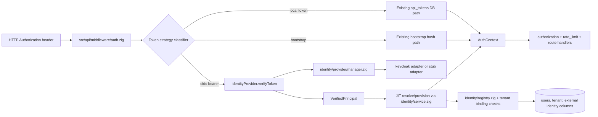
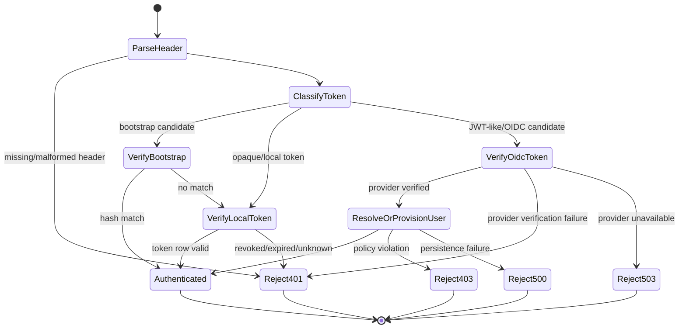

# Module: OIDC-01 Pluggable Provider Interface

## Module purpose

This module defines a provider-agnostic identity integration boundary for authentication and identity-administration workflows, so non-adapter backend code depends only on a stable `IdentityProvider` contract while Keycloak-specific protocol details remain isolated in adapter packages. The design preserves current internal token behavior (`api_tokens` and bootstrap fallback) during a migration-safe coexistence period and introduces explicit dependency inversion points for token verification, identity lookups, realm/tenant operations, provisioning, role grants, client lifecycle, federation management, and provider audit reads.

## Scope and non-goals

In scope:
- Identity provider abstraction and package boundaries.
- Backend call paths that must consume only the abstraction.
- Data contracts and error taxonomy for provider-facing operations.
- Coexistence design with existing IDN token path in `src/api/middleware/auth.zig`.
- Test touchpoints and acceptance traceability for OIDC-01.

Out of scope:
- Concrete Keycloak REST payload formats (OIDC-02).
- Provider selection/config loading implementation details (OIDC-03).
- JWT/JWKS verification algorithm details (OIDC-04/05/06/07).
- Schema migration content.

## Module and package boundaries

### Package layout (design target)

- `src/identity/provider/interface.zig`
  - Canonical provider contract, data types, error sets.
- `src/identity/provider/manager.zig`
  - Adapter registry/factory and provider selection wiring.
- `src/identity/provider/types.zig`
  - Shared value objects used by interface consumers.
- `src/identity/provider/errors.zig`
  - Shared provider-level typed error union.
- `src/identity/provider/adapters/keycloak/*.zig`
  - Keycloak-only HTTP endpoints, DTO mapping, auth/session handling.
- `src/identity/provider/adapters/stub/*.zig`
  - Test/stub adapter for isolation and compile-boundary checks.

### Boundary rules

1. Only files under `src/identity/provider/adapters/keycloak/` may reference Keycloak URLs, realm path formats, or admin payload schemas.
2. Non-adapter modules (`src/api/*`, `src/identity/service.zig`, `src/identity/registry.zig`, `src/db/*`) may import only provider interface/types/manager packages.
3. `src/api/middleware/auth.zig` becomes an orchestrator of token strategy selection and context propagation, not a provider-specific verifier.
4. Existing `api_tokens` SQL path remains local-token strategy and is not routed through provider adapter calls.

## Public interface

### Provider contract (design signatures)

```zig
pub const IdentityProvider = struct {
    ctx: *anyopaque,

    verifyTokenFn: *const fn (ctx: *anyopaque, allocator: std.mem.Allocator, input: VerifyTokenInput) VerifyTokenError!VerifiedPrincipal,
    lookupUserFn: *const fn (ctx: *anyopaque, allocator: std.mem.Allocator, input: LookupUserInput) LookupUserError!?ProviderUser,

    provisionRealmFn: *const fn (ctx: *anyopaque, allocator: std.mem.Allocator, input: ProvisionRealmInput) ProvisionRealmError!ProvisionRealmResult,
    provisionUserFn: *const fn (ctx: *anyopaque, allocator: std.mem.Allocator, input: ProvisionUserInput) ProvisionUserError!ProvisionUserResult,
    grantRolesFn: *const fn (ctx: *anyopaque, allocator: std.mem.Allocator, input: GrantRolesInput) GrantRolesError!GrantRolesResult,
    provisionClientFn: *const fn (ctx: *anyopaque, allocator: std.mem.Allocator, input: ProvisionClientInput) ProvisionClientError!ProvisionClientResult,

    upsertFederationFn: *const fn (ctx: *anyopaque, allocator: std.mem.Allocator, input: UpsertFederationInput) FederationError!FederationResult,
    deleteFederationFn: *const fn (ctx: *anyopaque, allocator: std.mem.Allocator, input: DeleteFederationInput) FederationError!void,

    listAuditEventsFn: *const fn (ctx: *anyopaque, allocator: std.mem.Allocator, input: ListAuditEventsInput) AuditEventError!AuditEventPage,
};
```

### Token path contract

```zig
pub const AuthTokenKind = enum {
    local_api_token,
    oidc_bearer,
    bootstrap_token,
};

pub const AuthVerificationInput = struct {
    raw_authorization_header: []const u8,
    request_path: []const u8,
    request_method: []const u8,
};

pub const AuthVerificationResult = struct {
    kind: AuthTokenKind,
    principal: VerifiedPrincipal,
    tenant_id: [36]u8,
    tenant_source: TenantSource,
    pipeline_run_id: ?[36]u8,
};
```

### Data contracts

```zig
pub const VerifyTokenInput = struct {
    raw_token: []const u8,
    expected_audience: []const u8,
    expected_issuer: ?[]const u8,
    now_unix_seconds: i64,
};

pub const VerifiedPrincipal = struct {
    provider_subject: []const u8,
    username: []const u8,
    display_name: []const u8,
    email: ?[]const u8,
    tenant_id: ?[36]u8,
    roles: []auth.Role,
    external_realm: ?[]const u8,
    token_id_hint: ?[]const u8,
    claim_source: ClaimSource,
};

pub const LookupUserInput = struct {
    tenant_id: []const u8,
    external_realm: []const u8,
    external_id: []const u8,
};

pub const ProvisionRealmInput = struct {
    tenant_id: []const u8,
    tenant_slug: []const u8,
    display_name: []const u8,
    desired_realm_id: ?[]const u8,
};

pub const ProvisionUserInput = struct {
    tenant_id: []const u8,
    external_realm: []const u8,
    external_id: []const u8,
    preferred_username: []const u8,
    display_name: []const u8,
    email: ?[]const u8,
    initial_roles: []const auth.Role,
};

pub const GrantRolesInput = struct {
    realm_id: []const u8,
    external_user_id: []const u8,
    roles: []const auth.Role,
};

pub const ProvisionClientInput = struct {
    realm_id: []const u8,
    client_name: []const u8,
    redirect_uris: []const []const u8,
    service_account_enabled: bool,
};

pub const UpsertFederationInput = struct {
    realm_id: []const u8,
    provider_alias: []const u8,
    provider_type: []const u8,
    config_json: []const u8,
    claim_mapping_json: []const u8,
};

pub const ListAuditEventsInput = struct {
    realm_id: []const u8,
    from_timestamp_ms: i64,
    to_timestamp_ms: i64,
    cursor: ?[]const u8,
    page_size: u16,
};
```

## Key invariants

1. Keycloak coupling invariant: No non-adapter module contains Keycloak endpoint strings or request/response DTOs.
2. Interface-only auth invariant: Any non-adapter path using external bearer verification calls only `IdentityProvider.verifyTokenFn`.
3. Coexistence invariant: Local `api_tokens` and bootstrap token verification remain functional while OIDC adapter is enabled.
4. Tenant safety invariant: Tenant context and pipeline-run context continue to be derived and propagated in auth middleware regardless of token kind.
5. Deterministic failure invariant: Provider failures are mapped to typed errors before HTTP mapping; no provider-raw message leaks to clients.

## Data flow diagram



## State transitions

### Auth verification strategy state machine



## Error taxonomy

### Provider-level errors

```zig
pub const ProviderError = error{
    InvalidToken,
    TokenExpired,
    TokenAudienceMismatch,
    TokenIssuerMismatch,
    SignatureVerificationFailed,
    ClaimValidationFailed,

    UserNotFound,
    RealmNotFound,
    ClientNotFound,
    FederationNotFound,

    DuplicateResource,
    Conflict,
    RateLimited,
    UnauthorizedAdminCall,
    ForbiddenAdminCall,

    UpstreamUnavailable,
    UpstreamTimeout,
    UpstreamProtocolError,

    NotImplemented,
    OutOfMemory,
    Internal,
};
```

### Auth integration mapping

- `InvalidToken`, `TokenExpired`, `TokenAudienceMismatch`, `TokenIssuerMismatch`, `SignatureVerificationFailed`, `ClaimValidationFailed` -> auth result unauthenticated (HTTP 401 by middleware mapping).
- `UnauthorizedAdminCall`, `ForbiddenAdminCall` during provisioning flow -> forbidden (HTTP 403) where policy-related; otherwise internal failure.
- `UpstreamUnavailable`, `UpstreamTimeout`, `RateLimited` -> service unavailable (HTTP 503).
- `OutOfMemory`, `Internal`, `UpstreamProtocolError` -> internal error (HTTP 500).

## Dependency inversion points

1. Auth middleware inversion: `src/api/middleware/auth.zig` depends on provider manager interface, not concrete adapter.
2. Provisioning inversion: `src/identity/service.zig` calls provider contract for external identity provisioning and role/client/federation operations.
3. Adapter registration inversion: `src/identity/provider/manager.zig` selects adapter by config key and returns `IdentityProvider` value-object with function pointers.
4. Test inversion: unit/integration tests can inject stub adapter to validate non-Keycloak modules compile and run without keycloak package symbols.

## Migration-safe coexistence with existing IDN token path

### Coexistence mode

- `coexistence_mode = dual_accept` for OIDC-33 period:
  - Accept local `api_tokens` path exactly as today.
  - Accept OIDC bearer path through `IdentityProvider.verifyToken`.
  - Keep bootstrap token path behavior unchanged (dev/provisioning safety checks).

### Routing rule

1. If token classification identifies known local token format or bootstrap hash match path, execute current logic.
2. If token is JWT-like and provider configured, run provider verification.
3. If provider verification fails with recoverable token error, return 401 without fallback to local path for the same token.
4. If provider unavailable, return 503 (do not silently downgrade security model).

### Rollout/rollback notes

- Rollout flag: `BPM_AUTH_MODE=local_only|dual_accept|oidc_only`.
- Default for OIDC-01 implementation: `dual_accept`.
- Rollback-safe operation: switching from `dual_accept` to `local_only` restores current behavior with no schema rollback and no adapter calls.
- No destructive schema/data actions are required by OIDC-01.

## Implementation touchpoints (backend)

Primary touchpoints:
- `src/api/middleware/auth.zig`
  - Extract token strategy classifier and provider verification hook.
  - Preserve tenant/pipeline claim resolution behavior and `AuthContext` contract.
- `src/identity/service.zig`
  - Add adapter-agnostic orchestration for lookup/provision lifecycle.
- `src/identity/registry.zig`
  - Reuse external identity resolution/provision persistence path (`external_realm`, `external_id`).
- `src/config.zig`
  - Add provider mode/type references (detailed in OIDC-03).
- `src/api/authorization.zig`
  - No provider coupling; consumes unchanged role semantics from `AuthContext`.

New module touchpoints:
- `src/identity/provider/interface.zig`
- `src/identity/provider/manager.zig`
- `src/identity/provider/adapters/keycloak/*.zig`
- `src/identity/provider/adapters/stub/*.zig`

## Test touchpoints

Unit tests:
- `tests/unit/test_api08_auth.zig`
  - Add token strategy classification and 401/503 mapping checks.
  - Add dual-accept coexistence behavior tests.
- `tests/unit/test_api09_tracing.zig`
  - Verify trace semantics unchanged through provider path.
- New: `tests/unit/test_oidc01_provider_boundary.zig`
  - Compile-time/assertion tests that non-adapter modules import only provider interface.
- New: `tests/unit/test_oidc01_provider_stub.zig`
  - Stub adapter contract compliance and error mapping.

Integration tests:
- Existing baseline: `tests/integration/idn04_api_token_management_test.zig`
  - Confirms local token path unaffected in dual mode.
- Existing baseline: `tests/integration/adp12_default_tenant_regression_test.zig`
  - Ensures default-tenant behavior parity during coexistence.
- New: `tests/integration/oidc01_dual_accept_test.zig`
  - Verifies local + OIDC token acceptance and expected failure responses.

## OIDC-01 acceptance traceability

| OIDC-01 acceptance criterion | Design section(s) | Implementable test points |
|---|---|---|
| Platform compiles with stub provider and no Keycloak-specific code outside adapter package | Module and package boundaries; Boundary rules; Dependency inversion points | `tests/unit/test_oidc01_provider_boundary.zig`, `tests/unit/test_oidc01_provider_stub.zig` |
| Every auth path referenced by non-adapter modules uses only abstract interface | Public interface; Data flow diagram; Implementation touchpoints | `tests/unit/test_api08_auth.zig`, `tests/integration/oidc01_dual_accept_test.zig` |
| Concrete IdentityProvider contract and package boundaries are defined | Public interface; Module and package boundaries; Data contracts | Interface signature compile checks in `tests/unit/test_oidc01_provider_stub.zig` |
| No Keycloak-specific coupling outside adapter package | Boundary rules; Key invariants | Static import scan test in `tests/unit/test_oidc01_provider_boundary.zig` |
| Auth subsystem call paths depend only on interface + coexist safely with IDN path | Data flow diagram; Migration-safe coexistence with existing IDN token path; State transitions | `tests/unit/test_api08_auth.zig`, `tests/integration/idn04_api_token_management_test.zig`, `tests/integration/oidc01_dual_accept_test.zig` |

## External dependencies

Code dependencies:
- `src/api/middleware/auth.zig`
- `src/identity/service.zig`
- `src/identity/registry.zig`
- `src/config.zig`

Data dependencies:
- Existing identity and token tables (`users`, `api_tokens`, tenant binding fields).

Runtime dependencies:
- Provider endpoints and credentials are runtime configuration concerns (OIDC-03), not hard-coded in this design.

Forbidden dependencies:
- Non-adapter imports of Keycloak URL constants, DTOs, or client helpers.
- Adapter-to-route-layer circular imports.

## Open questions

1. For `dual_accept`, should token classification be explicit by configuration precedence (`local_first` vs `oidc_first`) or implicit by token shape only? Current design assumes shape-first with explicit fallback boundaries.
2. Is tenant claim source always `tenant_id`, or should provider adapter support realm-to-tenant lookup when claim is absent in OIDC-01 scope?
3. Should provider audit event retrieval include hard upper bounds/default pagination contract at interface level now, or defer exact limits to OIDC-25/OIDC-26?