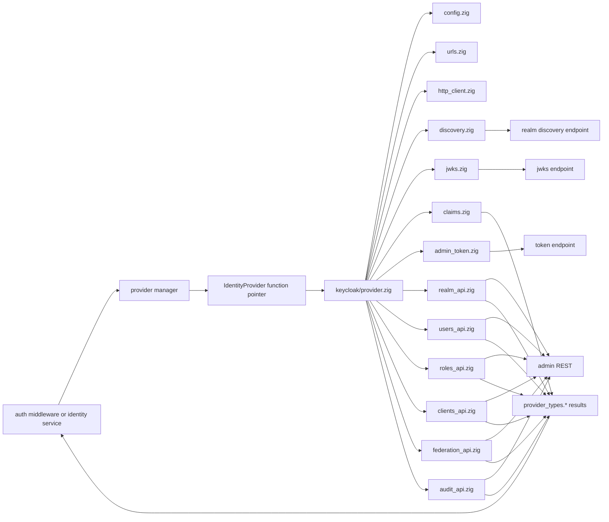
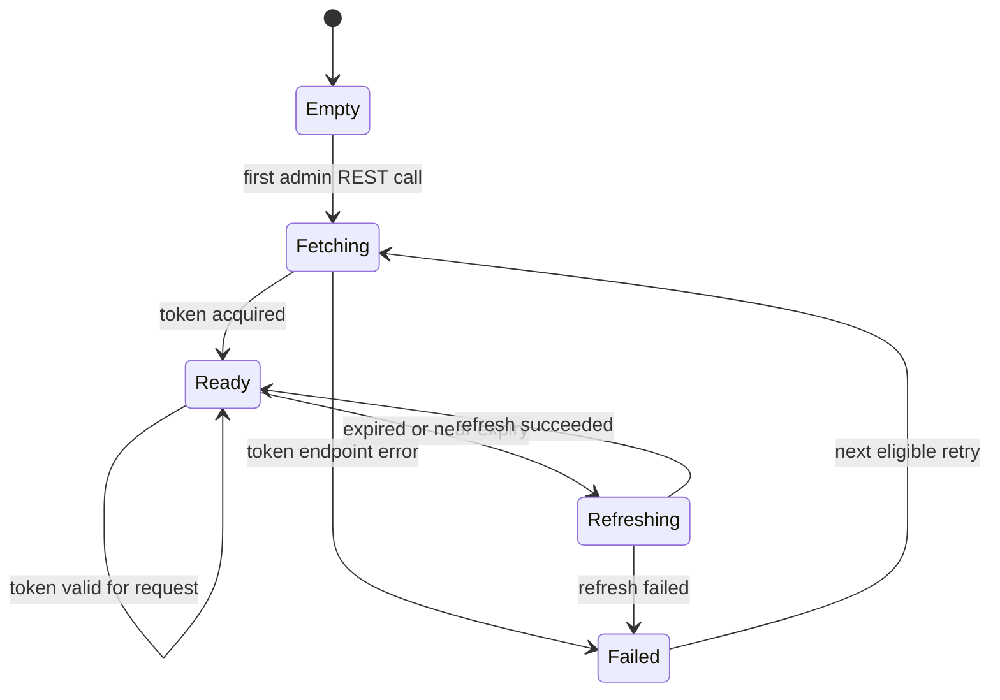
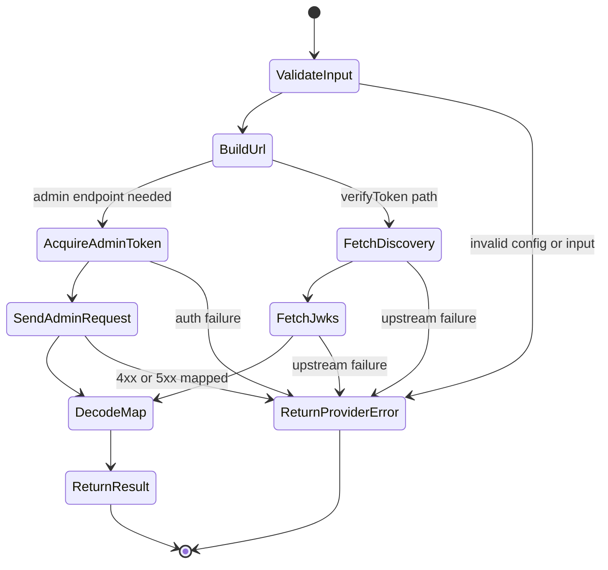

# Module: OIDC-02 Keycloak Adapter

## Module purpose

This module defines the concrete Keycloak 26.x adapter that satisfies the OIDC-01 `IdentityProvider` contract while isolating all Keycloak-specific URLs, DTOs, endpoint behavior, and admin semantics inside `src/identity/provider/adapters/keycloak/`. The design keeps the rest of the backend dependent only on `src/identity/provider/{interface,types,errors,manager}.zig`, so the adapter can be substituted or removed without forcing non-adapter modules to change or fail compilation.

## Scope and non-goals

In scope:
- Concrete package layout for the Keycloak adapter.
- Keycloak endpoint ownership for token verification, realm provisioning, user lookup/provisioning, role grants, client provisioning, federation management, and audit event reads.
- Request and response mappings between OIDC-01 provider types and Keycloak 26.x REST/OIDC payloads.
- Error mapping, dependency boundaries, test seams, and build-isolation rules.

Out of scope:
- Provider selection/config persistence details beyond the adapter inputs needed from OIDC-03.
- JWKS cache policy and claim validation policy details beyond the adapter seams later implemented by OIDC-04 through OIDC-08.
- Database schema changes. OIDC-02 requires no migration.

## Keycloak 26.x assumptions

- The provider target is the current Quarkus-based Keycloak 26.x distribution.
- OIDC discovery is available at `/realms/{realm}/.well-known/openid-configuration`.
- Realm JWKS is exposed through the discovery document's `jwks_uri`.
- Admin REST calls use the versionless Quarkus endpoints rooted at `/admin/realms/{realm}`.
- Admin authentication uses confidential-client client-credentials flow against `/realms/{admin_realm}/protocol/openid-connect/token`.
- The adapter does not rely on legacy WildFly packaging, deprecated auth endpoints, or distribution-specific filesystem behavior.

## Package layout

### Existing roots that remain provider-agnostic

- `src/identity/provider/interface.zig`
- `src/identity/provider/types.zig`
- `src/identity/provider/errors.zig`
- `src/identity/provider/manager.zig`

### Keycloak adapter package

- `src/identity/provider/adapters/keycloak/provider.zig`
  - Adapter entrypoint; exposes `Adapter`, `Config`, `init`, `deinit`, `asIdentityProvider`.
- `src/identity/provider/adapters/keycloak/config.zig`
  - Normalized Keycloak adapter configuration and validation helpers.
- `src/identity/provider/adapters/keycloak/urls.zig`
  - Keycloak-only URL construction for discovery, JWKS, admin, token, and realm-scoped routes.
- `src/identity/provider/adapters/keycloak/http_client.zig`
  - Adapter-local transport abstraction over HTTP requests and response decoding.
- `src/identity/provider/adapters/keycloak/admin_token.zig`
  - Service-account token acquisition, cache, and expiry checks for admin REST calls.
- `src/identity/provider/adapters/keycloak/discovery.zig`
  - Discovery document load and parse.
- `src/identity/provider/adapters/keycloak/jwks.zig`
  - JWKS fetch and key lookup seam used by token verification.
- `src/identity/provider/adapters/keycloak/claims.zig`
  - Standard-claim extraction and Keycloak-to-provider-role mapping.
- `src/identity/provider/adapters/keycloak/realm_api.zig`
  - Realm create/get/delete-safe read operations.
- `src/identity/provider/adapters/keycloak/users_api.zig`
  - User lookup and create/update operations.
- `src/identity/provider/adapters/keycloak/roles_api.zig`
  - Realm role lookup and role mapping application.
- `src/identity/provider/adapters/keycloak/clients_api.zig`
  - OIDC client lookup/provisioning operations.
- `src/identity/provider/adapters/keycloak/federation_api.zig`
  - Identity-provider federation upsert/delete operations.
- `src/identity/provider/adapters/keycloak/audit_api.zig`
  - Admin/audit event listing and pagination mapping.
- `src/identity/provider/adapters/keycloak/dto.zig`
  - Keycloak-specific request/response structs only used within the adapter package.
- `src/identity/provider/adapters/keycloak/testing.zig`
  - Test fixtures, fake transport builders, and payload helpers.

### Compile-isolation registration boundary

- `src/identity/provider/mod.zig` must remain abstraction-only and must not re-export `adapters.keycloak` directly.
- The Keycloak adapter is loaded through an adapter-specific bootstrap file referenced only from provider selection wiring added by OIDC-03, for example `src/identity/provider/adapters/keycloak/provider.zig` imported by config/bootstrap code, not by shared provider roots.
- Result: removing `src/identity/provider/adapters/keycloak/` from the build leaves `interface.zig`, `types.zig`, `errors.zig`, `manager.zig`, `identity/service.zig`, and `api/middleware/auth.zig` compilable with the stub or a different adapter.

## Public interface

### Adapter-local types

```zig
pub const Config = struct {
    base_url: []const u8,
    admin_base_url: ?[]const u8,
    admin_realm: []const u8,
    bootstrap_realm: []const u8,
    admin_client_id: []const u8,
    admin_client_secret_ref: []const u8,
    expected_audience: []const u8,
    expected_issuer: ?[]const u8,
    connect_timeout_ms: u32,
    request_timeout_ms: u32,
};

pub const Adapter = struct {
    allocator: std.mem.Allocator,
    config: Config,
    transport: HttpTransport,
    admin_token_source: AdminTokenSource,
    clock: Clock,

    pub fn init(allocator: std.mem.Allocator, config: Config, deps: InitDeps) !Adapter;
    pub fn deinit(self: *Adapter) void;
    pub fn asIdentityProvider(self: *Adapter) provider_interface.IdentityProvider;
};

pub const InitDeps = struct {
    transport: HttpTransport,
    clock: Clock,
    secret_resolver: SecretResolver,
};
```

### Provider contract implementation surface

`provider.zig` implements the existing OIDC-01 function-pointer contract without changing non-adapter signatures:

```zig
fn verifyToken(ctx: *anyopaque, allocator: std.mem.Allocator, input: provider_types.VerifyTokenInput) provider_errors.ProviderError!provider_types.VerifiedPrincipal;
fn lookupUser(ctx: *anyopaque, allocator: std.mem.Allocator, input: provider_types.LookupUserInput) provider_errors.ProviderError!?provider_types.ProviderUser;
fn provisionRealm(ctx: *anyopaque, allocator: std.mem.Allocator, input: provider_types.ProvisionRealmInput) provider_errors.ProviderError!provider_types.ProvisionRealmResult;
fn provisionUser(ctx: *anyopaque, allocator: std.mem.Allocator, input: provider_types.ProvisionUserInput) provider_errors.ProviderError!provider_types.ProvisionUserResult;
fn grantRoles(ctx: *anyopaque, allocator: std.mem.Allocator, input: provider_types.GrantRolesInput) provider_errors.ProviderError!provider_types.GrantRolesResult;
fn provisionClient(ctx: *anyopaque, allocator: std.mem.Allocator, input: provider_types.ProvisionClientInput) provider_errors.ProviderError!provider_types.ProvisionClientResult;
fn upsertFederation(ctx: *anyopaque, allocator: std.mem.Allocator, input: provider_types.UpsertFederationInput) provider_errors.ProviderError!provider_types.FederationResult;
fn deleteFederation(ctx: *anyopaque, allocator: std.mem.Allocator, input: provider_types.DeleteFederationInput) provider_errors.ProviderError!void;
fn listAuditEvents(ctx: *anyopaque, allocator: std.mem.Allocator, input: provider_types.ListAuditEventsInput) provider_errors.ProviderError!provider_types.AuditEventPage;
```

### Adapter helper interfaces

```zig
pub const HttpTransport = struct {
    ctx: *anyopaque,
    sendFn: *const fn (ctx: *anyopaque, allocator: std.mem.Allocator, request: HttpRequest) anyerror!HttpResponse,
};

pub const SecretResolver = struct {
    ctx: *anyopaque,
    resolveFn: *const fn (ctx: *anyopaque, allocator: std.mem.Allocator, secret_ref: []const u8) anyerror![]const u8,
};

pub const Clock = struct {
    ctx: *anyopaque,
    nowUnixSecondsFn: *const fn (ctx: *anyopaque) i64,
};
```

These helper seams are adapter-local only; they must not leak into `src/identity/provider/interface.zig`.

## Endpoint responsibilities

| Provider operation | Keycloak endpoint family | Adapter module | Responsibility |
|---|---|---|---|
| `verifyToken` | Discovery + JWKS from realm OIDC endpoints | `discovery.zig`, `jwks.zig`, `claims.zig` | Resolve realm metadata, obtain verification keys, decode claims, map to `VerifiedPrincipal` |
| `lookupUser` | `GET /admin/realms/{realm}/users/{id}` | `users_api.zig` | Load a Keycloak user by stable Keycloak user id and map to `ProviderUser` |
| `provisionRealm` | `POST /admin/realms`, `GET /admin/realms/{realm}` | `realm_api.zig` | Create or reuse realm for a tenant with idempotent existence check |
| `provisionUser` | `GET /admin/realms/{realm}/users`, `POST /admin/realms/{realm}/users` | `users_api.zig` | Reuse by external-id attribute or create a user and return Keycloak user id |
| `grantRoles` | `GET /admin/realms/{realm}/roles/{role}`, `POST /admin/realms/{realm}/users/{id}/role-mappings/realm` | `roles_api.zig` | Resolve realm-role representations and apply realm role mappings |
| `provisionClient` | `GET /admin/realms/{realm}/clients`, `POST /admin/realms/{realm}/clients` | `clients_api.zig` | Lookup or create confidential/public client and return stable client id |
| `upsertFederation` | `GET/POST/PUT /admin/realms/{realm}/identity-provider/instances{/{alias}}` | `federation_api.zig` | Create or update a realm federation provider by alias |
| `deleteFederation` | `DELETE /admin/realms/{realm}/identity-provider/instances/{alias}` | `federation_api.zig` | Delete an identity-provider instance by alias |
| `listAuditEvents` | `GET /admin/realms/{realm}/admin-events` | `audit_api.zig` | Retrieve admin events and map pagination into `AuditEventPage` |
| Admin bearer acquisition | `POST /realms/{admin_realm}/protocol/openid-connect/token` | `admin_token.zig` | Obtain and cache service-account access token for admin REST calls |

## Request and response mappings

### `verifyToken`

Input:
- `VerifyTokenInput.raw_token`
- `VerifyTokenInput.expected_audience`
- `VerifyTokenInput.expected_issuer`
- `VerifyTokenInput.now_unix_seconds`

Keycloak/OIDC mapping:
- Read issuer/discovery URL from adapter config or token issuer claim.
- Fetch discovery document and JWKS through adapter-local modules.
- Validate standard claims (`iss`, `sub`, `aud`, `exp`, `nbf`, `iat`) using generic logic hosted inside the adapter until OIDC-04 through OIDC-07 harden the shared policy.
- Read username from `preferred_username`.
- Read display name from `name`, else fallback to `preferred_username`.
- Read email from `email` when present.
- Read tenant id from custom tenant claim only if configured for the selected realm; otherwise return `tenant_id = null` and let higher-level fallback rules apply.
- Map Keycloak realm/client roles to `provider_types.ProviderRole` via `claims.zig`.

Output:
- `VerifiedPrincipal.provider_subject` <- Keycloak `sub`
- `VerifiedPrincipal.username` <- `preferred_username`
- `VerifiedPrincipal.display_name` <- `name` or `preferred_username`
- `VerifiedPrincipal.email` <- `email`
- `VerifiedPrincipal.tenant_id` <- parsed custom claim if present
- `VerifiedPrincipal.roles` <- mapped roles
- `VerifiedPrincipal.external_realm` <- resolved Keycloak realm name
- `VerifiedPrincipal.token_id_hint` <- `jti` when present

### `lookupUser`

Input:
- `LookupUserInput.tenant_id`
- `LookupUserInput.external_realm`
- `LookupUserInput.external_id`

Mapping:
- `external_realm` is the Keycloak realm name.
- `external_id` is the stable Keycloak user id.
- `users_api.zig` issues `GET /admin/realms/{realm}/users/{id}` with admin bearer.

Output:
- `ProviderUser.external_id` <- Keycloak `id`
- `ProviderUser.username` <- `username`
- `ProviderUser.display_name` <- joined first/last name when available, else username
- `ProviderUser.email` <- `email`
- `ProviderUser.active` <- `enabled`

### `provisionRealm`

Mapping:
- Desired realm id = `input.desired_realm_id` if present, otherwise normalized `tenant_slug`.
- Idempotency check = `GET /admin/realms/{realm_id}` before create.
- Create payload includes `realm`, `displayName`, `enabled = true`.

Output:
- `ProvisionRealmResult.realm_id` <- chosen realm id
- `ProvisionRealmResult.created` <- `true` only when POST created a new realm

### `provisionUser`

Mapping:
- Keycloak is authoritative for created user ids; the adapter does not attempt to force `external_id` into the Keycloak primary id field.
- `input.external_id` is persisted in a dedicated Keycloak user attribute for idempotent lookup and external identity traceability.
- Lookup order:
  1. Search for existing user by external-id attribute.
  2. Fallback to exact username search when attribute missing from older data.
  3. Create user if no existing user resolves.
- Create payload includes `username`, `email`, `enabled`, `attributes.external_id`, and display-name fields.

Output:
- `ProvisionUserResult.external_user_id` <- Keycloak `id`
- `ProvisionUserResult.created` <- `true` if POST created the user

### `grantRoles`

Mapping:
- Each `ProviderRole` maps to a configured Keycloak realm role name.
- Adapter loads role representations first, then posts the resolved representations to realm role mappings.

Output:
- `GrantRolesResult.applied` <- number of distinct role mappings submitted

### `provisionClient`

Mapping:
- `client_name` maps to Keycloak `clientId`.
- `redirect_uris` map directly to `redirectUris`.
- `service_account_enabled` maps to `serviceAccountsEnabled`.
- Default protocol is `openid-connect`.

Output:
- `ProvisionClientResult.client_id` <- stable Keycloak `clientId`
- `ProvisionClientResult.created` <- whether the client was newly created

### `upsertFederation` and `deleteFederation`

Mapping:
- `provider_alias` maps to Keycloak identity-provider alias.
- `provider_type` maps to Keycloak provider id.
- `config_json` and `claim_mapping_json` are parsed by adapter-local DTO builders and emitted into Keycloak's provider config and mapper payloads.

Output:
- `FederationResult.federation_id` <- alias for stable caller reference
- `FederationResult.created` <- create vs update

### `listAuditEvents`

Mapping:
- Use `GET /admin/realms/{realm}/admin-events`.
- `from_timestamp_ms` and `to_timestamp_ms` convert to Keycloak query fields.
- `cursor` maps to adapter-local offset token; caller never depends on Keycloak pagination shape.

Output:
- `AuditEvent.event_id` <- Keycloak event id or synthetic stable id when the endpoint omits one
- `AuditEvent.event_type` <- operation type + resource type summary
- `AuditEvent.actor_id` <- authDetails user/client identifier when present
- `AuditEvent.timestamp_ms` <- event time

## Data flow diagram



## State transitions

### Admin token lifecycle



### Provider-operation request flow



## Error taxonomy

### Input and configuration errors

- Missing or malformed `base_url`, realm id, client id, or secret reference -> `error.Internal` during adapter init after config validation has attached field context.
- Unsupported or unmapped provider role name -> `error.ClaimValidationFailed` for token path or `error.Conflict` for admin provisioning path.

### Token verification errors

- Discovery document unavailable -> `error.UpstreamUnavailable` or `error.UpstreamTimeout`
- JWKS fetch/decode failure -> `error.UpstreamProtocolError`
- Missing key id / signature mismatch -> `error.SignatureVerificationFailed`
- `exp`, `nbf`, `iss`, or `aud` mismatch -> `error.TokenExpired`, `error.TokenIssuerMismatch`, `error.TokenAudienceMismatch`, or `error.ClaimValidationFailed`
- Malformed JWT or claim parse failure -> `error.InvalidToken`

### Admin REST errors

- 401 from admin token endpoint or admin API -> `error.UnauthorizedAdminCall`
- 403 from admin API -> `error.ForbiddenAdminCall`
- 404 realm/user/client/federation not found -> `error.RealmNotFound`, `error.UserNotFound`, `error.ClientNotFound`, `error.FederationNotFound`
- 409 duplicate realm/user/client/alias -> `error.DuplicateResource` or `error.Conflict`
- 429 -> `error.RateLimited`
- 5xx or transport failure -> `error.UpstreamUnavailable` or `error.UpstreamTimeout`
- Unexpected response schema -> `error.UpstreamProtocolError`

### Memory and internal errors

- Allocation failure in payload mapping or response cloning -> `error.OutOfMemory`
- Any impossible adapter-local invariant break -> `error.Internal`

## Dependency boundaries

### Allowed dependencies

- `std`
- Adapter-local transport implementation
- `src/identity/provider/{interface,types,errors}.zig`
- Provider selection/config wiring owned by OIDC-03

### Backend touchpoints

- `src/identity/provider/manager.zig`
  - Continues to invoke `IdentityProvider` methods only; no Keycloak knowledge.
- `src/identity/service.zig`
  - Consumes `Manager` and provider types only; no adapter imports.
- `src/api/middleware/auth.zig`
  - Calls manager token-verification path only; no Keycloak URLs or DTOs.
- `build.zig`
  - Keeps `identity_provider` root module pointed at `src/identity/provider/mod.zig`.
  - Must not require non-adapter code to import `src/identity/provider/adapters/keycloak/provider.zig`.

### Forbidden dependencies

- No Keycloak imports from `src/api/**`, `src/identity/service.zig`, `src/identity/registry.zig`, or `src/config.zig` beyond opaque adapter bootstrap configuration.
- No Keycloak DTOs outside `src/identity/provider/adapters/keycloak/dto.zig`.
- No database, scheduler, audit-store, or route-handler direct dependencies inside adapter modules.
- No adapter dependency on frontend modules or docs-generated artifacts.

## Build wiring and compile-isolation expectations

1. The `identity_provider` build module remains the only dependency imported by the rest of the backend.
2. `src/identity/provider/mod.zig` exports only abstraction roots and optional generic registration helpers. It must not hard-import concrete adapters.
3. Concrete adapter selection happens in startup/config wiring. The selected adapter instance is converted to `IdentityProvider` and placed into `manager.Manager.provider`.
4. A stub-only build remains possible by compiling without any Keycloak adapter import sites. This is the acceptance check for OIDC-02 compile isolation.
5. Replacing Keycloak with a different adapter requires only:
   - a new adapter package under `src/identity/provider/adapters/<name>/`
   - provider-selection wiring changes in OIDC-03 configuration/bootstrap code
   - no changes to `identity/service.zig`, `api/middleware/auth.zig`, or provider interface consumers

## Test seams

- `HttpTransport` fake for deterministic unit tests without live HTTP.
- `Clock` fake to drive token-expiry and near-expiry refresh scenarios.
- `SecretResolver` fake to avoid environment or secret-store coupling in unit tests.
- Payload fixtures in `testing.zig` for discovery, JWKS, realm, user, role, client, federation, and admin-event responses.
- Adapter conformance tests instantiate `Adapter` and exercise every `IdentityProvider` function pointer through `asIdentityProvider()`.

## Validation and test points

### Unit-level validation

- URL builder tests confirm all Keycloak paths stay confined to `urls.zig`.
- DTO mapping tests cover success and malformed-response cases for each admin endpoint family.
- Token verification tests cover issuer, audience, expiry, and key-miss error mapping.
- Admin token cache tests cover initial fetch, reuse, refresh, and refresh failure.
- Compile-boundary tests ensure provider consumers compile against stub adapter with no Keycloak import path.

### Integration-level validation

- Local Keycloak 26.x container test verifies discovery, JWKS, and service-account token flow.
- Realm create-or-reuse scenario verifies idempotent `provisionRealm` behavior.
- User create-or-reuse scenario verifies `external_id` attribute search and returned stable Keycloak user id.
- Role grant scenario verifies adapter maps platform roles to Keycloak realm roles.
- Client provisioning scenario verifies redirect URIs and service-account flag handling.
- Federation upsert/delete scenario verifies alias-stable lifecycle.
- Admin-event listing scenario verifies pagination mapping.

## Acceptance traceability

| Handoff acceptance criterion | Design coverage | Validation point |
|---|---|---|
| Design defines the Keycloak adapter package structure and how it implements the OIDC-01 contract | Package layout, public interface, endpoint responsibilities | Adapter conformance unit tests through `asIdentityProvider()` |
| Design keeps Keycloak-specific concerns isolated to adapter-only modules | Compile-isolation registration boundary, dependency boundaries, forbidden dependencies | Compile-boundary test with stub-only provider build |
| Design maps OIDC-02 acceptance criteria to concrete validation or test points | Validation and test points, acceptance traceability | Unit + integration cases listed above |
| Design identifies backend touchpoints, build wiring, and compile-isolation expectations | Backend touchpoints, build wiring and compile-isolation expectations | `build.zig` wiring review plus stub-only compile test |
| Design references Keycloak 26.x Quarkus distribution assumptions where relevant | Keycloak 26.x assumptions section | Local Keycloak 26.x integration environment |

### Requirement traceability

- OIDC-02 primary coverage: concrete adapter structure and adapter-only Keycloak behavior.
- OIDC-01 continuity: the design preserves the existing `IdentityProvider` contract already present in `src/identity/provider/interface.zig`.
- OIDC-03 follow-on: provider selection/bootstrap must own concrete adapter instantiation.
- OIDC-04 to OIDC-08 follow-on: discovery/JWKS/claim seams are intentionally isolated so those requirements harden behavior without widening adapter coupling.

## DB schema impact

- None. This requirement does not introduce or modify database tables, columns, indexes, or constraints.

## Open questions

- None blocking for OIDC-02. The current `ProvisionUserInput.external_id` can be implemented as an idempotency attribute on Keycloak users while returning the authoritative Keycloak `id` in `ProvisionUserResult.external_user_id`.