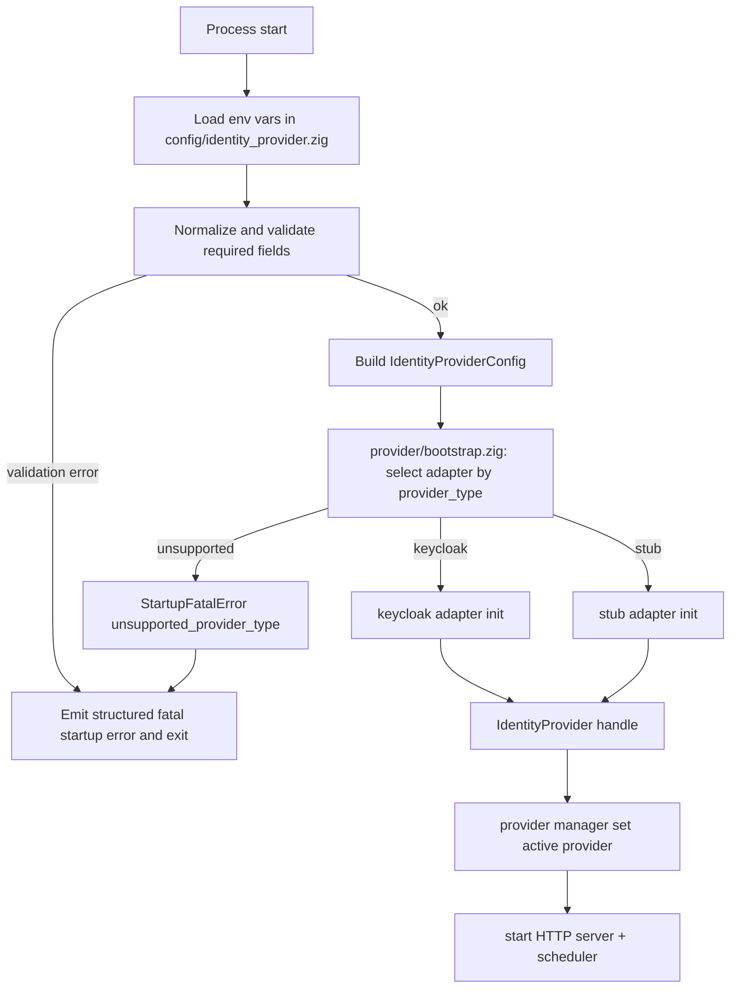

# Module: OIDC-03 Configuration Source

## Module purpose

This module defines how the backend loads and validates identity-provider startup configuration, then selects and bootstraps the active `IdentityProvider` adapter without leaking provider-specific behavior outside adapter packages. Until Stage 10 (`XC-03`) introduces repository-backed configuration artifacts, configuration is sourced from environment variables at process startup and treated as immutable runtime state.

## Scope and non-goals

In scope:
- Startup configuration schema for provider selection and adapter bootstrap.
- Required fields for OIDC-03: provider type, base URL, admin credentials reference, default realm/tenant identifier.
- Validation rules, startup failure modes, and explicit startup error contracts.
- Module boundaries that keep provider-specific details isolated under adapter packages.
- Loader/bootstrap flow and test seams for Step 02+ implementation.

Out of scope:
- Adapter implementation internals (`OIDC-02`).
- JWT/JWKS/claim verification policy details (`OIDC-04` through `OIDC-08`).
- Persistent configuration artifact schema for Stage 10 (`XC-03`).

## Public interface

### Zig design signatures

```zig
pub const ProviderType = enum {
    keycloak,
    stub,
};

pub const IdentityProviderConfig = struct {
    provider_type: ProviderType,
    base_url: []const u8,
    admin_credentials_ref: []const u8,
    default_realm_or_tenant: []const u8,

    // Optional provider-agnostic settings with safe defaults.
    admin_realm: ?[]const u8,
    expected_audience: ?[]const u8,
    expected_issuer: ?[]const u8,
    request_timeout_ms: u32,
    connect_timeout_ms: u32,
};

pub const StartupConfigLoader = struct {
    pub fn loadIdentityProviderConfig(
        allocator: std.mem.Allocator,
        env: EnvReader,
    ) ConfigLoadError!IdentityProviderConfig;
};

pub const ProviderBootstrap = struct {
    pub fn initializeActiveProvider(
        allocator: std.mem.Allocator,
        cfg: IdentityProviderConfig,
        deps: ProviderBootstrapDeps,
    ) ProviderBootstrapError!provider_interface.IdentityProvider;
};
```

### Configuration environment contract (Stage <= 9)

Required environment variables:
- `BPM_IDP_PROVIDER_TYPE`: provider selector (`keycloak` or `stub` in current scope).
- `BPM_IDP_BASE_URL`: provider base URL (https URL, no query, no fragment).
- `BPM_IDP_ADMIN_CREDENTIALS_REF`: secret reference only (not plaintext credential).
- `BPM_IDP_DEFAULT_REALM_OR_TENANT`: default realm/tenant identifier used by startup and fallback mapping.

Optional environment variables:
- `BPM_IDP_ADMIN_REALM`: admin realm for provider management (default `master` for Keycloak adapter).
- `BPM_IDP_EXPECTED_AUDIENCE`: default expected audience for verification flows.
- `BPM_IDP_EXPECTED_ISSUER`: explicit issuer override (if omitted, derived from discovery/base URL by adapter).
- `BPM_IDP_REQUEST_TIMEOUT_MS`: default adapter request timeout (default `5000`, bounds `500..60000`).
- `BPM_IDP_CONNECT_TIMEOUT_MS`: default connect timeout (default `1000`, bounds `100..10000`).

## Data types

```zig
pub const StartupErrorCode = enum {
    missing_required_field,
    invalid_field_value,
    unsupported_provider_type,
    secret_reference_invalid,
    adapter_bootstrap_failed,
};

pub const StartupValidationIssue = struct {
    field: []const u8,
    code: StartupErrorCode,
    message: []const u8,
};

pub const StartupFatalError = struct {
    code: StartupErrorCode,
    message: []const u8,
    field: ?[]const u8,
    cause: ?[]const u8,
};
```

## Key invariants

1. Provider-agnostic invariant: non-adapter modules consume only `IdentityProviderConfig`, provider manager interfaces, and typed errors; no provider URL or DTO strings may appear outside adapter package roots.
2. Startup determinism invariant: identity-provider config is loaded and fully validated before HTTP server, scheduler, or route registration begins.
3. Secret-safety invariant: config contains only secret references; resolved secret values are never persisted, logged, or echoed in startup errors.
4. Single-provider activation invariant: exactly one adapter is activated from `provider_type`; partial multi-adapter startup is forbidden.
5. Field-attributed failure invariant: every invalid config failure identifies the specific field key that failed validation.

## Module boundaries

Provider-agnostic modules:
- `src/config/identity_provider.zig`
  - Env parsing, normalization, and validation only.
- `src/identity/provider/bootstrap.zig`
  - Adapter selection by `provider_type`, common dependency wiring, typed startup errors.
- `src/identity/provider/manager.zig`
  - Runtime holder for active `IdentityProvider` returned by bootstrap.
- `src/main.zig` (or startup composition root)
  - Calls loader, then bootstrap, then continues normal server start.

Provider-specific modules (already isolated by OIDC-02):
- `src/identity/provider/adapters/keycloak/*`
- `src/identity/provider/adapters/stub/*`

Forbidden dependencies:
- `src/api/*`, `src/identity/service.zig`, `src/identity/registry.zig` must not import adapter-specific modules.
- `src/config/identity_provider.zig` must not import HTTP clients or provider API DTOs.

## Loader and bootstrap data flow



## Startup validation rules

Field-level rules:
- `BPM_IDP_PROVIDER_TYPE`
  - Required, case-insensitive enum.
  - Allowed now: `keycloak`, `stub`.
  - Any other value -> `unsupported_provider_type`.
- `BPM_IDP_BASE_URL`
  - Required.
  - Must parse as absolute `https` URL in production; `http` allowed only when `BPM_ENV=development`.
  - Must not include query or fragment.
- `BPM_IDP_ADMIN_CREDENTIALS_REF`
  - Required.
  - Must be non-empty reference token format (`env:NAME`, `vault:path#key`, or equivalent secret resolver format).
  - Plaintext credential-like values are rejected as `invalid_field_value`.
- `BPM_IDP_DEFAULT_REALM_OR_TENANT`
  - Required.
  - Must match identifier regex `^[a-zA-Z0-9][a-zA-Z0-9._-]{1,62}$`.
  - Reserved values (`null`, `undefined`, `default` with surrounding whitespace-only variants) are rejected.

Cross-field rules:
- If `provider_type=keycloak`, `BPM_IDP_ADMIN_REALM` defaults to `master` when omitted.
- If `provider_type=stub`, `admin_credentials_ref` is still required to preserve schema parity and avoid divergent config shapes before artifact-based config lands.
- Timeout bounds violations are fatal config errors.

## Failure modes and startup error contracts

### Startup contract

When OIDC-03 configuration is invalid or provider bootstrap fails, process startup terminates before opening network listeners and emits one structured fatal log entry with:
- `component = "startup.identity_provider"`
- `error_code` from `StartupErrorCode`
- `field` when applicable
- redacted message (never includes secret values)
- non-zero exit code

### Error mapping table

| Condition | Error code | Field | Startup behavior |
|---|---|---|---|
| Missing required env var | `missing_required_field` | missing key | Fatal log + exit |
| Unknown provider type | `unsupported_provider_type` | `BPM_IDP_PROVIDER_TYPE` | Fatal log + exit |
| Base URL malformed/insecure | `invalid_field_value` | `BPM_IDP_BASE_URL` | Fatal log + exit |
| Admin credentials reference malformed/plaintext | `secret_reference_invalid` | `BPM_IDP_ADMIN_CREDENTIALS_REF` | Fatal log + exit |
| Default realm/tenant identifier invalid | `invalid_field_value` | `BPM_IDP_DEFAULT_REALM_OR_TENANT` | Fatal log + exit |
| Adapter init (network/secret resolver/protocol) failure | `adapter_bootstrap_failed` | provider-dependent | Fatal log + exit |

## External dependencies

- Environment variable source (`std.process.getEnvVarOwned` or env abstraction).
- Secret resolver abstraction used by adapters (reference in config, value resolved at bootstrap).
- Existing provider abstraction (`src/identity/provider/interface.zig`, `manager.zig`) from OIDC-01.
- Adapter packages from OIDC-02 for concrete `provider_type` activation.
- Startup composition root and logger for fatal contract emission.

## Acceptance criteria traceability (OIDC-03)

1. Switching provider type loads corresponding adapter:
- Validation/test point: unit tests for `provider_type -> adapter factory` mapping.
- Validation/test point: integration startup test matrix (`keycloak`, `stub`) asserts selected adapter kind.

2. Misconfiguration yields clear startup error with invalid field:
- Validation/test point: table-driven config validation tests for each required field.
- Validation/test point: startup failure tests assert `error_code` and `field` in fatal log payload.

3. Required fields covered by schema and validation:
- Validation/test point: schema completeness test asserts all four OIDC-03 required fields are marked required.
- Validation/test point: negative tests for each field missing/invalid path.

4. Provider-agnostic boundaries preserved:
- Validation/test point: compile-boundary check ensuring non-adapter modules import only provider interface/bootstrap, not adapter modules.
- Validation/test point: grep/static scan in CI for keycloak-specific strings outside adapter path.

5. Step 02+ sequencing and touchpoints identified:
- Validation/test point: implementation checklist references touched modules and expected test layers.

## Implementation touchpoints and Step 02+ sequencing

Step 02a (BACKEND-DEV):
- Add `src/config/identity_provider.zig` with env schema parse/validate.
- Add `src/identity/provider/bootstrap.zig` adapter selection and typed startup errors.
- Wire startup in composition root (`src/main.zig` and/or existing config bootstrap).
- Keep all adapter-specific references limited to bootstrap and adapter packages.

Step 03 (TEST-DESIGNER):
- Unit specs for loader normalization/validation and timeout bounds.
- Unit specs for provider selection and unsupported provider behavior.
- Integration startup tests for success and fatal-startup scenarios.
- Compile-isolation test proving non-adapter modules compile without Keycloak package references.

Step 04 (TEST-RUNNER):
- Run unit + integration suites for startup and configuration paths.
- Verify fatal contract payload shape and non-zero exit behavior.

## Open questions

- Should `provider_type=stub` require `admin_credentials_ref` in all environments, or can development mode relax this without violating configuration-shape stability?
- For default realm/tenant identifier, should canonical lowercase normalization be enforced at load time or deferred to tenant binding logic?
- Should unsupported future provider types fail hard (current design) or allow startup with adapter disabled behind feature flags?
