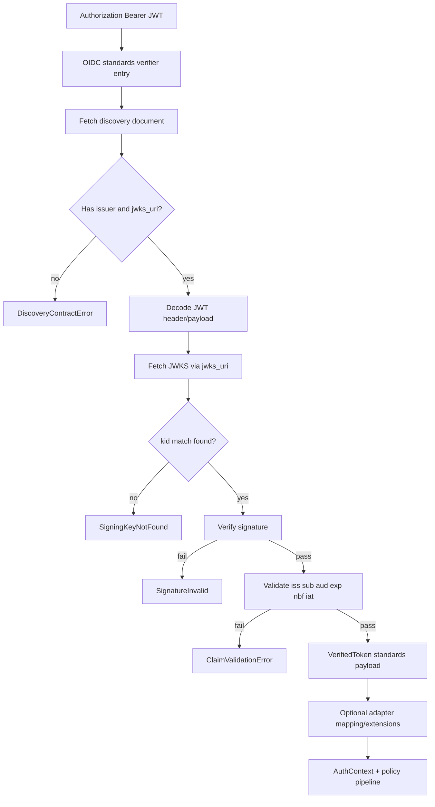
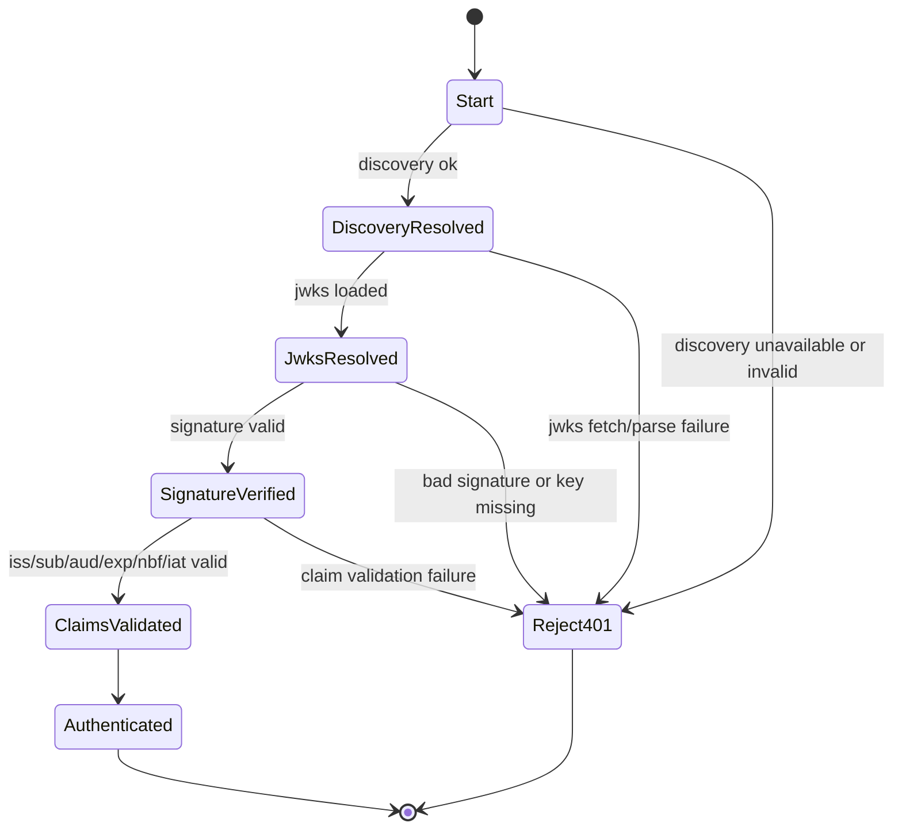

# Module: OIDC-04 Standards Compliance Boundary

## Module purpose

This module defines the provider-agnostic token verification boundary for OIDC authentication so core auth behavior depends only on standards-defined mechanisms: discovery metadata resolution, JWKS signature keys, and standard claim validation for `iss`, `sub`, `aud`, `exp`, `nbf`, and `iat`. The boundary ensures any OIDC-compliant discovery URL can be used without code changes in core authentication paths, while adapter-specific behavior remains optional extension logic outside core verification.

## Scope and non-goals

In scope:
- Standards-only verifier contract and pipeline stages.
- Module boundaries between core verifier and provider adapters.
- Error contracts and HTTP-facing failure classification.
- Test seams and validation points tied directly to OIDC-04 acceptance criteria.
- Step 02 implementation touchpoints and Step 03/04 test sequencing.

Out of scope:
- Provider-specific claim mapping policies (handled in OIDC-08).
- JWKS cache tuning and refresh logic details (OIDC-06).
- Bearer token type discrimination details (OIDC-05).
- Realm/tenant provisioning concerns (OIDC-09+).

## Standards boundary definition

Core verifier inputs are constrained to:
- Discovery URL (or issuer from which discovery URL is derived per OIDC rules).
- JWT bearer token.
- Expected audience and optional issuer override from provider-agnostic config.
- Current time and configurable skew.

Core verifier may use only:
- OpenID Provider Discovery document at `/.well-known/openid-configuration`.
- `jwks_uri` from discovery metadata to obtain signing keys.
- JWT header fields needed for standards verification (`alg`, `kid`, `typ`).
- Standard claims: `iss`, `sub`, `aud`, `exp`, `nbf`, `iat`.

Core verifier must not require:
- Provider-specific claim shapes such as `realm_access`, `resource_access`, or proprietary extensions.
- Provider-specific token introspection or admin APIs for authentication success.
- Adapter-specific endpoint conventions outside discovery metadata.

## Public interface

```zig
pub const OidcStandardsVerifier = struct {
    pub fn verify(
        allocator: std.mem.Allocator,
        deps: VerifierDeps,
        input: VerifyInput,
    ) VerifyError!VerifiedToken;
};

pub const VerifierDeps = struct {
    discovery_resolver: DiscoveryResolver,
    jwks_resolver: JwksResolver,
    jwt_decoder: JwtDecoder,
    clock: Clock,
};

pub const VerifyInput = struct {
    discovery_url: []const u8,
    raw_token: []const u8,
    expected_audience: []const u8,
    expected_issuer: ?[]const u8,
    allowed_clock_skew_seconds: u32,
};

pub const VerifiedToken = struct {
    issuer: []const u8,      // from iss
    subject: []const u8,     // from sub
    audience: []const []const u8, // normalized aud values
    issued_at: i64,          // iat
    not_before: ?i64,        // nbf
    expires_at: i64,         // exp
    token_id: ?[]const u8,   // optional jti passthrough only
};
```

## Data types

```zig
pub const DiscoveryDocument = struct {
    issuer: []const u8,
    jwks_uri: []const u8,
    authorization_endpoint: ?[]const u8,
    token_endpoint: ?[]const u8,
};

pub const JwkSet = struct {
    keys: []Jwk,
};

pub const Jwk = struct {
    kid: []const u8,
    kty: []const u8,
    alg: ?[]const u8,
    use: ?[]const u8,
    n: ?[]const u8,
    e: ?[]const u8,
    x5c: ?[]const []const u8,
};
```

## Module boundaries

Provider-agnostic core modules:
- `src/identity/provider/oidc/standards_verifier.zig`
- `src/identity/provider/oidc/discovery_client.zig`
- `src/identity/provider/oidc/jwks_client.zig`
- `src/identity/provider/oidc/claim_validator.zig`
- `src/identity/provider/oidc/errors.zig`

Adapter-specific modules (extension only):
- `src/identity/provider/adapters/keycloak/*`
- Future provider adapters under `src/identity/provider/adapters/*`

Boundary rule:
- Core auth pipeline (`src/api/middleware/auth.zig` and provider interface users) consumes only `OidcStandardsVerifier` output and standard-claim guarantees.
- Adapter modules may enrich identity context after core verification but must not be required for authentication success.

## Verifier pipeline stages

1. Parse and classify token as JWT bearer candidate (OIDC-05 integration point).
2. Resolve discovery document from configured discovery URL.
3. Validate discovery minimum contract: `issuer` and `jwks_uri` present.
4. Decode JWT header and payload without trusting claims yet.
5. Resolve JWKS from `jwks_uri` and select verification key by `kid`.
6. Verify JWT signature against selected JWK.
7. Validate standard claims only:
   - `iss` equals expected issuer (explicit config or discovery issuer).
   - `sub` present and non-empty.
   - `aud` includes expected audience.
   - `exp` strictly in future considering clock skew.
   - `nbf` absent or not in future considering clock skew.
   - `iat` present and not unreasonably future-dated.
8. Emit `VerifiedToken` with normalized standard fields.
9. Hand off to optional mapping layer (OIDC-08) for tenant/roles/user attribute extraction.

## Data flow diagram



## State transitions



## Error taxonomy

```zig
pub const VerifyError = error{
    DiscoveryUnavailable,
    DiscoveryDocumentInvalid,
    DiscoveryIssuerMissing,
    DiscoveryJwksUriMissing,

    JwksUnavailable,
    JwksInvalid,
    SigningKeyNotFound,
    UnsupportedSigningAlgorithm,

    JwtMalformed,
    SignatureInvalid,

    IssuerMismatch,
    SubjectMissing,
    AudienceMismatch,
    TokenExpired,
    TokenNotYetValid,
    IssuedAtInvalid,

    ClockUnavailable,
    OutOfMemory,
    Internal,
};
```

HTTP/auth mapping contract:
- `JwtMalformed`, `SignatureInvalid`, `IssuerMismatch`, `SubjectMissing`, `AudienceMismatch`, `TokenExpired`, `TokenNotYetValid`, `IssuedAtInvalid`, `SigningKeyNotFound` -> HTTP 401.
- `DiscoveryUnavailable`, `JwksUnavailable` -> HTTP 503 when configured policy chooses fail-closed-on-upstream-unavailable; never fallback to provider-specific extension checks.
- `DiscoveryDocumentInvalid`, `JwksInvalid`, `Internal` -> HTTP 500 with structured problem details.

## Dependencies

Allowed dependencies:
- `src/identity/provider/interface.zig`
- `src/identity/provider/types.zig`
- `src/identity/provider/errors.zig`
- `src/config/identity_provider.zig` (provider-agnostic verifier config only)
- HTTP transport abstraction and JSON/JWT parsing helpers

Must not depend on:
- `src/identity/provider/adapters/keycloak/*` or any adapter package.
- DB modules for core token verification decisions.
- Provider admin APIs for authentication success path.

## Acceptance criteria to validation/test points

1. OIDC-04 standards boundary uses discovery + JWKS + standard claims only:
- Validation point: static boundary test/grep enforces no non-standard claim requirements in `standards_verifier`.
- Test point: unit table tests verify pass/fail decisions depend only on discovery metadata, JWKS, and `iss/sub/aud/exp/nbf/iat`.

2. No provider-specific token extension is required:
- Test point: positive auth tests with minimal standards-only token (no `realm_access`, no provider extension claims).
- Test point: compatibility suite where Keycloak-specific extensions are absent but token still authenticates.

3. Any OIDC-compliant discovery URL works without code changes:
- Test seam: `DiscoveryResolver` abstraction receives interchangeable mock providers with different hostnames and endpoint shapes from discovery.
- Test point: integration matrix runs same verifier binary against at least two discovery fixtures with distinct issuers/JWKS URIs.

4. Design maps acceptance criteria to concrete validation/test points:
- Validation point: traceability checklist in TEST-DESIGNER spec maps each OIDC-04 criterion to one unit and one integration case.
- Test point: TEST-RUNNER report section includes criterion IDs and PASS/FAIL evidence links.

5. Provider-agnostic behavior outside adapter modules is preserved:
- Validation point: compile-boundary check ensuring auth middleware and provider manager import no adapter-specific symbols.
- Test point: build variant with stub adapter and standards verifier still compiles and runs auth verification tests.

## Backend touchpoints for Step 02 and Step 03/04

Step 02a (BACKEND-DEV):
- Add `src/identity/provider/oidc/standards_verifier.zig` and support modules for discovery/JWKS/claim validation.
- Update `src/identity/provider/interface.zig` and provider manager wiring only as needed for standards-verifier dependency injection.
- Update `src/api/middleware/auth.zig` to consume standards verifier result before optional adapter-specific mapping.
- Keep adapter-specific claim enrichment optional and post-verification.

Step 03 (TEST-DESIGNER):
- Author unit tests for each standard-claim failure mode and discovery/JWKS contract violations.
- Author integration tests for cross-provider discovery fixture compatibility.
- Author boundary test to assert no adapter dependency in standards verifier modules.

Step 04 (TEST-RUNNER):
- Execute unit/integration suites with traceability to OIDC-04 acceptance criteria.
- Verify no test requires provider-specific extension claims for successful authentication.

## Key invariants

1. Authentication success depends only on standards-compliant discovery, JWKS, and standard claim semantics.
2. Provider-specific claims may enrich context but never gate authentication success.
3. Core verifier remains adapter-agnostic and compile-safe without any specific provider package.
4. A discovery URL change is configuration-only, not a code change.

## Open questions

- Should `iat` future tolerance equal the same skew as `nbf/exp`, or be separately configurable?
- Should discovery/JWKS transport failures be hard 503 in all environments, or allow a short retry window before response classification?
- For mixed token ecosystems during OIDC-33 coexistence, should malformed JWT-like tokens always short-circuit as 401, or can classifier route to local-token path first?