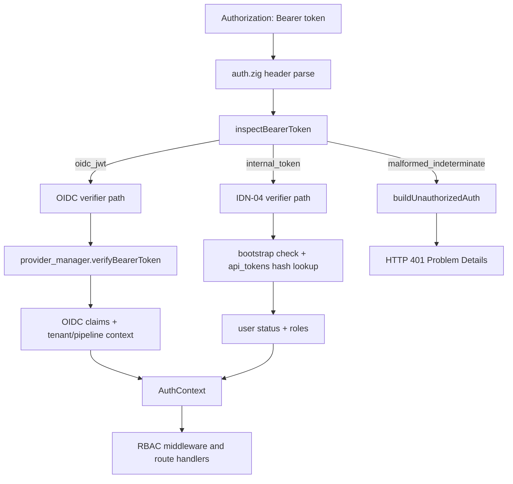
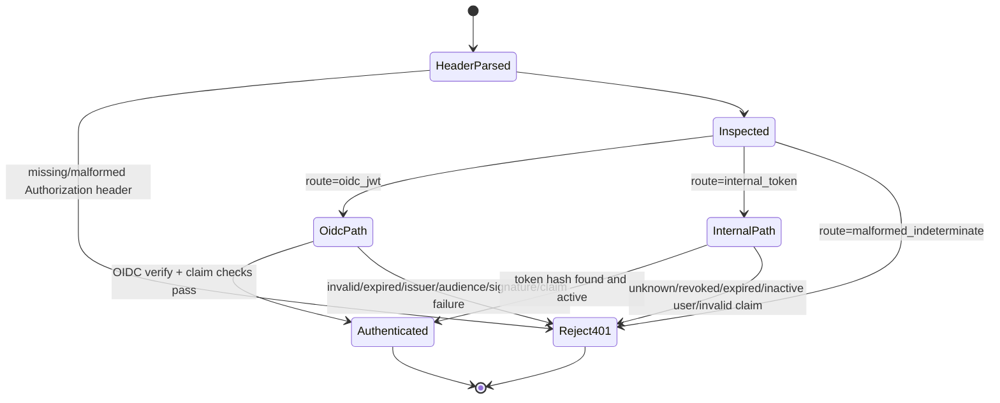

# Module: OIDC-05 Bearer Token Acceptance

## Module purpose

This module extends API-08 authentication to accept two coexisting Bearer token families during and after Stage 6.5: OIDC-issued JWTs and internally issued IDN-04 tokens. The design introduces deterministic token-format inspection before verification so each request is routed to exactly one verifier path without fallback ambiguity, while malformed or indeterminate tokens consistently return structured HTTP 401 responses.

## Public interface

### Token routing contract

```zig
pub const TokenRoute = enum {
    oidc_jwt,
    internal_token,
    malformed_indeterminate,
};

pub const TokenRouteReason = enum {
    jwt_three_segments,
    opaque_no_dots,
    jwt_shape_invalid,
    illegal_character,
    empty_segment,
};

pub const TokenInspectionResult = struct {
    route: TokenRoute,
    reason: TokenRouteReason,
};

pub fn inspectBearerToken(raw_token: []const u8) TokenInspectionResult;
```

### Auth decision pipeline contract

```zig
pub const VerifyRouteResult = union(enum) {
    authenticated: AuthContext,
    unauthenticated: HandlerResult,
};

pub fn verifyByRoute(
    allocator: std.mem.Allocator,
    inspection: TokenInspectionResult,
    raw_token: []const u8,
    db_pool: *pool_mod.Pool,
    provider_manager: provider_manager_mod.Manager,
) VerifyRouteResult;
```

### Structured 401 builder contract

```zig
pub const Auth401Code = enum {
    token_missing,
    token_header_malformed,
    token_type_indeterminate,
    token_invalid,
    token_expired,
    token_revoked,
    token_unknown,
    token_claim_invalid,
};

pub fn buildUnauthorizedAuth(
    allocator: std.mem.Allocator,
    code: Auth401Code,
    detail: []const u8,
    route: TokenRoute,
) HandlerResult;
```

## Token-format inspection and deterministic routing

Inspection is lexical and deterministic only. It does not perform signature or database checks.

### Stage A: hard-fail malformed token text

- Reject as `malformed_indeterminate` if token contains whitespace or control characters.
- Reject as `malformed_indeterminate` if token contains characters outside allowed bearer-token lexical set for this system (`A-Z a-z 0-9 - _ . ~`).

### Stage B: classify by delimiter structure

- `dot_count == 0` -> `internal_token` (IDN-04 verifier path).
- `dot_count == 2` -> candidate JWT shape.
- Any other dot count -> `malformed_indeterminate`.

### Stage C: JWT-shape confirmation for `dot_count == 2`

All three segments must be non-empty and base64url-decodable for header and payload.

- If true -> `oidc_jwt`.
- If false -> `malformed_indeterminate`.

### Unambiguity rule

Any token with dot separators that fails JWT-shape checks is never routed to internal-token verification. This prevents ambiguous fallback behavior and guarantees deterministic routing for OIDC-05.

## Decision pipeline stages

1. Parse `Authorization` header and extract bearer token (existing API-08 behavior).
2. `inspectBearerToken(raw_token)` determines `TokenRoute`.
3. Route execution:
- `oidc_jwt`: verify via provider manager OIDC path (`verifyBearerToken`), then derive tenant/pipeline context and build `AuthContext`.
- `internal_token`: verify via existing IDN-04 hash/DB flow (plus bootstrap behavior already present in API-08).
- `malformed_indeterminate`: return structured HTTP 401 immediately.
4. Map verifier result to authenticated context or structured 401.
5. Keep downstream authorization/RBAC behavior unchanged.

## Data flow diagram



## State transitions



## Error taxonomy

All failures below return HTTP 401 with RFC 9457 body and `WWW-Authenticate: Bearer`.

| Error code | Route | Condition | Structured detail fields |
|---|---|---|---|
| `token_missing` | n/a | Authorization header absent | `code`, `route`, `detail` |
| `token_header_malformed` | n/a | Missing `Bearer ` prefix or empty value | `code`, `route`, `detail` |
| `token_type_indeterminate` | `malformed_indeterminate` | Dot count invalid, empty JWT segment, or non-base64url JWT segment | `code`, `route`, `reason`, `detail` |
| `token_invalid` | `oidc_jwt` or `internal_token` | Signature/claim invalid or unknown internal token | `code`, `route`, `detail` |
| `token_expired` | `oidc_jwt` or `internal_token` | OIDC `exp` failed or IDN-04 expiry reached | `code`, `route`, `detail` |
| `token_revoked` | `internal_token` | IDN-04 token revoked | `code`, `route`, `detail` |
| `token_claim_invalid` | `oidc_jwt` or `internal_token` | Tenant/pipeline claim format invalid | `code`, `route`, `claim`, `detail` |

Required response shape extension in Problem Details:

- `extensions.code` (stable machine code)
- `extensions.token_route` (`oidc_jwt`, `internal_token`, `malformed_indeterminate`, or `n/a`)
- `extensions.token_reason` (for indeterminate format failures)

## Dependencies

Depends on:

- `src/api/middleware/auth.zig` (orchestrator for parsing, routing, and context assignment)
- `src/identity/provider/manager.zig` (OIDC verifier entrypoint)
- `src/identity/provider/oidc/standards_verifier.zig` (OIDC-04 verification boundary)
- `src/api/errors.zig` (RFC 9457 response builder)
- `src/api/tenant_context.zig` and `src/api/pipeline_context.zig`
- `src/identity/registry.zig` and IDN-04 token store path for internal tokens

Must not depend on:

- Keycloak adapter modules directly from auth middleware
- Provider-specific claim extensions as a prerequisite for route selection

## Coexistence behavior (OIDC-33 alignment)

- Internal IDN-04 tokens remain valid with no migration requirement.
- OIDC JWTs are accepted concurrently when provider manager is configured and auth mode allows external verification.
- Routing happens before verification, and each token is verified by exactly one path.
- No cross-path fallback after a route has been selected.

## Acceptance criteria traceability

1. Unambiguous detection for OIDC JWT vs internal token:
- Implementation point: add `inspectBearerToken` and route enum in auth middleware/provider manager seam.
- Test seam: table-driven unit tests for token strings covering 0 dots, 2 valid JWT dots, and malformed dot patterns.

2. Dedicated verification path for each token family with coexistence:
- Implementation point: explicit route switch in auth middleware before verification logic.
- Test seam: integration tests proving one OIDC token and one IDN-04 token both authenticate successfully in same deployment.

3. Malformed/indeterminate handling with structured 401:
- Implementation point: `buildUnauthorizedAuth` and error-code mapping.
- Test seam: malformed token cases assert 401, `WWW-Authenticate: Bearer`, and problem extensions `code` + `token_route`.

4. Concrete implementation/test touchpoints:
- Step 02a implementation files:
  - `src/api/middleware/auth.zig`
  - `src/identity/provider/manager.zig`
  - `src/api/errors.zig` (or auth error helper)
  - `src/identity/provider/types.zig` (if route/error enums are shared)
- Step 03 test design files:
  - `tests/specs/OIDC-05.md` (new)
  - add/extend auth middleware unit spec file
- Step 04 execution targets:
  - auth unit tests for classifier matrix
  - integration auth tests covering dual-token coexistence

## Suggested test matrix for Step 03/04

- `jwt_valid_oidc_route`: three-segment base64url token routes to OIDC path.
- `opaque_internal_route`: no-dot token routes to IDN-04 path.
- `jwt_like_invalid_segment`: three segments with invalid base64url payload -> 401 `token_type_indeterminate`.
- `one_dot_token`: one-dot token -> 401 `token_type_indeterminate`.
- `three_dot_token`: three-dot token -> 401 `token_type_indeterminate`.
- `oidc_invalid_signature`: OIDC route chosen, signature fails -> 401 `token_invalid`.
- `internal_revoked`: internal route chosen, revoked IDN-04 token -> 401 `token_revoked`.
- `dual_accept_coexistence`: one OIDC token and one IDN-04 token both succeed under same runtime config.

## Open questions

- Should tokens containing `~` remain accepted for internal tokens, or should internal token lexical policy be tightened to match current issuance format exactly?
- For upstream OIDC unavailability, should API-08 continue returning 401 for uniformity or introduce 503 for verifier unavailability in a later requirement?
- Should bootstrap token be treated as a distinct internal sub-route in diagnostics, or remain grouped under `internal_token` for external API error payloads?