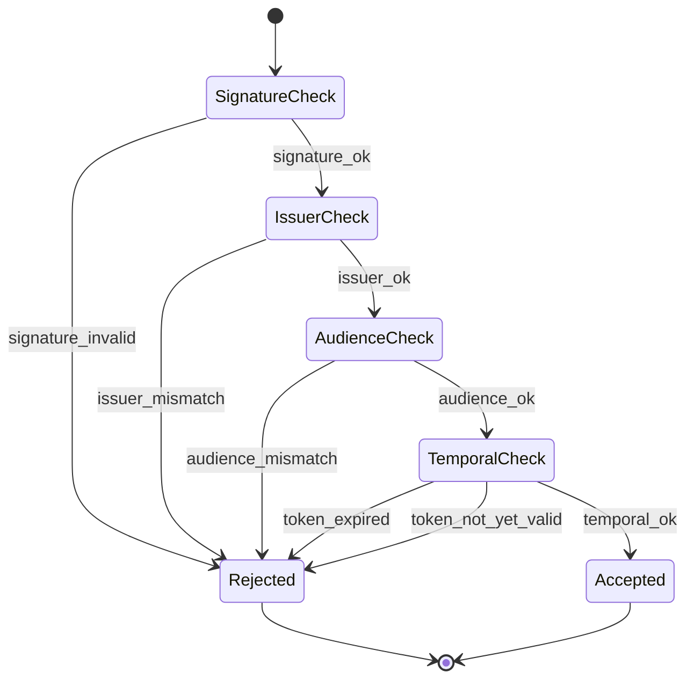

# Module: OIDC-07 Claim Validation

## Module purpose

This module defines deterministic claim validation for OIDC JWT verification after token-route detection (OIDC-05) and key resolution/JWKS caching (OIDC-06). It enforces tenant-scoped issuer and audience checks, symmetric clock-skew handling for temporal claims, and structured authentication error mapping to HTTP 401 so every invalid-token case is explicit, testable, and consistent across middleware and provider adapter boundaries.

## Public interface

### Claim-validation inputs and outputs

```zig
const std = @import("std");

pub const TimeClaims = struct {
    exp: ?i64, // unix seconds
    nbf: ?i64, // unix seconds
};

pub const RealmValidationConfig = struct {
    issuer: []const u8,
    client_id: []const u8,
    clock_skew_seconds: i64, // default 30, must be >= 0
};

pub const ParsedJwtClaims = struct {
    iss: []const u8,
    aud: []const []const u8,
    exp: ?i64,
    nbf: ?i64,
    sub: []const u8,
};

pub const ClaimValidationReason = enum {
    signature_invalid,
    issuer_mismatch,
    audience_mismatch,
    token_expired,
    token_not_yet_valid,
    required_claim_missing,
    claim_format_invalid,
};

pub const ClaimValidationResult = union(enum) {
    ok,
    invalid: ClaimValidationReason,
};

pub fn validateOidcClaims(
    now_unix: i64,
    claims: ParsedJwtClaims,
    realm: RealmValidationConfig,
) ClaimValidationResult;
```

### Temporal-claim helper contract

```zig
pub fn validateTemporalWindow(
    now_unix: i64,
    exp: ?i64,
    nbf: ?i64,
    clock_skew_seconds: i64,
) ClaimValidationResult;
```

Behavior contract:
- `exp` check uses symmetric skew: token is expired only when `now_unix > exp + skew`.
- `nbf` check uses symmetric skew: token is not-yet-valid only when `now_unix < nbf - skew`.
- `nbf` absent is accepted.

### Auth-error mapping contract

```zig
pub const Auth401Code = enum {
    token_invalid_signature,
    token_invalid_issuer,
    token_invalid_audience,
    token_expired,
    token_not_yet_valid,
    token_claim_invalid,
};

pub fn mapClaimValidationToUnauthorized(
    allocator: std.mem.Allocator,
    reason: ClaimValidationReason,
    tenant_id: []const u8,
) HandlerResult;
```

Required mapping outcome:
- Every `ClaimValidationReason` maps to HTTP 401 with RFC 9457 body and `WWW-Authenticate: Bearer`.
- Problem-details extensions include at minimum `code`, `tenant_id`, and `reason`.

## Data types

```zig
pub const ValidationDependencies = struct {
    // Resolved from OIDC-06 flow before claim validation.
    jwks_verifier: *const JwksVerifier,
    // Tenant-scoped realm resolver (ADP-04b / OIDC-03 config source).
    realm_resolver: *const RealmResolver,
};

pub const ValidationContext = struct {
    tenant_id: []const u8,
    token_kid: []const u8,
    now_unix: i64,
};
```

## Key invariants

- Signature verification completes first using OIDC-06 JWKS cache flow; claim validation never runs on an unverified signature.
- Issuer check is exact string match against tenant realm `issuer` configuration.
- Audience check passes only when configured tenant `client_id` is present in `aud` set.
- Clock skew is configurable, non-negative, default `30`, and applied symmetrically to both `exp` and `nbf` boundaries.
- Any single validation failure short-circuits to an authentication failure mapped to HTTP 401.

## Data flow diagram

```mermaid
flowchart TD
    A[Bearer token routed to OIDC path (OIDC-05)] --> B[Parse JWT header and claims]
    B --> C[Resolve tenant realm config by tenant_id]
    C --> D[OIDC-06 signature verification using cached JWKS]
    D -->|bad signature| E[Map to 401 token_invalid_signature]
    D -->|valid signature| F[validateOidcClaims]

    F --> G{Issuer == configured issuer?}
    G -->|No| H[Map to 401 token_invalid_issuer]
    G -->|Yes| I{Audience contains configured client_id?}

    I -->|No| J[Map to 401 token_invalid_audience]
    I -->|Yes| K[validateTemporalWindow(now, exp, nbf, skew)]

    K -->|expired| L[Map to 401 token_expired]
    K -->|not yet valid| M[Map to 401 token_not_yet_valid]
    K -->|ok| N[Return verified claims for OIDC-08 mapping]
```

## State transitions



## Error taxonomy

| Internal reason | Trigger condition | HTTP mapping | Stable code |
|---|---|---|---|
| `signature_invalid` | OIDC-06 verifier cannot validate signature with cached/refreshed JWKS | 401 | `token_invalid_signature` |
| `issuer_mismatch` | `claims.iss != realm.issuer` | 401 | `token_invalid_issuer` |
| `audience_mismatch` | configured `realm.client_id` not present in `claims.aud` | 401 | `token_invalid_audience` |
| `token_expired` | `now_unix > exp + skew` | 401 | `token_expired` |
| `token_not_yet_valid` | `now_unix < nbf - skew` | 401 | `token_not_yet_valid` |
| `required_claim_missing` | mandatory claim absent (`iss`, `aud`) | 401 | `token_claim_invalid` |
| `claim_format_invalid` | claim shape/type invalid (`aud` not list/string, temporal claim non-numeric) | 401 | `token_claim_invalid` |

## Dependencies

Depends on:
- `src/identity/provider/oidc/standards_verifier.zig` for JWT parse and signature-verification orchestration.
- `src/identity/provider/adapters/keycloak/provider.zig` and `src/identity/provider/oidc/jwks_cache.zig` for OIDC-06 JWKS handoff.
- `src/api/middleware/auth.zig` for request auth orchestration and 401 response emission.
- Tenant realm configuration source from OIDC-03 and tenant-realm binding in ADP-04b.
- `src/api/errors.zig` for RFC 9457 Problem Details construction.

Must not depend on:
- Database migrations or schema changes (OIDC-07 is runtime validation behavior only).
- Frontend modules.
- `src/engine/transition.zig`.

## Module-level change plan (Step 02a guidance)

Planned backend touchpoints:
- `src/identity/provider/oidc/standards_verifier.zig`: add claim validation stage after signature verification and before claim mapping.
- `src/identity/provider/adapters/keycloak/config.zig`: expose `clock_skew_seconds` (default 30) with non-negative validation.
- `src/api/middleware/auth.zig`: map claim-validation failures to structured HTTP 401 via stable machine codes.
- `src/api/errors.zig` (or auth error helper): add/align RFC 9457 extensions for OIDC claim errors.

No SQL migrations are required.

## Validation matrix (OIDC-07 acceptance)

| Case | Input condition | Expected result |
|---|---|---|
| Wrong issuer | valid signature but `iss` differs from tenant configured issuer | HTTP 401, `token_invalid_issuer` |
| Wrong audience | valid signature and issuer, but `aud` omits tenant `client_id` | HTTP 401, `token_invalid_audience` |
| Expired token | valid signature/issuer/audience, but `now > exp + skew` | HTTP 401, `token_expired` |
| Not-yet-valid token | valid signature/issuer/audience, but `now < nbf - skew` | HTTP 401, `token_not_yet_valid` |
| Bad signature | signature fails against OIDC-06 JWKS resolver path | HTTP 401, `token_invalid_signature` |

## Unit and integration test plan

### Unit tests

Target: claim-validation logic in isolation (no HTTP, no DB).

- `TC-OIDC07-U01`: issuer mismatch returns `issuer_mismatch`.
- `TC-OIDC07-U02`: audience missing configured client ID returns `audience_mismatch`.
- `TC-OIDC07-U03`: expired check uses symmetric skew (`exp + skew`).
- `TC-OIDC07-U04`: nbf check uses symmetric skew (`nbf - skew`).
- `TC-OIDC07-U05`: missing `nbf` is accepted.
- `TC-OIDC07-U06`: each `ClaimValidationReason` maps to stable 401 machine code.

### Integration tests

Target: end-to-end auth middleware behavior with OIDC verifier path and tenant realm config.

- `TC-OIDC07-I01 wrong issuer`: request with issuer mismatch returns HTTP 401 with structured body.
- `TC-OIDC07-I02 wrong audience`: request with audience mismatch returns HTTP 401.
- `TC-OIDC07-I03 expired`: request with past `exp` beyond skew returns HTTP 401.
- `TC-OIDC07-I04 not-yet-valid`: request with future `nbf` beyond skew returns HTTP 401.
- `TC-OIDC07-I05 bad signature`: request signed with non-matching key returns HTTP 401 after JWKS flow.
- `TC-OIDC07-I06 skew boundary`: boundary checks at `exp + skew` and `nbf - skew` confirm symmetric behavior.

All invalid-case acceptance criteria are covered by named integration tests.

## Open questions

- Should per-tenant configuration allow overriding `clock_skew_seconds` at runtime per realm, or should this remain a global OIDC default with optional per-realm override in a later requirement?
- For malformed temporal claims (`exp`/`nbf` not numeric), should the public machine code remain `token_claim_invalid` or split into dedicated claim-format codes for observability?
