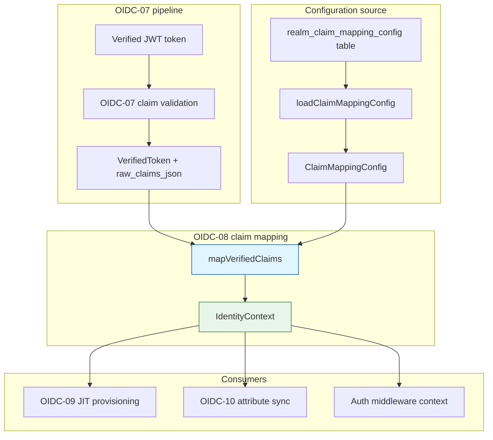
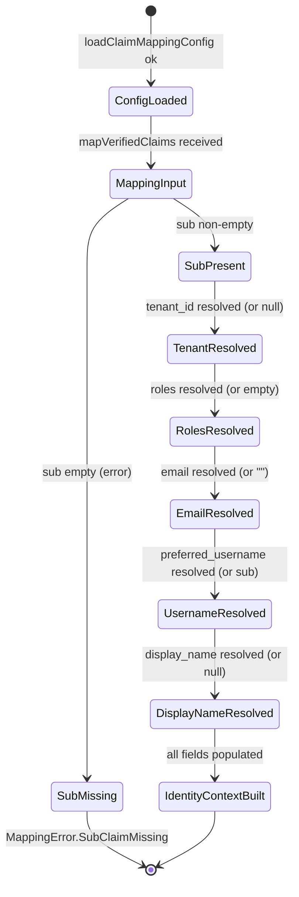

# Module: OIDC-08 Standard Claim Mapping

## Module purpose

This module defines the deterministic, purely functional claim-mapping layer that transforms verified OIDC claims (from OIDC-07) into a provider-agnostic internal `IdentityContext` struct. Mapping rules are configurable per realm so that tokens from different providers (Keycloak, Okta, Azure AD, generic OIDC) produce structurally equivalent identity contexts. The mapping layer sits between OIDC-07 (verification) and OIDC-09 (JIT user provisioning) and enforces that `sub` is always required, optional claims produce stable defaults, and nested claim paths (e.g. `realm_access.roles`) are resolved without I/O.

## Public interface

### Configuration loading (I/O boundary)

```zig
pub const ClaimMappingConfig = struct {
    realm: []const u8,
    tenant_id_claim: []const u8,              // default "tenant_id"
    roles_claim_paths: []const []const u8,     // default ["realm_access.roles", "roles"]
    email_claim: []const u8,                  // default "email"
    preferred_username_claim: []const u8,      // default "preferred_username"
    display_name_claim: []const u8,           // default "name"
};

pub const ClaimMappingError = error{
    RealmConfigNotFound,
    PoolExhausted,
    ConfigParseFailed,
    OutOfMemory,
};

/// Load the per-realm claim mapping configuration from the database.
/// Returns `null` when no explicit config row exists for the realm;
/// callers should then use the default-valued `ClaimMappingConfig`.
pub fn loadClaimMappingConfig(
    allocator: std.mem.Allocator,
    pool: *Pool,
    realm: []const u8,
) ClaimMappingError!?ClaimMappingConfig;
```

### Pure mapping function (no I/O)

```zig
pub const MappingError = error{
    SubClaimMissing,
    ClaimPathMalformed,
    ClaimTypeMismatch,
    OutOfMemory,
};

/// Transform verified OIDC claims into a canonical internal IdentityContext.
///
/// `standard_claims` comes from the OIDC-07/OIDC-04 verifier (contains sub,
/// iss, aud, exp, nbf, iat — the standard envelope fields).
///
/// `raw_claims_json` is the full decoded JWT payload as a JSON string.
/// It is required because non-standard claims such as `realm_access.roles`
/// and `tenant_id` are not part of the VerifiedToken envelope.
///
/// This function performs NO I/O. All inputs are provided by the caller.
pub fn mapVerifiedClaims(
    allocator: std.mem.Allocator,
    config: ClaimMappingConfig,
    standard_claims: VerifiedToken,
    raw_claims_json: []const u8,
) MappingError!IdentityContext;
```

### Identity equivalence (provider-agnostic comparison)

```zig
/// Two IdentityContext values represent the same user when their
/// (external_user_id, realm) tuple matches. This function compares only
/// those fields. Use it to verify the OIDC-08 AC-1 invariant: tokens
/// from different providers for the same user produce equivalent contexts.
pub fn identityContextsEquivalent(
    a: IdentityContext,
    b: IdentityContext,
) bool;
```

### JSON path resolver (internal helper, exposed for testing)

```zig
/// Resolve a dot-separated JSON path (e.g. "realm_access.roles") against
/// a parsed json.Value. Returns `null` when the path does not exist in the
/// document. Does not allocate — operates on the parsed value tree.
///
/// Supported path segments: object keys only. Array indexing is not
/// supported (roles claims are expected to be top-level arrays reachable
/// by key traversal).
pub fn resolveJsonPath(
    document: std.json.Value,
    path: []const []const u8,
) ?std.json.Value;
```

## Data types

### IdentityContext (canonical internal identity)

```zig
pub const IdentityContext = struct {
    /// From `sub` claim — always present after OIDC-07 verification.
    /// Maps to `external_user_id` in the local user record (IDN-01).
    external_user_id: []const u8,

    /// From configurable `tenant_id` claim path.
    /// `null` when the claim is absent at the configured path.
    tenant_id: ?[]const u8,

    /// Source realm identifier — the OIDC `iss` formatted as
    /// a realm slug for cross-realm identity disambiguation.
    realm: []const u8,

    /// List of roles from configurable claim paths.
    /// Defaults to empty slice when no roles claim is present.
    roles: []const []const u8,

    /// From `email` claim (or configured alternative).
    /// Defaults to empty string `""` when absent (OIDC-08 AC-3).
    email: []const u8,

    /// From `preferred_username` claim (or configured alternative).
    /// Defaults to `external_user_id` value when absent (OIDC-08 AC-3).
    preferred_username: []const u8,

    /// From `name` / `display_name` claim (or configured alternative).
    /// `null` when absent (no default — display name is presentation-only).
    display_name: ?[]const u8,
};
```

### ClaimMappingConfig (per-realm configuration record)

```zig
pub const ClaimMappingConfig = struct {
    /// The realm this configuration applies to.
    realm: []const u8,

    /// JSON path to the tenant_id claim. Default: "tenant_id"
    tenant_id_claim: []const u8,

    /// Ordered list of JSON paths to search for roles. The first path
    /// that resolves to a non-null JSON array wins. This allows
    /// Keycloak-specific paths (realm_access.roles) with a standards-friendly
    /// fallback (roles) — default: ["realm_access.roles", "roles"]
    roles_claim_paths: []const []const u8,

    /// JSON path to the email claim. Default: "email"
    email_claim: []const u8,

    /// JSON path to the preferred_username claim. Default: "preferred_username"
    preferred_username_claim: []const u8,

    /// JSON path to the display name claim. Default: "name"
    display_name_claim: []const u8,
};
```

### Default configuration constant

```zig
pub const DEFAULT_CLAIM_MAPPING_CONFIG: ClaimMappingConfig = .{
    .realm = "",
    .tenant_id_claim = "tenant_id",
    .roles_claim_paths = &.{ "realm_access.roles", "roles" },
    .email_claim = "email",
    .preferred_username_claim = "preferred_username",
    .display_name_claim = "name",
};
```

## Key invariants

1. **Pure mapping rule.** `mapVerifiedClaims` performs zero I/O — no database queries, no network calls, no filesystem access. All data is passed in as function arguments. The function is deterministic: same inputs always produce the same output.

2. **`sub` is always required.** `VerifiedToken.subject` is guaranteed non-empty by OIDC-07 validation. `mapVerifiedClaims` errors with `MappingError.SubClaimMissing` if it is empty or absent — this should never occur in practice because OIDC-07 already enforces it, but the mapping layer independently validates the contract.

3. **Missing optional claims produce defaults, never errors.** The following rules apply regardless of which claim paths are configured:
   - Missing `email` at configured path → `email = ""`
   - Missing `preferred_username` at configured path → `preferred_username = external_user_id` (the `sub` value)
   - Missing roles at all configured paths → `roles = &.{}`
   - Missing `display_name` at configured path → `display_name = null`
   - Missing `tenant_id` at configured path → `tenant_id = null`

4. **Provider equivalence.** Two `IdentityContext` values with the same `(external_user_id, realm)` tuple are considered equivalent regardless of differences in other fields. This ensures tokens from different providers that represent the same person produce a stable lookup key for OIDC-09 JIT provisioning.

5. **No circular dependencies.** OIDC-08 depends on OIDC-04's `VerifiedToken` type and OIDC-07's validation pipeline. It does not depend on OIDC-09, IDN-01, or any provisioning logic.

6. **Role path ordering is significant.** The first path in `roles_claim_paths` that resolves to a JSON array value wins. This means `["realm_access.roles", "roles"]` prefers the Keycloak-specific path and falls back to the OIDC-standard `roles` claim.

## Data flow diagram



## State transitions



## DB tables / columns touched

### New table: `realm_claim_mapping_config`

This table stores per-realm overrides for claim mapping. When no row exists for a realm, the system uses `DEFAULT_CLAIM_MAPPING_CONFIG`. This follows the OIDC-03 configuration pattern extended for per-realm granularity.

```sql
CREATE TABLE IF NOT EXISTS realm_claim_mapping_config (
    realm                   VARCHAR(64) PRIMARY KEY,
    tenant_id_claim         VARCHAR(128) NOT NULL DEFAULT 'tenant_id',
    roles_claim_paths       TEXT[] NOT NULL DEFAULT ARRAY['realm_access.roles','roles'],
    email_claim             VARCHAR(128) NOT NULL DEFAULT 'email',
    preferred_username_claim VARCHAR(128) NOT NULL DEFAULT 'preferred_username',
    display_name_claim      VARCHAR(128) NOT NULL DEFAULT 'display_name',
    created_at              TIMESTAMPTZ NOT NULL DEFAULT now(),
    updated_at              TIMESTAMPTZ NOT NULL DEFAULT now()
);
```

**Design notes:**
- `realm` references the realm identifier used in OIDC-03 / ADP-04b tenant ↔ realm binding. No explicit FK constraint to avoid migration ordering issues with the tenant table.
- `roles_claim_paths` is a PostgreSQL text array so that multiple fallback paths can be specified in order. The backend iterates them in array order and uses the first non-null array value found.
- The table has `updated_at` for cache-invalidation purposes if a future stage adds runtime config reload.
- This is a configuration table, not an event-store table — it is read during startup and on config reload, never on the hot authentication path (the `ClaimMappingConfig` is expected to be cached in memory per realm after loading).

### No changes to event-store tables

As specified in the task, no event-store tables are modified. The mapping config lives in the identity/tenant schema separate from the event store.

## Cross-module dependencies

### Depends on

| Module | Dependency type | What it provides |
|---|---|---|
| **OIDC-04/OIDC-07** (`standards_verifier.zig`, `claim_validator.zig`) | Compile-time type dependency | `VerifiedToken` struct (sub, iss fields), guarantee that signature + standard claims are valid before mapping runs |
| **OIDC-03** (`config/identity_provider.zig`) | Configuration pattern | Realm identifier resolution, config storage pattern (env → DB config table pattern) |
| **ADP-04b** | Schema convention | Realm identifier format and tenant ↔ realm binding convention |
| **JSON parsing** (`std.json` or wrapper) | Standard library | JSON path resolution for extracting nested claims from raw payload |
| **db/pool.zig** | Runtime dependency (config load only) | Connection pool for reading `realm_claim_mapping_config` table |

### Consumed by

| Module | What it receives |
|---|---|
| **OIDC-09** (JIT provisioning) | `IdentityContext` — used to create/update local user records |
| **OIDC-10** (attribute sync) | `IdentityContext` — used to reconcile display name, email, roles on each auth |
| **Auth middleware** (`api/middleware/auth.zig`) | `IdentityContext` — attached to request context after successful OIDC auth |
| **ADP-03** (tenant context) | `IdentityContext.tenant_id` — used to scope the request to a tenant |

### Must NOT depend on

- OIDC-09, OIDC-10, IDN-01 — mapping is upstream of provisioning; circular dependency would violate the pipeline ordering.
- `src/engine/transition.zig` — no engine coupling.
- Provider adapters (`src/identity/provider/adapters/*`) — mapping is provider-agnostic; provider-specific claim paths are handled via config, not code.

## Acceptance criteria to design element traceability

| Acceptance criterion | Design element(s) |
|---|---|
| AC-1: Tokens from different providers produce equivalent internal user contexts | `IdentityContext` (provider-agnostic shape), `identityContextsEquivalent()` (equivalence predicate by `(external_user_id, realm)` pair) |
| AC-2: Claim mapping rules configurable per realm, stored in platform configuration | `ClaimMappingConfig` (per-realm config struct), `realm_claim_mapping_config` (DB table), `loadClaimMappingConfig()` (config loader), `DEFAULT_CLAIM_MAPPING_CONFIG` (fallback) |
| AC-3: Missing optional claims produce concrete defaults (email → "", preferred_username → sub, roles → empty list) | `mapVerifiedClaims()` defaulting rules documented in invariants; `email = ""`, `preferred_username = external_user_id`, `roles = &.{}` implemented in the mapping function |

## Identified risks and open questions

1. **JSON path resolver complexity.** Nested paths like `realm_access.roles` require a JSON path resolver that tokenizes on `.` and traverses the parsed `std.json.Value` tree. This is straightforward for two-level paths but may need extension for deeper nesting or array segments in future provider support. **Mitigation:** `resolveJsonPath` is implemented as a standalone, tested helper with well-defined supported syntax. Array indexing is explicitly excluded (roles claims are expected as direct array values, not arrays of objects).

2. **Config reload strategy.** `loadClaimMappingConfig` is called at startup and optionally on config reload. There is no hot-reload mechanism defined for Stage 6.5. If config is changed in the DB while the server is running, the change will not take effect until restart. **Recommendation:** Mark as accepted for Stage 6.5; add a simple reload endpoint or periodic refresh in a later stage if needed.

3. **Roles claim path ordering across providers.** The ordered `roles_claim_paths` array assumes that the first matching path is authoritative. If a token coincidentally has both `realm_access.roles` and `roles` present with different values, the Keycloak path (`realm_access.roles`) wins because it appears first in the default list. This is correct for Keycloak-centric deployments but may surprise administrators using a different provider that populates both paths. **Recommendation:** Document this behavior explicitly in the operator guide.

4. **`iss` to `realm` normalization.** `IdentityContext.realm` is populated from the OIDC `iss` claim. Depending on the provider, `iss` may be a full URL (`https://keycloak.example.com/realms/my-realm`) or a simple identifier. The mapping layer should normalize `iss` to a realm slug for cross-realm disambiguation. **Open question:** Should normalization live in OIDC-08 or in the adapter layer (OIDC-02)? Recommend a simple `extractRealmFromIssuer()` helper in OIDC-08 with an adapter-provided override hook.

5. **`tenant_id` type mismatch.** The `tenant_id` claim is expected to be a JSON string. If a provider emits it as a number or object, `resolveJsonPath` will still find the value but type coercion will fail. **Open question:** Should `mapVerifiedClaims` accept non-string tenant_id (e.g., call `.toString()` for numbers), or strictly reject with `MappingError.ClaimTypeMismatch`? Recommend strict rejection for security (type confusion in tenant assignment is a privilege-escalation risk).

6. **Cross-realm sub collision.** Two different realms could theoretically issue tokens with the same `sub` value for different users. The `(external_user_id, realm)` tuple prevents collision, but this relies on the `realm` field being populated correctly from `iss`. Misconfigured issuers could cause false equivalence.
