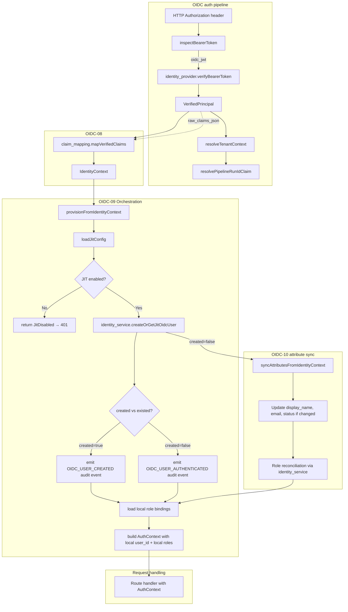

# Module: OIDC-09 JIT User Provisioning Orchestration

## Module purpose

This module defines the orchestration layer that bridges the OIDC-08 claim-mapping output (`IdentityContext`) and the ADP-04a identity service (`createOrGetJitOidcUser`) so that every successfully verified OIDC bearer token results in a local user record before the request proceeds to route handling. The orchestrator handles the create-vs-existed distinction for audit tracking, enforces JIT configuration per realm (enabled/disabled, default role assignments), and provides a stable insertion point that OIDC-10 (attribute synchronisation) can reuse on every subsequent authentication.

The orchestrator is a **thin I/O-bound coordinator** — it does not contain business logic for user creation (that lives in `identity/service.zig` and `identity/registry.zig`), nor does it parse claims (that lives in `oidc/claim_mapping.zig`). Its sole responsibility is sequencing: receive an `IdentityContext`, load per-realm JIT configuration, call `createOrGetJitOidcUser`, and produce the data needed to build an `AuthContext`.

## Scope and non-goals

**In scope:**
- Orchestration function that accepts `IdentityContext` and returns a provisioned local user with create/existed discrimination.
- Per-realm JIT configuration (enabled/disabled, default user status, default role assignment).
- Audit event emission for user creation events (OBS-03).
- Error handling for provisioning failures during the auth pipeline.
- Interface contract that OIDC-10 can reuse for attribute synchronisation on subsequent logins.

**Out of scope:**
- Claim parsing or JWT verification (OIDC-07, OIDC-08).
- Actual user record creation in the database (ADP-04a / `identity/service.zig`).
- Role assignment logic beyond default-role seeding (IDN-03).
- Frontend behaviour or UI for JIT provisioning.

## Public interface

### Orchestration entry point (new module)

```zig
/// Result of a JIT provisioning operation.
pub const JitProvisioningResult = struct {
    /// The local user record (owned by caller).
    user: registry_mod.User,
    /// True when this call created a new local user record;
    /// false when the user already existed from a previous auth.
    created: bool,
};

/// Orchestrate JIT provisioning from an OIDC-08 IdentityContext.
///
/// Steps:
///   1. Load per-realm JIT configuration from the database.
///   2. If JIT is disabled for this realm, return error.JitDisabled.
///   3. Call identity_service.createOrGetJitOidcUser() with the mapped data.
///   4. If `created` is true, emit an audit event (OBS-03).
///   5. Return the provisioned user and the created flag.
///
/// Error behaviour:
///   - JitDisabled: JIT provisioning is not enabled for this realm.
///   - All IdentityError variants propagate (DuplicateUsername,
///     ExternalIdentityCollision, PoolExhausted, etc.).
///   - OutOfMemory propagates.
pub fn provisionFromIdentityContext(
    allocator: std.mem.Allocator,
    identity_service: *identity_service.Service,
    pool: *Pool,
    audit_writer: *audit.Writer,
    identity_ctx: *const claim_mapping.IdentityContext,
    realm_issuer: []const u8,
    tenant_id: []const u8,
) JitProvisioningError!JitProvisioningResult;
```

### Per-realm JIT configuration

```zig
/// Per-realm JIT provisioning configuration.
/// Stored in a `jit_provisioning_config` table (or as JSON within
/// realm_claim_mapping_config).
pub const JitProvisioningConfig = struct {
    /// Whether JIT user creation is enabled for this realm.
    enabled: bool,
    /// Default status for newly JIT-provisioned users.
    default_status: registry_mod.UserStatus,
    /// Role slugs to assign to newly provisioned users by default.
    /// Roles must exist in the `roles` table for the platform.
    /// If empty, the user gets no platform roles and defaults to VIEWER.
    default_roles: []const []const u8,
};

/// Load the JIT provisioning configuration for a given realm.
/// Returns the default config (enabled=true, status=ACTIVE, roles=[])
/// when no explicit config row exists.
pub fn loadJitConfig(
    allocator: std.mem.Allocator,
    pool: *Pool,
    realm: []const u8,
) JitConfigError!JitProvisioningConfig;
```

### Attribute synchronisation entry point (for OIDC-10 reuse)

```zig
/// Synchronise user attributes from an IdentityContext on every auth.
///
/// This is the function that OIDC-10 will call on subsequent logins.
/// It updates display name, email, and status on the existing local user
/// record when the token claims differ from stored values. Role
/// reconciliation (token roles authoritative, local roles preserved) is
/// handled by OIDC-10 itself — this function only updates profile fields.
///
/// Precondition: the user MUST already exist (JIT-provisioned on first auth).
/// Returns `error.UserNotFound` if no local record maps to this identity.
pub fn syncAttributesFromIdentityContext(
    allocator: std.mem.Allocator,
    identity_service: *identity_service.Service,
    pool: *Pool,
    identity_ctx: *const claim_mapping.IdentityContext,
    tenant_id: []const u8,
) SyncError!registry_mod.User;
```

### Error taxonomy

```zig
pub const JitProvisioningError = error{
    /// JIT provisioning is disabled for this realm.
    JitDisabled,
    /// The realm is not owned by the resolved tenant.
    RealmTenantMismatch,
    /// Username collision with an existing internal user.
    DuplicateUsername,
    /// External identity collision with a different tenant's user.
    ExternalIdentityCollision,
    /// Database pool exhausted.
    PoolExhausted,
    /// Generic persistence failure.
    PersistenceFailed,
    /// Allocator exhausted.
    OutOfMemory,
};

pub const JitConfigError = error{
    ConfigParseFailed,
    PoolExhausted,
    OutOfMemory,
};

pub const SyncError = error{
    UserNotFound,
    PoolExhausted,
    PersistenceFailed,
    OutOfMemory,
};
```

## Data types

### JitProvisioningConfig (new data type)

```zig
pub const JitProvisioningConfig = struct {
    realm: []const u8,
    enabled: bool,
    default_status: registry_mod.UserStatus,
    default_roles: []const []const u8,

    pub fn deinit(self: *JitProvisioningConfig, allocator: std.mem.Allocator) void {
        allocator.free(self.realm);
        for (self.default_roles) |r| allocator.free(r);
        allocator.free(self.default_roles);
    }
};
```

### Default JIT configuration constant

```zig
pub const DEFAULT_JIT_CONFIG: JitProvisioningConfig = .{
    .realm = "",
    .enabled = true,
    .default_status = .ACTIVE,
    .default_roles = &.{},
};
```

### Extended AuthContext augmentation (for roles)

The `AuthContext` currently uses `primaryProviderRole(principal.roles)` for role resolution. After JIT provisioning, the role should come from the **local user's role bindings** (from `user_roles`), not from the token claims directly. This is a critical design decision:

- **First auth (created=true):** Use `config.default_roles` to seed initial roles. If no default roles configured, fall back to token-derived role (from `VerifiedPrincipal.roles`).
- **Subsequent auth (created=false):** Load roles from local `user_roles` table. Token roles are used by OIDC-10 for reconciliation (token roles authoritatively replace OIDC-sourced role bindings, but locally-assigned roles from IDN-03 are preserved).

This requires extending the auth pipeline to call `identity_service.getUserRoles()` after JIT provisioning to read local role bindings.

## Key invariants

1. **JIT provisioning is idempotent.** `createOrGetJitOidcUser` guarantees exactly one local user record per `(tenant_id, external_realm, external_id)` tuple. The `created` flag disambiguates first vs subsequent auth.

2. **Provisioning failure is a hard failure.** If `provisionFromIdentityContext` returns an error, the auth pipeline MUST NOT proceed. The request is rejected with HTTP 401 (provisioning unavailable) or HTTP 500 (internal error). Rationale: a request that failed to create/lookup the user has no identity to route on.

3. **JIT-provisioned users start ACTIVE by default.** `default_status = .ACTIVE` ensures that newly provisioned users can immediately access the platform. Realms that require admin approval before access must set `default_status = .INACTIVE` in their JIT config.

4. **JIT config is per-realm, not per-tenant.** Since one tenant maps to exactly one realm (OIDC-12), per-realm config is effectively per-tenant. Using realm as the config key avoids a dependency on the tenant-resolution layer.

5. **Audit events are emitted at the orchestration layer, not in identity/service.zig.** The identity service performs the DB write; the orchestrator decides whether that write is worth auditing. This keeps the identity service generic (it does not know about audit policies).

6. **Role assignment is a two-phase process.** Phase 1 (in orchestrator): seed default roles for new users. Phase 2 (OIDC-10): reconcile token-derived roles against local bindings on every auth. The orchestrator does NOT perform role reconciliation.

## Data flow diagram



## Error handling matrix

| Scenario | Error class | HTTP result | Notes |
|---|---|---|---|
| Realm JIT config not found | — | 200 (proceed with defaults) | `loadJitConfig` returns defaults, never errors |
| JIT disabled for realm | `JitDisabled` | 401 | Administrator must enable JIT for this realm |
| `identity_service.createOrGetJitOidcUser` returns `DuplicateUsername` | `DuplicateUsername` | 500 (logged) | OIDC `preferred_username` collides with existing internal user; admin intervention needed |
| `identity_service.createOrGetJitOidcUser` returns `ExternalIdentityCollision` | `ExternalIdentityCollision` | 401 | The external identity is linked to a different tenant — token tenant mismatch |
| `identity_service.createOrGetJitOidcUser` returns `PoolExhausted` | `PoolExhausted` | 503 | Transient; client may retry |
| `identity_service.createOrGetJitOidcUser` returns `PersistenceFailed` | `PersistenceFailed` | 500 | Non-transient DB write failure |
| Realm-tenant binding mismatch | `RealmTenantMismatch` | 401 | Token's realm not owned by resolved tenant |
| Out of memory | `OutOfMemory` | 500 | Fatal |

## Module placement: new `src/oidc/jit_provisioning.zig`

**Decision: New orchestration module at `src/oidc/jit_provisioning.zig`.**

Rationale:
- Keeps the OIDC orchestration logic co-located with other OIDC modules (`claim_mapping.zig`).
- Avoids bloating `src/identity/service.zig` with OIDC-specific audit and config logic.
- Provides a clean boundary: `auth.zig` calls one function (`provisionFromIdentityContext`) rather than orchestrating the three-step sequence (config → identity service → audit) inline.
- Makes OIDC-10's attribute sync a first-class peer function in the same module, ensuring both creation (OIDC-09) and update (OIDC-10) share the same lookup pathway.

The orchestration module imports:
- `src/identity/service.zig` (for `createOrGetJitOidcUser`, `resolveUserByExternalIdentity`)
- `src/identity/registry.zig` (for `UserStatus`, `User` types)
- `src/oidc/claim_mapping.zig` (for `IdentityContext`)
- `src/db/pool.zig` (for database access to load config)
- `src/obs/audit.zig` (for audit event emission)

## Wiring into auth pipeline

The current OIDC JWT path in `auth.zig` (lines ~660–770) bypasses local user creation entirely — it uses `principal.provider_subject` directly as `user_id` in `AuthContext`. After OIDC-09, this path MUST be replaced with:

```
1. verifyBearerToken → VerifiedPrincipal              (existing)
2. mapVerifiedClaims → IdentityContext                 (OIDC-08, new call)
3. resolveTenantContext                                (existing)
4. jit_provisioning.provisionFromIdentityContext       (OIDC-09, new call)
5. load local role bindings from user_roles            (new call)
6. build AuthContext with local user_id + local roles  (modified)
```

### Proposed auth.zig modification points

| Location | Change |
|---|---|
| After `const verified = identity_provider_manager.verifyBearerToken(...)` | Add call to `claim_mapping.mapVerifiedClaims` to produce `IdentityContext` |
| After `IdentityContext` is available | Call `jit_provisioning.provisionFromIdentityContext` with the context |
| Replace `user_id = allocator.dupe(u8, principal.provider_subject)` | Use `result.user.user_id` from the provisioning result |
| Replace `role = primaryProviderRole(principal.roles)` | Load roles from local `user_roles` table via `identity_service.getUserRoles()` — but note that OIDC-10 will reconcile roles separately |
| After provisioning | If `result.created` is true, trace-log the event at INFO level |

### Transition strategy (safe coexistence)

During the transition, both the old path (principal.subject as user_id) and the new path (JIT-provisioned user_id) MUST coexist. The switch is gated by checking whether the realm has JIT enabled:

```zig
const jit_config = jit_provisioning.loadJitConfig(allocator, pool, realm) catch |err| switch (err) {
    // Fall back to old behaviour if config cannot be loaded
    else => JitProvisioningConfig{ .enabled = false, ... },
};

if (jit_config.enabled) {
    // New OIDC-09 path: provision local user, use local user_id
    const jit_result = jit_provisioning.provisionFromIdentityContext(...);
    user_id = jit_result.user.user_id;
    role = loadLocalRole(...);
} else {
    // Legacy path: use principal.provider_subject directly
    user_id = principal.provider_subject;
    role = primaryProviderRole(principal.roles);
}
```

This allows realm-by-realm rollout: a realm with `jit_enabled = false` (the default during migration) continues using the legacy behaviour, while test realms can enable JIT for validation.

## Status defaults

Newly JIT-provisioned users get `status = .ACTIVE` by default.

Rationale:
- The OIDC provider has already authenticated the user; the platform should not require a second activation step.
- Realms that need gated access (admin approval before first use) can set `default_status = .INACTIVE` in their `jit_provisioning_config`.
- An INACTIVE user cannot authenticate (auth.zig checks user status via the users table), so this acts as a kill switch without requiring changes at the provider.

## Migration

A new migration file `NNN_jit_provisioning_config.sql` is needed:

```sql
CREATE TABLE IF NOT EXISTS jit_provisioning_config (
    realm TEXT PRIMARY KEY,
    enabled BOOLEAN NOT NULL DEFAULT TRUE,
    default_status TEXT NOT NULL DEFAULT 'ACTIVE'
        CHECK (default_status IN ('ACTIVE', 'INACTIVE')),
    default_roles JSONB NOT NULL DEFAULT '[]'::jsonb,
    created_at TIMESTAMPTZ NOT NULL DEFAULT NOW(),
    updated_at TIMESTAMPTZ NOT NULL DEFAULT NOW()
);

-- Seed the default realm with JIT enabled (status=ACTIVE).
INSERT INTO jit_provisioning_config (realm, enabled, default_status, default_roles)
VALUES ('bpm-default', TRUE, 'ACTIVE', '[]'::jsonb)
ON CONFLICT (realm) DO NOTHING;
```

The seed row for `bpm-default` ensures the default tenant (ADP-04b) has JIT provisioning enabled with sensible defaults immediately after migration.

## Audit events (OBS-03)

The orchestrator MUST emit audit events for JIT provisioning. Two event types:

| Event type | When | Payload | Severity |
|---|---|---|---|
| `OIDC_USER_CREATED` | First auth (created=true) | `{ user_id, tenant_id, realm, external_id, preferred_username }` | INFO |
| `OIDC_USER_AUTHENTICATED` | Subsequent auth (created=false) | `{ user_id, tenant_id, realm, external_id }` | INFO |

Audit emission MUST be best-effort (fire-and-forget): if the audit writer fails, the auth still succeeds. The orchestrator logs the audit failure but does not fail the request. This mirrors the existing pattern in `auth.zig` where `last_used_at` updates are best-effort.

## Configuration: per-realm JIT settings

The `jit_provisioning_config` table controls JIT behaviour:

| Column | Type | Default | Description |
|---|---|---|---|
| `realm` | TEXT PK | — | Realm identifier matching `tenant.idp_realm_id` |
| `enabled` | BOOLEAN | TRUE | Master switch for JIT provisioning in this realm |
| `default_status` | TEXT | `'ACTIVE'` | Default `UserStatus` for newly created JIT users |
| `default_roles` | JSONB | `'[]'` | Array of role slugs to assign to new users (e.g. `["TASK_WORKER", "VIEWER"]`) |
| `created_at` | TIMESTAMPTZ | NOW() | Row creation timestamp |
| `updated_at` | TIMESTAMPTZ | NOW() | Row last-update timestamp |

The config is loaded once per auth request. Caching is not required at this stage because auth is not a hot-path relative to the database pool. If profiling shows contention, a per-realm TTL cache can be added later.

## OIDC-10 compatibility

The `syncAttributesFromIdentityContext` function provides the OIDC-10 insertion point. OIDC-10 will:

1. On every auth (after JIT provisioning), call `syncAttributesFromIdentityContext` to update display name, email, and status.
2. Perform role reconciliation: token roles from `IdentityContext.roles` authoritatively replace OIDC-sourced role bindings in `user_roles`, while locally-assigned roles (from IDN-03) are preserved.
3. The sync function is called unconditionally — even on first auth — so that any profile changes made between token issuance and the first platform call are captured.

## Dependencies

### This module calls / depends on:

| Module | Why |
|---|---|
| `src/identity/service.zig` | `createOrGetJitOidcUser`, `resolveUserByExternalIdentity` |
| `src/identity/registry.zig` | `UserStatus`, `User` types |
| `src/oidc/claim_mapping.zig` | `IdentityContext` input type |
| `src/db/pool.zig` | Database access for config loading |
| `src/obs/audit.zig` | Audit event emission |
| `migrations/NNN_jit_provisioning_config.sql` | JIT config table |

### This module must NOT depend on:

| Module | Reason |
|---|---|
| `src/engine/transition.zig` | Pure execution engine — no I/O allowed |
| `web/src/` | No frontend coupling |
| `src/api/middleware/auth.zig` | Auth middleware calls THIS module, not the other way around |
| `src/oidc/claim_mapping.zig` (for I/O) | Claim mapping is pure — orchestrator is I/O; dependency is only on the `IdentityContext` type |

## Module-level change plan

### Files to create

| File | Purpose |
|---|---|
| `src/oidc/jit_provisioning.zig` | Orchestration module with `provisionFromIdentityContext`, `loadJitConfig`, `syncAttributesFromIdentityContext` |
| `migrations/NNN_jit_provisioning_config.sql` | JIT config table + default realm seed row |

### Files to modify

| File | Change |
|---|---|
| `src/api/middleware/auth.zig` | Wire `provisionFromIdentityContext` after `verifyBearerToken`; replace synthetic `user_id` with provisioned local `user_id`; add JIT-enabled gating for coexistence |
| `src/identity/service.zig` | (No change needed — `createOrGetJitOidcUser` already exists with the correct signature) |
| `src/oidc/claim_mapping.zig` | (No change needed — `IdentityContext` and `mapVerifiedClaims` already defined) |
| `src/main.zig` or `src/api/server.zig` | Ensure the OIDC config loading sequence initialises the `identity_provider_manager` before any requests arrive (already done if OIDC-07 pipeline is initialised) |
| `build.zig` | (Possibly) ensure `src/oidc/jit_provisioning.zig` is included in the module graph |

### File creation order (for BACKEND-DEV)

1. `migrations/NNN_jit_provisioning_config.sql` — migration first (table must exist before code queries it)
2. `src/oidc/jit_provisioning.zig` — new orchestration module
3. `src/api/middleware/auth.zig` — wire into auth pipeline
4. Run `zig build migrate` — apply the migration
5. Run `zig build` — verify compilation
6. Run `zig build test` — verify unit tests pass
7. Run `zig build test-integration` — verify integration tests pass

## Open questions

- **OQ-1**: Should `default_roles` be assigned at JIT provisioning time (inserted into `user_roles` immediately), or should role assignment be deferred to OIDC-10's reconciliation step? Assigning at provisioning time means the user has roles immediately; deferring means there's a window where the user exists with no roles (defaults to VIEWER via role fallback). **Recommended: assign at provisioning time** for immediate usability, and let OIDC-10 overwrite OIDC-sourced bindings on the same auth.

- **OQ-2**: Should the `syncAttributesFromIdentityContext` function be called from within `provisionFromIdentityContext` (making it a single orchestration call), or should it remain a separate call that auth.zig must invoke separately? **Recommended: separate calls.** This keeps the orchestrator's responsibility focused on creation/lookup and lets OIDC-10 own attribute synchronisation independently.

- **OQ-3**: Does the `jit_provisioning_config` table need a tenant-level FK, or is realm-level configuration sufficient? Since OIDC-12 guarantees 1:1 tenant↔realm mapping, realm-level config is sufficient. Adding a tenant FK would create a circular dependency (tenant references realm, config references tenant).

- **OQ-4**: For the coexistence/legacy path, should the old behaviour (principal.provider_subject as user_id) be kept indefinitely or removed after all realms are migrated? **Recommended: keep for one release cycle**, then remove in a follow-up cleanup after all realms have JIT enabled.
