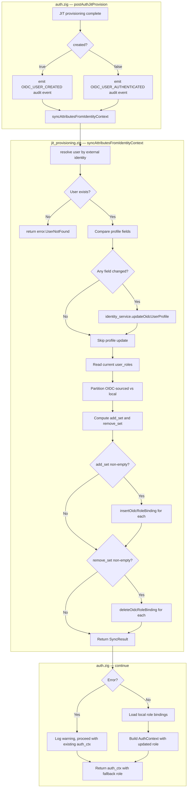

# Module: OIDC-10 Attribute Synchronisation and Role Reconciliation

## Module purpose

This document defines the design for the OIDC-10 attribute synchronisation and role reconciliation layer. It extends the OIDC-09 JIT provisioning orchestration in `src/oidc/jit_provisioning.zig` by replacing the `syncAttributesFromIdentityContext` stub with a real implementation that:

1. Updates the local user record's `display_name`, `email`, and `status` from token claims on every authentication.
2. Reconciles role bindings: token roles from `IdentityContext.roles` are authoritative for OIDC-sourced role bindings, while locally-assigned roles (from IDN-03) are preserved.
3. Is wired into `postAuthJitProvision` in `src/api/middleware/auth.zig` as a best-effort step after JIT provisioning and before building the `AuthContext`.

The design follows the architecture established in OIDC-09: thin orchestration in `jit_provisioning.zig`, data access in `identity/service.zig` and `identity/registry.zig`, and no I/O in pure modules.

## Scope and non-goals

**In scope:**
- Replacing the `syncAttributesFromIdentityContext` stub with a real orchestration function that calls `identity_service` to update profile fields and reconcile roles.
- Role reconciliation algorithm: diff current `user_roles` bindings against token roles, insert OIDC-sourced roles, delete stale OIDC-sourced roles, skip locally-assigned roles.
- Wiring into `auth.zig`: call attribute sync after JIT provisioning on every auth (both first and subsequent). Sync failure must not block auth.
- New identity service and registry functions needed for profile update and role binding management.
- New DB queries (prepared statements via `pg.zig`) for reading/updating user profile fields and managing role bindings.
- Test strategy for unit and integration tests.
- Error taxonomy for sync operations.

**Out of scope:**
- Default role seeding at JIT provisioning time (handled by OIDC-09 via `default_roles` in `jit_provisioning_config`).
- Changes to the `jit_provisioning_config` table schema.
- Frontend or API-layer changes.
- Caching of user profiles or role bindings.
- Password or credential management.

## Public interface

### Updated `syncAttributesFromIdentityContext` (replaces stub)

```zig
/// Result of an attribute sync + role reconciliation operation.
pub const SyncResult = struct {
    /// The updated local user record (owned by caller).
    user: User,
    /// Roles that were added during reconciliation.
    roles_added: []const []const u8,
    /// Roles that were removed during reconciliation.
    roles_removed: []const []const u8,
    /// Whether any profile fields were updated.
    profile_changed: bool,

    pub fn deinit(self: *SyncResult, allocator: std.mem.Allocator) void {
        self.user.deinit(allocator);
        for (self.roles_added) |r| allocator.free(r);
        allocator.free(self.roles_added);
        for (self.roles_removed) |r| allocator.free(r);
        allocator.free(self.roles_removed);
    }
};

/// Synchronise user attributes and reconcile roles from an IdentityContext
/// on every authentication.
///
/// Steps:
///   1. Resolve the local user record by `(tenant_id, realm, external_user_id)`.
///   2. Compare token claims against stored user profile fields.
///   3. If `display_name`, `email`, or `status` differ, call
///      `identity_service.updateUserProfile()` to persist changes.
///   4. Reconcile role bindings:
///      a. Read current `user_roles` for the user.
///      b. Classify each binding as OIDC-sourced (`role_source = 'oidc'`)
///         or locally-assigned (`role_source = 'internal'`).
///      c. Compute desired role set from `IdentityContext.roles`.
///      d. Insert OIDC-sourced roles that are in the desired set but not
///         currently bound (regardless of source — idempotent insert).
///      e. Delete OIDC-sourced bindings that are in the current set but
///         not in the desired set.
///      f. Leave locally-assigned bindings untouched.
///   5. Return SyncResult with the updated user, added/removed roles,
///      and a profile_changed flag.
///
/// Error behaviour:
///   - UserNotFound: No local record maps to this external identity.
///   - PoolExhausted / PersistenceFailed / OutOfMemory: DB errors.
///   - All errors are considered non-fatal to auth (best-effort).
///
/// Precondition: the user MUST already exist (JIT-provisioned on first auth).
pub fn syncAttributesFromIdentityContext(
    allocator: std.mem.Allocator,
    identity_service: *identity_service_mod.Service,
    pool: *pool_mod.Pool,
    identity_ctx: *const claim_mapping.IdentityContext,
    tenant_id: []const u8,
) SyncError!SyncResult;
```

### New `SyncError` set (replaces current stub set)

```zig
pub const SyncError = error{
    /// No local user found for this external identity.
    UserNotFound,
    /// Database pool exhausted.
    PoolExhausted,
    /// Generic persistence failure.
    PersistenceFailed,
    /// Allocator exhausted.
    OutOfMemory,
};
```

### New identity service functions needed

```zig
// In src/identity/service.zig

/// Input for updating an OIDC user's profile fields.
pub const UpdateOidcUserProfileInput = struct {
    user_id: []const u8,
    tenant_id: []const u8,
    display_name: []const u8,
    email: []const u8,
    status: registry_mod.UserStatus,
};

/// Update display_name, email, and/or status for an OIDC user.
/// Only writes fields that actually differ from current stored values.
/// Returns the updated User record on success.
pub fn updateOidcUserProfile(
    self: *Service,
    allocator: std.mem.Allocator,
    input: UpdateOidcUserProfileInput,
) IdentityError!registry_mod.User;

/// Input for role reconciliation.
pub const ReconcileOidcRolesInput = struct {
    tenant_id: []const u8,
    user_id: []const u8,
    /// Roles from the IdentityContext that should be
    /// authoritatively assigned as OIDC-sourced.
    token_roles: []const []const u8,
};

/// Result of role reconciliation.
pub const ReconcileOidcRolesResult = struct {
    added: []const []const u8,
    removed: []const []const u8,

    pub fn deinit(self: *ReconcileOidcRolesResult, allocator: std.mem.Allocator) void {
        for (self.added) |r| allocator.free(r);
        allocator.free(self.added);
        for (self.removed) |r| allocator.free(r);
        allocator.free(self.removed);
    }
};

/// Reconcile OIDC token roles against local role bindings.
///
/// Algorithm:
///   1. Read current user_roles for the user (with role_source).
///   2. Partition into OIDC-sourced vs locally-assigned.
///   3. Compute add_set = token_roles ∖ existing_role_slugs.
///   4. Compute remove_set = OIDC-sourced_slugs ∖ token_roles.
///   5. Insert role bindings for add_set (role_source = 'oidc').
///   6. Delete role bindings for remove_set (only where role_source = 'oidc').
///   7. Return lists of added and removed role slugs.
pub fn reconcileOidcRoles(
    self: *Service,
    allocator: std.mem.Allocator,
    input: ReconcileOidcRolesInput,
) IdentityError!ReconcileOidcRolesResult;
```

### New registry functions needed

```zig
// In src/identity/registry.zig

/// Input for updating user profile fields.
pub const UpdateUserProfileInput = struct {
    user_id: []const u8,
    tenant_id: []const u8,
    display_name: []const u8,
    email: []const u8,
    status: UserStatus,
};

/// Update display_name, email, and status for a user.
/// Returns the updated User record.
/// Returns error.NotFound if the user does not exist.
pub fn updateUserProfile(
    self: *Registry,
    allocator: std.mem.Allocator,
    input: UpdateUserProfileInput,
) RegistryError!User;

/// A single role binding row from user_roles joined with roles.
pub const UserRoleBinding = struct {
    role_slug: []const u8,
    role_source: []const u8,  // "oidc" or "internal"

    pub fn deinit(self: *UserRoleBinding, allocator: std.mem.Allocator) void {
        allocator.free(self.role_slug);
        allocator.free(self.role_source);
    }
};

/// Read all role bindings for a user, including the source.
pub fn selectUserRoles(
    self: *Registry,
    allocator: std.mem.Allocator,
    tenant_id: []const u8,
    user_id: []const u8,
) RegistryError![]UserRoleBinding;

/// Insert an OIDC-sourced role binding for a user.
/// Looks up the role_id from the `roles` table by slug.
/// Idempotent: ON CONFLICT DO NOTHING.
pub fn insertOidcRoleBinding(
    self: *Registry,
    allocator: std.mem.Allocator,
    tenant_id: []const u8,
    user_id: []const u8,
    role_slug: []const u8,
) RegistryError!void;

/// Delete an OIDC-sourced role binding for a user.
/// Only deletes rows where role_source = 'oidc'.
/// Idempotent: no-op if the binding does not exist or is not OIDC-sourced.
pub fn deleteOidcRoleBinding(
    self: *Registry,
    allocator: std.mem.Allocator,
    tenant_id: []const u8,
    user_id: []const u8,
    role_slug: []const u8,
) RegistryError!void;
```

## Role reconciliation algorithm

The reconciliation algorithm is the core of OIDC-10. It is defined as a pure (deterministic) function operating on set logic, executed by `reconcileOidcRoles` in the identity service.

### Input
- `current_bindings`: set of `(role_slug, role_source)` tuples from `user_roles`
- `token_roles`: set of role slugs from `IdentityContext.roles`

### Steps

```
1. Partition current_bindings:
   oidc_slugs   = { slug | (slug, "oidc")     ∈ current_bindings }
   local_slugs  = { slug | (slug, "internal")  ∈ current_bindings }

2. Compute diffs:
   add_set    = token_roles ∖ (oidc_slugs ∪ local_slugs)
   remove_set = oidc_slugs ∖ token_roles

3. Apply:
   For each slug in add_set:    INSERT INTO user_roles (role_source = 'oidc')
   For each slug in remove_set: DELETE FROM user_roles WHERE role_source = 'oidc'

4. Return:
   added   = add_set    (as sorted list)
   removed = remove_set (as sorted list)
```

### Key invariants

1. **Token roles are authoritative over OIDC-sourced bindings.** If a token no longer includes a role that was previously OIDC-sourced, that binding is removed.

2. **Locally-assigned roles are never modified.** `local_slugs` is subtracted from both the add and remove sets. This preserves roles assigned via the IDN-03 internal role management API.

3. **A role present in both token and local bindings is treated as local.** If an admin assigned a role internally and the token also includes it, the binding is preserved with `role_source = 'internal'`. The token's match does not downgrade it to OIDC-sourced.

4. **idempotent inserts and deletes.** The `INSERT` uses `ON CONFLICT DO NOTHING` so duplicate role assignments are harmless. The `DELETE` uses `WHERE role_source = 'oidc'` so it never touches local bindings.

5. **Empty token_roles on subsequent auth.** If the IdP issues a token with no roles, all OIDC-sourced bindings are removed (the user may default to VIEWER). Locally-assigned roles remain.

### Example scenarios

| Scenario | Current bindings | Token roles | Result |
|---|---|---|---|
| New OIDC role added in IdP | `{TASK_WORKER/oidc}` | `{TASK_WORKER, PROCESS_OPERATOR}` | Add PROCESS_OPERATOR/oidc |
| OIDC role removed in IdP | `{TASK_WORKER/oidc, VIEWER/internal}` | `{}` | Remove TASK_WORKER/oidc; VIEWER/internal preserved |
| Overlap with local role | `{PROCESS_DESIGNER/oidc, PROCESS_DESIGNER/internal}` | `{PROCESS_OPERATOR}` | Add PROCESS_OPERATOR/oidc; Remove PROCESS_DESIGNER/oidc; PROCESS_DESIGNER/internal preserved |
| No change | `{TASK_WORKER/oidc}` | `{TASK_WORKER}` | Nothing added, nothing removed |

## Data flow diagram



## Database changes

### New `role_source` column on `user_roles` (migration required)

The `user_roles` table needs a `role_source` column to distinguish OIDC-sourced bindings from locally-assigned ones.

```sql
-- Migration: NNN_oidc10_role_source.sql
ALTER TABLE user_roles
ADD COLUMN IF NOT EXISTS role_source TEXT NOT NULL DEFAULT 'internal'
CHECK (role_source IN ('internal', 'oidc'));
```

**Design rationale:** Using a column rather than a separate table keeps the schema simple and allows a single query to read all bindings with their sources. The default `'internal'` ensures existing rows (from IDN-03) are treated as locally-assigned without requiring a backfill.

### New DB queries

#### 1. Update user profile fields

```sql
UPDATE users
SET display_name = $3,
    email = $4,
    status = $5,
    updated_at = NOW()
WHERE id::text = $1 AND tenant_id = $2::uuid
RETURNING id::text, username, display_name, email, status, created_at::text
```

Parameters: `[$1: user_id, $2: tenant_id, $3: display_name, $4: email, $5: status]`

#### 2. Read user role bindings with source

```sql
SELECT r.name AS role_slug, ur.role_source
FROM user_roles ur
JOIN roles r ON r.id = ur.role_id
WHERE ur.user_id = $1::uuid
```

Parameters: `[$1: user_id]`

#### 3. Insert OIDC-sourced role binding (idempotent)

```sql
INSERT INTO user_roles (user_id, role_id, role_source)
SELECT $1::uuid, r.id, 'oidc'
FROM roles r
WHERE r.name = $2
  AND NOT EXISTS (
    SELECT 1 FROM user_roles ur
    WHERE ur.user_id = $1::uuid AND ur.role_id = r.id
  )
ON CONFLICT (user_id, role_id) DO NOTHING
```

Parameters: `[$1: user_id, $2: role_slug]`

**Note:** A `UNIQUE (user_id, role_id)` constraint must exist on `user_roles` for `ON CONFLICT DO NOTHING` to work. Verify this exists or add it in the migration.

#### 4. Delete OIDC-sourced role binding (source-guarded)

```sql
DELETE FROM user_roles
WHERE user_id = $1::uuid
  AND role_id = (SELECT id FROM roles WHERE name = $2)
  AND role_source = 'oidc'
```

Parameters: `[$1: user_id, $2: role_slug]`

#### 5. Resolve user by external identity (existing — from OIDC-09)

```sql
SELECT id::text, username, display_name, email, status, created_at::text
FROM users
WHERE tenant_id = $1::uuid
  AND external_realm = $2
  AND external_id = $3
LIMIT 1
```

Parameters: `[$1: tenant_id, $2: external_realm, $3: external_id]`

This query already exists in `registry.zig` as `selectUserByExternalIdentity`. It is reused by the sync function without modification.

### Migration file

A single new migration `NNN_oidc10_role_source.sql` is needed:

```sql
-- Add role_source column to user_roles for OIDC reconciliation.
ALTER TABLE user_roles
ADD COLUMN IF NOT EXISTS role_source TEXT NOT NULL DEFAULT 'internal'
CHECK (role_source IN ('internal', 'oidc'));

-- Ensure unique constraint exists for idempotent inserts.
-- If already present, the IF NOT EXISTS clause is a no-op.
-- The constraint name is standardised: user_roles_user_id_role_id_key.
-- PostgreSQL's ALTER TABLE ... ADD CONSTRAINT ... IF NOT EXISTS is not
-- supported before PG 14, so we use a DO block for compatibility.
DO $$
BEGIN
    IF NOT EXISTS (
        SELECT 1 FROM pg_constraint
        WHERE conname = 'user_roles_user_id_role_id_key'
          AND connamespace = (SELECT oid FROM pg_namespace WHERE nspname = 'public')
    ) THEN
        -- Drop any existing duplicate-name constraint if present.
        -- This is safe because the UNIQUE constraint is required for
        -- OIDC-10's ON CONFLICT DO NOTHING strategy.
        ALTER TABLE user_roles ADD CONSTRAINT user_roles_user_id_role_id_key UNIQUE (user_id, role_id);
    END IF;
END $$;
```

## Wiring into auth.zig

The `postAuthJitProvision` function in `src/api/middleware/auth.zig` already handles the OIDC JIT flow. After `processProvisionResult` and before loading local role bindings, the sync call is inserted:

### Insertion point

```zig
// Current code (simplified):
const provision_result = jit_provisioning.processProvisionResult(...);
const role = loadUserRole(allocator, db_pool, provision_result.user.user_id) catch ...;

// After OIDC-10:
const provision_result = jit_provisioning.processProvisionResult(...);

// ── OIDC-10: Attribute sync and role reconciliation (best-effort) ──
const sync_result = jit_provisioning.syncAttributesFromIdentityContext(
    allocator,
    identity_service,
    db_pool,
    &identity_ctx,
    auth_ctx.tenant_id[0..],
) catch |err| {
    // Best-effort: log the error but do not block auth.
    // The user record still exists from JIT provisioning.
    // Role reconciliation may be stale until next auth.
    std.log.warn("OIDC-10 sync failed: {s}", .{@errorName(err)});
};

// After sync completes (or fails), reload roles because reconciliation
// may have changed them.
const role = loadUserRole(allocator, db_pool, provision_result.user.user_id) catch ...;
```

### Error handling strategy

| Scenario | Behaviour |
|---|---|
| User not found (should not happen after JIT) | Log error, proceed with existing `auth_ctx`. User visible as authenticated but with attributes from previous sync. |
| DB pool exhausted during profile update | Log warning, skip profile update, continue to role reconciliation (separate connection) |
| DB pool exhausted during role reconciliation | Log warning, skip role reconciliation, use existing role bindings |
| Persistence failure during profile write | Log error, skip profile update (user will retry on next auth) |
| Persistence failure during role write | Partial state: some roles may have been updated but others not. Log error. Will be reconciled on next auth. |
| OutOfMemory | Log error, skip sync entirely |

**Key principle:** Attribute sync must never cause an authenticated user to be rejected. All errors are caught, logged, and the request proceeds with the best available data.

### First-auth consideration

On first auth (`created=true`), the `syncAttributesFromIdentityContext` function is still called. This is intentional:

- The `createOrGetJitOidcUser` function creates the user with claims from the first token. Calling sync on first auth ensures any claims that changed between token issuance and the platform call are captured.
- Role reconciliation on first auth handles the case where token roles differ from `default_roles` in `jit_provisioning_config`. The explicit token roles overwrite the default-seeded OIDC-sourced bindings.

## Error taxonomy

### `SyncError` (in `jit_provisioning.zig`)

```zig
pub const SyncError = error{
    UserNotFound,
    PoolExhausted,
    PersistenceFailed,
    OutOfMemory,
};
```

### Additional errors in identity service (propagated)

| Error | Source | Description |
|---|---|---|
| `NotFound` | `registry.updateUserProfile` | User ID not found |
| `ValidationFailed` | `service.updateOidcUserProfile` | Missing or invalid input fields |
| `InvalidEmail` | `service.updateOidcUserProfile` | Email format validation failure |
| `PoolExhausted` | `registry.selectUserRoles` | Connection pool exhausted |
| `PersistenceFailed` | All queries | Generic DB failure |

### Error mapping (in auth.zig wiring)

All sync errors are caught and mapped to a logged warning. No sync error propagates to the HTTP response.

## Dependencies

### This module calls / depends on:

| Module | Why |
|---|---|
| `src/oidc/jit_provisioning.zig` | Contains the `syncAttributesFromIdentityContext` orchestration function (this file) |
| `src/identity/service.zig` | New `updateOidcUserProfile` and `reconcileOidcRoles` functions |
| `src/identity/registry.zig` | New `updateUserProfile`, `selectUserRoles`, `insertOidcRoleBinding`, `deleteOidcRoleBinding` functions |
| `src/db/pool.zig` | Database access for all queries |
| `src/oidc/claim_mapping.zig` | `IdentityContext` input type (specifically `roles`, `display_name`, `email` fields) |
| `src/obs/logger.zig` | Warning logging on sync failure |
| `migrations/NNN_oidc10_role_source.sql` | `role_source` column on `user_roles` |

### This module must NOT depend on:

| Module | Reason |
|---|---|
| `src/engine/transition.zig` | Pure execution engine — no I/O allowed |
| `src/api/routes/` | No route handler coupling |
| `src/api/middleware/auth.zig` (beyond types) | Auth middleware calls THIS module, not the other way around |
| `src/scheduler/` | No async scheduling dependency |

## Test strategy

### Unit tests (pure, no DB)

Tests for `src/oidc/jit_provisioning.zig`:

| Test case | Description |
|---|---|
| TC-OIDC-10-01 | `syncAttributesFromIdentityContext` returns `UserNotFound` when user does not exist (using mock service) |
| TC-OIDC-10-02 | Profile comparison logic: fields that match are not updated |
| TC-OIDC-10-03 | Profile comparison logic: fields that differ trigger update call |
| TC-OIDC-10-04 | SyncResult deinit frees all owned memory correctly |

### Integration tests (real PostgreSQL)

Tests in `tests/integration/oidc10_attribute_sync_test.zig`:

| Test case | Description | Acceptance criterion |
|---|---|---|
| TC-OIDC-10-05 | Full flow: create OIDC user → sync display_name, email, status → read back updated values | Profile fields are updated on subsequent auth |
| TC-OIDC-10-06 | Role reconciliation: token roles include roles not currently assigned → new bindings created | New roles appear in `user_roles` with `role_source = 'oidc'` |
| TC-OIDC-10-07 | Role reconciliation: token roles omit a previously OIDC-sourced role → binding removed | Stale OIDC-sourced binding deleted |
| TC-OIDC-10-08 | Role reconciliation: locally-assigned role not in token roles → preserved | Local binding remains with `role_source = 'internal'` |
| TC-OIDC-10-09 | Role reconciliation: overlap between token roles and locally-assigned roles → preserved with `role_source = 'internal'` | Local binding not downgraded to OIDC-sourced |
| TC-OIDC-10-10 | Role reconciliation: empty token_roles → all OIDC-sourced bindings removed, local preserved | Only OIDC-sourced bindings deleted |
| TC-OIDC-10-11 | Role reconciliation: no role changes → no insert/delete operations | Zero net changes |
| TC-OIDC-10-12 | Attribute sync failure does not block auth: simulate DB error → auth succeeds with logged warning | Auth proceeds with fallback role |
| TC-OIDC-10-13 | Attribute sync on first auth (created=true) → profile and roles synced after JIT creation | Sync applies on first auth too |
| TC-OIDC-10-14 | Changing role in IdP → next auth reflects new role | Test via token manipulation in test harness |
| TC-OIDC-10-15 | `role_source` column default is `'internal'` for existing rows | Migration idempotent |

### Test file location

```
tests/integration/oidc10_attribute_sync_test.zig
```

### Test dependencies

- Real PostgreSQL database (`BPM_TEST_DB_URL`)
- Pre-existing OIDC user (created via `createOrGetJitOidcUser`)
- Pre-existing roles in the `roles` table (seeded by prior migrations)
- Helper functions for tenant setup and cleanup (same pattern as `oidc09_jit_provisioning_test.zig`)

## Module placement

All changes are within existing modules:

| File | Change |
|---|---|
| `src/oidc/jit_provisioning.zig` | Replace `syncAttributesFromIdentityContext` stub with real implementation |
| `src/identity/service.zig` | Add `updateOidcUserProfile` and `reconcileOidcRoles` |
| `src/identity/registry.zig` | Add `updateUserProfile`, `selectUserRoles`, `insertOidcRoleBinding`, `deleteOidcRoleBinding` |
| `src/api/middleware/auth.zig` | Wire sync call after `processProvisionResult` and before `loadUserRole` |
| `migrations/NNN_oidc10_role_source.sql` | Add `role_source` column + unique constraint |

### Implementation order (for BACKEND-DEV)

1. `migrations/NNN_oidc10_role_source.sql` — migration first (table must exist before code queries it)
2. `src/identity/registry.zig` — add new registry functions (`updateUserProfile`, `selectUserRoles`, `insertOidcRoleBinding`, `deleteOidcRoleBinding`)
3. `src/identity/service.zig` — add `updateOidcUserProfile` and `reconcileOidcRoles` (calling the new registry functions)
4. `src/oidc/jit_provisioning.zig` — replace `syncAttributesFromIdentityContext` stub with real implementation
5. `src/api/middleware/auth.zig` — wire the sync call into `postAuthJitProvision`
6. Run `zig build migrate` — apply the migration
7. Run `zig build` — verify compilation
8. Run `zig build test` — verify unit tests pass
9. Run `zig build test-integration` — verify integration tests pass

## Open questions and risks

### OQ-1: Role slug → role_id resolution performance

The current design uses a subquery `(SELECT id FROM roles WHERE name = $2)` for each role slug in the add/remove sets. For realistic role counts (5–20), this is acceptable. If roles grow to 100+, consider a batch lookup query that resolves all slugs at once.

**Recommended:** Accept the subquery approach for now. If profiling shows contention, optimise with a batch lookup query.

### OQ-2: `role_source` column vs separate `oidc_role_bindings` table

Using a `role_source` column on `user_roles` is the simplest approach and allows a single query for "all roles, with source". The alternative (a separate `oidc_role_bindings` table) would require JOINs or UNIONs for every role read.

**Recommended:** `role_source` column, as designed above.

### OQ-3: Transactional atomicity of profile update + role reconciliation

The profile update and role reconciliation steps are currently separate operations (potentially on different connections from the pool). If the profile update succeeds but role reconciliation fails, the user's profile is updated but roles are stale until the next auth.

**Recommended:** Accept eventual consistency within one auth interval. Making both steps atomic would require holding a transaction across multiple operations, which increases connection contention. The best-effort semantics already documented (errors logged, auth not blocked) are acceptable.

### OQ-4: Status synchronisation from token claims

The `IdentityContext` does not currently carry a `status` field from token claims. If status is to be synchronised, the claim mapping (OIDC-08) needs to support a `status_claim` configuration, or status must be derived from token attributes (e.g., `email_verified`).

**Recommended:** For this iteration, status sync is limited to the OIDC-09 default (`jit_config.default_status`). If the IdP provides a status indicator (e.g., `email_verified: false` → INACTIVE), this can be added to `ClaimMappingConfig` in a follow-up. For now, the status field in the sync function reads from `IdentityContext` but is expected to always pass `ACTIVE` unless the claim mapping is extended.

### OQ-5: Role slug collision between realms

If two realms have roles with the same name but different semantics, the current role lookup is by slug only (no tenant/realm scope). This is consistent with the existing role model where roles are platform-wide, not per-tenant.

**Risk rating:** Low, because the `roles` table is platform-wide and role reconciliation is scoped to the user's tenant via foreign keys.

### OQ-6: Concurrent auth requests for the same user

If a user sends two requests simultaneously, both may trigger attribute sync + role reconciliation. The inserts use `ON CONFLICT DO NOTHING` and deletes are idempotent, so concurrent operations are safe. However, there is a TOCTOU race: both requests read the same current bindings, compute the same diffs, and apply the same changes — wasteful but harmless.

**Risk rating:** Low. Idempotent writes prevent data corruption.
