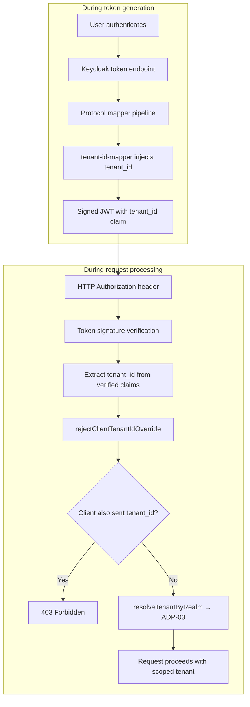

# Module: OIDC-13 Tenant Claim Source

## Module purpose

This module defines the design for ensuring the `tenant_id` claim (required by ADP-03 for tenant context resolution) is populated exclusively by the identity provider, not constructed or overridden by the client. For Keycloak, this is implemented via a **protocol mapper** configured at the realm or client level that injects the `tenant_id` into every issued token based on realm metadata. Clients MUST NOT be able to supply, override, or influence the `tenant_id` claim value. This is a security-critical invariant that prevents tenant-escapes and cross-tenant data access.

## Public interface

### Protocol mapper configuration (Keycloak adapter)

```zig
/// Configuration for the Keycloak protocol mapper that injects the
/// tenant_id claim into tokens. This mapper is added to every realm
/// created via OIDC-14 provisioning.
pub const TenantClaimMapperConfig = struct {
    /// The BPM tenant_id (UUID) to inject into the claim.
    tenant_id: [36]u8,
    /// The claim name to use. Defaults to 'tenant_id'.
    claim_name: []const u8,
    /// Whether to add the claim to the access token, ID token, and
    /// userinfo endpoint response.
    add_to_access_token: bool,
    add_to_id_token: bool,
    add_to_userinfo: bool,
};

pub const DEFAULT_TENANT_CLAIM_MAPPER_CONFIG: TenantClaimMapperConfig = .{
    .tenant_id = undefined, // must be filled per realm
    .claim_name = "tenant_id",
    .add_to_access_token = true,
    .add_to_id_token = true,
    .add_to_userinfo = true,
};
```

### Claim validation middleware

```zig
/// Result of validating that the tenant_id claim in a token was
/// issued by the IdP (not supplied by the client).
pub const TenantClaimValidationResult = struct {
    /// The tenant_id extracted from the token claim.
    tenant_id: [36]u8,
    /// Whether the claim was present and from a trusted source.
    valid: bool,
    /// If invalid, a description of why.
    reason: ?[]const u8,
};

/// Validate that the tenant_id claim in a token is trustworthy.
///
/// This function performs these checks:
///   1. The token MUST have a tenant_id claim.
///   2. The claim value MUST be a valid UUID.
///   3. The claim MUST NOT be present in the token's unverified
///      headers or as a client-supplied request parameter (which
///      would indicate client injection attempt).
///
/// Note: Since the tenant_id is injected by a Keycloak protocol mapper
/// (which runs server-side during token generation), a validly-signed
/// token already guarantees the claim's provenance. The main risk is
/// a client presenting a self-constructed JWT with a tenant_id claim
/// — but such a token would fail signature verification at OIDC-07/08.
/// This validation is therefore a defence-in-depth layer.
///
/// Error cases:
///   - MissingClaim: The token has no tenant_id claim.
///   - InvalidClaimValue: The tenant_id is not a valid UUID.
///   - ClaimInjectionDetected: The claim appears in token headers
///     or client params (heuristic — see open questions).
///   - OutOfMemory.
pub fn validateTenantClaimSource(
    verified_principal: *const VerifiedPrincipal,
    raw_token: []const u8,
    allocator: std.mem.Allocator,
) TenantClaimError!TenantClaimValidationResult;
```

### Protocol mapper creation (Keycloak admin API)

Within `src/identity/provider/adapters/keycloak/realm_api.zig`, realm provisioning (OIDC-14) includes a step to create the `tenant_id` protocol mapper:

```zig
/// Create a protocol mapper on a realm that injects the tenant_id claim.
///
/// Keycloak Admin REST:
///   POST /admin/realms/{realm}/protocol-mappers/models
///
/// Payload (Keycloak DTO):
/// {
///   "name": "tenant-id-mapper",
///   "protocol": "openid-connect",
///   "protocolMapper": "oidc-hardcoded-claim-mapper",
///   "config": {
///     "claim.name": "tenant_id",
///     "claim.value": "<tenant-uuid>",
///     "jsonType.label": "String",
///     "access.token.claim": "true",
///     "id.token.claim": "true",
///     "userinfo.token.claim": "true"
///   }
/// }
///
/// The "oidc-hardcoded-claim-mapper" built-in mapper type injects a
/// static claim value into every issued token. The claim value is the
/// BPM tenant UUID, passed from the realm provisioning context.
///
/// This mapper is created once during realm provisioning. It is not
/// modified afterwards unless the tenant_id changes (which should
/// never happen — see OIDC-12 immutability invariant).
///
/// Error cases:
///   - UpstreamUnavailable: Keycloak endpoint unreachable.
///   - UnauthorizedAdminCall: Admin token expired or invalid.
///   - DuplicateResource: Mapper with same name already exists
///     (idempotent — treat as success).
///   - UpstreamProtocolError: Unexpected response from Keycloak.
pub fn createTenantIdMapper(
    admin_token: *AdminToken,
    realm: []const u8,
    tenant_id: [36]u8,
) CreateMapperError!void;
```

### Client-side override prevention (API gateway)

The platform API layer (middleware) MUST strip or reject any client-supplied `tenant_id` in request headers or body parameters. This is implemented in the auth middleware (auth.zig) as a separate validation step:

```zig
/// Reject any request that attempts to supply a tenant_id claim
/// via client-controlled channels.
///
/// This checks:
///   - HTTP header `X-Tenant-ID` — rejected.
///   - Query parameter `tenant_id` — rejected.
///   - Request body field `tenant_id` — rejected if the body is
///     trusted to be JSON (for endpoints that accept JSON bodies,
///     the tenant_id field is removed before parsing).
///
/// The only authoritative source of tenant_id is the token claim
/// injected by the IdP protocol mapper.
///
/// Error cases:
///   - ClientOverridesTenantId: Return 403 Forbidden with message
///     "tenant_id claim is managed by the identity provider".
pub fn rejectClientTenantIdOverride(
    request_headers: *const std.http.Headers,
    request_path: []const u8,
    request_body: []const u8,
) ClientOverrideError!void;
```

## Key invariants

1. **Tenant_id is server-injected only.** The claim value originates from the Keycloak realm's protocol mapper configuration. Clients MUST NOT be able to influence it through any channel (headers, params, body).

2. **Protocol mapper is immutable after provisioning.** Once the `tenant-id-mapper` is created on a realm during OIDC-14 provisioning, it is never modified. Changing the tenant binding (OIDC-12 invariant 3) would require creating a new realm and decommissioning the old one.

3. **All token types carry the claim.** The protocol mapper injects `tenant_id` into access tokens, ID tokens, and the userinfo endpoint response. This ensures tenant context is available regardless of which token type the platform consumes.

4. **Client override is always rejected.** Even if a client somehow adds a `tenant_id` claim to a self-constructed JWT, the token signature verification (OIDC-07/08) will reject it. The defence-in-depth check in the auth middleware adds an extra layer of protection.

5. **Token without tenant_id resolves to default tenant.** Per ADP-03, a token that has no `tenant_id` claim (e.g., from a pre-migration realm) resolves to the default tenant. The protocol mapper is only added to realms provisioned after OIDC-13 is active.

## DB tables/columns touched

No new DB tables or columns. This module is configuration-only:

| Storage | What | Where |
|---|---|---|
| Keycloak realm | Protocol mapper configuration | Stored in Keycloak's internal DB, managed via Admin REST API |
| Realm claim mapping config | Per-realm mapper settings | `realm_claim_mapping_config` table (from OIDC-08) could store the claim name override |

## Data flow



## Cross-module dependencies

### This module calls / depends on:

| Module | Why |
|---|---|
| `src/identity/provider/adapters/keycloak/realm_api.zig` | `createTenantIdMapper` — protocol mapper creation during realm provisioning |
| `src/identity/provider/adapters/keycloak/dto.zig` | Keycloak protocol mapper DTO types |
| `src/api/middleware/auth.zig` | `rejectClientTenantIdOverride` call — client override prevention |
| `src/identity/provider/types.zig` | `VerifiedPrincipal` — consumed during validation |
| `src/identity/provider/errors.zig` | Shared provider error types |

### This module must NOT depend on:

| Module | Why |
|---|---|
| `src/db/pool.zig` | No database calls — mapper config is in Keycloak, not in BPM DB |
| `src/oidc/jit_provisioning.zig` | JIT provisioning is downstream of tenant context resolution |
| Any route handler module | Configuration-only; no HTTP awareness |

## Identified risks / open questions

1. **Hardcoded-claim-mapper vs script mapper.** The design uses Keycloak's built-in `oidc-hardcoded-claim-mapper`. This is the simplest approach and meets the requirement. An alternative is a JavaScript protocol mapper that computes `tenant_id` from realm metadata. The hardcoded mapper is preferred because it has no runtime evaluation overhead and the tenant_id is fixed at provisioning time. However, if realm metadata needs to change the tenant_id dynamically (not recommended per OIDC-12), a script mapper would be needed.

2. **Claim name configuration.** The user-facing claim name is hardcoded as `tenant_id`. If another provider uses a different claim name (e.g., `bpm_tenant_id`), OIDC-08's per-realm claim mapping configuration should support mapping the provider's claim to `tenant_id` internally. This is an OIDC-08 design detail, not OIDC-13.

3. **Client override detection heuristic.** `rejectClientTenantIdOverride` relies on detecting `tenant_id` in headers/params/body. A sophisticated attacker could encode `tenant_id` in a custom header that the platform does not check. The defence-in-depth design relies on signature verification as the primary defence — this detection is a secondary safety net. Consider documenting this limitation.

4. **Token exchange scenarios.** If the platform uses token exchange (e.g., exchanging an access token for a different audience), the `tenant_id` claim from the original token must be preserved in the exchanged token. Keycloak's token exchange endpoints handle this automatically for protocol mapper claims, but this should be verified during integration testing.
