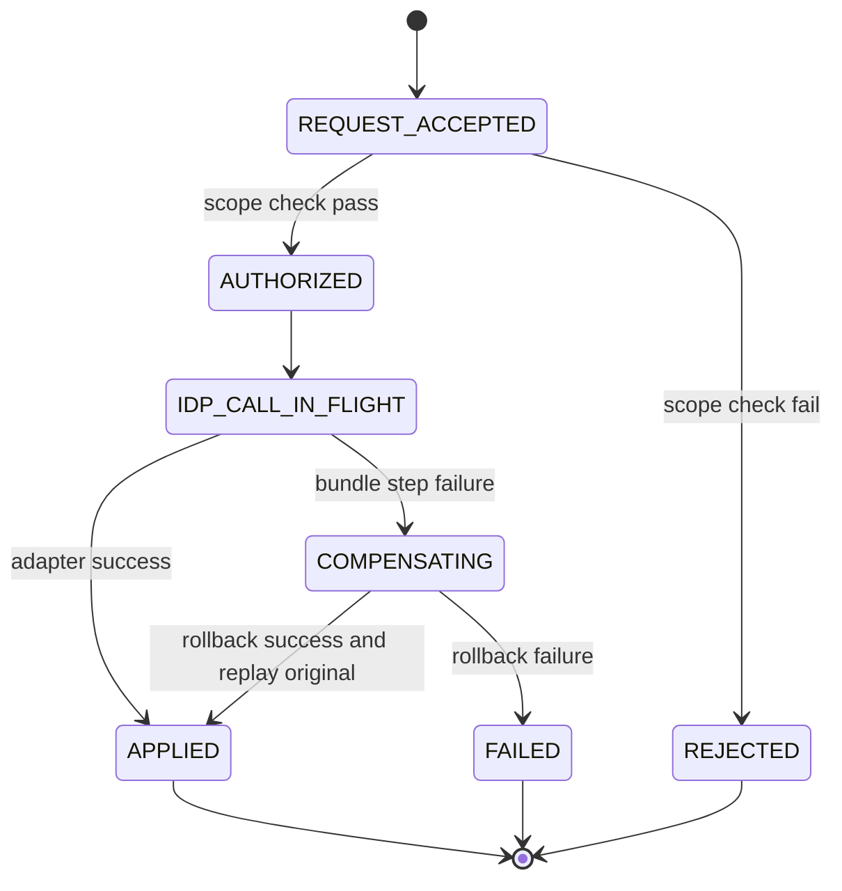

# Module: OIDC-16 Full Lifecycle API for Agents

## Module purpose

This module defines the platform REST orchestration layer for full identity-provider lifecycle operations used by automation agents: realms, users, roles, clients, federations, and client secret rotation. It wraps adapter operations from OIDC-02/OIDC-14/OIDC-15 behind a scope-gated API so a qualified automation agent can provision and manage tenant identity resources through platform endpoints only.

## Public interface

```zig
pub const AgentPrincipal = struct {
    actor_id: []const u8,
    roles: []const []const u8,
    scopes: []const []const u8,
    auth_source: enum { human, agent },
};

pub const ProvisionBundleRequest = struct {
    tenant_id: [36]u8,
    realm: RealmCreateInput,
    admin_user: ?UserCreateInput,
    client: ?ClientCreateInput,
    federation: ?FederationCreateInput,
    idempotency_key: []const u8,
};

pub const ProvisionBundleResult = struct {
    realm_id: []const u8,
    user_id: ?[]const u8,
    client_id: ?[]const u8,
    federation_id: ?[]const u8,
    transaction_id: []const u8,
};

pub fn createRealm(ctx: *RequestContext, principal: AgentPrincipal, body: RealmCreateInput) !RealmView;
pub fn listRealms(ctx: *RequestContext, principal: AgentPrincipal, query: RealmListQuery) !RealmListPage;
pub fn getRealm(ctx: *RequestContext, principal: AgentPrincipal, realm_id: []const u8) !RealmView;
pub fn updateRealm(ctx: *RequestContext, principal: AgentPrincipal, realm_id: []const u8, body: RealmUpdateInput) !RealmView;
pub fn deleteRealm(ctx: *RequestContext, principal: AgentPrincipal, realm_id: []const u8) !DeleteResult;

pub fn createUser(ctx: *RequestContext, principal: AgentPrincipal, realm_id: []const u8, body: UserCreateInput) !UserView;
pub fn listUsers(ctx: *RequestContext, principal: AgentPrincipal, realm_id: []const u8, query: UserListQuery) !UserListPage;
pub fn getUser(ctx: *RequestContext, principal: AgentPrincipal, realm_id: []const u8, user_id: []const u8) !UserView;
pub fn updateUser(ctx: *RequestContext, principal: AgentPrincipal, realm_id: []const u8, user_id: []const u8, body: UserUpdateInput) !UserView;
pub fn deleteUser(ctx: *RequestContext, principal: AgentPrincipal, realm_id: []const u8, user_id: []const u8) !DeleteResult;

pub fn assignRoles(ctx: *RequestContext, principal: AgentPrincipal, realm_id: []const u8, user_id: []const u8, body: RoleAssignInput) !RoleAssignResult;
pub fn revokeRoles(ctx: *RequestContext, principal: AgentPrincipal, realm_id: []const u8, user_id: []const u8, body: RoleRevokeInput) !RoleRevokeResult;

pub fn createClient(ctx: *RequestContext, principal: AgentPrincipal, realm_id: []const u8, body: ClientCreateInput) !ClientView;
pub fn listClients(ctx: *RequestContext, principal: AgentPrincipal, realm_id: []const u8, query: ClientListQuery) !ClientListPage;
pub fn updateClient(ctx: *RequestContext, principal: AgentPrincipal, realm_id: []const u8, client_id: []const u8, body: ClientUpdateInput) !ClientView;
pub fn deleteClient(ctx: *RequestContext, principal: AgentPrincipal, realm_id: []const u8, client_id: []const u8) !DeleteResult;
pub fn rotateClientSecret(ctx: *RequestContext, principal: AgentPrincipal, realm_id: []const u8, client_id: []const u8, body: SecretRotateInput) !SecretRotateResult;

pub fn createFederation(ctx: *RequestContext, principal: AgentPrincipal, realm_id: []const u8, body: FederationCreateInput) !FederationView;
pub fn listFederations(ctx: *RequestContext, principal: AgentPrincipal, realm_id: []const u8) !FederationList;
pub fn deleteFederation(ctx: *RequestContext, principal: AgentPrincipal, realm_id: []const u8, federation_id: []const u8) !DeleteResult;

pub fn provisionBundle(ctx: *RequestContext, principal: AgentPrincipal, body: ProvisionBundleRequest) !ProvisionBundleResult;
```

## Data structures and persistence model

- `agent_api_scope_matrix` (static table or config object): maps route action to required scopes.
- `idp_operation_ledger` (new table in OIDC-17/18): stores idempotency key, normalized request hash, response payload hash, status, and replay metadata.
- `idp_transaction_log` (new table in OIDC-18): stores forward steps and compensation plan for bundle transactions.

No provider resource state is persisted locally beyond existing tenant binding and operation ledger records.

## API route surfaces and auth scopes

- `POST /api/v1/idp/realms` scope `idp.realm.write`
- `GET /api/v1/idp/realms` scope `idp.realm.read`
- `GET /api/v1/idp/realms/{realmId}` scope `idp.realm.read`
- `PATCH /api/v1/idp/realms/{realmId}` scope `idp.realm.write`
- `DELETE /api/v1/idp/realms/{realmId}` scope `idp.realm.delete`
- `POST /api/v1/idp/realms/{realmId}/users` scope `idp.user.write`
- `GET /api/v1/idp/realms/{realmId}/users` scope `idp.user.read`
- `GET /api/v1/idp/realms/{realmId}/users/{userId}` scope `idp.user.read`
- `PATCH /api/v1/idp/realms/{realmId}/users/{userId}` scope `idp.user.write`
- `DELETE /api/v1/idp/realms/{realmId}/users/{userId}` scope `idp.user.delete`
- `POST /api/v1/idp/realms/{realmId}/users/{userId}/roles:assign` scope `idp.role.bind`
- `POST /api/v1/idp/realms/{realmId}/users/{userId}/roles:revoke` scope `idp.role.bind`
- `POST /api/v1/idp/realms/{realmId}/clients` scope `idp.client.write`
- `GET /api/v1/idp/realms/{realmId}/clients` scope `idp.client.read`
- `PATCH /api/v1/idp/realms/{realmId}/clients/{clientId}` scope `idp.client.write`
- `DELETE /api/v1/idp/realms/{realmId}/clients/{clientId}` scope `idp.client.delete`
- `POST /api/v1/idp/realms/{realmId}/clients/{clientId}/secret:rotate` scope `idp.client.rotate`
- `POST /api/v1/idp/realms/{realmId}/federations` scope `idp.federation.write`
- `GET /api/v1/idp/realms/{realmId}/federations` scope `idp.federation.read`
- `DELETE /api/v1/idp/realms/{realmId}/federations/{federationId}` scope `idp.federation.delete`
- `POST /api/v1/idp/provisioning:bundle` scope `idp.bundle.write`

Authorization rule: caller must be `PLATFORM_ADMIN` OR role `AGENT_RUNNER` with required sub-scope.

## Invariants and failure or rollback guarantees

1. No endpoint invokes adapter mutation before scope authorization succeeds.
2. Every mutating endpoint requires `Idempotency-Key` header (OIDC-17).
3. Bundle endpoint returns success only if all requested steps commit or compensation succeeds (OIDC-18).
4. Route-to-adapter mapping is one-to-one; API layer adds orchestration, auth, idempotency, and audit only.
5. OpenAPI operation IDs must exist for each route to satisfy API-11.

## State transitions



## DB schema or index additions if needed

- Reuse OIDC-17 `idp_operation_ledger` unique index on `(endpoint_fingerprint, idempotency_key)`.
- Reuse OIDC-18 `idp_transaction_log` index on `(transaction_id, step_index)`.
- No OIDC-16-only table beyond these shared artifacts.

## Cross-module dependencies

- Depends on `src/api/server.zig`, `src/api/middleware/auth.zig`, `src/api/errors.zig`.
- Depends on `src/identity/provider/interface.zig` and Keycloak adapter modules.
- Depends on OIDC-17 idempotency middleware, OIDC-18 transaction coordinator, OIDC-19 audit wrapper.
- Must not depend on UI modules or direct SQL inside route handlers.

## Testability hooks and observability points

- Inject `IdentityProvider` test double for unit-level route contract tests.
- Expose `X-Idp-Transaction-Id` and `X-Idempotency-Replayed` headers for assertions.
- Emit metrics counters per route and scope decision (`allow`, `deny`).
- Emit structured audit event envelope for each adapter call via OIDC-19.

## Risks and open questions

1. Open question: whether `idp.bundle.write` should be split into finer bundle scopes (`bundle.realm`, `bundle.user`) for least privilege.
2. Open question: pagination cursor format for list endpoints should align with existing API cursor codec or introduce realm-scoped cursor namespace.
3. Risk: provider API drift can cause route-level behavior mismatch; require adapter capability discovery at startup.
4. Risk: bundle rollback over eventually consistent provider APIs may require asynchronous reconciliation for rare partial failures.
