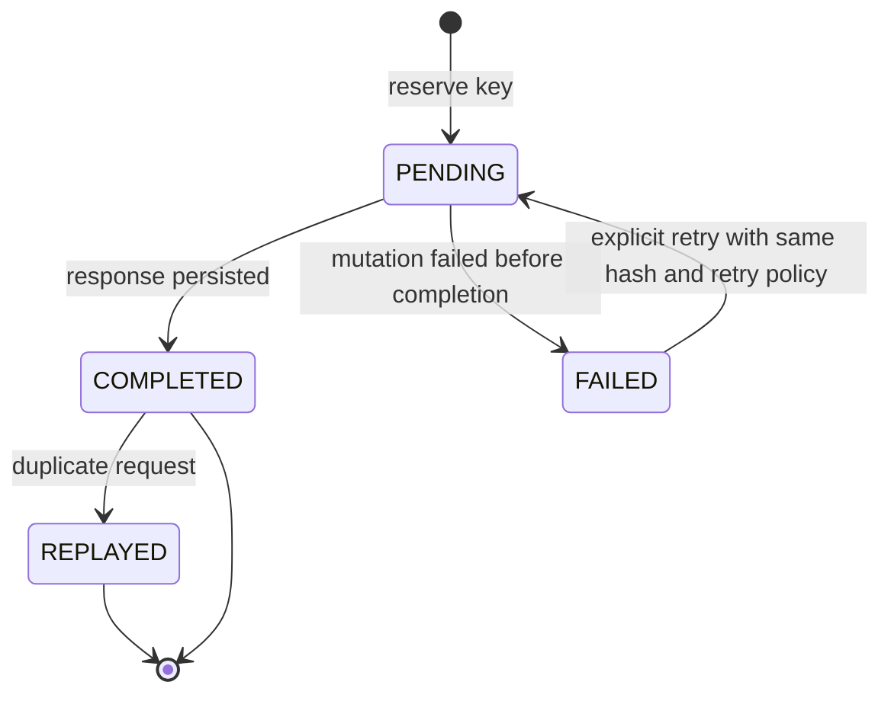

# Module: OIDC-17 Provisioning Idempotency

## Module purpose

This module standardizes idempotency behavior for all mutating OIDC provisioning endpoints so agent retries are safe. Each provisioning request carries an idempotency key that deduplicates repeated submissions and returns the original response semantics with HTTP 200 on duplicates, matching ES-03.

## Public interface

```zig
pub const IdempotencyScope = enum {
    realm_create,
    realm_update,
    realm_delete,
    user_create,
    user_update,
    user_delete,
    role_assign,
    role_revoke,
    client_create,
    client_update,
    client_delete,
    client_secret_rotate,
    federation_create,
    federation_delete,
    bundle_provision,
};

pub const IdempotencyRecord = struct {
    key: []const u8,
    scope: IdempotencyScope,
    endpoint_fingerprint: []const u8,
    request_hash: [32]u8,
    response_status: u16,
    response_body_json: []const u8,
    created_at_unix: i64,
    expires_at_unix: i64,
};

pub const ReplayResult = union(enum) {
    miss,
    hit: IdempotencyRecord,
    conflict: struct {
        existing_request_hash: [32]u8,
        attempted_request_hash: [32]u8,
    },
};

pub fn checkAndReserve(
    allocator: std.mem.Allocator,
    pool: *Pool,
    key: []const u8,
    scope: IdempotencyScope,
    endpoint_fingerprint: []const u8,
    request_hash: [32]u8,
    ttl_seconds: u32,
) !ReplayResult;

pub fn persistFinalResponse(
    allocator: std.mem.Allocator,
    pool: *Pool,
    key: []const u8,
    scope: IdempotencyScope,
    endpoint_fingerprint: []const u8,
    response_status: u16,
    response_body_json: []const u8,
) !void;
```

## Data structures and persistence model

### New table: idp_operation_ledger

```sql
CREATE TABLE IF NOT EXISTS idp_operation_ledger (
    operation_id UUID PRIMARY KEY,
    endpoint_fingerprint TEXT NOT NULL,
    idempotency_key TEXT NOT NULL,
    scope TEXT NOT NULL,
    request_hash BYTEA NOT NULL,
    response_status INT,
    response_body_json JSONB,
    state TEXT NOT NULL CHECK (state IN ('PENDING','COMPLETED','FAILED')),
    actor_id TEXT NOT NULL,
    created_at TIMESTAMPTZ NOT NULL DEFAULT NOW(),
    completed_at TIMESTAMPTZ,
    expires_at TIMESTAMPTZ NOT NULL
);

CREATE UNIQUE INDEX IF NOT EXISTS uq_idp_operation_ledger_scope_key
ON idp_operation_ledger (endpoint_fingerprint, idempotency_key);

CREATE INDEX IF NOT EXISTS idx_idp_operation_ledger_expiry
ON idp_operation_ledger (expires_at);
```

Retention target: purge expired completed rows with daily scheduler.

## API route surfaces and auth scopes

All mutating OIDC routes from OIDC-16 require:
- Header `Idempotency-Key` (1..128 printable ASCII)
- Optional header `Idempotency-TTL-Seconds` with bounded range (default 86400)

Auth scope does not change from OIDC-16. Idempotency processing runs after auth and before adapter calls.

## Invariants and failure or rollback guarantees

1. Same `(endpoint_fingerprint, idempotency_key)` and same request hash returns original status/body with HTTP 200 and no repeated mutation.
2. Same key with different request hash returns `409 IdempotencyConflict`.
3. Reservation row is created in `PENDING` state before mutation call.
4. On success, row transitions to `COMPLETED` with persisted response body.
5. On upstream failure before effect confirmation, row stays `FAILED` and is not replayable as success.

## State transitions



## DB schema or index additions if needed

Included above. No change to provider schema.

## Cross-module dependencies

- Depends on `src/db/pool.zig` and migration runner for ledger table.
- Depends on API middleware layer for header extraction and fingerprinting.
- Depends on OIDC-18 transaction coordinator for bundle step dedup.
- Must not depend on provider adapter internals beyond route handler invocation boundaries.

## Testability hooks and observability points

- Clock injection for TTL tests.
- Request-hash function injection for deterministic collision tests.
- Counter metrics: `idp_idempotency_hit_total`, `idp_idempotency_conflict_total`, `idp_idempotency_miss_total`.
- Histogram metric for idempotency lookup latency.
- Audit annotation on replay responses with source operation ID.

## Risks and open questions

1. Open question: Should idempotency key uniqueness be global per actor or per endpoint fingerprint only.
2. Open question: replay retention duration for compliance versus storage cost.
3. Risk: very large response payload storage in ledger may increase table bloat; mitigation is capped response snapshot with hash plus object store fallback if needed.
4. Risk: clock skew in clustered deployment can affect TTL expiry boundary behavior.
