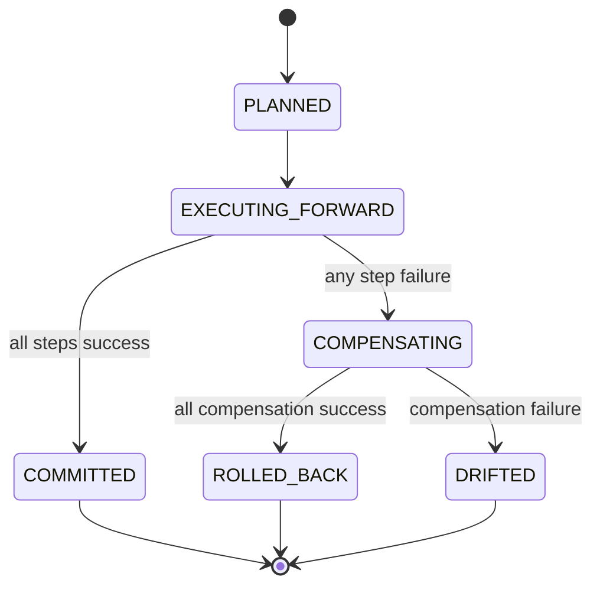

# Module: OIDC-18 Provisioning Transactional Semantics

## Module purpose

This module defines platform-level transaction orchestration for multi-step provisioning operations that span multiple adapter calls. From API perspective, a bundle request is atomic: all requested resources are created and linked, or the provider is restored to equivalent pre-request state through reverse-order compensation.

## Public interface

```zig
pub const ProvisionStepKind = enum {
    create_realm,
    create_user,
    assign_role,
    create_client,
    create_federation,
    rotate_client_secret,
};

pub const ProvisionForwardStep = struct {
    step_index: u16,
    kind: ProvisionStepKind,
    request_payload_json: []const u8,
};

pub const CompensationStep = struct {
    step_index: u16,
    kind: ProvisionStepKind,
    compensation_payload_json: []const u8,
};

pub const TransactionPlan = struct {
    transaction_id: []const u8,
    forward_steps: []const ProvisionForwardStep,
    compensation_stack: std.ArrayList(CompensationStep),
};

pub const TransactionResult = struct {
    transaction_id: []const u8,
    committed: bool,
    compensated: bool,
    failed_step: ?u16,
};

pub fn executeProvisioningTransaction(
    allocator: std.mem.Allocator,
    pool: *Pool,
    provider: *IdentityProvider,
    audit_writer: *AuditWriter,
    plan: TransactionPlan,
) !TransactionResult;

pub fn runCompensation(
    allocator: std.mem.Allocator,
    provider: *IdentityProvider,
    audit_writer: *AuditWriter,
    compensation_stack: []const CompensationStep,
) !void;
```

## Data structures and persistence model

### New table: idp_transaction_log

```sql
CREATE TABLE IF NOT EXISTS idp_transaction_log (
    transaction_id UUID NOT NULL,
    step_index INT NOT NULL,
    step_kind TEXT NOT NULL,
    direction TEXT NOT NULL CHECK (direction IN ('FORWARD','COMPENSATION')),
    status TEXT NOT NULL CHECK (status IN ('PENDING','SUCCESS','FAILED','SKIPPED')),
    request_payload_json JSONB,
    response_payload_json JSONB,
    error_code TEXT,
    created_at TIMESTAMPTZ NOT NULL DEFAULT NOW(),
    completed_at TIMESTAMPTZ,
    PRIMARY KEY (transaction_id, step_index, direction)
);

CREATE INDEX IF NOT EXISTS idx_idp_txn_status
ON idp_transaction_log (transaction_id, direction, status);
```

Compensation stack is persisted step-by-step after each successful forward action.

## API route surfaces and auth scopes

- `POST /api/v1/idp/provisioning:bundle` scope `idp.bundle.write`
- Optional `GET /api/v1/idp/provisioning/transactions/{transactionId}` scope `idp.bundle.read` for diagnosis

## Invariants and failure or rollback guarantees

1. Compensation executes in strict reverse order of successful forward steps.
2. Each forward success persists compensation payload before next forward call.
3. If compensation fails, transaction returns failure and records unresolved drift for reconciliation worker.
4. Transaction result is success only when all forward steps succeed.
5. Idempotent replay via OIDC-17 returns original committed or failed terminal summary.

## State transitions



## DB schema or index additions if needed

Included above. No additional provider schema.

## Cross-module dependencies

- Depends on OIDC-16 bundle route orchestration.
- Depends on OIDC-17 ledger for replay semantics.
- Depends on OIDC-19 auditing for each forward and compensation call.
- Uses provider adapter interfaces for create and delete operations.
- Must not depend on scheduler business logic except optional reconciliation trigger enqueue.

## Testability hooks and observability points

- Fault-injection hook per step kind for deterministic rollback testing.
- Compensator dry-run mode for integration tests.
- Metrics: `idp_txn_commit_total`, `idp_txn_rollback_total`, `idp_txn_drift_total`, `idp_txn_duration_seconds`.
- Audit events include `transaction_id`, `step_index`, `direction`.

## Risks and open questions

1. Open question: whether role assignment compensation must restore pre-existing role set snapshot versus naive revoke of assigned role list.
2. Open question: drift policy when compensation fails on delete of realm due to provider outage; reconcile worker retry cadence and escalation threshold.
3. Risk: provider side eventually-consistent deletion can make immediate equivalence checks flaky.
4. Risk: long transaction chains may increase latency; consider async orchestration for large bundles.
