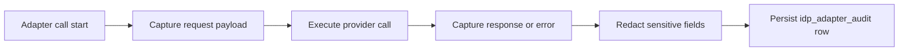

# Module: OIDC-19 Provisioning Audit and Redaction

## Module purpose

This module provides mandatory audit coverage for every identity-provider adapter call, both read and write, with strict redaction of sensitive fields. It extends existing OBS-03 and ADP-09 audit semantics to include adapter method, status, latency, actor identity, and transaction context without leaking secrets.

## Public interface

```zig
pub const AdapterAuditEvent = struct {
    actor_id: []const u8,
    auth_source: enum { human, agent },
    adapter_method: []const u8,
    provider_status_code: u16,
    duration_ms: u64,
    realm_id: ?[]const u8,
    resource_id: ?[]const u8,
    transaction_id: ?[]const u8,
    request_payload_json: []const u8,
    response_payload_json: []const u8,
    redaction_applied: bool,
};

pub const RedactionPolicy = struct {
    redacted_paths: []const []const u8,
    replacement_literal: []const u8,
};

pub fn auditAdapterCall(
    allocator: std.mem.Allocator,
    writer: *AuditWriter,
    event: AdapterAuditEvent,
) !void;

pub fn redactSensitiveFields(
    allocator: std.mem.Allocator,
    payload_json: []const u8,
    policy: RedactionPolicy,
) ![]const u8;
```

## Data structures and persistence model

### New table: idp_adapter_audit

```sql
CREATE TABLE IF NOT EXISTS idp_adapter_audit (
    audit_id UUID PRIMARY KEY,
    actor_id TEXT NOT NULL,
    auth_source TEXT NOT NULL,
    adapter_method TEXT NOT NULL,
    provider_status_code INT NOT NULL,
    duration_ms BIGINT NOT NULL,
    realm_id TEXT,
    resource_id TEXT,
    transaction_id UUID,
    request_payload_redacted JSONB,
    response_payload_redacted JSONB,
    redaction_applied BOOLEAN NOT NULL DEFAULT TRUE,
    created_at TIMESTAMPTZ NOT NULL DEFAULT NOW()
);

CREATE INDEX IF NOT EXISTS idx_idp_adapter_audit_actor_time
ON idp_adapter_audit (actor_id, created_at DESC);

CREATE INDEX IF NOT EXISTS idx_idp_adapter_audit_txn
ON idp_adapter_audit (transaction_id)
WHERE transaction_id IS NOT NULL;
```

Sensitive path defaults:
- `client_secret`
- `secret`
- `password`
- `credentials[].value`
- `mfa_seed`
- `otp_secret`
- `private_key`
- `token`

Replacement value is exactly `[REDACTED]`.

## API route surfaces and auth scopes

- No new external route required.
- Existing audit query routes include idp adapter events.
- Viewing events requires existing audit read scope (`audit.read`).

## Invariants and failure or rollback guarantees

1. Every adapter invocation emits exactly one audit event regardless of call outcome.
2. Redaction runs before persistence and before logs leave process boundary.
3. Redaction failure does not skip audit; fallback stores metadata with payload omitted and a redaction error marker.
4. Audit write failure does not mask primary adapter result but increments critical metric and error log.

## State transitions

Not a lifecycle module. Event flow is append-only.



## DB schema or index additions if needed

Included above. No provider schema change.

## Cross-module dependencies

- Depends on `src/obs/audit.zig` writer contracts.
- Depends on OIDC-16 route layer and OIDC-18 transaction IDs.
- Depends on JSON serializer and structured logger.
- Must not depend on frontend or business workflow modules.

## Testability hooks and observability points

- Deterministic redaction tests with nested JSON arrays and objects.
- Golden tests ensuring sensitive fields never appear unredacted.
- Metrics:
  - `idp_audit_event_total{method,status}`
  - `idp_audit_redaction_fail_total`
  - `idp_audit_write_fail_total`
  - `idp_adapter_call_duration_seconds{method}`
- Expose transaction-level timeline retrieval through audit query filters.

## Risks and open questions

1. Open question: whether partial payload hashing should be stored alongside redacted payload for forensic integrity checks.
2. Open question: whether response body for read calls should be truncated by size threshold.
3. Risk: schema evolution in provider payloads may introduce new secret fields not covered by static path list.
4. Risk: large payload redaction could add latency under high adapter throughput.
