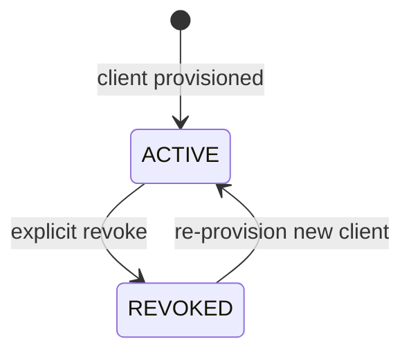

# Module: OIDC-20 Agent Service-Account Clients

## Module purpose

This module defines the provider-side identity model for platform agents as dedicated OIDC clients using client-credentials only. Each agent receives isolated credentials and minimum required provider roles so revocation and blast radius are per-agent.

## Public interface

```zig
pub const AgentKind = enum {
    orchestrator,
    code_designer,
    backend_dev,
    frontend_dev,
    test_designer,
    test_runner,
    issue_fixer,
    release_validator,
    doc_updater,
};

pub const AgentClientProvisionInput = struct {
    realm_id: []const u8,
    agent_kind: AgentKind,
    display_name: []const u8,
    requested_scopes: []const []const u8,
    idempotency_key: []const u8,
};

pub const AgentClientProvisionResult = struct {
    provider_client_id: []const u8,
    client_secret: []const u8,
    service_account_user_id: []const u8,
    effective_scopes: []const []const u8,
};

pub fn provisionAgentClient(
    allocator: std.mem.Allocator,
    provider: *IdentityProvider,
    input: AgentClientProvisionInput,
) !AgentClientProvisionResult;

pub fn revokeAgentClient(
    allocator: std.mem.Allocator,
    provider: *IdentityProvider,
    realm_id: []const u8,
    provider_client_id: []const u8,
) !void;
```

## Data structures and persistence model

### New table: agent_identity_binding

```sql
CREATE TABLE IF NOT EXISTS agent_identity_binding (
    binding_id UUID PRIMARY KEY,
    realm_id TEXT NOT NULL,
    agent_kind TEXT NOT NULL,
    provider_client_id TEXT NOT NULL,
    service_account_user_id TEXT NOT NULL,
    scopes_json JSONB NOT NULL,
    status TEXT NOT NULL CHECK (status IN ('ACTIVE','REVOKED')),
    created_at TIMESTAMPTZ NOT NULL DEFAULT NOW(),
    revoked_at TIMESTAMPTZ
);

CREATE UNIQUE INDEX IF NOT EXISTS uq_agent_identity_binding_active
ON agent_identity_binding (realm_id, agent_kind)
WHERE status = 'ACTIVE';
```

Secrets are never persisted in plaintext. Optionally store secret fingerprint only.

## API route surfaces and auth scopes

- `POST /api/v1/idp/realms/{realmId}/agents/clients` scope `idp.agent-client.write`
- `GET /api/v1/idp/realms/{realmId}/agents/clients` scope `idp.agent-client.read`
- `DELETE /api/v1/idp/realms/{realmId}/agents/clients/{clientId}` scope `idp.agent-client.delete`

Route is restricted to `PLATFORM_ADMIN` and selected automation setup flows.

## Invariants and failure or rollback guarantees

1. One active service-account client per `(realm_id, agent_kind)`.
2. Provider client must have `serviceAccountsEnabled=true`, `publicClient=false`, `standardFlowEnabled=false`, `directAccessGrantsEnabled=false`.
3. Token issuance for agents must use client-credentials flow only.
4. Revoking one binding does not mutate other agent clients.

## State transitions



## DB schema or index additions if needed

Included above. No provider schema changes; provider resources are clients and roles in realm.

## Cross-module dependencies

- Depends on OIDC-16 client lifecycle routes.
- Depends on OIDC-21 secret rotation path.
- Depends on ADP-07 role model for `AGENT_RUNNER` and sub-scopes.
- Must not depend on human login or password grant flows.

## Testability hooks and observability points

- Capability assertion helper validates provider client flags after creation.
- Integration test ensures revocation of one client preserves another agent's token issuance.
- Metrics:
  - `idp_agent_clients_active{agent_kind}`
  - `idp_agent_client_revocation_total{agent_kind}`
  - `idp_agent_client_provision_fail_total{reason}`
- Audit events include `agent_kind` and `provider_client_id`.

## Risks and open questions

1. Open question: naming convention for provider client IDs across tenants (`bpm-agent-{agent_kind}` versus UUID suffix).
2. Open question: whether service account users require explicit group assignment or direct role mapping only.
3. Risk: accidental privilege creep if scope templates are not immutable per agent kind.
4. Risk: exposing client identifiers in logs could aid reconnaissance; ensure log redaction policy covers sensitive metadata where needed.
