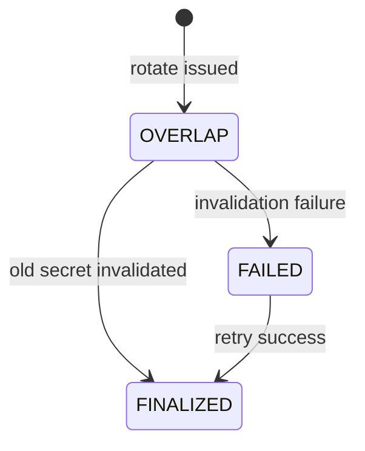

# Module: OIDC-21 Zero-Downtime Agent Secret Rotation

## Module purpose

This module defines rotating agent client secrets without service interruption by introducing overlap validity between old and new credentials for a configurable grace period (default 3600 seconds). It guarantees in-flight agent calls can continue during rollout while enforcing deterministic old-secret invalidation at grace expiry.

## Public interface

```zig
pub const SecretRotationRequest = struct {
    realm_id: []const u8,
    provider_client_id: []const u8,
    overlap_seconds: u32 = 3600,
    actor_id: []const u8,
    idempotency_key: []const u8,
};

pub const SecretRotationResult = struct {
    rotation_id: []const u8,
    new_secret: []const u8,
    old_secret_valid_until_unix: i64,
    overlap_seconds: u32,
};

pub fn rotateAgentSecret(
    allocator: std.mem.Allocator,
    pool: *Pool,
    provider: *IdentityProvider,
    input: SecretRotationRequest,
) !SecretRotationResult;

pub fn finalizeExpiredSecretRotations(
    allocator: std.mem.Allocator,
    pool: *Pool,
    provider: *IdentityProvider,
    now_unix: i64,
) !u32;
```

## Data structures and persistence model

### New table: agent_secret_rotation

```sql
CREATE TABLE IF NOT EXISTS agent_secret_rotation (
    rotation_id UUID PRIMARY KEY,
    realm_id TEXT NOT NULL,
    provider_client_id TEXT NOT NULL,
    old_secret_fingerprint TEXT NOT NULL,
    new_secret_fingerprint TEXT NOT NULL,
    old_secret_valid_until TIMESTAMPTZ NOT NULL,
    status TEXT NOT NULL CHECK (status IN ('OVERLAP','FINALIZED','FAILED')),
    created_by TEXT NOT NULL,
    created_at TIMESTAMPTZ NOT NULL DEFAULT NOW(),
    finalized_at TIMESTAMPTZ
);

CREATE INDEX IF NOT EXISTS idx_agent_secret_rotation_finalize
ON agent_secret_rotation (status, old_secret_valid_until)
WHERE status = 'OVERLAP';
```

Plain secrets are not persisted. Response includes new secret once.

## API route surfaces and auth scopes

- `POST /api/v1/idp/realms/{realmId}/agents/clients/{clientId}/secret:rotate` scope `idp.client.rotate`
- `GET /api/v1/idp/realms/{realmId}/agents/clients/{clientId}/secret-rotations` scope `idp.client.read`

## Invariants and failure or rollback guarantees

1. Rotation creates new secret first, then marks old secret expiration timestamp.
2. During overlap, both old and new credentials are accepted for token issuance.
3. After overlap deadline, old secret is invalidated and status transitions to `FINALIZED`.
4. If finalize step fails, status remains `FAILED` and scheduler retries.
5. Idempotent rotate request with same key returns original `rotation_id` and overlap deadline.

## State transitions



## DB schema or index additions if needed

Included above.

## Cross-module dependencies

- Depends on OIDC-20 agent client model.
- Depends on OIDC-16 secret rotation route.
- Depends on scheduler module for finalize job.
- Depends on OIDC-19 for auditing rotation lifecycle.

## Testability hooks and observability points

- Injected clock for overlap boundary tests.
- Integration test: token retrieval succeeds with old secret during overlap and fails after finalize.
- Metrics:
  - `idp_secret_rotation_started_total`
  - `idp_secret_rotation_finalized_total`
  - `idp_secret_rotation_finalize_fail_total`
  - `idp_secret_overlap_seconds` histogram
- Audit event fields include `rotation_id`, `overlap_seconds`, and finalization outcome.

## Risks and open questions

1. Open question: provider support for simultaneous dual-secret validity may require emulation via secondary client in some adapters.
2. Open question: minimum and maximum overlap bounds for security policy.
3. Risk: operational mishandling of one-time secret response payload by callers.
4. Risk: stale clients continuing to use old secret beyond overlap can trigger burst failures after finalization.
