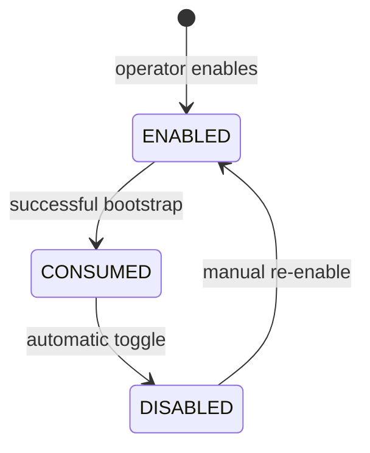

# Module: OIDC-22 Bootstrap Agent Identity

## Module purpose

This module defines one-time bootstrap identity creation for the first automation agent when no persistent provider-side agent clients exist yet. Bootstrap is authorized by an out-of-band secret from environment config, auto-disables after first successful bootstrap, and can only be re-enabled through explicit manual operator action.

## Public interface

```zig
pub const BootstrapRequest = struct {
    bootstrap_secret: []const u8,
    requested_agent_kind: AgentKind,
    requested_realm_id: []const u8,
    idempotency_key: []const u8,
};

pub const BootstrapResult = struct {
    bootstrap_id: []const u8,
    provisioned_client_id: []const u8,
    bootstrap_disabled_after_success: bool,
};

pub const BootstrapState = struct {
    enabled: bool,
    enabled_by: ?[]const u8,
    enabled_at_unix: ?i64,
    disabled_at_unix: ?i64,
    last_bootstrap_id: ?[]const u8,
};

pub fn bootstrapFirstAgent(
    allocator: std.mem.Allocator,
    pool: *Pool,
    provider: *IdentityProvider,
    input: BootstrapRequest,
) !BootstrapResult;

pub fn setBootstrapEnabled(
    allocator: std.mem.Allocator,
    pool: *Pool,
    actor_id: []const u8,
    enabled: bool,
    reason: []const u8,
) !BootstrapState;
```

## Data structures and persistence model

### New table: agent_bootstrap_state

```sql
CREATE TABLE IF NOT EXISTS agent_bootstrap_state (
    singleton_key TEXT PRIMARY KEY CHECK (singleton_key = 'global'),
    enabled BOOLEAN NOT NULL,
    enabled_by TEXT,
    enabled_at TIMESTAMPTZ,
    disabled_at TIMESTAMPTZ,
    last_bootstrap_id UUID,
    updated_at TIMESTAMPTZ NOT NULL DEFAULT NOW()
);
```

### New table: agent_bootstrap_audit

```sql
CREATE TABLE IF NOT EXISTS agent_bootstrap_audit (
    event_id UUID PRIMARY KEY,
    event_type TEXT NOT NULL CHECK (event_type IN ('BOOTSTRAP_ATTEMPT','BOOTSTRAP_SUCCESS','BOOTSTRAP_DISABLED','BOOTSTRAP_REENABLED')),
    actor_id TEXT,
    outcome TEXT NOT NULL,
    details_json JSONB,
    created_at TIMESTAMPTZ NOT NULL DEFAULT NOW()
);
```

Bootstrap secret is read from environment and never stored.

## API route surfaces and auth scopes

- `POST /api/v1/idp/bootstrap/agents` no bearer auth, guarded by bootstrap secret and enabled flag
- `POST /api/v1/idp/bootstrap/state:enable` scope `platform.bootstrap.manage`
- `POST /api/v1/idp/bootstrap/state:disable` scope `platform.bootstrap.manage`
- `GET /api/v1/idp/bootstrap/state` scope `platform.bootstrap.read`

## Invariants and failure or rollback guarantees

1. Bootstrap create succeeds only when bootstrap enabled and no active agent client exists for requested kind.
2. On first successful bootstrap, system atomically disables bootstrap before returning response.
3. Repeated bootstrap attempts after disable return explicit `BootstrapDisabled` error.
4. Re-enable path requires authenticated operator scope and audit reason.

## State transitions



## DB schema or index additions if needed

Included above with singleton table and audit table.

## Cross-module dependencies

- Depends on OIDC-20 service-account provisioning.
- Depends on config module for bootstrap secret environment variable.
- Depends on OIDC-19 audit redaction and append.
- Must not depend on normal human auth middleware for unauthenticated bootstrap route, except local secret validator.

## Testability hooks and observability points

- Injected secret validator for deterministic tests.
- Concurrency test ensuring only one success when parallel bootstrap calls race.
- Metrics:
  - `idp_bootstrap_attempt_total{outcome}`
  - `idp_bootstrap_enabled` gauge
- Audit details include reason when manual re-enable occurs.

## Risks and open questions

1. Open question: whether bootstrap route should be bound to localhost only during initial setup.
2. Open question: required manual operator action protocol for re-enable (CLI command versus config file toggle plus restart).
3. Risk: environment secret leakage via process listing or misconfigured logs.
4. Risk: race condition between bootstrap success and disable write without proper transaction isolation.
