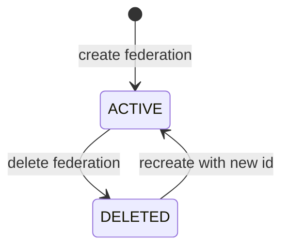

# Module: OIDC-23 Identity Provider Federation Support

## Module purpose

This module defines adapter-backed federation management for SAML, upstream OIDC, and supported social providers per realm. It provides pass-through typed configuration, lifecycle operations, and integration points for JIT user linking from OIDC-09.

## Public interface

```zig
pub const FederationType = enum {
    saml,
    oidc,
    social_google,
    social_github,
    social_microsoft,
};

pub const FederationCreateInput = struct {
    realm_id: []const u8,
    provider_alias: []const u8,
    federation_type: FederationType,
    config_json: []const u8,
    jit_link_enabled: bool = true,
    idempotency_key: []const u8,
};

pub const FederationView = struct {
    federation_id: []const u8,
    provider_alias: []const u8,
    federation_type: FederationType,
    enabled: bool,
    created_at_unix: i64,
};

pub fn createFederation(
    allocator: std.mem.Allocator,
    provider: *IdentityProvider,
    input: FederationCreateInput,
) !FederationView;

pub fn listFederations(
    allocator: std.mem.Allocator,
    provider: *IdentityProvider,
    realm_id: []const u8,
) ![]FederationView;

pub fn deleteFederation(
    allocator: std.mem.Allocator,
    provider: *IdentityProvider,
    realm_id: []const u8,
    federation_id: []const u8,
) !void;
```

## Data structures and persistence model

### New table: idp_federation_binding

```sql
CREATE TABLE IF NOT EXISTS idp_federation_binding (
    federation_binding_id UUID PRIMARY KEY,
    realm_id TEXT NOT NULL,
    provider_alias TEXT NOT NULL,
    federation_type TEXT NOT NULL,
    provider_federation_id TEXT NOT NULL,
    config_digest TEXT NOT NULL,
    jit_link_enabled BOOLEAN NOT NULL DEFAULT TRUE,
    status TEXT NOT NULL CHECK (status IN ('ACTIVE','DELETED')),
    created_at TIMESTAMPTZ NOT NULL DEFAULT NOW(),
    deleted_at TIMESTAMPTZ
);

CREATE UNIQUE INDEX IF NOT EXISTS uq_idp_federation_alias_active
ON idp_federation_binding (realm_id, provider_alias)
WHERE status = 'ACTIVE';
```

Raw secret-bearing federation config is not stored; store digest and selected non-sensitive metadata only.

## API route surfaces and auth scopes

- `POST /api/v1/idp/realms/{realmId}/federations` scope `idp.federation.write`
- `GET /api/v1/idp/realms/{realmId}/federations` scope `idp.federation.read`
- `DELETE /api/v1/idp/realms/{realmId}/federations/{federationId}` scope `idp.federation.delete`

## Invariants and failure or rollback guarantees

1. Federation alias is unique per realm for active records.
2. Create federation is idempotent under OIDC-17 key semantics.
3. Deleting federation does not delete already JIT-provisioned local users; it prevents future federated login from that source.
4. For bundle transactions, federation create compensation is delete federation in reverse order (OIDC-18).

## State transitions



## DB schema or index additions if needed

Included above.

## Cross-module dependencies

- Depends on OIDC-16 route surface and OIDC-17 idempotency.
- Depends on OIDC-09 JIT provisioning link path.
- Depends on OIDC-24 claim mapping overlay for federated attributes.
- Must not depend on tenant default-realm fallback logic.

## Testability hooks and observability points

- Contract test vectors per federation type validating required config keys.
- Integration tests confirming federated login yields JIT user link event.
- Metrics:
  - `idp_federation_create_total{type,outcome}`
  - `idp_federation_delete_total{type,outcome}`
  - `idp_federation_active{type}`
- Audit events include provider alias and type with redacted config paths.

## Risks and open questions

1. Open question: canonical schema registry location for per-provider config validation.
2. Open question: behavior when upstream provider metadata endpoint becomes unavailable after federation creation.
3. Risk: social provider API deprecations can break existing federation configs.
4. Risk: alias collisions when importing federations from external manifests.
