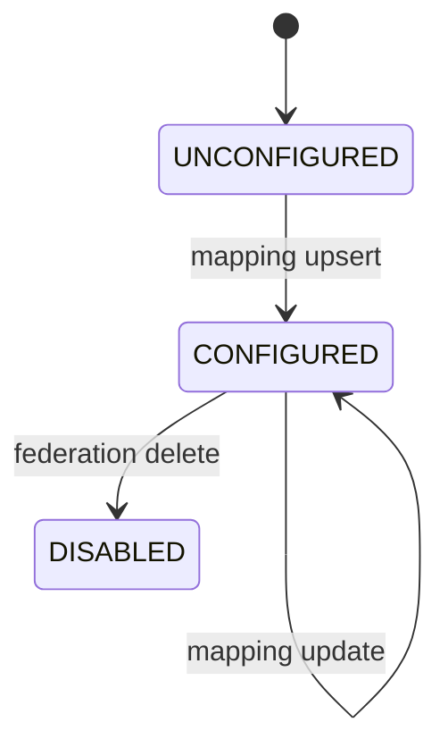

# Module: OIDC-24 Federated Attribute Mapping

## Module purpose

This module adds configurable mapping from federated provider claims or attributes to internal user profile fields and role grants. It is a SHOULD-level capability and must fail gracefully for unmapped attributes while preserving successful federated authentication.

## Public interface

```zig
pub const MappingSource = enum { saml_attribute, oidc_claim, social_claim };

pub const MappingRule = struct {
    source_type: MappingSource,
    source_key: []const u8,
    target_field: []const u8,
    transform: enum { passthrough, lowercase, uppercase, split_csv, first_nonempty },
    required: bool,
};

pub const RoleMappingRule = struct {
    source_key: []const u8,
    source_value: []const u8,
    target_role: []const u8,
};

pub const FederationMappingConfig = struct {
    realm_id: []const u8,
    federation_id: []const u8,
    attribute_rules: []const MappingRule,
    role_rules: []const RoleMappingRule,
    updated_by: []const u8,
};

pub fn upsertFederationMapping(
    allocator: std.mem.Allocator,
    pool: *Pool,
    input: FederationMappingConfig,
) !void;

pub fn applyFederationMapping(
    allocator: std.mem.Allocator,
    mapping: FederationMappingConfig,
    inbound_claims_json: []const u8,
) !MappedIdentity;
```

## Data structures and persistence model

### New table: federation_attribute_mapping

```sql
CREATE TABLE IF NOT EXISTS federation_attribute_mapping (
    mapping_id UUID PRIMARY KEY,
    realm_id TEXT NOT NULL,
    federation_id TEXT NOT NULL,
    attribute_rules_json JSONB NOT NULL,
    role_rules_json JSONB NOT NULL,
    updated_by TEXT NOT NULL,
    updated_at TIMESTAMPTZ NOT NULL DEFAULT NOW()
);

CREATE UNIQUE INDEX IF NOT EXISTS uq_federation_attribute_mapping
ON federation_attribute_mapping (realm_id, federation_id);
```

Mapping config is versioned by append-only audit events; latest row is authoritative.

## API route surfaces and auth scopes

- `PUT /api/v1/idp/realms/{realmId}/federations/{federationId}/mapping` scope `idp.federation.write`
- `GET /api/v1/idp/realms/{realmId}/federations/{federationId}/mapping` scope `idp.federation.read`

## Invariants and failure or rollback guarantees

1. Missing optional source attributes are ignored without failure.
2. Missing required source attributes produce mapping error event but must not leak secret values.
3. Mapping updates are idempotent on equivalent normalized JSON payload.
4. Mapping application occurs before JIT profile upsert so derived fields persist consistently.

## State transitions



## DB schema or index additions if needed

Included above.

## Cross-module dependencies

- Depends on OIDC-23 federation lifecycle IDs.
- Depends on OIDC-09 JIT provisioning profile upsert.
- Depends on OIDC-08 claim normalization pipeline.
- Must not depend on interactive user profile editor flows.

## Testability hooks and observability points

- Table-driven unit tests for transforms and rule precedence.
- Integration test with sample SAML/OIDC claim sets ensuring expected profile output.
- Metrics:
  - `idp_federation_mapping_apply_total{outcome}`
  - `idp_federation_mapping_missing_required_total{source_key}`
  - `idp_federation_mapping_latency_seconds`
- Audit events capture mapping config diffs without exposing PII beyond field names.

## Risks and open questions

1. Open question: whether role mapping should allow regex matching or strict equality only.
2. Open question: conflict resolution when multiple rules target same field.
3. Risk: improperly broad role mappings can escalate privilege.
4. Risk: high-cardinality source attributes can create unstable mapping behavior if not normalized.
