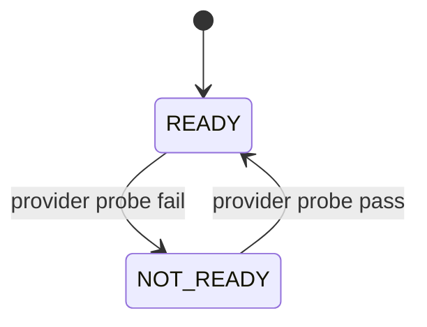

# Module: OIDC-25 Provider Readiness Health Check

## Module purpose

This module integrates identity-provider connectivity and capability checks into readiness semantics. `/health/ready` reports not-ready with HTTP 503 when provider checks fail, and recovers automatically on successful subsequent checks.

## Public interface

```zig
pub const ProviderReadinessStatus = struct {
    ready: bool,
    subsystem: []const u8,
    reason: ?[]const u8,
    checked_at_unix: i64,
    latency_ms: u64,
};

pub fn checkProviderReadiness(
    allocator: std.mem.Allocator,
    provider: *IdentityProvider,
    timeout_ms: u32,
) !ProviderReadinessStatus;

pub fn buildReadyResponse(
    allocator: std.mem.Allocator,
    db_ready: bool,
    provider_status: ProviderReadinessStatus,
    scheduler_ready: bool,
) !ReadyResponse;
```

Recommended provider probe sequence:
- lightweight metadata fetch or admin ping endpoint
- token verification capability probe without secret data

## Data structures and persistence model

No mandatory persistent table. Optionally maintain in-memory health cache with short TTL.

Optional history table (if auditability needed):

```sql
CREATE TABLE IF NOT EXISTS subsystem_health_probe (
    probe_id UUID PRIMARY KEY,
    subsystem TEXT NOT NULL,
    status TEXT NOT NULL,
    reason TEXT,
    latency_ms BIGINT NOT NULL,
    checked_at TIMESTAMPTZ NOT NULL DEFAULT NOW()
);

CREATE INDEX IF NOT EXISTS idx_subsystem_health_probe_recent
ON subsystem_health_probe (subsystem, checked_at DESC);
```

## API route surfaces and auth scopes

- `GET /health/ready` public readiness endpoint

When provider check fails, response body includes subsystem detail:
- `subsystem: "identity_provider"`
- `status: "not_ready"`
- `reason: <error-class>`

## Invariants and failure or rollback guarantees

1. Any provider readiness failure forces overall readiness false.
2. Failure classification must not leak secrets or tokens.
3. Recovery sets readiness true on next passing check without manual intervention.
4. Readiness check timeout is bounded to avoid handler starvation.

## State transitions



## DB schema or index additions if needed

None required. Optional probe history table above.

## Cross-module dependencies

- Depends on `src/api/routes/health.zig`.
- Depends on adapter capability check in provider interface.
- Depends on API-12 readiness aggregation semantics.
- Must not call heavy provisioning endpoints in readiness path.

## Testability hooks and observability points

- Injectable provider probe stub for fail/pass transition tests.
- Integration tests toggling provider availability and asserting HTTP 503 then 200.
- Metrics:
  - `idp_readiness_probe_total{outcome}`
  - `idp_readiness_probe_latency_seconds`
  - `platform_ready_state{subsystem="identity_provider"}` gauge
- Structured log includes subsystem and bounded reason class.

## Risks and open questions

1. Open question: exact probe endpoint contract for non-Keycloak adapters.
2. Open question: readiness debounce policy to avoid flapping under intermittent failures.
3. Risk: synchronous provider probes on every readiness call can overload provider under heavy probe traffic.
4. Risk: shared network partition can mark platform not-ready even when local operations still partially function.
