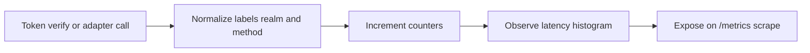

# Module: OIDC-26 Provider Metrics

## Module purpose

This module defines Prometheus metrics for identity-provider operations: token verification rate and latency, JWKS cache hit ratio, adapter call rate by method, and adapter error rate. Labels include realm and method to support operational analysis and alerting.

## Public interface

```zig
pub const VerificationMetricsInput = struct {
    realm_id: []const u8,
    method: []const u8,
    success: bool,
    duration_ms: u64,
    cache_hit: bool,
};

pub fn recordTokenVerification(input: VerificationMetricsInput) void;
pub fn recordJwksCacheAccess(realm_id: []const u8, hit: bool) void;
pub fn recordAdapterCall(realm_id: []const u8, method: []const u8, status_class: []const u8, duration_ms: u64) void;
pub fn recordAdapterError(realm_id: []const u8, method: []const u8, error_code: []const u8) void;
```

## Data structures and persistence model

No persistent DB required. Metrics are in-process counters and histograms exported at `/metrics`.

Metric definitions:
- `idp_token_verification_total{realm_id,method,outcome}` counter
- `idp_token_verification_duration_seconds_bucket{realm_id,method,le}` histogram
- `idp_jwks_cache_access_total{realm_id,outcome}` counter (`outcome=hit|miss`)
- `idp_adapter_call_total{realm_id,method,status_class}` counter
- `idp_adapter_call_duration_seconds_bucket{realm_id,method,le}` histogram
- `idp_adapter_error_total{realm_id,method,error_code}` counter

Derived ratio:
- JWKS hit ratio computed as `hit / (hit + miss)` in PromQL.

## API route surfaces and auth scopes

- `GET /metrics` existing OBS-02 route

No new route required.

## Invariants and failure or rollback guarantees

1. Each token verification attempt increments exactly one verification counter with outcome label.
2. Each adapter invocation increments exactly one call counter regardless of success/failure.
3. Error counter increments only for failed adapter calls and includes normalized error code.
4. Metrics emission failures must not fail business requests.

## State transitions

Not lifecycle-oriented; this module is event-based telemetry.



## DB schema or index additions if needed

None.

## Cross-module dependencies

- Depends on `src/obs/metrics.zig` registry and exporter.
- Depends on OIDC-06 JWKS cache instrumentation points.
- Depends on OIDC-16 route and adapter wrappers for method labeling.
- Must not depend on audit persistence path for metric correctness.

## Testability hooks and observability points

- Unit tests verifying label cardinality constraints.
- Integration test running known traffic and asserting metrics text contains expected series.
- Suggested alerting examples:
  - high adapter error rate by method
  - sudden JWKS hit ratio drop
  - verification latency regression

## Risks and open questions

1. Open question: whether `realm_id` label should be hashed to reduce sensitive tenant exposure in metrics backend.
2. Open question: label cardinality cap for dynamic method names across adapters.
3. Risk: unbounded realm label cardinality can increase memory usage in metrics registry.
4. Risk: inconsistent method naming across adapters can fragment dashboards and alerts.
