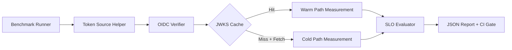
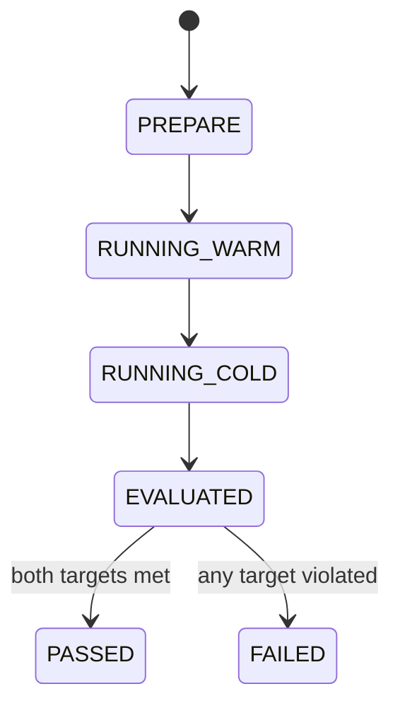

# Module: OIDC-27 Token Verification Performance Envelope

## Module purpose

This module defines the benchmark and observability envelope for OIDC token verification so warm-cache and cold-cache paths are measured separately, compared against explicit latency SLO targets, and monitored for regression in CI and runtime telemetry.

## Public interface

```zig
pub const VerificationBenchmarkScenario = enum {
    warm_cache,
    cold_cache,
};

pub const VerificationBenchmarkInput = struct {
    realm_id: []const u8,
    scenario: VerificationBenchmarkScenario,
    sample_count: u32,
    concurrency: u16,
    token_source: []const u8,
};

pub const VerificationBenchmarkStats = struct {
    scenario: VerificationBenchmarkScenario,
    sample_count: u32,
    p50_us: u64,
    p95_us: u64,
    p99_us: u64,
    max_us: u64,
    target_p95_us: u64,
    pass: bool,
};

pub const VerificationSloEvaluation = struct {
    warm_cache_target_p95_us: u64,
    cold_cache_target_p95_us: u64,
    warm_cache_pass: bool,
    cold_cache_pass: bool,
};

pub fn runVerificationBenchmark(
    allocator: std.mem.Allocator,
    verifier: *OidcVerifier,
    input: VerificationBenchmarkInput,
) !VerificationBenchmarkStats;

pub fn evaluateVerificationSlo(
    warm_stats: VerificationBenchmarkStats,
    cold_stats: VerificationBenchmarkStats,
) VerificationSloEvaluation;
```

## Data structures and persistence or artifact model

### Benchmark result artifact

- Path: `tests/reports/oidc-verification-benchmark.json`
- Format:

```json
{
  "run_id": "WF02-...",
  "realm_id": "bpm-default",
  "generated_at": "2026-05-28T00:00:00Z",
  "warm_cache": {
    "sample_count": 5000,
    "p95_us": 1800,
    "pass": true
  },
  "cold_cache": {
    "sample_count": 200,
    "p95_us": 76000,
    "pass": true
  }
}
```

No DB persistence required; benchmark output is a deterministic report artifact.

## Invariants and migration or coexistence safety guarantees

1. Warm-cache and cold-cache measurements are never aggregated into a single percentile stream.
2. Warm-cache target is fixed at p95 < 2000 us.
3. Cold-cache target is fixed at p95 < 100000 us.
4. Benchmark harness must use real verifier implementation and real JWKS resolution path.
5. Any benchmark failure is non-destructive and does not change auth behavior; it only fails CI or release gates.

## API route, CLI, helper surfaces and auth scopes

- CLI: `zig build bench-oidc-verify -- --realm bpm-default --samples 5000`
- Helper API (test-only):
  - `pub fn primeJwksCache(...) !void`
  - `pub fn clearJwksCacheForBenchmark(...) void`
- No public HTTP route added.

## Integration test strategy and environment assumptions

- Environment assumptions:
  - Keycloak dev realm reachable via docker-compose stack.
  - Test token helper from OIDC-30 available in non-production env.
- Strategy:
  - Test A (warm): prime JWKS cache once, run N verifications, assert p95 < 2 ms.
  - Test B (cold): clear cache between verification batches, assert p95 < 100 ms.
  - Test C: verify metrics for warm vs cold scenario labels are emitted.

## Data flow diagram



## Error taxonomy

```zig
pub const OidcPerfError = error{
    InvalidSampleCount,
    InvalidConcurrency,
    TokenAcquisitionFailed,
    JwksPrimeFailed,
    VerificationFailed,
    BenchmarkClockUnavailable,
    ReportWriteFailed,
};
```

## State transitions



## Cross-module dependencies

- Depends on OIDC-06 JWKS cache behavior.
- Depends on OIDC-26 metrics registry for latency and cache labels.
- Depends on OIDC-30 token helper for deterministic token sourcing in tests.
- Must not depend on legacy internal token codepaths.

## Risks and open questions

1. Risk: noisy local developer machines can cause false negative latency failures.
2. Risk: network jitter to provider can mask verifier-side regressions.
3. Open question: should CI enforce hard fail for SHOULD-level requirement, or soft warn with trend tracking?
4. Open question: should perf envelope include p99 constraints in addition to p95.
