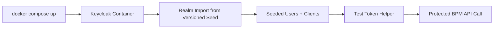
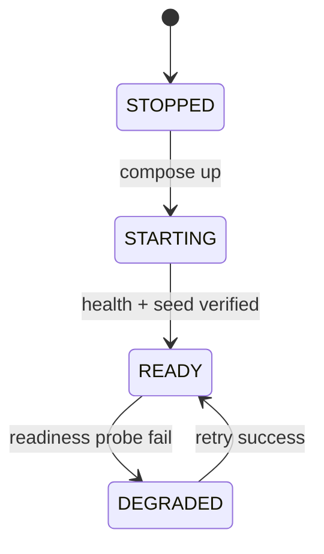

# Module: OIDC-28 Local Development Realm Runnable Setup

## Module purpose

This module defines a deterministic local Keycloak realm environment that boots with zero manual post-start configuration, enabling immediate OIDC authentication tests for seeded human users and platform clients.

## Public interface

```zig
pub const RealmBootstrapInput = struct {
    compose_profile: []const u8,
    realm_seed_path: []const u8,
    wait_timeout_seconds: u32,
};

pub const RealmBootstrapStatus = struct {
    keycloak_ready: bool,
    realm_imported: bool,
    platform_client_present: bool,
    seeded_users_count: u16,
};

pub fn startLocalRealm(
    allocator: std.mem.Allocator,
    input: RealmBootstrapInput,
) !RealmBootstrapStatus;

pub fn verifyLocalRealmReadiness(
    allocator: std.mem.Allocator,
    expected_realm: []const u8,
) !RealmBootstrapStatus;
```

```typescript
export interface DevRealmUser {
  username: string
  realmRoles: Array<'PLATFORM_ADMIN' | 'PROCESS_DESIGNER' | 'TASK_WORKER'>
}

export interface DevRealmManifest {
  realm: 'bpm-default'
  users: DevRealmUser[]
  clients: string[]
}
```

## Data structures and persistence or seed artifact model

- Compose descriptor: `docker-compose.yml` (or `docker-compose.oidc.yml`) with Keycloak service and healthcheck.
- Seed source-of-truth: `infrastructure/keycloak/realms/bpm-default.json` (owned by OIDC-29).
- Optional readiness fixture:

```json
{
  "realm": "bpm-default",
  "requiredUsers": ["admin-user", "designer-user", "worker-user"],
  "requiredClients": ["bpm-platform-api"]
}
```

## Invariants and migration or coexistence safety guarantees

1. `docker compose up` yields a ready realm without interactive admin console actions.
2. Seeded users always include three role-distinct identities.
3. Dev-only admin credentials and import settings are never consumed in production deployment paths.
4. Local realm setup does not disable or modify legacy internal token verification paths.

## API route, CLI, helper surfaces and auth scopes

- CLI:
  - `docker compose up keycloak -d`
  - `zig build verify-dev-realm`
- Helper endpoint (non-production):
  - `GET /_dev/oidc/realm-status` for local validation output.
- Auth scope: endpoint restricted to local/dev environments only.

## Integration test strategy and environment assumptions

- Environment assumptions:
  - Docker engine available.
  - Port mapping for Keycloak reachable from test runner.
- Strategy:
  - Start compose service, poll readiness endpoint.
  - Validate seed import completed and users/clients are queryable.
  - Acquire OIDC token for each seeded role via OIDC-30 helper and call one protected API route.

## Data flow diagram



## Error taxonomy

```zig
pub const DevRealmError = error{
    ComposeLaunchFailed,
    ProviderNotReady,
    RealmImportMissing,
    SeededUserMissing,
    SeededClientMissing,
    DevOnlyGuardViolation,
};
```

## State transitions



## Cross-module dependencies

- Depends on OIDC-29 for seed artifact structure and versioning.
- Depends on OIDC-30 for token acquisition in integration paths.
- Depends on OIDC-31 for E2E suite orchestration.
- Must not depend on production bootstrap secrets or production admin routes.

## Risks and open questions

1. Risk: Keycloak startup time variance can create flaky readiness checks without robust retry policy.
2. Risk: accidental drift between compose environment variables and seed expectations.
3. Open question: whether local realm profile should include optional TLS termination for parity with CI.
4. Open question: should seeded passwords be deterministic defaults or generated at startup and written to a local artifact.
