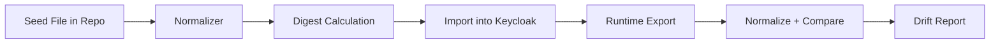
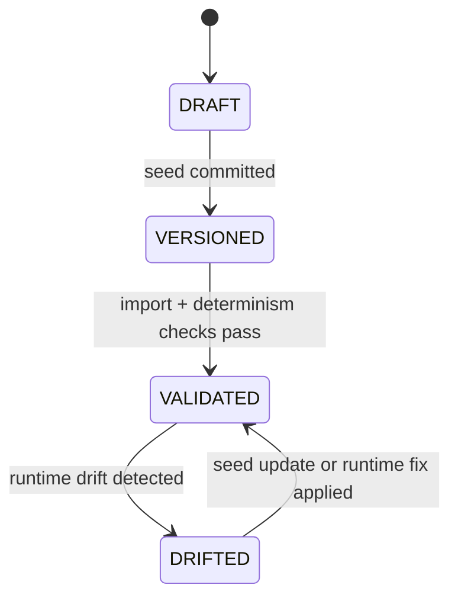

# Module: OIDC-29 Realm Seed as Versioned Artifact and Drift Controls

## Module purpose

This module defines the Keycloak realm seed file as a deterministic, versioned artifact with automated drift detection so realm shape changes are reviewed through source control and reproducibly imported across local and CI environments.

## Public interface

```zig
pub const RealmSeedManifest = struct {
    realm_name: []const u8,
    seed_version: []const u8,
    schema_version: u16,
    generated_at_unix: i64,
    digest_sha256_hex: []const u8,
};

pub const RealmSeedValidationResult = struct {
    valid: bool,
    importable: bool,
    deterministic: bool,
    drift_detected: bool,
    digest_sha256_hex: []const u8,
};

pub fn validateRealmSeedArtifact(
    allocator: std.mem.Allocator,
    seed_json: []const u8,
) !RealmSeedValidationResult;

pub fn detectRealmSeedDrift(
    allocator: std.mem.Allocator,
    expected_seed_digest: []const u8,
    exported_runtime_seed_json: []const u8,
) !bool;
```

```typescript
export interface RealmSeedFile {
  realm: 'bpm-default'
  clients: Array<Record<string, unknown>>
  users: Array<Record<string, unknown>>
  roles: Record<string, unknown>
  attributes?: {
    seedVersion?: string
  }
}
```

## Data structures and persistence or seed artifact model

- Canonical artifact path: `infrastructure/keycloak/realms/bpm-default.json`
- Deterministic normalization process:
  - Remove volatile export fields (export timestamps, provider-generated IDs).
  - Stable key ordering and array ordering by semantic key.
  - Compute SHA-256 digest over normalized JSON.
- Drift report artifact path: `tests/reports/realm-seed-drift.json`

## Invariants and migration or coexistence safety guarantees

1. Seed artifact is the only accepted realm bootstrap input for local and CI imports.
2. Any behavioral realm change requires a committed diff to the seed file.
3. Drift detection compares normalized forms to avoid false positives from provider-generated fields.
4. Seed updates must preserve coexistence assumptions from OIDC-33 unless change explicitly documents migration impact.

## API route, CLI, helper surfaces and auth scopes

- CLI:
  - `zig build validate-realm-seed`
  - `zig build check-realm-seed-drift`
- CI gate:
  - realm import smoke check on Keycloak 26.x.
- No new public API route required.

## Integration test strategy and environment assumptions

- Environment assumptions:
  - Keycloak container can import realm JSON in clean startup.
  - CI runner can export realm for drift comparison.
- Strategy:
  - Validate schema and normalization determinism of committed seed.
  - Import seed into clean realm, export runtime realm, normalize both, assert no drift.
  - Verify required users, role bindings, clients from OIDC-28 and OIDC-32 are present.

## Data flow diagram



## Error taxonomy

```zig
pub const RealmSeedError = error{
    SeedFileMissing,
    SeedJsonInvalid,
    SeedSchemaInvalid,
    SeedNondeterministic,
    ImportValidationFailed,
    DriftCheckFailed,
    DigestMismatch,
};
```

## State transitions



## Cross-module dependencies

- Depends on OIDC-28 local realm bootstrap.
- Depends on OIDC-32 seeded agent clients and role bindings.
- Depends on OIDC-31 CI E2E suite for end-to-end import usage.
- Must not depend on mutable runtime admin edits as source-of-truth.

## Risks and open questions

1. Risk: provider export format changes between Keycloak patch versions can affect normalization logic.
2. Risk: manual admin edits in local environments may trigger persistent drift unless environment reset is routine.
3. Open question: whether seed digest should be persisted in a lockfile for stronger review visibility.
4. Open question: policy for backward compatibility when seed removes previously available roles.
