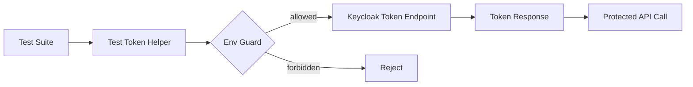
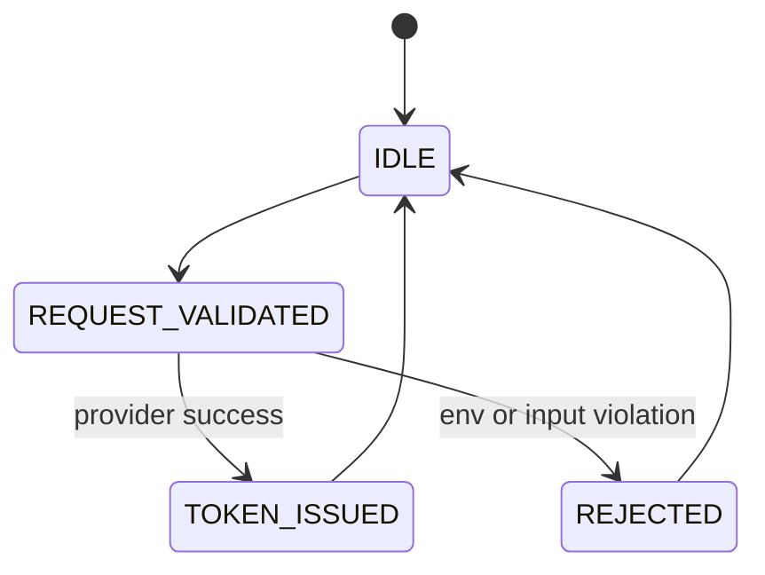

# Module: OIDC-30 Test Token Issuance Helper

## Module purpose

This module defines a test-only helper that issues OIDC tokens from the development realm using password grant or client credentials, enabling deterministic automated authentication in integration and E2E suites while remaining unreachable in production.

## Public interface

```zig
pub const TestGrantType = enum {
    password,
    client_credentials,
};

pub const TestTokenRequest = struct {
    realm_id: []const u8,
    grant_type: TestGrantType,
    username: ?[]const u8 = null,
    password: ?[]const u8 = null,
    client_id: []const u8,
    client_secret: ?[]const u8 = null,
    requested_scopes: []const []const u8,
};

pub const TestTokenResponse = struct {
    access_token: []const u8,
    token_type: []const u8,
    expires_in_seconds: u32,
    scope: []const u8,
};

pub fn issueTestOidcToken(
    allocator: std.mem.Allocator,
    provider: *IdentityProvider,
    request: TestTokenRequest,
    env: Environment,
) !TestTokenResponse;

pub fn assertTestTokenHelperAllowed(env: Environment) !void;
```

```typescript
export interface OidcTestTokenInput {
  role?: 'PLATFORM_ADMIN' | 'PROCESS_DESIGNER' | 'TASK_WORKER'
  grantType: 'password' | 'client_credentials'
  clientId?: string
}

export interface OidcTestTokenOutput {
  accessToken: string
  expiresInSeconds: number
}
```

## Data structures and persistence or seed artifact model

No persistent DB model required.

Optional short-lived in-memory cache for test performance:
- key: `(realm_id, grant_type, principal, scopes)`
- value: token + expiry
- TTL: min(60s, token lifetime minus safety window)

Test fixture mapping artifact:
- `tests/fixtures/oidc-test-principals.json` mapping logical roles to seeded realm users/clients.

## Invariants and migration or coexistence safety guarantees

1. Helper hard-fails when `BPM_ENV=production` or production build profile is active.
2. Helper supports only configured test realm IDs, default `bpm-default`.
3. Helper never logs raw tokens, passwords, or client secrets.
4. Legacy internal token tests continue unchanged during coexistence; helper augments, not replaces, those tests.

## API route, CLI, helper surfaces and auth scopes

- Internal helper function for Zig integration tests: `issueTestOidcToken(...)`.
- Optional dev-only HTTP route:
  - `POST /_test/oidc/token` disabled outside test/dev env.
- CLI wrapper for scripts:
  - `zig build issue-test-token -- --role TASK_WORKER`
- No production auth scopes because surface is disabled in production.

## Integration test strategy and environment assumptions

- Environment assumptions:
  - OIDC-28 local realm up and seeded.
  - Test principals from OIDC-29/OIDC-32 present.
- Strategy:
  - Password grant path for human seeded users.
  - Client credentials path for agent clients.
  - Negative tests: helper forbidden in production env profile; missing credentials rejected.
  - Verify returned token can call protected API and maps to expected role context.

## Data flow diagram



## Error taxonomy

```zig
pub const TestTokenHelperError = error{
    HelperDisabledInProduction,
    UnsupportedGrantType,
    MissingCredentials,
    InvalidRealm,
    ProviderRequestFailed,
    ProviderUnauthorized,
    TokenParseFailed,
};
```

## State transitions



## Cross-module dependencies

- Depends on OIDC-28 for local provider availability.
- Depends on OIDC-29 and OIDC-32 for principal/client seed definitions.
- Depends on OIDC-31 E2E suite consuming helper output.
- Must not depend on production-only runtime paths.

## Risks and open questions

1. Risk: accidental exposure of test helper route if env guards are incomplete.
2. Risk: token endpoint throttling can make large suites flaky without caching/retry controls.
3. Open question: whether password grant should be retained if provider policy disables it later.
4. Open question: should helper emit signed fixture snapshots to improve reproducibility across CI runners.
