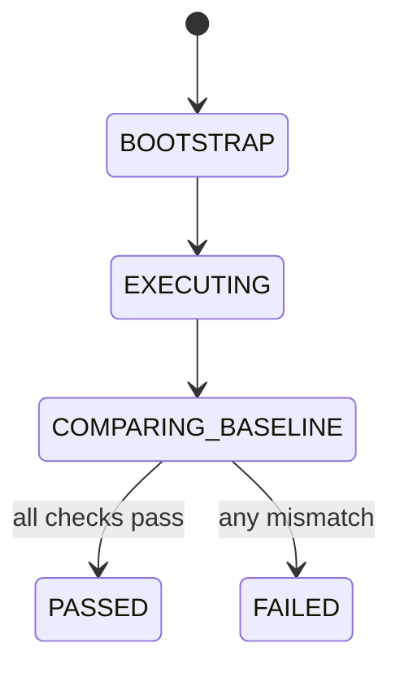

# Module: OIDC-31 End-to-End Authentication Test Suite Across Real Backend and IDP

## Module purpose

This module defines a mandatory real-environment E2E suite that validates OIDC authentication over the Stage 1-6 API surface and checks behavioral equivalence with pre-OIDC expectations across all required roles.

## Public interface

```zig
pub const E2eAuthSuiteConfig = struct {
    bpm_api_base_url: []const u8,
    keycloak_base_url: []const u8,
    realm_id: []const u8,
    test_timeout_seconds: u32,
    require_role_matrix: bool = true,
};

pub const E2eAuthSuiteResult = struct {
    total_cases: u32,
    passed_cases: u32,
    failed_cases: u32,
    role_matrix_complete: bool,
    equivalence_pass: bool,
};

pub fn runOidcE2eAuthSuite(
    allocator: std.mem.Allocator,
    cfg: E2eAuthSuiteConfig,
) !E2eAuthSuiteResult;

pub fn compareWithLegacyBaseline(
    allocator: std.mem.Allocator,
    oidc_result: E2eAuthSuiteResult,
    baseline_path: []const u8,
) !bool;
```

```typescript
export interface AuthE2ECase {
  id: string
  role: 'PLATFORM_ADMIN' | 'PROCESS_DESIGNER' | 'TASK_WORKER'
  route: string
  expectedStatus: number
}

export interface AuthE2EReport {
  runId: string
  cases: Array<{ id: string; pass: boolean; observedStatus: number }>
  equivalencePass: boolean
}
```

## Data structures and persistence or seed artifact model

- Test case catalog: `tests/specs/OIDC-31.md`
- Execution report: `tests/reports/oidc-e2e-auth-suite.json`
- Legacy baseline snapshot: `tests/reports/pre-oidc-auth-baseline.json`

No production database schema changes required.

## Invariants and migration or coexistence safety guarantees

1. Suite runs against real backend and real IDP only; no HTTP mocking.
2. All Stage 5 permission-matrix roles are exercised.
3. Equivalence check compares OIDC-authenticated outcomes to pre-OIDC baseline semantics.
4. Failures in suite do not mutate migration state; they gate release readiness.

## API route, CLI, helper surfaces and auth scopes

- Test runner command:
  - `zig build test-oidc-e2e`
  - optional `npx playwright test web/tests/e2e/auth`
- Helper usage:
  - token helper from OIDC-30 for token acquisition.
- No new production API routes.

## Integration test strategy and environment assumptions

- Environment assumptions:
  - Compose-based Keycloak realm started and seeded.
  - Backend started with OIDC mode enabled and DB migrated.
  - Test DB and event store accessible.
- Strategy:
  - Acquire role-specific tokens.
  - Execute representative Stage 1-6 endpoints per role.
  - Assert expected allow/deny semantics and response schema.
  - Run dual-path comparison for selected cases against legacy token baseline from OIDC-33.

## Data flow diagram


## Error taxonomy

```zig
pub const OidcE2eSuiteError = error{
    EnvironmentBootstrapFailed,
    KeycloakUnavailable,
    BackendUnavailable,
    TokenIssuanceFailed,
    AuthorizationMismatch,
    BaselineComparisonFailed,
    ReportWriteFailed,
};
```

## State transitions



## Cross-module dependencies

- Depends on OIDC-28 local realm and OIDC-29 seed artifact.
- Depends on OIDC-30 token helper for test automation.
- Depends on OIDC-33 coexistence semantics for equivalence checks.
- Must not depend on mocked provider adapters.

## Risks and open questions

1. Risk: long end-to-end startup time can increase CI runtime significantly.
2. Risk: flaky network startup ordering between backend and provider services.
3. Open question: canonical ownership of pre-OIDC baseline artifact updates.
4. Open question: minimum endpoint coverage set for each Stage 1-6 area to satisfy regression confidence.
