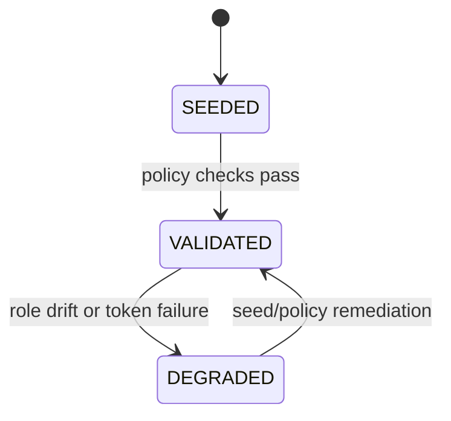

# Module: OIDC-32 Dedicated Agent Test Identities and Lifecycle Policy

## Module purpose

This module defines dedicated seeded service-account clients for pipeline agents in development and CI, with minimum-privilege role bindings, deterministic credential lifecycle, and automated validation that identities remain usable for agent integration workflows.

## Public interface

```zig
pub const AgentTestIdentity = enum {
    agent_architect,
    agent_developer,
    agent_devops,
};

pub const AgentIdentityPolicy = struct {
    identity: AgentTestIdentity,
    client_id: []const u8,
    required_roles: []const []const u8,
    secret_rotation_days: u16,
    disabled_in_production: bool,
};

pub const AgentIdentityValidationResult = struct {
    identity: AgentTestIdentity,
    client_present: bool,
    roles_valid: bool,
    token_issue_valid: bool,
};

pub fn validateAgentTestIdentity(
    allocator: std.mem.Allocator,
    provider: *IdentityProvider,
    realm_id: []const u8,
    identity: AgentTestIdentity,
) !AgentIdentityValidationResult;

pub fn listAgentIdentityPolicies(
    allocator: std.mem.Allocator,
    realm_id: []const u8,
) ![]AgentIdentityPolicy;
```

```typescript
export interface AgentIdentityFixture {
  key: 'agent-architect' | 'agent-developer' | 'agent-devops'
  clientId: string
  requiredRoles: string[]
}
```

## Data structures and persistence or seed artifact model

- Seed presence in `infrastructure/keycloak/realms/bpm-default.json`:
  - clients: `agent-architect`, `agent-developer`, `agent-devops`
  - service account role mappings: include `AGENT_RUNNER` + stage-scoped roles.
- Policy artifact:
  - `infrastructure/keycloak/policies/agent-test-identities.json`

No additional database tables required for baseline design.

## Invariants and migration or coexistence safety guarantees

1. Each required agent identity must be present in seed artifact and importable.
2. Role bindings are minimum-privilege and explicitly declared in policy artifact.
3. Agent test identities are non-human principals and excluded from user migration helper outputs (OIDC-34).
4. Coexistence with legacy tokens (OIDC-33) must not elevate privileges for either auth type.

## API route, CLI, helper surfaces and auth scopes

- Validation CLI:
  - `zig build verify-agent-test-identities`
- Optional test-only route:
  - `GET /_test/oidc/agent-identities/status`
- Management auth scope (admin-only if management route is exposed): `idp.agent-client.read`

## Integration test strategy and environment assumptions

- Environment assumptions:
  - Realm imported from versioned seed.
  - Provider allows client-credentials for seeded agent clients.
- Strategy:
  - For each agent identity, request token via client credentials.
  - Call one representative protected endpoint per required role set.
  - Verify identities are available after seed import and after secret rotation rehearsal.

## Data flow diagram


## Error taxonomy

```zig
pub const AgentIdentityPolicyError = error{
    IdentityMissing,
    RoleBindingMismatch,
    ClientCredentialsDisabled,
    TokenIssuanceFailed,
    PolicyArtifactInvalid,
};
```

## State transitions



## Cross-module dependencies

- Depends on OIDC-20 service account client design.
- Depends on OIDC-21 secret rotation overlap behavior.
- Depends on OIDC-29 seed artifact and OIDC-30 token helper.
- Must not depend on human password grant flows.

## Risks and open questions

1. Risk: over-broad role assignment to agent clients can violate least-privilege goals.
2. Risk: secret lifecycle policy drift between seed defaults and runtime rotation practices.
3. Open question: whether stage-specific roles should be separate per agent or centrally grouped.
4. Open question: should agent identity validation be a hard CI gate or warning in developer environments.
