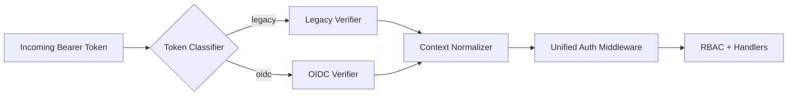
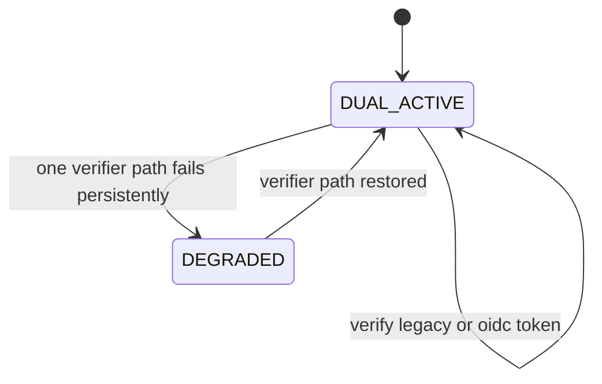

# Module: OIDC-33 Coexistence Period Between Legacy and OIDC Bearer Paths

## Module purpose

This module defines dual-token authentication behavior where legacy internal tokens and OIDC bearer tokens remain valid indefinitely, producing equivalent internal user context and authorization outcomes for the same logical principal.

## Public interface

```zig
pub const AuthTokenKind = enum {
    legacy_internal,
    oidc_bearer,
};

pub const UnifiedAuthContext = struct {
    subject_id: []const u8,
    tenant_id: []const u8,
    roles: []const []const u8,
    token_kind: AuthTokenKind,
    issued_at_unix: i64,
};

pub fn authenticateBearerToken(
    allocator: std.mem.Allocator,
    token: []const u8,
) !UnifiedAuthContext;

pub fn normalizeAuthContext(
    allocator: std.mem.Allocator,
    input: UnifiedAuthContext,
) !UnifiedAuthContext;

pub fn assertAuthEquivalence(
    allocator: std.mem.Allocator,
    legacy_ctx: UnifiedAuthContext,
    oidc_ctx: UnifiedAuthContext,
) !void;
```

## Data structures and persistence or seed artifact model

No mandatory schema change required.

Optional compatibility audit table:

```sql
CREATE TABLE IF NOT EXISTS auth_coexistence_audit (
    event_id UUID PRIMARY KEY,
    subject_id TEXT NOT NULL,
    token_kind TEXT NOT NULL CHECK (token_kind IN ('legacy_internal','oidc_bearer')),
    equivalence_group_id TEXT,
    outcome TEXT NOT NULL,
    created_at TIMESTAMPTZ NOT NULL DEFAULT NOW()
);

CREATE INDEX IF NOT EXISTS idx_auth_coexistence_audit_subject
ON auth_coexistence_audit (subject_id, created_at DESC);
```

## Invariants and migration or coexistence safety guarantees

1. Any legacy token issued before Stage 6.5 remains valid after deployment (until its intrinsic expiry/revocation policy).
2. OIDC and legacy token paths both emit `UnifiedAuthContext` for downstream middleware.
3. Authorization decisions are based on normalized roles and tenant context, not token kind.
4. Migration rollback from OIDC preference to legacy preference must not invalidate existing sessions unexpectedly.

## API route, CLI, helper surfaces and auth scopes

- Existing bearer-authenticated API routes remain unchanged.
- Optional diagnostics route (admin only):
  - `GET /api/v1/auth/coexistence/compare/{subjectId}`
  - Scope: `auth.coexistence.read`
- Test helper:
  - `pub fn issueLegacyAndOidcPair(...) !struct { legacy: []const u8, oidc: []const u8 }`

## Integration test strategy and environment assumptions

- Environment assumptions:
  - Legacy token issuer still configured.
  - OIDC provider and seed realm available.
- Strategy:
  - For selected principal, issue both token kinds.
  - Call same protected routes with each token and compare status + body-level auth fields.
  - Include regression test for token issued pre-deployment and used post-deployment.

## Data flow diagram



## Error taxonomy

```zig
pub const CoexistenceAuthError = error{
    UnsupportedTokenKind,
    LegacyVerificationFailed,
    OidcVerificationFailed,
    SubjectLinkNotFound,
    TenantContextMismatch,
    RoleNormalizationFailed,
    EquivalenceViolation,
};
```

## State transitions



## Cross-module dependencies

- Depends on IDN-04 internal token issuance and verification.
- Depends on OIDC-05 dual-token verification foundation.
- Depends on OIDC-31 E2E equivalence tests.
- Must not introduce token-kind branching in RBAC decision logic.

## Risks and open questions

1. Risk: subtle claim-to-role mapping differences can create authorization drift across token types.
2. Risk: telemetry dashboards may hide token-kind-specific failures without explicit labels.
3. Open question: whether coexistence diagnostics should be exposed in production or restricted to test/admin tooling.
4. Open question: expected support window for legacy issuer key rotation under indefinite coexistence.
