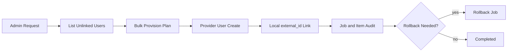
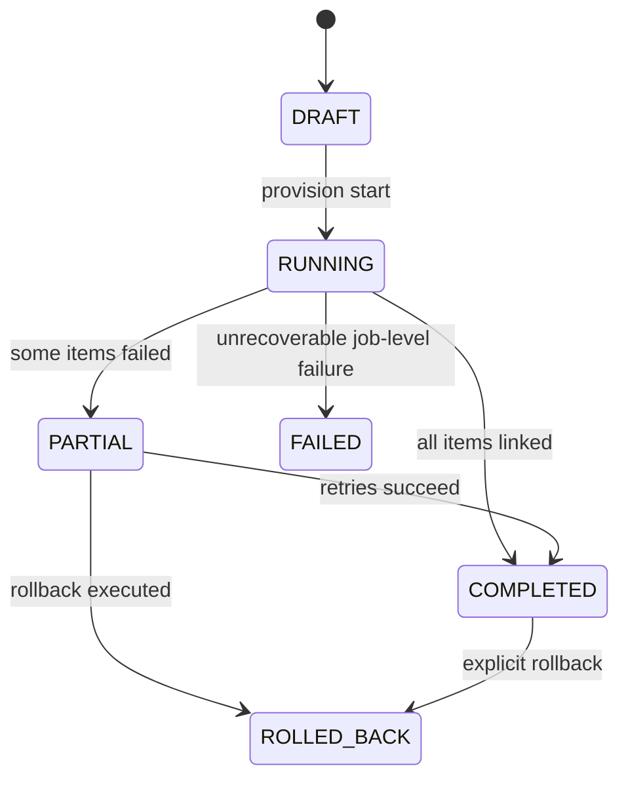

# Module: OIDC-34 Migration Helper for Transition Rollout and Backout Safety

## Module purpose

This module defines an administrative migration helper that identifies internal users missing OIDC links, provisions corresponding provider users in bulk, links identities locally, and supports safe rollout and backout without breaking ongoing authentication.

## Public interface

```zig
pub const MigrationCandidateFilter = struct {
    tenant_id: ?[]const u8 = null,
    page_size: u16 = 100,
    cursor: ?[]const u8 = null,
};

pub const UnlinkedUserCandidate = struct {
    local_user_id: []const u8,
    username: []const u8,
    email: []const u8,
    tenant_id: []const u8,
    suggested_provider_username: []const u8,
};

pub const BulkProvisionRequest = struct {
    realm_id: []const u8,
    candidates: []const UnlinkedUserCandidate,
    dry_run: bool,
    idempotency_key: []const u8,
};

pub const BulkProvisionResult = struct {
    migration_job_id: []const u8,
    attempted: u32,
    provisioned: u32,
    linked: u32,
    failed: u32,
};

pub fn listUnlinkedInternalUsers(
    allocator: std.mem.Allocator,
    pool: *Pool,
    filter: MigrationCandidateFilter,
) ![]UnlinkedUserCandidate;

pub fn provisionAndLinkUsers(
    allocator: std.mem.Allocator,
    pool: *Pool,
    provider: *IdentityProvider,
    request: BulkProvisionRequest,
) !BulkProvisionResult;

pub fn rollbackMigrationJob(
    allocator: std.mem.Allocator,
    pool: *Pool,
    provider: *IdentityProvider,
    migration_job_id: []const u8,
) !void;
```

## Data structures and persistence or seed artifact model

### New table: oidc_migration_job

```sql
CREATE TABLE IF NOT EXISTS oidc_migration_job (
    migration_job_id UUID PRIMARY KEY,
    realm_id TEXT NOT NULL,
    initiated_by TEXT NOT NULL,
    dry_run BOOLEAN NOT NULL,
    status TEXT NOT NULL CHECK (status IN ('RUNNING','PARTIAL','COMPLETED','ROLLED_BACK','FAILED')),
    attempted_count INTEGER NOT NULL,
    provisioned_count INTEGER NOT NULL,
    linked_count INTEGER NOT NULL,
    failed_count INTEGER NOT NULL,
    created_at TIMESTAMPTZ NOT NULL DEFAULT NOW(),
    completed_at TIMESTAMPTZ
);
```

### New table: oidc_migration_item

```sql
CREATE TABLE IF NOT EXISTS oidc_migration_item (
    migration_item_id UUID PRIMARY KEY,
    migration_job_id UUID NOT NULL REFERENCES oidc_migration_job(migration_job_id),
    local_user_id UUID NOT NULL,
    provider_user_id TEXT,
    action_status TEXT NOT NULL CHECK (action_status IN ('PLANNED','PROVISIONED','LINKED','FAILED','ROLLED_BACK')),
    failure_reason TEXT,
    created_at TIMESTAMPTZ NOT NULL DEFAULT NOW(),
    updated_at TIMESTAMPTZ NOT NULL DEFAULT NOW()
);

CREATE INDEX IF NOT EXISTS idx_oidc_migration_item_job
ON oidc_migration_item (migration_job_id, action_status);
```

## Invariants and migration or coexistence safety guarantees

1. Migration helper never disables legacy auth; it only adds OIDC links.
2. Provision-and-link is idempotent by job idempotency key and local user ID.
3. Partial failures are recorded per item and do not invalidate successful links.
4. Backout operation can remove provider users created by a job (where safe) and clear new links while preserving pre-existing links.
5. Agent service accounts from OIDC-32 are excluded from candidate enumeration.

## API route, CLI, helper surfaces and auth scopes

- `GET /api/v1/admin/oidc-migration/unlinked-users` scope `identity.user.read`
- `POST /api/v1/admin/oidc-migration/provision` scope `identity.user.write`
- `POST /api/v1/admin/oidc-migration/jobs/{jobId}/rollback` scope `identity.user.write`
- CLI wrappers:
  - `zig build oidc-migration-list`
  - `zig build oidc-migration-provision -- --dry-run`

All routes restricted to `PLATFORM_ADMIN`.

## Integration test strategy and environment assumptions

- Environment assumptions:
  - Local user registry populated (IDN-01).
  - `external_id` linkage field available (ADP-04a).
  - Provider admin client credentials configured.
- Strategy:
  - List unlinked users and validate pagination stability.
  - Dry-run provisioning validates candidate transforms without writes.
  - Real provisioning creates provider users, links local records, and records job/items.
  - Rollback test validates safe reversal for job-created identities.
  - Coexistence test confirms legacy tokens keep working during and after migration operations.

## Data flow diagram



## Error taxonomy

```zig
pub const OidcMigrationHelperError = error{
    Unauthorized,
    CandidateQueryFailed,
    ProviderProvisionFailed,
    LinkUpdateFailed,
    JobPersistenceFailed,
    RollbackFailed,
    CoexistenceSafetyViolation,
};
```

## State transitions



## Cross-module dependencies

- Depends on IDN-01 user registry queries.
- Depends on ADP-04a external identity link field semantics.
- Depends on OIDC-23 provider user provisioning primitives.
- Depends on OIDC-33 coexistence guarantees to ensure no forced migration disruption.
- Must not depend on production-only manual admin console procedures.

## Risks and open questions

1. Risk: duplicate email or username collisions at provider can produce partial jobs.
2. Risk: rollback may be incomplete if provider-side deletes are blocked by external dependencies.
3. Open question: whether helper should support incremental batching by tenant and role for large datasets.
4. Open question: desired conflict policy when local user already linked to a different provider account.
