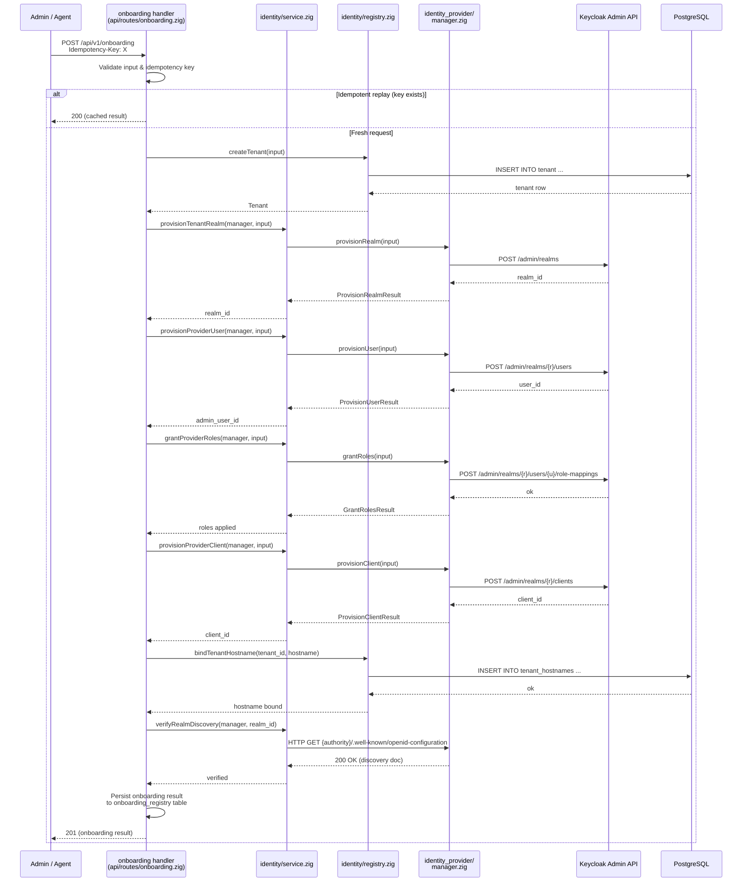

# Module: Company Onboarding Orchestration (OIDC-35)

## Module purpose

The onboarding orchestration module provides a high-level, multi-step API for
provisioning a new company tenant end-to-end. It coordinates four phases in a
single idempotent transaction:

1. **Create tenant** — insert row in `tenant` table with `idp_realm_id`
2. **Provision realm** — call Keycloak adapter to create realm, protocol mapper,
   admin user, and OIDC client
3. **Bind hostname** — register the tenant's custom hostname in `tenant_hostnames`
4. **Verify** — probe the realm's OIDC discovery endpoint and report readiness

This module wraps lower-level primitives (identity/service.zig, identity/registry.zig,
the Keycloak adapter via identity_provider/manager.zig) into a single orchestration
surface suitable for automated (agent) and manual (admin UI) onboarding flows.

---

## Endpoint sequence

### Onboarding Flow (synchronous, single API call)

```
POST /api/v1/onboarding  {Idempotency-Key: <uuid>}
  │
  ├─ 1. Validate input (slug, display_name, admin_email, hostname)
  ├─ 2. Create tenant in DB (identity/registry.zig: createTenant)
  ├─ 3. Provision Keycloak realm   (identity_provider/manager.zig: provisionRealm)
  ├─ 4. Create admin user in realm (identity_provider/manager.zig: provisionUser)
  ├─ 5. Assign PLATFORM_ADMIN role (identity_provider/manager.zig: grantRoles)
  ├─ 6. Create OIDC client         (identity_provider/manager.zig: provisionClient)
  ├─ 7. Bind hostname in DB        (identity/registry.zig: bindTenantHostname)
  ├─ 8. Verify realm discovery     (identity_provider/manager.zig: verifyDiscovery)
  └─ 9. Return onboarding result
```

Each step has a compensating action on failure (Saga pattern, matching OIDC-18).
On idempotent replay, all steps are skipped and the original result is returned.

---

## Request/Response schemas

### `POST /api/v1/onboarding`

#### Request body

```json
{
  "slug": "acme-corp",
  "display_name": "Acme Corp",
  "admin_email": "admin@acme.com",
  "admin_username": "admin",
  "admin_display_name": "Acme Admin",
  "hostname": "bpm.acme.com",
  "realm_config": {
    "default_token_lifetime_seconds": 900,
    "min_password_length": 8,
    "require_uppercase": true,
    "require_digit": true,
    "signing_key_algorithm": "RS256"
  },
  "client_config": {
    "redirect_uris": ["https://bpm.acme.com/*"],
    "service_account_enabled": true
  }
}
```

| Field | Type | Required | Description |
|---|---|---|---|
| `slug` | string | yes | URL-safe tenant identifier; used as realm name |
| `display_name` | string | yes | Human-readable tenant name |
| `admin_email` | string | yes | Email for the realm admin user |
| `admin_username` | string | yes | Username for the realm admin user |
| `admin_display_name` | string | yes | Display name for the realm admin user |
| `hostname` | string | yes | Custom hostname for the tenant (e.g. `bpm.acme.com`) |
| `realm_config` | object | no | Overrides for realm provisioning defaults (see OIDC-14) |
| `client_config` | object | no | Overrides for OIDC client provisioning defaults |

#### Response — 201 Created

```json
{
  "onboarding_id": "550e8400-e29b-41d4-a716-446655440000",
  "tenant_id": "550e8400-e29b-41d4-a716-446655440001",
  "idp_realm_id": "acme-corp",
  "client_id": "bpm-platform-api",
  "admin_user_id": "550e8400-e29b-41d4-a716-446655440002",
  "hostname": "bpm.acme.com",
  "oidc_authority": "http://keycloak:8081/realms/acme-corp",
  "discovery_url": "http://keycloak:8081/realms/acme-corp/.well-known/openid-configuration",
  "created": true
}
```

#### Response — 200 OK (idempotent replay)

```json
{
  "onboarding_id": "550e8400-e29b-41d4-a716-446655440000",
  "tenant_id": "550e8400-e29b-41d4-a716-446655440001",
  "idp_realm_id": "acme-corp",
  "client_id": "bpm-platform-api",
  "admin_user_id": "550e8400-e29b-41d4-a716-446655440002",
  "hostname": "bpm.acme.com",
  "oidc_authority": "http://keycloak:8081/realms/acme-corp",
  "discovery_url": "http://keycloak:8081/realms/acme-corp/.well-known/openid-configuration",
  "created": false
}
```

#### Response — 409 Conflict (idempotency key collision — different request body)

```json
{
  "type": "https://bpm.example.com/problems/idempotency-conflict",
  "title": "Idempotency Conflict",
  "status": 409,
  "detail": "Idempotency key 'abc-123' was used with a different request body",
  "trace_id": "req-001"
}
```

### `GET /api/v1/onboarding/:onboarding_id`

Retrieve the result of a completed onboarding by its `onboarding_id`.

#### Response — 200 OK

```json
{
  "onboarding_id": "550e8400-e29b-41d4-a716-446655440000",
  "tenant_id": "550e8400-e29b-41d4-a716-446655440001",
  "idp_realm_id": "acme-corp",
  "client_id": "bpm-platform-api",
  "admin_user_id": "550e8400-e29b-41d4-a716-446655440002",
  "hostname": "bpm.acme.com",
  "oidc_authority": "http://keycloak:8081/realms/acme-corp",
  "discovery_url": "http://keycloak:8081/realms/acme-corp/.well-known/openid-configuration",
  "created": true,
  "status": "completed"
}
```

#### Response — 404 Not Found

```json
{
  "type": "https://bpm.example.com/problems/not-found",
  "title": "Not Found",
  "status": 404,
  "detail": "Onboarding record not found",
  "trace_id": "req-002"
}
```

### `GET /api/v1/onboarding?hostname={hostname}`

Look up an existing onboarding result by hostname (useful after idempotent replay
when the caller lost the response).

#### Response — 200 OK

Same shape as `GET /api/v1/onboarding/:onboarding_id`.

---

## Data flow diagram



---

## Error taxonomy

### OnboardingError set

```zig
pub const OnboardingError = error{
    /// Tenant slug already exists in the database.
    DuplicateTenantSlug,
    /// The requested hostname is already bound to another tenant.
    DuplicateHostname,
    /// Realm creation at the provider failed (network, auth, or internal error).
    RealmProvisioningFailed,
    /// User creation at the provider failed.
    UserProvisioningFailed,
    /// Role assignment at the provider failed.
    RoleAssignmentFailed,
    /// OIDC client creation at the provider failed.
    ClientProvisioningFailed,
    /// Hostname binding failed (DB-level constraint violation).
    HostnameBindingFailed,
    /// Verification of the realm's OIDC discovery endpoint failed.
    VerificationFailed,
    /// The requested realm (by slug) already exists at the provider.
    RealmAlreadyExists,
    /// The provided idempotency key was already used with a different request body.
    IdempotencyConflict,
    /// The caller lacks PLATFORM_ADMIN privileges.
    Forbidden,
    /// Input validation failed (missing or malformed fields).
    ValidationFailed,
    /// Database pool is exhausted.
    PoolExhausted,
    /// Generic persistence failure.
    PersistenceFailed,
    /// Allocator out of memory.
    OutOfMemory,
};
```

### Error → HTTP mapping

| Error | HTTP status | Problem type slug |
|---|---|---|
| `ValidationFailed` | 422 | `validation-failed` |
| `Forbidden` | 403 | `forbidden` |
| `DuplicateTenantSlug` | 409 | `duplicate-tenant-slug` |
| `DuplicateHostname` | 409 | `duplicate-hostname` |
| `RealmAlreadyExists` | 409 | `realm-already-exists` |
| `IdempotencyConflict` | 409 | `idempotency-conflict` |
| `RealmProvisioningFailed` | 502 | `provider-error` |
| `UserProvisioningFailed` | 502 | `provider-error` |
| `RoleAssignmentFailed` | 502 | `provider-error` |
| `ClientProvisioningFailed` | 502 | `provider-error` |
| `HostnameBindingFailed` | 500 | `internal-error` |
| `VerificationFailed` | 502 | `provider-error` |
| `PoolExhausted` | 503 | `service-unavailable` |
| `PersistenceFailed` | 500 | `internal-error` |
| `OutOfMemory` | 500 | `internal-error` |

### Error response format (RFC 9457 Problem Details)

All error responses follow the existing `api/errors.zig` ProblemDetails pattern:

```json
{
  "type": "https://bpm.example.com/problems/validation-failed",
  "title": "Validation Failed",
  "status": 422,
  "detail": "slug: must be 3-63 lowercase alphanumeric or hyphens",
  "trace_id": "req-abc123"
}
```

---

## Idempotency key semantics

Matching **ES-03** (event idempotency) and **OIDC-17** (provisioning idempotency):

1. **Required header:** `Idempotency-Key` (UUID format) on every `POST /api/v1/onboarding`.
2. **Scope:** The key is scoped to the `onboarding` endpoint (fingerprint `/api/v1/onboarding`).
3. **Lifetime:** 24 hours after the last write. After expiry, a new request with the same key
   is treated as a fresh request (no replay guarantee).
4. **Replay semantics:**
   - Same key + same request body → HTTP 200 with `"created": false` (original result returned).
   - Same key + different request body → HTTP 409 with problem type `idempotency-conflict`.
5. **Underlying store:** An `onboarding_registry` database table (see Data types below) with
   `ON CONFLICT (idempotency_key) DO NOTHING RETURNING *` — matching the ES-03 pattern from
   `backend_developer_guide.md §4.2`.
6. **Pending state:** During the first request execution, the record is `state = 'pending'`.
   A concurrent request with the same key receives HTTP 409 with `detail: "onboarding already in progress"`.
7. **Completion:** On success, state transitions to `completed` and the full response is stored.
   On failure, state transitions to `failed` and the error response is stored (so retry with the same
   key returns the original error, not a duplicate).

---

## Authentication requirements

All onboarding endpoints require **`PLATFORM_ADMIN`** role:

| Endpoint | Required role | Middleware chain |
|---|---|---|
| `POST /api/v1/onboarding` | `PLATFORM_ADMIN` | `auth → rbac(PLATFORM_ADMIN) → ratelimit → audit` |
| `GET /api/v1/onboarding/:id` | `PLATFORM_ADMIN` | `auth → rbac(PLATFORM_ADMIN) → audit` |
| `GET /api/v1/onboarding?hostname=` | `PLATFORM_ADMIN` | `auth → rbac(PLATFORM_ADMIN) → audit` |

- Token verification uses the existing `auth.zig` middleware chain.
- OIDC tokens (from the platform's own realm) and internal API tokens are both accepted.
- `AgentPrincipal` with `agent_runner` role and `bundle_write` scope also qualifies
  (covers automated agent-driven onboarding per OIDC-16).

---

## Public interface (function signatures)

### `src/identity/service.zig` — new functions

All functions below to be added to `identity.Service`. No existing signatures change.

```zig
/// Execute the full onboarding sequence as a saga transaction.
/// Idempotency is handled at the caller (API handler) level via the
/// onboarding_registry table.
pub fn executeOnboarding(
    self: *Service,
    allocator: std.mem.Allocator,
    manager: provider_manager_mod.Manager,
    actor: auth.AuthContext,
    input: OnboardingInput,
) (ProviderIntegrationError || OnboardingError)!OnboardingResult;

/// Verify that a Keycloak realm's OIDC discovery endpoint is reachable
/// and returns HTTP 200.
pub fn verifyRealmDiscovery(
    self: *Service,
    allocator: std.mem.Allocator,
    manager: provider_manager_mod.Manager,
    realm_id: []const u8,
) (ProviderIntegrationError || OnboardingError)!void;

/// Bind a hostname to a tenant in the tenant_hostnames table.
pub fn bindTenantHostname(
    self: *Service,
    allocator: std.mem.Allocator,
    tenant_id: []const u8,
    hostname: []const u8,
) (IdentityError || OnboardingError)!void;

/// Look up an existing onboarding result by onboarding_id.
pub fn getOnboarding(
    self: *Service,
    allocator: std.mem.Allocator,
    onboarding_id: []const u8,
) (IdentityError || OnboardingError)!?OnboardingRecord;

/// Look up an existing onboarding result by hostname.
pub fn getOnboardingByHostname(
    self: *Service,
    allocator: std.mem.Allocator,
    hostname: []const u8,
) (IdentityError || OnboardingError)!?OnboardingRecord;
```

### `src/api/routes/onboarding.zig` — new route handler

```zig
/// POST /api/v1/onboarding
pub fn handleOnboarding(
    service: *identity_service.Service,
    allocator: std.mem.Allocator,
    actor: auth.AuthContext,
    body: []const u8,
    idempotency_key: []const u8,
) HandlerResult;

/// GET /api/v1/onboarding/:onboarding_id
pub fn handleGetOnboarding(
    service: *identity_service.Service,
    allocator: std.mem.Allocator,
    actor: auth.AuthContext,
    onboarding_id: []const u8,
) HandlerResult;

/// GET /api/v1/onboarding?hostname={hostname}
pub fn handleGetOnboardingByHostname(
    service: *identity_service.Service,
    allocator: std.mem.Allocator,
    actor: auth.AuthContext,
    hostname: []const u8,
) HandlerResult;
```

### `src/identity/provider/types.zig` — new type (if not already present)

```zig
pub const VerifyDiscoveryInput = struct {
    authority: []const u8,
};

pub const VerifyDiscoveryResult = struct {
    issuer: []const u8,
    status_code: u16,
};
```

---

## Data types

```zig
/// Input to the onboarding endpoint.
pub const OnboardingInput = struct {
    slug: []const u8,
    display_name: []const u8,
    admin_email: []const u8,
    admin_username: []const u8,
    admin_display_name: []const u8,
    hostname: []const u8,
    realm_config: ?RealmConfigOverrides,
    client_config: ?ClientConfigOverrides,
};

pub const RealmConfigOverrides = struct {
    default_token_lifetime_seconds: ?u32,
    min_password_length: ?u8,
    require_uppercase: ?bool,
    require_digit: ?bool,
    signing_key_algorithm: ?[]const u8,
};

pub const ClientConfigOverrides = struct {
    redirect_uris: ?[]const []const u8,
    service_account_enabled: ?bool,
};

/// Result returned to the caller on success.
pub const OnboardingResult = struct {
    onboarding_id: []const u8,
    tenant_id: []const u8,
    idp_realm_id: []const u8,
    client_id: []const u8,
    admin_user_id: []const u8,
    hostname: []const u8,
    oidc_authority: []const u8,
    discovery_url: []const u8,
    created: bool,

    pub fn deinit(self: OnboardingResult, allocator: std.mem.Allocator) void {
        allocator.free(self.onboarding_id);
        allocator.free(self.tenant_id);
        allocator.free(self.idp_realm_id);
        allocator.free(self.client_id);
        allocator.free(self.admin_user_id);
        allocator.free(self.hostname);
        allocator.free(self.oidc_authority);
        allocator.free(self.discovery_url);
    }
};

/// Persisted record in the onboarding_registry table.
pub const OnboardingRecord = struct {
    onboarding_id: []const u8,
    idempotency_key: []const u8,
    tenant_id: []const u8,
    request_hash: [32]u8,
    response_status: u16,
    response_body_json: []const u8,
    state: OnboardingState,
    created_at: []const u8,
    completed_at: ?[]const u8,

    pub fn deinit(self: OnboardingRecord, allocator: std.mem.Allocator) void {
        allocator.free(self.onboarding_id);
        allocator.free(self.idempotency_key);
        allocator.free(self.tenant_id);
        allocator.free(self.response_body_json);
        allocator.free(self.created_at);
        if (self.completed_at) |v| allocator.free(v);
    }
};

pub const OnboardingState = enum {
    pending,
    completed,
    failed,
};
```

---

## Database schema (new migration)

The `onboarding_registry` table stores idempotency keys, request hashes, and response
bodies. Its schema (columns, constraints, indexes) is defined in the migration file
`migrations/NNN_onboarding_registry.sql`. The design assumes:

| Column | Type | Purpose |
|---|---|---|
| `id` | UUID PK | Surrogate key |
| `onboarding_id` | UUID | Logical identifier returned to caller |
| `idempotency_key` | TEXT UNIQUE | Idempotency scope per ES-03 |
| `request_hash` | BYTEA | SHA-256 of canonical request JSON |
| `response_status` | SMALLINT | Cached HTTP status for replay |
| `response_body` | JSONB | Cached response body for replay |
| `state` | TEXT | `pending` / `completed` / `failed` |
| `idempotency_expires_at` | TIMESTAMPTZ | 24h TTL |
| `created_at` | TIMESTAMPTZ | Row creation timestamp |
| `completed_at` | TIMESTAMPTZ? | Completion timestamp |

Refer to the migration file for the exact SQL DDL.

---

## Key invariants

1. **No partial onboarding.** If any step in the saga fails, compensating actions
   undo all previously completed steps. A partial state is never visible to callers.
2. **Idempotency is collision-proof.** A different request body with the same key
   is always rejected (HTTP 409), never silently accepted.
3. **Realm identity matches tenant slug.** The Keycloak realm ID is derived from
   `slug` (lowercased, hyphens allowed), making it predictable for DNS/UI.
4. **Hostname uniqueness.** No two tenants may share the same hostname. The DB
   constraint on `tenant_hostnames.hostname` enforces this.
5. **OIDC discovery is verified synchronously.** The `POST` response includes a
   working `oidc_authority` URL whose discovery endpoint returns HTTP 200.
6. **No I/O in the handler delegate.** The route handler only parses/validates
   input and delegates to `identity/service.zig`. All DB and HTTP calls live in
   the service layer.
7. **Admin user always has PLATFORM_ADMIN.** The provisioned admin user is granted
   `PLATFORM_ADMIN` role in the target realm at creation time.

---

## Test-tenant bootstrap examples (curl)

The following curl commands demonstrate end-to-end onboarding for test/CI
environments. They assume the backend is running at `http://localhost:8080`
and the caller has a valid PLATFORM_ADMIN token stored in `$TOKEN`.

### 1. Bootstrap a minimal test tenant

```bash
curl -s -X POST http://localhost:8080/api/v1/onboarding \
  -H "Authorization: Bearer $TOKEN" \
  -H "Content-Type: application/json" \
  -H "Idempotency-Key: 11111111-1111-4111-8111-111111111111" \
  -d '{
    "slug": "test-corp",
    "display_name": "Test Corp",
    "admin_email": "admin@test-corp.local",
    "admin_username": "admin",
    "admin_display_name": "Test Admin",
    "hostname": "bpm.test-corp.local"
  }'
```

**Expected response (201):**

```json
{
  "onboarding_id": "550e8400-e29b-41d4-a716-446655440000",
  "tenant_id": "550e8400-e29b-41d4-a716-446655440001",
  "idp_realm_id": "test-corp",
  "client_id": "bpm-platform-api",
  "admin_user_id": "550e8400-e29b-41d4-a716-446655440002",
  "hostname": "bpm.test-corp.local",
  "oidc_authority": "http://keycloak:8081/realms/test-corp",
  "discovery_url": "http://keycloak:8081/realms/test-corp/.well-known/openid-configuration",
  "created": true
}
```

### 2. Idempotent replay (same key, same body)

```bash
# Re-issue the exact same request — returns cached result with created=false
curl -s -X POST http://localhost:8080/api/v1/onboarding \
  -H "Authorization: Bearer $TOKEN" \
  -H "Content-Type: application/json" \
  -H "Idempotency-Key: 11111111-1111-4111-8111-111111111111" \
  -d '{
    "slug": "test-corp",
    "display_name": "Test Corp",
    "admin_email": "admin@test-corp.local",
    "admin_username": "admin",
    "admin_display_name": "Test Admin",
    "hostname": "bpm.test-corp.local"
  }'
```

**Expected response (200):** Same body as above with `"created": false`.

### 3. Idempotency conflict (same key, different body)

```bash
curl -s -X POST http://localhost:8080/api/v1/onboarding \
  -H "Authorization: Bearer $TOKEN" \
  -H "Content-Type: application/json" \
  -H "Idempotency-Key: 11111111-1111-4111-8111-111111111111" \
  -d '{
    "slug": "other-corp",
    "display_name": "Other Corp",
    "admin_email": "admin@other.local",
    "admin_username": "admin",
    "admin_display_name": "Other Admin",
    "hostname": "bpm.other.local"
  }'
```

**Expected response (409):**

```json
{
  "type": "https://bpm.example.com/problems/idempotency-conflict",
  "title": "Idempotency Conflict",
  "status": 409,
  "detail": "Idempotency key '11111111-1111-4111-8111-111111111111' was used with a different request body",
  "trace_id": "req-abc123"
}
```

### 4. Retrieve onboarding result by ID

```bash
curl -s http://localhost:8080/api/v1/onboarding/550e8400-e29b-41d4-a716-446655440000 \
  -H "Authorization: Bearer $TOKEN"
```

**Expected response (200):** Full onboarding result with `"status": "completed"`.

### 5. Lookup by hostname

```bash
curl -s "http://localhost:8080/api/v1/onboarding?hostname=bpm.test-corp.local" \
  -H "Authorization: Bearer $TOKEN"
```

**Expected response (200):** Same onboarding result.

### 6. Validation error (missing required field)

```bash
curl -s -X POST http://localhost:8080/api/v1/onboarding \
  -H "Authorization: Bearer $TOKEN" \
  -H "Content-Type: application/json" \
  -H "Idempotency-Key: 22222222-2222-4222-8222-222222222222" \
  -d '{
    "slug": "bad-request"
  }'
```

**Expected response (422):**

```json
{
  "type": "https://bpm.example.com/problems/validation-failed",
  "title": "Validation Failed",
  "status": 422,
  "detail": "admin_email: is required",
  "trace_id": "req-def456"
}
```

### 7. Unauthenticated request (missing token)

```bash
curl -s -X POST http://localhost:8080/api/v1/onboarding \
  -H "Content-Type: application/json" \
  -H "Idempotency-Key: 33333333-3333-4333-8333-333333333333" \
  -d '{
    "slug": "unauth-test",
    "display_name": "Unauth Test",
    "admin_email": "admin@unauth.local",
    "admin_username": "admin",
    "admin_display_name": "Unauth Admin",
    "hostname": "bpm.unauth.local"
  }'
```

**Expected response (401):** Unauthorized (no token or invalid token).

---

## Dependencies

### Modules this module calls

| Module | Functions used | Purpose |
|---|---|---|
| `identity/registry.zig` | `createTenant`, `bindTenantHostname` | DB operations for tenant + hostname |
| `identity/service.zig` | `provisionTenantRealm`, `provisionProviderUser`, `grantProviderRoles`, `provisionProviderClient` | Adapter calls for realm, user, roles, client |
| `identity_provider/manager.zig` | `provisionRealm`, `provisionUser`, `grantRoles`, `provisionClient`, `verifyBearerToken` (for discovery check) | Delegation to active IDP adapter |
| `api/errors.zig` | `problemBadRequest`, `problemConflict`, `problemUnprocessable`, etc. | RFC 9457 error responses |
| `oidc/agent_lifecycle.zig` | `IdempotencyStore`, `IdempotencyScope` | Idempotency check and store |
| `auth.zig` (middleware) | `AuthContext`, `Role` | Actor identity and authorization |

### Modules this module must NOT depend on

- `engine/transition.zig` — pure transition function, no I/O
- `scheduler/scheduler.zig` — background timer, unrelated
- `webhook/dispatcher.zig` — post-provisioning webhooks (separate concern)

### New files to create

| File | Purpose |
|---|---|
| `src/api/routes/onboarding.zig` | HTTP handler for POST/GET onboarding endpoints |
| `src/identity/onboarding.zig` | Orchestration logic: saga execution, compensation |
| `migrations/NNN_onboarding_registry.sql` | Database table for onboarding records + idempotency |

### Existing files to modify

| File | Change |
|---|---|
| `src/identity/service.zig` | Add `executeOnboarding`, `verifyRealmDiscovery`, `bindTenantHostname`, onboarding lookup functions |
| `src/api/server.zig` | Register new onboarding routes |
| `src/api/errors.zig` | Add `problemBadGateway` (502) constructor if not present |

---

## How the Keycloak adapter is called for realm creation

The onboarding saga calls the Keycloak adapter through the standard
`identity_provider` pipeline, never directly:

```
onboarding handler
  → identity.Service.executeOnboarding()
    → Service.provisionTenantRealm(manager, input)
      → Manager.provisionRealm(allocator, input)     [identity_provider/manager.zig]
        → KeycloakAdapter.provisionRealm(allocator, input)  [adapters/keycloak/provider.zig]
          → POST {keycloak_base}/admin/realms         [Keycloak Admin REST API]
          → POST {keycloak_base}/admin/realms/{r}/clients
          → POST {keycloak_base}/admin/realms/{r}/users
          → POST {keycloak_base}/admin/realms/{r}/users/{u}/role-mappings
```

The `Manager` picks the active adapter at startup via configuration (OIDC-03).
During testing, the stub adapter (`adapters/stub/provider.zig`) is used instead.

---

## Open questions

1. **Should the admin user be created in the local `users` table as well, or only
   at the provider?** Currently, OIDC-35 assumes the admin exists only in Keycloak;
   JIT provisioning (OIDC-10) creates the local record on first login. If an
   immediate local record is needed, the saga should also call `createUser` on
   `identity/registry.zig`.
2. **Should the onboarding endpoint support an optional `tenant_id` override?**
   Some callers may want to pre-define the tenant UUID. The existing
   `createTenant` path already supports caller-supplied UUIDs.
3. **What is the required hostname format validation?** Should the API accept
   fully qualified domain names only, or also allow wildcard prefixes?
4. **SLA for the synchronous `POST` endpoint.** If Keycloak is slow, the request
   could take >30s. Consider whether an async onboarding flow (return 202 with a
   polling URL) is needed for production. The current design is synchronous per
   OIDC-35 acceptance criterion #6.
