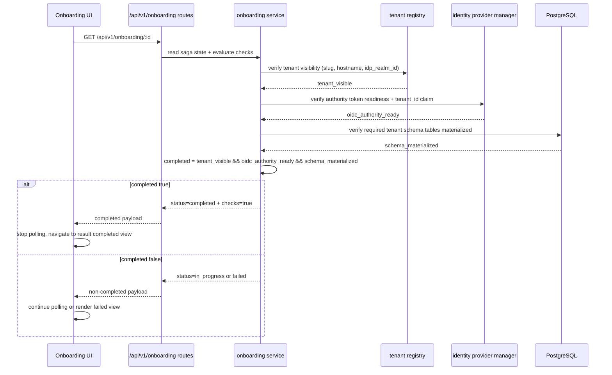
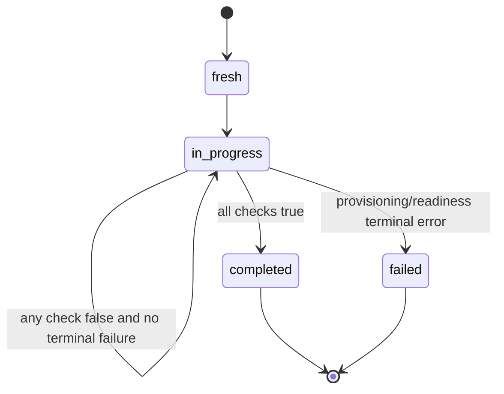

# Design: Onboarding Completion Gate (BO Accept R2)

**Requirements covered:** ONB-UI-03, ONB-UI-04, OIDC-12, OIDC-13, OIDC-14
**Classification:** Type E (novel cross-cutting onboarding completion semantics across backend orchestration, OIDC readiness verification, and UI flow)

---

## Module purpose

Define the completion gate for tenant onboarding so a saga is considered `completed` only when all required readiness checks pass simultaneously:
- `tenant_visible = true`
- `oidc_authority_ready = true`
- `schema_materialized = true`

The design ensures backend status semantics and frontend rendering/transition behavior are aligned and auditable.

---

## Public interface

### Backend interfaces (Zig)

```zig
pub const CompletionChecks = struct {
    tenant_visible: bool,
    oidc_authority_ready: bool,
    schema_materialized: bool,
};

pub const OnboardingStatus = enum {
    fresh,
    in_progress,
    completed,
    failed,
};
```

```zig
pub const OnboardingStatusResponse = struct {
    onboarding_id: []const u8,
    status: OnboardingStatus,
    slug: ?[]const u8,
    hostname: ?[]const u8,
    oidc_authority: ?[]const u8,
    tenant_visible: bool,
    oidc_authority_ready: bool,
    schema_materialized: bool,
    failure_reason: ?[]const u8,
};
```

```zig
pub fn evaluateCompletionGate(
    checks: CompletionChecks,
) bool;

pub fn verifyTenantVisibility(
    allocator: std.mem.Allocator,
    registry: *identity_registry.Registry,
    tenant_slug: []const u8,
    expected_hostname: []const u8,
    expected_realm_id: []const u8,
) !bool;

pub fn verifyOidcAuthorityReadiness(
    allocator: std.mem.Allocator,
    manager: identity_provider.manager.Manager,
    tenant_slug: []const u8,
    tenant_id: []const u8,
    authority: []const u8,
) !bool;

pub fn verifySchemaMaterialization(
    allocator: std.mem.Allocator,
    pool: *db_pool.Pool,
    tenant_id: []const u8,
) !bool;
```

### API route contracts

```zig
pub fn handleGetOnboardingById(ctx: *RequestContext) !void;
pub fn handleGetOnboardingByHostname(ctx: *RequestContext) !void;
```

Expected response additions for onboarding status/result payloads:
- `tenant_visible`
- `oidc_authority_ready`
- `schema_materialized`
- `status` (`completed` is only allowed when all three checks are true)

### Frontend interfaces (TypeScript)

```ts
export type OnboardingStatus = 'fresh' | 'in_progress' | 'completed' | 'failed'

export interface OnboardingStatusDto {
  onboarding_id: string
  status: OnboardingStatus
  slug?: string
  hostname?: string
  oidc_authority?: string
  tenant_visible: boolean
  oidc_authority_ready: boolean
  schema_materialized: boolean
  failure_reason?: string
}

export interface CompletionChecks {
  tenant_visible: boolean
  oidc_authority_ready: boolean
  schema_materialized: boolean
}

export function isCompletionGateSatisfied(checks: CompletionChecks): boolean
```

---

## Data flow diagram



---

## Error taxonomy

### Backend

```zig
pub const OnboardingCompletionGateError = error{
    OnboardingNotFound,
    TenantVisibilityProbeFailed,
    OidcAuthorityProbeFailed,
    OidcClaimMismatch,
    SchemaReadinessProbeFailed,
    MissingRequiredSchemaTables,
    InvalidCompletionState,
};
```

Mapping guidance:
- `OnboardingNotFound` -> HTTP 404
- Probe failures that represent transient external conditions -> HTTP 503 + `status=in_progress` when recoverable
- Deterministic mismatch/invalid state -> HTTP 422 for mutation endpoints, `status=failed` for saga outcome surfaces

### Frontend

- Three consecutive transient poll failures (5xx/network) surface UI error state on progress page
- Any response with one or more checks false must not render completed result state

---

## State transitions



Transition constraints:
- `completed` requires all three checks true in the same evaluated response
- If any check is false, onboarding cannot be surfaced as `completed`
- Result endpoint by hostname must return the same completion semantics as by onboarding id

---

## Dependencies

Depends on:
- `src/identity/onboarding.zig` (saga status/read model)
- `src/identity/registry.zig` (tenant visibility probe)
- `src/identity_provider/manager.zig` and Keycloak adapter (authority/token claim readiness probe)
- `src/db/provisioning.zig` and tenant schema registry tables (materialization probe)
- Onboarding routes under `src/api/routes/`
- Frontend onboarding pages and API client modules under `web/src/`

Must not depend on:
- Engine transition internals (`src/engine/transition.zig`)
- Direct SQL interpolation in route handlers
- UI-only state as source of truth for completion status

---

## Open questions

- Exact required-table source of truth for `schema_materialized`: static list in code, migration metadata table, or `tenant_schemas` registry projection?
- Failure policy for temporary OIDC authority unavailability after tenant row exists: remain `in_progress` with retries vs immediate `failed` after bounded retries?
- Should `GET /api/v1/onboarding?hostname=<h>` return failed records too (for parity with result-page reload behavior), or remain completed-only with explicit failed-recovery UX?

Current handoff is marked PASS because the completion gate behavior is fully designed; these open questions are implementation policy details and can be resolved conservatively in CODE-DESIGN-VALIDATOR/BACKEND-DEV without changing the interface shape.
