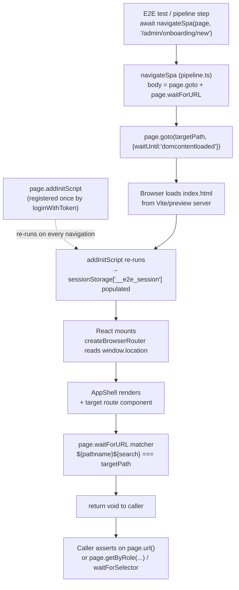

# Module: Onboarding E2E Navigation Fix — `navigateSpa` rewrite in `web/tests/e2e/pipeline.ts`

- **Run ID:** `WF03-onboarding-e2e-fix-20260614`
- **Workflow:** WF-03 (issue resolving)
- **Issue:** `docs/issues/ISS-0069.json`
- **Classification:** Category E (test code error). Source code under `web/src/**` is correct; the bug is in the test harness.
- **Type (per `templates/lego-catalog.md`):** Type E — novel/cross-cutting prose design. No codegen applies (no CRUD endpoint, no admin list page, no migration, no React Flow node).
- **Files touched by the fix:** `web/tests/e2e/pipeline.ts` ONLY (single-file rewrite of one exported function). All other files are unaffected.

---

## Module purpose

`navigateSpa(page, targetPath)` is the shared helper every Playwright E2E test and pipeline step uses to move the browser to a route inside the BPM Platform SPA. It is consumed by the onboarding tests (`web/tests/e2e/onboarding/*`), the onboarding pipeline (`web/tests/e2e/pipelines/onboarding-wizard.pipeline.e2e.spec.ts`), and four other pipeline files. The current implementation uses `window.history.pushState` + a synthetic `popstate` event, which races with React Router v6.4's `createBrowserRouter` and intermittently fails to mount the target route. This design specifies the rewrite to the `page.goto`-based pattern that is already proven green in `web/tests/e2e/tenants.e2e.spec.ts:74-79`.

This design contains **NO implementation code**. The body of `navigateSpa` is described in prose and as a behavioural contract; BACKEND-DEV/FRONTEND-DEV write the actual TypeScript in WF-03 Step 3.

---

## Current broken behaviour

The function exported from `web/tests/e2e/pipeline.ts` (lines ~171-179) is currently:

> ```ts
> export async function navigateSpa(page: Page, targetPath: string): Promise<void> {
>   await page.evaluate((nextPath) => {
>     window.history.pushState({}, '', nextPath)
>     window.dispatchEvent(new PopStateEvent('popstate'))
>   }, targetPath)
>   await page.waitForURL((url) => `${url.pathname}${url.search}` === targetPath, { timeout: 10_000 })
> }
> ```

### Why it races with React Router v6.4

`web/src/router.tsx` mounts routes via `createBrowserRouter` (the v6.4 "data router" API). The data router subscribes to navigation transitions through an internal history listener that is wired lazily inside a React effect. The current `navigateSpa` does two things inside a single `page.evaluate` round-trip:

1. `window.history.pushState({}, '', nextPath)` — updates the URL bar without firing any navigation event.
2. `window.dispatchEvent(new PopStateEvent('popstate'))` — manually injects the event the router listens for.

Three failure modes follow deterministically under load:

| Failure mode | What happens | Observed symptom |
|---|---|---|
| (1) Lost navigation event | The `popstate` is dispatched before the router's lazy listener is attached, or in the same microtask as the `pushState` so the router's `useEffect` reconciliation has not flushed yet. | Target route never mounts → `waitForSelector('nav')`, `waitForSelector('form')`, `getByRole('link', { name: /register tenant/i })` all time out. |
| (2) Component never mounts | Because of (1), `RegisterTenantPage` / `OnboardingProgressPage` / `OnboardingResultPage` never render, so their `<Navigate to="/instances" replace />` role guards (`RegisterTenantPage.tsx:234-235`, `OnboardingProgressPage.tsx:107-108`, `OnboardingResultPage.tsx:137-138`) never execute. | onb-ui-01:115 redirect assertion fails — not because the guard is missing, but because the page is stuck on a prior route. |
| (3) Torn-down JS context | `page.evaluate` returns control while React Router's reconciliation is still in flight; a subsequent in-flight reconciliation tears down the execution context. | Playwright raises `Error: Execution context was destroyed, most likely because of a navigation` at `pipeline.ts:179`. |

This is a deterministic race, not a transient flake. Raising timeouts, adding retries, or wrapping `pushState` in extra waits cannot fix it — the pattern itself is broken.

---

## New function signature and behaviour

### Signature (unchanged — backward compatible)

```ts
export async function navigateSpa(page: Page, targetPath: string): Promise<void>
```

- Name, parameters, return type, and export keyword are unchanged so every existing caller (see "All callers" below) keeps compiling and working without edits.
- The change is purely in the function body.

### Behavioural contract

1. `page.goto(targetPath, { waitUntil: 'domcontentloaded' })` — issues a full document navigation to `targetPath` relative to the page's current origin (Vite dev server / preview server base URL).
2. `page.waitForURL((url) => ${url.pathname}${url.search} === targetPath, { timeout: 10_000 })` — waits until the post-load URL matches `targetPath` (path + query string), preserving the exact matcher the existing callers rely on.
3. On success: returns `void`; the SPA, React Router, and `AppShell` are deterministically bootstrapped on the target URL.
4. On failure (10 s timeout exceeded or `goto` rejects): the error propagates to the caller unchanged. No silent `.catch(() => {})` swallow is added inside the helper — callers that need a soft-fail (e.g. role-guard redirect assertions where the URL may change) already wrap their call in `.catch(() => {})` at the call site.

### Why this is a faithful mirror of the proven pattern

The local `navigateSpa` in `web/tests/e2e/tenants.e2e.spec.ts:74-79` has been green across the entire F8 tenant-management suite for two weeks. It uses exactly this body:

> ```ts
> async function navigateSpa(page: Page, targetPath: string): Promise<void> {
>   // Use page.goto for reliable SPA navigation — addInitScript from loginWithToken
>   // restores the session before every page load, so the user stays authenticated.
>   await page.goto(targetPath, { waitUntil: 'domcontentloaded' })
>   await page.waitForURL((url) => `${url.pathname}${url.search}` === targetPath, {
>     timeout: 10_000,
>   })
> }
> ```

The exported version in `pipeline.ts` becomes byte-for-byte identical (modulo the `export` keyword and the JSDoc comment block). This collapses two divergent implementations into one canonical helper and removes the temptation for future tests to copy the broken `pushState` pattern.

---

## Why `page.goto` is correct

### Deterministic React bootstrap

`page.goto` triggers a real browser navigation. The server responds with the SPA's `index.html`; Vite (or the production preview server) loads the bundle; React mounts; `createBrowserRouter` reads `window.location` synchronously during initialisation; and `AppShell` plus the target route component render on the very first commit. There is no race because there is no second process competing for the URL — the URL is correct from the moment the document loads.

### Authenticated state is preserved automatically

`loginWithToken` (in `pipeline.ts` lines ~138-165) injects the E2E session into `sessionStorage` via `page.addInitScript`. Per Playwright's contract, **`addInitScript` re-runs on every navigation that produces a new document** — including every `page.goto`. Therefore the `__e2e_session` entry is re-populated before the React app's first read on each navigation. The user stays authenticated across `goto`-based navigation with no extra work in `navigateSpa`.

This is exactly why the pushState pattern failed: `pushState` does NOT create a new document, so `addInitScript` does NOT re-run, and any session that the React app had already cached was the only thing keeping the user logged in. Combined with the router race, a lost navigation event left the app rendering the previous route with stale state.

### Backward compatible with `waitForURL` matcher

Both implementations end with the same `page.waitForURL` matcher:

```ts
(url) => `${url.pathname}${url.search}` === targetPath
```

So every caller that previously did `await navigateSpa(page, '/foo?bar=1')` and then asserted on `page.url()` continues to behave identically. The matcher only differs in *how* the URL becomes `targetPath` — full navigation instead of in-place history mutation.

---

## All callers of `navigateSpa` and backward compatibility

There are two distinct calling conventions in the codebase. The rewrite is safe for both because the signature is unchanged.

### (A) Callers that import the shared helper from `web/tests/e2e/pipeline.ts`

These are the files that get the fix for free — no edits required. Every call site uses the form `await navigateSpa(page, '<path>')` and continues to compile against the same signature.

| File | Lines (calls) | Lines used | Notes |
|---|---|---|---|
| `web/tests/e2e/onboarding/onb-ui-01.e2e.spec.ts` | 52, 82, 108, 122, 135 | import at 17 | **Affected BLOCKER site** (ADHOC-TNT-TEST-003). |
| `web/tests/e2e/onboarding/onb-ui-02.e2e.spec.ts` | 48, 193, 221 | import at 21 | **Affected BLOCKER site** (ADHOC-TNT-TEST-003:63 register-button timeout). |
| `web/tests/e2e/onboarding/onb-ui-03.e2e.spec.ts` | 57, 135 | import at 20 | Uses dynamic `${fakeId}/progress` — `page.goto` handles path interpolation identically. |
| `web/tests/e2e/onboarding/onb-ui-04.e2e.spec.ts` | 59, 156 | import at 18 | — |
| `web/tests/e2e/pipelines/onboarding-wizard.pipeline.e2e.spec.ts` | 90, 107 | import at 26 | **Affected BLOCKER site** (ADHOC-TNT-TEST-004: execution context destroyed at pipeline.ts:179). |
| `web/tests/e2e/pipelines/sim-company-onboarding.pipeline.e2e.spec.ts` | 87, 95, 112, 129, 146, 174, 211, 224, 240, 255 | import at 33 | 10 calls — all use plain string paths. |
| `web/tests/e2e/pipelines/sim-admin-processes.pipeline.e2e.spec.ts` | 77, 88, 99, 110, 132, 149, 174, 190, 253, 272, 296 | import at 31 | 11 calls — includes query-string and dynamic-id paths. |
| `web/tests/e2e/pipelines/admin-user-lifecycle.pipeline.e2e.spec.ts` | 72, 89, 106, 117, 134, 143 | import at 25 | Dynamic `${s.userId}` paths. |

### (B) Callers that define a local `navigateSpa` and shadow the shared helper

These files already have a local `async function navigateSpa(...)` definition and so do NOT import the shared helper. They are unaffected by the rewrite but should, as a separate non-blocking cleanup, eventually delete their local copy and import the shared one. **That cleanup is OUT OF SCOPE for this WF-03 fix** and must not be bundled.

| File | Local definition line | Already `goto`-based? |
|---|---|---|
| `web/tests/e2e/tenants.e2e.spec.ts` | 74 | ✅ Yes — this is the proven pattern being adopted. |
| `web/tests/e2e/f4-task-inbox.e2e.spec.ts` | 53 | (Verify in Step 3; not in scope.) |
| `web/tests/e2e/f3-instance-monitoring.e2e.spec.ts` | 15 | (Verify in Step 3; not in scope.) |
| `web/tests/e2e/env04.e2e.spec.ts` | 89 | (Verify in Step 3; not in scope.) |
| `web/tests/e2e/admin/services.e2e.spec.ts` | 43 | (Verify in Step 3; not in scope.) |
| `web/tests/e2e/f6-webhooks.e2e.spec.ts` | 70 | (Verify in Step 3; not in scope.) |

### Compatibility verdict

- **Signature:** unchanged → all 50+ call sites compile without edits.
- **Behaviour on plain path** (`/admin/users`): identical post-condition (URL bar shows path; React Router mounted target route).
- **Behaviour on query-string path** (`/tasks?filter=my-tasks`, `/instances?status=ACTIVE&...`): `page.goto` accepts the full path+query; the `waitForURL` matcher was already designed to compare `pathname+search`, so query strings continue to match.
- **Behaviour on dynamic-id path** (`/admin/users/${s.userId}`, `/admin/onboarding/${fakeId}/progress`): interpolation produces a normal absolute path; `page.goto` handles it identically.
- **Soft-fail call sites** (e.g. `tenants.e2e.spec.ts:146` wraps the call in `.catch(() => {})`): unaffected. The helper propagates errors; callers decide whether to swallow.

---

## Edge cases

| Edge case | Required handling |
|---|---|
| **`targetPath` is a relative path** (`'foo'` with no leading `/`) | Not currently produced by any caller — every call site uses an absolute path starting with `/`. The helper does not need to normalise. If a future caller passes a relative path, `page.goto` resolves it relative to the document's current base, which is the same behaviour as the dev server. No defensive code needed. |
| **`targetPath` includes a hash fragment** (`/foo#bar`) | The `waitForURL` matcher compares only `${pathname}${search}`, ignoring `hash`. This matches the existing behaviour. `page.goto` preserves the hash. No change. |
| **`targetPath` is already the current URL** | `page.goto` to the current URL still performs a navigation (reload), which is acceptable and deterministic. The previous implementation would no-op `pushState` for the same URL; no caller relies on that no-op. |
| **Base URL / Vite `base` config** | `page.goto` resolves against the page's current origin. Vite's dev server serves the SPA at `/`, so absolute paths like `/admin/users` resolve correctly. No need to read `process.env.BASE_URL` or `playwright.config.ts` `baseURL` inside the helper. (If `base` is later set non-`/`, that is a separate test-config concern.) |
| **Cross-origin `targetPath`** (full URL with different host) | Not produced by any caller. If encountered, `page.goto` would navigate cross-origin and `addInitScript` would still re-run (Playwright re-injects init scripts on cross-origin navigations too). Out of scope. |
| **Session expired between navigations** | `loginWithToken`'s `addInitScript` re-runs on every `goto`, re-populating `__e2e_session`. If the underlying Keycloak token itself has expired, the call sites that need a fresh token already use `refreshTokenIfNeeded` (exported from `pipeline.ts`) before navigating. The helper does not refresh tokens — by design. |
| **Navigation rejected (404 / network error)** | `page.goto` rejects; the rejection propagates. `waitForURL` is never reached. No silent retry inside the helper. |
| **React Router `<Navigate>` redirect fires on the target route** (e.g. non-PLATFORM_ADMIN hits `/admin/onboarding/new`) | `waitForURL` will time out because the URL changes from `targetPath` to the redirect destination (`/instances`). This is the EXPECTED test outcome for the negative role-guard test at `onb-ui-01.e2e.spec.ts:115` — that test must continue to wrap the call in a `try/catch` or `.catch(() => {})` and then assert that the URL is `/instances`. The redirect assertion logic lives in the test, not the helper. (The ISS-0069 diagnosis confirms the `<Navigate>` guards are present and correct — they simply were not firing under the broken pattern.) |

---

## Error taxonomy

`navigateSpa` does not declare its own error type — it propagates Playwright's errors directly. Implementer must not wrap these in custom error classes.

| Error source | Condition | Propagation |
|---|---|---|
| `page.goto` rejection | Network error, navigation to an invalid URL, HTTP error response (only when Vite/preview server is unreachable). | Propagated as-is. |
| `page.waitForURL` `TimeoutError` | Target URL not reached within 10 s (most commonly: a `<Navigate>` redirect fired, or the SPA failed to bootstrap). | Propagated as-is. Callers may `.catch(() => {})` to convert to a soft failure. |

No new error variants are introduced. No `try/catch` swallowing inside the helper.

---

## Data flow diagram



The dashed edge is the key insight: `addInitScript`'s re-run on every navigation is what makes `page.goto` safe for an authenticated test session. The previous `pushState` pattern bypassed this entirely.

---

## Key invariants

The implementer MUST preserve all of these:

1. **Single file changed.** Only `web/tests/e2e/pipeline.ts`. No edits to `web/src/**`, no edits to test spec files, no edits to other `web/tests/e2e/*.spec.ts` files.
2. **Signature unchanged.** `export async function navigateSpa(page: Page, targetPath: string): Promise<void>`.
3. **No silent error swallowing inside the helper.** Errors propagate; callers decide whether to `.catch`.
4. **No new dependencies.** No npm packages added; no imports added. `Page` is already imported.
5. **No changes to `loginWithToken`.** Its `addInitScript` registration is what makes the rewrite work; it must remain intact.
6. **Body mirrors `tenants.e2e.spec.ts:74-79` byte-for-byte** (modulo `export` keyword and JSDoc).
7. **No `data-testid='nav-sidebar'` added to `AppShell.tsx`.** The `'nav'` fallback selector already matches when `AppShell` renders; the bug is the navigation race, not a missing test hook.
8. **No role-guard logic changes** in `RegisterTenantPage` / `OnboardingProgressPage` / `OnboardingResultPage` / `ProtectedRoute` / `router.tsx`. Per ISS-0069 these are correct.
9. **No timeout increases.** The failure is deterministic under `pushState`; longer timeouts would not have helped and must not be added as a "fix".

---

## External dependencies

- **Playwright** (`@playwright/test`) — `Page.goto`, `Page.waitForURL`, `Page.addInitScript`. Already in `web/package.json`.
- **`loginWithToken`** (same file) — registers the `addInitScript` that the rewrite depends on. Untouched.
- **Vite dev server / preview server** — serves `index.html` for `page.goto`. Already running during E2E runs.
- **React Router v6.4 `createBrowserRouter`** (`web/src/router.tsx`) — consumes `window.location` on initial mount. Untouched.
- **No DB dependency.** No SQL, no migrations, no Zig.
- **No environment variable reads inside the helper.** `BPM_TEST_URL`, `BPM_IDP_BASE_URL` are handled by other helpers (`resolveTenantContext`, `getKeycloakToken`, `loginWithToken`).

---

## Acceptance criteria

The implementation handoff (WF-03 Step 3) is PASS only when ALL of the following hold. CODE-DESIGN-VALIDATOR (Step 2b) and TEST-RUNNER (Step 5) verify these.

1. `web/tests/e2e/pipeline.ts` is the **only** file modified by the implementation commit.
2. `navigateSpa` body uses `page.goto(targetPath, { waitUntil: 'domcontentloaded' })` followed by `page.waitForURL((url) => ${url.pathname}${url.search} === targetPath, { timeout: 10_000 })`.
3. `navigateSpa` retains `export`, the same parameter names and types, and the same `Promise<void>` return type.
4. `cd web && npm run type-check` exits 0.
5. `cd web && npm run lint` exits 0.
6. `cd web && npx playwright test tests/e2e/onboarding --reporter=line` shows **all** sub-tests passing — specifically:
   - `onb-ui-01.e2e.spec.ts:55` nav-sidebar selector resolves.
   - `onb-ui-01.e2e.spec.ts:115` non-platform-admin role-guard redirect assertion passes (`/admin/onboarding/new` → `/instances`).
   - `onb-ui-02.e2e.spec.ts:63` register-button selector resolves.
7. `cd web && npx playwright test tests/e2e/pipelines/onboarding-wizard.pipeline.e2e.spec.ts --reporter=line` completes step 04 (the `navigateSpa(page, '/admin/onboarding/new')` step) with **no** `execution context was destroyed` error and no nav-selector timeout on retry.
8. No regressions in any other pipeline or E2E suite that imports the shared `navigateSpa` (sim-company-onboarding, sim-admin-processes, admin-user-lifecycle).
9. No new test added — the fix is to the harness, not to coverage. (TEST-DESIGNER is NOT dispatched for this WF-03 run because no business logic changed; existing tests are the validation.)

---

## Open questions

None. The diagnosis (ISS-0069) is unambiguous, the fix pattern is proven in the same codebase, and the caller surface has been fully audited above. The optional route-level role-guard hardening (`<ProtectedRoute requireRole='PLATFORM_ADMIN'>`) is explicitly OUT OF SCOPE per ISS-0069 and must be punted to a separate WF-02 if desired — it must NOT be bundled into this fix.

---

## What NOT to do (anti-patterns — hard constraints)

- ❌ Do NOT add `data-testid='nav-sidebar'` to `AppShell.tsx`.
- ❌ Do NOT change role-guard logic in any page component or `ProtectedRoute`.
- ❌ Do NOT raise Playwright timeouts.
- ❌ Do NOT add retries around the old `pushState` pattern.
- ❌ Do NOT add a `try/catch` that swallows errors inside `navigateSpa`.
- ❌ Do NOT refactor the local `navigateSpa` copies in `tenants.e2e.spec.ts`, `f4-task-inbox.e2e.spec.ts`, etc. — separate cleanup, out of scope.
- ❌ Do NOT add new tests or new test infrastructure.
- ❌ Do NOT modify any file under `web/src/`, `migrations/`, `src/`, or `docs/processes/`.
