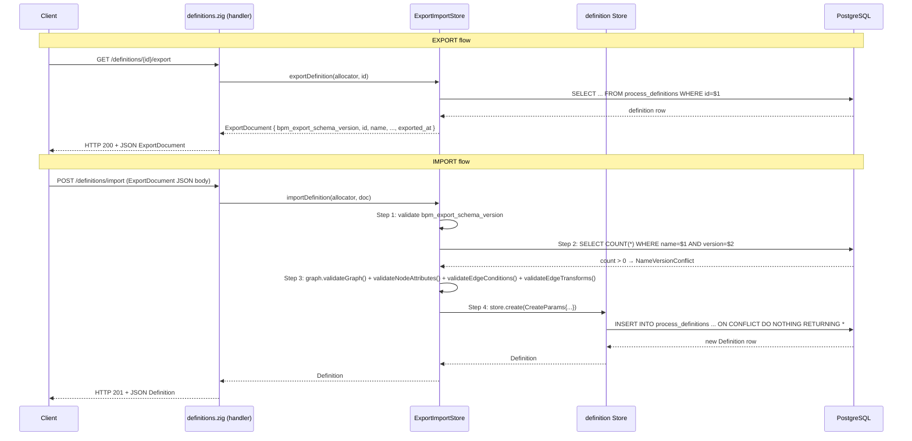

# Module: definition/export-import

**Covers:** PD-09
**Files:** `src/definition/export_import.zig`, `src/api/routes/definitions.zig` (handler stubs)

---

## Module purpose

Enable migration of process definitions between environments (dev → staging → prod) by
providing a self-contained JSON export format and a corresponding import endpoint.
Export serialises a definition (graph + metadata) plus an export schema version tag.
Import reverses the process: validates the document, re-runs graph validation, and
creates a new DRAFT definition with a platform-assigned UUID.

---

## Public interface

### Types

```zig
/// Self-contained export document produced by exportDefinition() and consumed
/// by importDefinition().
pub const ExportDocument = struct {
    /// Always "bpm/definition/v1" for this platform version.
    bpm_export_schema_version: []const u8,
    /// Source definition UUID (informational; NOT re-used on import).
    id: Uuid,
    name: []const u8,
    version: []const u8,
    description: []const u8,
    graph: DefinitionGraph,
    /// UTC ISO8601 timestamp, e.g. "2026-05-21T00:00:00Z".
    exported_at: []const u8,
};
```

### Functions

```zig
/// Export a definition by UUID. Works for any status (DRAFT, ACTIVE, DEPRECATED,
/// ARCHIVED). Returns DefinitionNotFound if the id does not exist.
pub fn exportDefinition(
    self: *ExportImportStore,
    allocator: std.mem.Allocator,
    definition_id: Uuid,
) ExportImportError!ExportDocument;

/// Import a definition from an ExportDocument following the algorithm:
///   1. Schema version check (reject unsupported versions → HTTP 422)
///   2. Name+version uniqueness check (→ HTTP 409 if exists)
///   3. Graph re-validation (structural + node attributes + edge conditions + transforms)
///   4. Store.create() with status DRAFT (platform assigns new UUID)
pub fn importDefinition(
    self: *ExportImportStore,
    allocator: std.mem.Allocator,
    doc: ExportDocument,
) ExportImportError!Definition;
```

### Error taxonomy

```zig
pub const ExportImportError = error{
    DefinitionNotFound,      // HTTP 404 — export target does not exist
    NameVersionConflict,      // HTTP 409 — import duplicates existing name+version
    UnknownSchemaVersion,     // HTTP 422 — unsupported bpm_export_schema_version
    InvalidGraph,             // HTTP 422 — graph failed structural/attribute/condition validation
    PoolExhausted,            // HTTP 503
    DatabaseError,            // HTTP 500
};
```

---

## Data flow diagram



---

## Key invariants

1. **Export is read-only.** No state is modified; all statuses can be exported.
2. **Import always creates a new definition.** The source UUID in the export document is informational — the platform always assigns a fresh UUID.
3. **Import re-runs the full validation pipeline** (PD-02 structural checks, PD-05 node attribute validation, PD-06 edge condition validation, edge transform validation). It must not short-circuit validation.
4. **Idempotency by name+version.** If a definition with the same (name, version) already exists in the same tenant, import returns HTTP 409 before any write.
5. **Schema version is strict.** `bpm_export_schema_version` must exactly match `EXPORT_SCHEMA_VERSION`. No partial or "compatible" matching — this prevents silent data corruption across platform upgrades.
6. **No SQL string interpolation.** All user-supplied values bind via `$N` placeholders.

---

## State transitions

Import creates a definition in **DRAFT** status only. The imported definition follows the standard lifecycle (PD-04):

```
DRAFT → ACTIVE → DEPRECATED → ARCHIVED
```

No special lifecycle rules apply to imported definitions.

---

## Dependencies

| Depends on | Direction | Notes |
|---|---|---|
| `graph.zig` (validateGraph, validateNodeAttributes, validateEdgeConditions, validateEdgeTransforms) | calls | Graph validation pipeline |
| `store.zig` (Store.create) | calls | DB insert with validation and UUID assignment |
| `pool.zig` | calls | DB connection |
| `api/middleware/auth.zig` | middleware | Export/import requires authenticated session |
| `api/middleware/rbac.zig` | middleware | PROCESS_DESIGNER or PLATFORM_ADMIN role required |

---

## Open questions

None. The design is fully specified by PD-09 AC.

---

## HTTP interface (for handler reference)

### GET /api/v1/definitions/{id}/export

| Aspect | Value |
|---|---|
| Success | HTTP 200, body: ExportDocument JSON |
| Not found | HTTP 404 `{"error": "not_found"}` |
| Invalid UUID | HTTP 422 `{"error": "invalid_id_format"}` |
| Auth required | Yes (Bearer token) |
| Role required | PROCESS_DESIGNER or PLATFORM_ADMIN |

### POST /api/v1/definitions/import

| Aspect | Value |
|---|---|
| Request body | ExportDocument JSON |
| Success | HTTP 201, body: Definition JSON |
| Unknown schema version | HTTP 422 `{"error": "unknown_schema_version"}` |
| Name+version conflict | HTTP 409 `{"error": "name_version_conflict"}` |
| Graph validation failed | HTTP 422 + violations array |
| Auth required | Yes (Bearer token) |
| Role required | PROCESS_DESIGNER or PLATFORM_ADMIN |
| Idempotent | Yes (by name+version; HTTP 409 on duplicate) |
