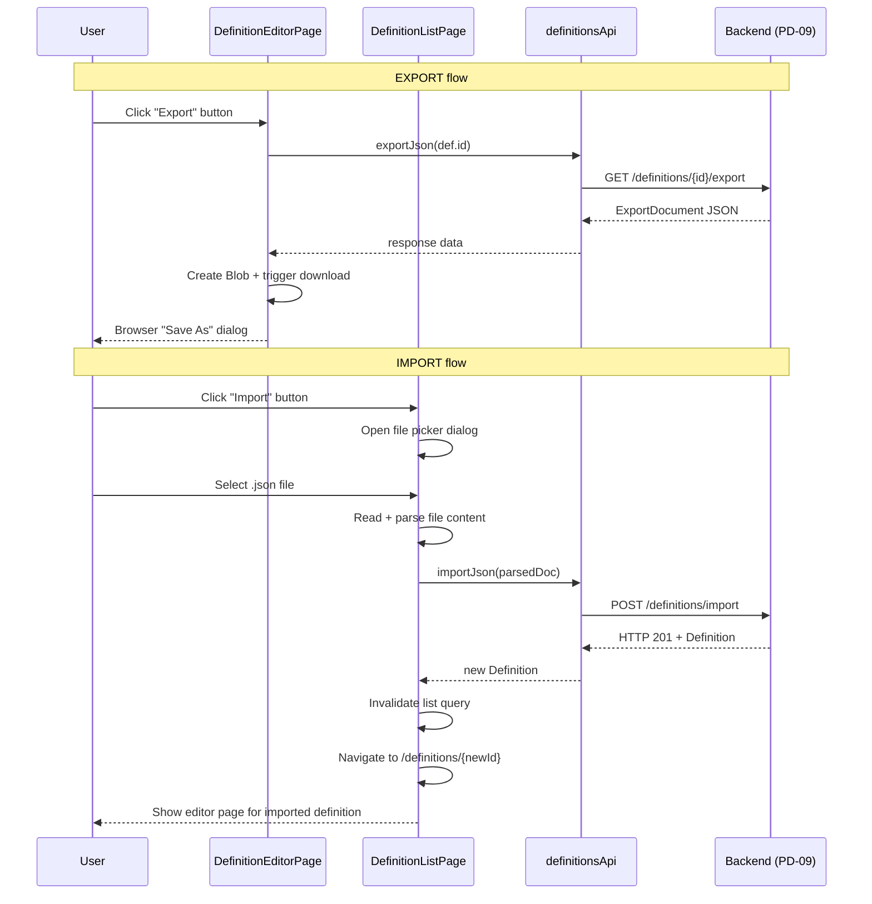

# Module: pd-ui-07 — Export/Import buttons

**Covers:** PD-UI-07
**Files:** `web/src/pages/definitions/DefinitionEditorPage.tsx` (Export button),
          `web/src/pages/definitions/DefinitionListPage.tsx` (Import button + dialog),
          `web/src/api/definitions.ts` (API methods — already present)

---

## Module purpose

Add UI affordances for the PD-09 export/import endpoints:
- **Export button** on the definition editor page — downloads the definition as a
  self-contained JSON file.
- **Import button** on the definition list page — opens a file picker, uploads a
  previously exported JSON file, and navigates to the newly imported definition.

---

## Public interface

### API methods (already present in `definitions.ts`)

```typescript
// Trigger download of export JSON for a given definition id
definitionsApi.exportJson(id: string): Promise<unknown>

// Upload an export document and create a new definition
definitionsApi.importJson(body: unknown): Promise<ProcessDefinition>
```

### Component additions

**DefinitionEditorPage.tsx** — Add an Export button in the toolbar area (alongside
the Save button). On click:
1. Call `definitionsApi.exportJson(def.id)`
2. Serialise the response as a JSON blob
3. Trigger browser download via `URL.createObjectURL` + temporary `<a>` element
4. Show success toast on completion, error toast on failure

```typescript
// Pseudo-signature:
handleExport(id: string): Promise<void>
// Downloads: "definition-{name}-{version}.json"
```

**DefinitionListPage.tsx** — Add an Import button in the filter bar area (next to
"+ New Definition"). On click:
1. Open a hidden `<input type="file" accept=".json">`
2. On file selection, parse the JSON
3. Call `definitionsApi.importJson(parsed)`
4. On success (HTTP 201): show success toast, invalidate definition list query,
   navigate to the new definition editor page
5. On error (HTTP 422/409): show error dialog with server message

```typescript
// Pseudo-signature:
handleImport(): Promise<void>
// Opens file picker → reads file → calls API → navigates on success
```

---

## Data flow diagram



---

## Error taxonomy

The Export button and Import button both rely on backend API calls that can fail. Below are the error states the UI must handle:

| Error | Cause | UI behaviour |
|---|---|---|
| HTTP 422 (Validation) | Backend rejects malformed UUID (export) or unknown schema version / graph validation failure (import) | Show error toast with server error message |
| HTTP 409 (Conflict) | Name+version already exists (import) | Show error dialog: "A definition with name '{name}' version '{version}' already exists" |
| HTTP 401/403 (Auth/RBAC) | User lacks PROCESS_DESIGNER or PLATFORM_ADMIN role | Button is hidden entirely (role-gated); if session expires mid-session, redirect to login |
| HTTP 404 (Not Found) | Definition deleted between page load and export click | Show error toast "Definition not found" |
| Network failure | Connection lost, DNS failure, backend unreachable | Show error toast "Network error — check your connection" |
| File parse error (import) | Selected `.json` file is not valid JSON or does not match ExportDocument shape | Show error dialog "Invalid file — expected a BPM export JSON file" |
| File read error (import) | Browser FileReader fails | Show error toast "Could not read file" |

---

## Key invariants

1. **Export button is always visible** for any definition (regardless of status).
2. **Import triggers navigation** to the new definition editor so the user can
   review and adjust the imported definition immediately.
3. **Role-gating**: Both Export and Import require PROCESS_DESIGNER or
   PLATFORM_ADMIN role. If the user lacks the role, the buttons are hidden
   entirely (not disabled).
4. **File format**: Only `.json` files accepted by the import file picker.
5. **No raw `fetch`**: All API calls go through `src/api/client.ts` per
   frontend developer guide §3.

---

## Dependencies

| Depends on | Direction | Notes |
|---|---|---|
| `src/api/definitions.ts` (exportJson, importJson) | calls | Already implemented |
| Backend PD-09 endpoints | network | `GET /definitions/{id}/export`, `POST /definitions/import` |
| `src/hooks/useDefinitions.ts` | calls | For `useDefinition` and list query invalidation |
| `src/components/ui/Toast.tsx` | calls | Success/error feedback |
| `src/auth/useAuth.ts` (useHasRole) | calls | Role gating |

---

## Open questions

None. The design is fully specified by PD-UI-07 and PD-09.
