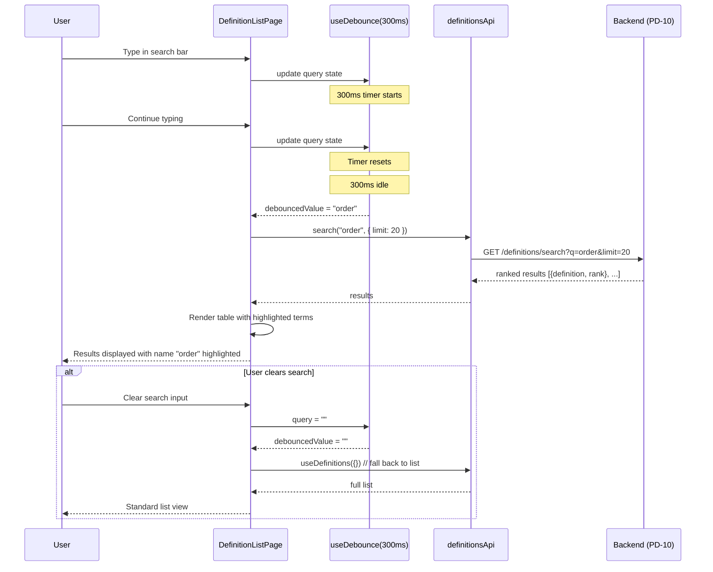

# Module: pd-ui-08 — Debounced full-text search

**Covers:** PD-UI-08
**Files:** `web/src/pages/definitions/DefinitionListPage.tsx` (search bar — already present),
          `web/src/hooks/useDefinitions.ts` (query hook — already present),
          `web/src/api/definitions.ts` (API — already present)

---

## Module purpose

Enhance the existing definition list search bar with client-side debounce (300 ms)
and search result highlighting. The search bar queries the PD-10 backend endpoint
(`GET /definitions/search?q=`) instead of the current client-side name filter.

---

## Public interface

### Changes to existing components

**DefinitionListPage.tsx** — Replace the current `useDefinitions`-based inline
`ILIKE name filter` with a debounced search against the PD-10 search endpoint.

Current behaviour (to replace):
- `useDefinitions({ name: search })` — client passes name as a filter to the
  list endpoint, which does `name ILIKE '%query%'`

Target behaviour:
- A new `useDefinitionSearch(query)` hook calls `GET /definitions/search?q=query`
  with 300 ms debounce
- Results are displayed in the same table format, replacing list results when a
  non-empty query is active
- When the query is empty, fall back to the regular list view (useDefinitions)

### New hook: `useDefinitionSearch`

```typescript
// Pseudo-signature:
function useDefinitionSearch(query: string, options?: { limit?: number; offset?: number }) {
  return useQuery({
    queryKey: ['definitions', 'search', query, limit, offset],
    queryFn: () => definitionsApi.search(query, { limit, offset }),
    enabled: query.trim().length > 0,
    // Debounce: skip fetching until the user stops typing for 300ms
    // Implemented via the debounced query value passed into the hook
  })
}
```

### Debounce implementation

Use a simple `useState` + `useEffect` + `setTimeout` pattern (or a dedicated
`useDebounce` utility hook) to delay the search query value:

```typescript
// Pseudo-signature:
function useDebounce<T>(value: T, delayMs: number): T
// Returns the debounced value after `delayMs` of inactivity
```

### Search result highlighting

When displaying search results, highlight matching substrings in the `name` and
`description` columns. Use a simple `highlightText` utility:

```typescript
// Pseudo-signature:
function highlightText(text: string, query: string): React.ReactNode
// Wraps matching substrings in <mark> tags with a yellow background
```

---

## Data flow diagram



---

## Error taxonomy

The search bar depends on the PD-10 backend endpoint and must gracefully handle the following errors:

| Error | Cause | UI behaviour |
|---|---|---|
| HTTP 4xx (Client error) | Malformed query, invalid pagination parameters | Show error toast "Search failed — try a different query" |
| HTTP 500 (Server error) | Backend search is unavailable or crashed | Show error toast "Search unavailable — showing full list" and fall back to the regular list view |
| Network failure | Connection lost, DNS failure, backend unreachable | Show error toast "Network error — search results may be incomplete" and keep the last successful results displayed (stale data) |
| Empty results (non-error) | No definitions match the query | Show "No results found for '{query}'" in the table body (this is the expected behaviour, not an error) |

---

## Key invariants

1. **Debounce value = 300 ms.** No search request is sent until the user stops
   typing for 300 ms. This prevents flooding the backend with keystroke-level
   requests.
2. **Empty query falls back to the list endpoint.** When the search bar is empty,
   the page shows the standard paginated definition list (PD-UI-01 behaviour).
3. **Search results replace list results in the same table.** The same table
   component is used for both list and search results; columns are identical.
4. **Highlighting is visual only.** Matching substrings in `name` and
   `description` are wrapped in `<mark>` with a yellow background. The
   underlying data is unchanged.
5. **Search is case-insensitive.** Both the query and the text are lowercased
   before matching for highlight purposes (backend ILIKE is already
   case-insensitive).
6. **No raw `fetch`.** All API calls go through `src/api/client.ts`.

---

## Dependencies

| Depends on | Direction | Notes |
|---|---|---|
| `src/api/definitions.ts` (search method — needs addition via `definitionsApi.search`) | calls | New API method for `GET /definitions/search` |
| Backend PD-10 endpoint | network | `GET /definitions/search?q=&limit=&offset=` |
| `src/hooks/useDefinitions.ts` | calls | Existing list query for fallback |
| `src/components/ui/Toast.tsx` | calls | Error feedback if search fails |

---

## Open questions

None. The design is fully specified by PD-UI-08 and PD-10.
