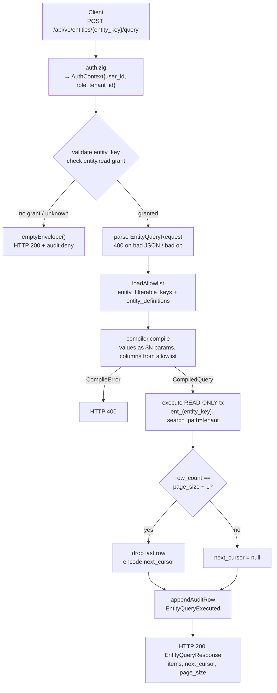

# Module: qry-01-04-entity-query

**Covers:** QRY-01, QRY-02, QRY-03, QRY-04  
**Files:** `src/api/routes/entity_query.zig` (new), `src/entities/query/compiler.zig` (new), `src/entities/query/allowlist.zig` (new), `src/entities/query/cursor.zig` (new), `src/entities/query/types.zig` (new)  
**Migrations:** `migrations/1152_qry_filterable_keys.sql` (new — adds `entity_filterable_keys` table)  
**Depends on:** `src/api/pagination.zig` (API-06), `src/api/response.zig`, `src/api/middleware/auth.zig`, `src/entities/definition.zig` (EXP-201), `src/obs/audit.zig` (OBS-03), `src/db/pool.zig`  
**Related:** QRY-05 (field-level stripping, future), EXP-203 (typed projection tables `ent_<entity_key>`), TNT-01, IDN-05, ADP-09

---

## Module purpose

This module exposes the structured entity query surface required by QRY-01–QRY-04. It provides a single POST endpoint (`POST /api/v1/entities/{entity_key}/query`) that accepts a filter/sort/pagination DSL, compiles it to a fully-parameterised SQL statement against the caller's tenant-scoped `ent_{entity_key}` typed projection table, and returns a keyset-paged result envelope.

Security properties are structural, not defensive:
- Every filter value is bound as a positional parameter ($N) — the compiler never concatenates values into SQL text.
- Every column or JSONB key reference is resolved from the allowlist before emission — undeclared identifiers cannot reach the statement.
- The operator and direction enums are closed; the compiler maps from them to SQL literals, never passes client text through.
- For an `entity_key` the caller has no `entity.read` grant on (or that does not exist), the handler returns the empty envelope immediately from the registry lookup — the `ent_` table is never touched.

---

## Classification per templates/lego-catalog.md

| Requirement | Classification | Rationale |
|---|---|---|
| QRY-01 Structured entity query surface | **Type E** | Novel cross-cutting module: new DSL, query compiler, SQL generator, handler, audit event. No existing template covers query compilers. |
| QRY-02 Declared filterable field allowlist | **Type E** | Novel allowlist table and compiler integration; no CRUD-endpoint template applies. |
| QRY-03 Keyset pagination | **Type E** | Multi-column keyset cursor with sort-fingerprint validation; extends API-06 pattern but differs from it substantially. |
| QRY-04 Empty envelope for unauthorised entity types | **Type E** | Novel authorisation-first decision path that bypasses the normal RBAC 403/404 flow. |

No Type A–D parameter files are emitted. All four requirements are Type E novel/cross-cutting work and are covered by this single artefact.

---

## Public interface

### 1. DSL types (`src/entities/query/types.zig`)

`FilterOp` is a closed enum; the compiler maps each tag to a SQL operator string — no client-supplied operator string ever reaches SQL text. `contains` maps to `ILIKE '%' || $N || '%'` and is rejected for non-text storage types. `FilterNode.field` is used only as an allowlist lookup key, never interpolated into SQL. `FilterNode.value` is always bound as a positional `$N` parameter. `EntityQueryRequest.sort` accepts at most 2 nodes; more returns HTTP 400 `too_many_sort_fields`. `EntityQueryRequest.page_size` defaults to 50 when absent; maximum is 200. `EntityQueryResponse.page_size` echoes the effective value used (50 when the request omits `page_size`; the supplied value otherwise).

```zig
pub const FilterOp = enum { eq, neq, lt, lte, gt, gte, in, contains };

pub const SortDir = enum { asc, desc };

pub const FilterNode = struct {
    field: []const u8,
    op:    FilterOp,
    value: []const u8,
};

pub const SortNode = struct {
    field: []const u8,
    dir:   SortDir,
};

pub const EntityQueryRequest = struct {
    filters:   []FilterNode,
    sort:      []SortNode,
    page_size: ?u16,
    cursor:    ?[]const u8,
};

pub const EntityQueryResponse = struct {
    items:       []std.json.Value,
    next_cursor: ?[]const u8,
    page_size:   u16,
};
```

### 2. Allowlist types (`src/entities/query/allowlist.zig`)

`typed_column` resolves to a double-quoted SQL identifier (`"<name>"`); `jsonb_key` resolves to `payload ->> '<key>'` with the declared storage type cast. `loadAllowlist` reads `entity_filterable_keys` and merges typed-column names from the `entity_definitions` snapshot; typed columns shadow any same-name JSONB key (QRY-02). Returns an empty allowlist when `entity_key` is not registered. `EntityAllowlist.find` returns `null` when the field is not allowlisted.

```zig
pub const ColumnKind = enum { typed_column, jsonb_key };

pub const FieldStorageType = enum { text, numeric, boolean, timestamptz };

pub const AllowlistedField = struct {
    name:         []const u8,
    kind:         ColumnKind,
    storage_type: FieldStorageType,
};

pub const EntityAllowlist = struct {
    fields: []AllowlistedField,
    pub fn find(self: *const EntityAllowlist, name: []const u8) ?AllowlistedField;
};

pub const AllowlistError = error{ DbError, OutOfMemory };

pub fn loadAllowlist(
    allocator:  std.mem.Allocator,
    tx:         *db.Tx,
    tenant_id:  [16]u8,
    entity_key: []const u8,
) AllowlistError!EntityAllowlist;
```

### 3. Query compiler (`src/entities/query/compiler.zig`)

`compile` executes in 9 steps: (1) validate `page_size` (default 50, max 200); (2) validate sort node count (≤ 2); (3) decode cursor and check sort fingerprint; (4) for each `FilterNode`: resolve field from allowlist, validate op/type compatibility, bind value as `$N`; (5) for each `SortNode`: resolve from allowlist, append to ORDER BY; (6) append `record_id` as final ORDER BY term (direction of first sort node, or ASC when none); (7) if cursor present: append keyset WHERE predicate; (8) set LIMIT = page_size + 1; (9) return `CompiledQuery`. `table` is the pre-validated `ent_{entity_key}` identifier — never derived from client text. `OperatorNotRecognised` is re-checked here as defence-in-depth. `OperatorNotValidForType` fires for e.g. `contains` on a `numeric` field.

```zig
pub const CompiledQuery = struct {
    sql:         []const u8,
    params:      [][]const u8,
    param_count: usize,
};

pub const CompileError = error{
    OperatorNotRecognised,
    FilterFieldNotAllowlisted,
    OperatorNotValidForType,
    TooManySortFields,
    PageSizeExceedsMax,
    CursorMalformed,
    CursorSortMismatch,
    OutOfMemory,
};

pub fn compile(
    allocator: std.mem.Allocator,
    table:     []const u8,
    allowlist: EntityAllowlist,
    request:   EntityQueryRequest,
) CompileError!CompiledQuery;
```

### 4. Keyset cursor (`src/entities/query/cursor.zig`)

Raw cursor format (before base64url): `QE:<issued_at_us>:<fingerprint>:<col1>|<col2>|…`. The `QE:` prefix rejects cursors from other endpoints. `SortFingerprint.value` is encoded as e.g. `"created_at:desc,record_id:desc"`. `QueryCursor.tuple` holds one value per ORDER BY term (including the appended `record_id`); `|` in a value is percent-encoded. `decodeCursor` validates: (1) valid base64url; (2) `QE:` prefix present; (3) issued-at within 24 h; (4) tuple field count matches ORDER BY term count; (5) sort fingerprint matches current request's sort.

```zig
pub const SortFingerprint = struct {
    value: []const u8,
};

pub const QueryCursor = struct {
    fingerprint:  SortFingerprint,
    tuple:        [][]const u8,
    issued_at_us: i64,
    allocator:    std.mem.Allocator,
    pub fn deinit(self: *const QueryCursor) void;
};

pub const CursorDecodeError = error{ CursorMalformed, CursorSortMismatch, OutOfMemory };

pub fn encodeCursor(
    allocator:    std.mem.Allocator,
    fingerprint:  SortFingerprint,
    tuple:        [][]const u8,
    issued_at_us: i64,
) error{OutOfMemory}![]u8;

pub fn decodeCursor(
    allocator:      std.mem.Allocator,
    encoded:        []const u8,
    fingerprint:    SortFingerprint,
    order_by_count: usize,
) CursorDecodeError!QueryCursor;
```

### 5. HTTP handler (`src/api/routes/entity_query.zig`)

`handleEntityQuery` decision sequence: (1) validate `entity_key` path param (`[a-z][a-z0-9_]*`, ≤128 chars; 400 `invalid_entity_key` if malformed); (2) check `entity.read` grant — on no-grant or unknown `entity_key`: return `emptyEnvelope()` + audit QRY-04; (3) parse body → `EntityQueryRequest` (400 on bad JSON / unknown op); (4) load allowlist for `(tenant_id, entity_key)`; (5) compile query (400 on `CompileError`); (6) execute in read-only tx; (7) detect next page and encode cursor; (8) append `EntityQueryExecuted` audit; (9) return 200. `emptyEnvelope()` returns the constant `{"items":[],"next_cursor":null,"page_size":50}` — byte-identical regardless of deny reason. The `page_size` field is always the default constant (50); deny and unknown-entity responses never reflect a non-default requested value (probe-safety: a caller cannot distinguish the deny path from the zero-rows granted path by requesting a non-default page size).

```zig
pub const EntityQueryDeps = struct {
    pool:      *db.Pool,
    allocator: std.mem.Allocator,
};

pub fn handleEntityQuery(
    deps:       EntityQueryDeps,
    auth:       AuthContext,
    entity_key: []const u8,
    body_json:  []const u8,
) HandlerResult;

fn emptyEnvelope() HandlerResult;
```

---

## Data flow diagram



---

## Allowlist table schema (`migrations/1152_qry_filterable_keys.sql`)

```sql
-- Per-entity declared JSONB keys that may appear in filters/sorts.
-- Typed projection columns are not stored here; they are read from
-- entity_definitions at allowlist load time and shadow same-name keys.
CREATE TABLE IF NOT EXISTS entity_filterable_keys (
    id              UUID        PRIMARY KEY DEFAULT gen_random_uuid(),
    tenant_id       UUID        NOT NULL,
    entity_key      TEXT        NOT NULL,
    key_name        TEXT        NOT NULL,
    storage_type    TEXT        NOT NULL
                                CHECK (storage_type IN ('text','numeric','boolean','timestamptz')),
    created_at      TIMESTAMPTZ NOT NULL DEFAULT NOW(),
    updated_at      TIMESTAMPTZ NOT NULL DEFAULT NOW(),

    CONSTRAINT uq_efk_tenant_entity_key UNIQUE (tenant_id, entity_key, key_name)
);

CREATE INDEX IF NOT EXISTS idx_efk_tenant_entity
    ON entity_filterable_keys (tenant_id, entity_key);
```

**Invariant:** An `entity_filterable_keys` row whose `key_name` matches a typed column name in the corresponding `entity_definitions` row is rejected at declaration time with error `jsonb_key_shadows_typed_column` (QRY-02 AC: "rejects … at declaration time"). This check lives in the admin API that manages `entity_filterable_keys`, not in the query handler.

---

## Typed projection table contract (`ent_{entity_key}`)

EXP-203 generates one table per entity type per tenant. The query handler reads but never writes these tables. Required columns the compiler may always reference:

| Column | SQL type | Notes |
|---|---|---|
| `record_id` | UUID | Primary key; always appended to ORDER BY |
| `tenant_id` | UUID | Equality-filtered at row level (defence-in-depth; outer RLS also applies) |
| `created_at` | TIMESTAMPTZ | Typed column; always allowlisted |
| `updated_at` | TIMESTAMPTZ | Typed column; always allowlisted |

Additional typed columns are declared in `entity_definitions.definition_json.fields` where `queried = true`. JSONB keys are in `entity_filterable_keys`.

---

## Query authorisation and grant model (QRY-04)

The `entity.read` grant is resolved from the existing `role_permissions` / `user_roles` tables before the handler opens any DB transaction against `ent_*`. The authorisation check is a two-phase lookup:

```
Phase 1: Is entity_key registered in entity_definitions for this tenant?
         (SELECT count(*) FROM entity_definitions WHERE tenant_id = $1 AND name = $2 AND status = 'ACTIVE')

Phase 2: Does the caller hold entity.read for this entity_key?
         (resolved from the caller's role + per-entity-key permission rows; details are part of the IDN-05 grant model)
```

Both "not registered" and "no grant" produce the **identical** `emptyEnvelope()` response — no timing side-channel is introduced because both cases execute the same constant-time code path (the `ent_` table is never queried in either case).

The `emptyEnvelope` response body is the constant string `{"items":[],"next_cursor":null,"page_size":50}`. It is a compile-time constant, not a dynamically-built value, so the byte content is guaranteed identical across both paths.

**Probe-safety:** The `page_size` field in deny and unknown-entity responses is always the default constant 50. It does not echo a non-default value supplied in the request body. A caller that sends `page_size:100` and receives back `page_size:50` cannot draw any inference: a granted caller with zero matching rows also returns `page_size:50` (the effective default). This ensures the three cases — deny, unknown `entity_key`, and granted+zero-rows — are structurally indistinguishable.

---

## SQL injection defence (QRY-01, QRY-02)

Three layers working together:

### Layer 1 — Operator/direction enum mapping
The compiler holds a static `fn filterOpToSql(op: FilterOp) []const u8` that maps from the closed `FilterOp` enum to a literal SQL string. The client never supplies the operator string; it supplies a JSON string that is mapped to the enum at parse time, and then the enum is mapped to SQL by the compiler. No switch fall-through or default case exists.

### Layer 2 — Column reference allowlist
The SQL column expression (typed column identifier or `payload ->> '<key>'`) is produced by the compiler from the `AllowlistedField` struct returned by the allowlist lookup. The client-supplied `field` string is used only as a lookup key into the allowlist; the compiler emits the SQL text from `AllowlistedField.name` (double-quoted for typed columns) or the literal string `payload ->> $KEY` where `$KEY` is the `key_name` stored in `entity_filterable_keys` — not the client-supplied string.

### Layer 3 — Value binding
Every filter value and every cursor tuple value is passed to the DB driver as a positional parameter (`$1`, `$2`, …). The `CompiledQuery.params` slice is passed separately from `CompiledQuery.sql`; they are never concatenated.

---

## Keyset cursor scheme (QRY-03)

### Cursor encoding

The ordered tuple from the last row (one value per ORDER BY term, including the appended `record_id`) is serialised as:

```
QE:<issued_at_us>:<fingerprint>:<val1>|<val2>|…
```

- `QE:` — endpoint prefix; a cursor from a different endpoint is rejected with `cursor_malformed`.
- `<issued_at_us>` — wall-clock µs; cursors older than 24 h are treated as malformed (CursorMalformed).
- `<fingerprint>` — URL-safe encoding of `sort_field1:dir1,sort_field2:dir2,…,record_id:dir` (the full effective ORDER BY). A follow-up request with a different sort produces `cursor_sort_mismatch`.
- `<val1>|<val2>|…` — pipe-separated column values from the last row. `|` in a value is percent-encoded.

The whole string is base64url-encoded (no padding) before returning to the client.

### Keyset predicate

For ORDER BY `(a ASC, record_id ASC)` and a cursor tuple `(v_a, v_id)`:

```sql
WHERE (a > $N) OR (a = $N AND record_id > $M)
```

For a three-term ORDER BY `(a DESC, b ASC, record_id DESC)` and cursor `(v_a, v_b, v_id)`:

```sql
WHERE (a < $1)
   OR (a = $1 AND b > $2)
   OR (a = $1 AND b = $2 AND record_id < $3)
```

The compiler generates the predicate programmatically from the effective ORDER BY slice; no hard-coded column names appear in the keyset expansion logic.

### page_size + 1 trick

The compiler always emits `LIMIT (page_size + 1)`. The handler:
- If `row_count == page_size + 1`: drops the last row from `items`, encodes the ordered tuple of the second-to-last row as `next_cursor`.
- If `row_count ≤ page_size`: sets `next_cursor = null`.

### Sort node cap

At most 2 client-supplied sort nodes are accepted. The compiler returns `CompileError.TooManySortFields` (→ HTTP 400 `too_many_sort_fields`) when `request.sort.len > 2`.

---

## Audit event: EntityQueryExecuted

Appended via `obs/audit.zig :: appendAuditRowWithChainInTx` inside the handler's DB transaction.

```zig
pub const EntityQueryExecutedPayload = struct {
    entity_key:         []const u8,
    /// Names of the filter fields only — NOT the filter values.
    filter_field_names: [][]const u8,
    /// Names of the sort fields.
    sort_field_names:   [][]const u8,
    /// Number of rows returned to the client (after the +1 row is dropped).
    row_count:          u32,
    /// page_size used in this query.
    page_size:          u16,
    /// True if this was a cursor-continuation request.
    has_cursor:         bool,
};
```

For QRY-04 (empty-envelope path), a separate audit entry is appended instead:

```zig
pub const EntityQueryDeniedPayload = struct {
    entity_key:  []const u8,
    /// "not_registered" | "no_grant" — the internal reason.
    /// Both produce identical HTTP responses but are distinguishable in audit.
    deny_reason: []const u8,
};
```

Both audit entries carry the standard `actor_id`, `tenant_id`, `resource_id = entity_key`, and `action = "entity.query"` fields from the OBS-03 audit chain schema.

---

## Error taxonomy

| Error code | HTTP | When |
|---|---|---|
| `operator_not_recognised` | 400 | `op` value outside the `FilterOp` enum |
| `filter_field_not_allowlisted` | 400 | Field not in typed columns or `entity_filterable_keys` |
| `operator_not_valid_for_type` | 400 | e.g. `contains` on a `numeric` field |
| `page_size_exceeds_max` | 400 | `page_size > 200`; body carries `"max": 200` |
| `too_many_sort_fields` | 400 | More than 2 client-supplied sort nodes |
| `cursor_malformed` | 400 | Non-base64url, wrong prefix, expired, tuple decode failure |
| `cursor_sort_mismatch` | 400 | Cursor fingerprint ≠ current request sort |
| `invalid_entity_key` | 400 | `entity_key` path param fails `[a-z][a-z0-9_]*` or exceeds 128 chars |
| *(none — empty envelope)* | 200 | Unknown entity_key or no `entity.read` grant (QRY-04) |

No HTTP 403 or HTTP 404 is returned by this endpoint (QRY-04 invariant).

---

## State transitions

This module is read-only. It has no state machine. The only write is the audit entry.

---

## Tenant isolation

The handler:
1. Constructs the table name as `ent_` + `entity_key` where `entity_key` has been validated to match `[a-z][a-z0-9_]*` and been looked up in `entity_definitions WHERE tenant_id = $caller_tenant_id`. The caller can never reach a table outside their tenant schema.
2. Executes the query with `search_path` set to the caller's tenant schema and `public`, following the existing TNT-01/DB-03 pattern.
3. A defence-in-depth `WHERE tenant_id = $1` predicate is appended to every compiled query; the parameter is the caller's `tenant_id` from `AuthContext`, never a client-supplied value.

---

## Dependencies

| Module | Symbol used | Direction |
|---|---|---|
| `src/db/pool.zig` | `Pool`, `Tx` | Query compiler / handler execute SQL |
| `src/api/response.zig` | `HandlerResult`, `ok`, `errorResult` | Handler response construction |
| `src/api/middleware/auth.zig` | `AuthContext` | Caller identity + tenant_id |
| `src/entities/definition.zig` | typed column list from `entity_definitions` | Allowlist loader reads definition |
| `src/obs/audit.zig` | `appendAuditRowWithChainInTx` | Append audit entries |
| `src/api/pagination.zig` | `MAX_PAGE_SIZE`, `DEFAULT_PAGE_SIZE`, `validatePageSize` | page_size constants and validation |
| `std.base64.url_safe_no_pad` | encode/decode | Cursor base64url |

**Must NOT depend on:** `src/engine/`, `src/definition/`, `src/tasks/`, `src/webhooks/`. The entity query module is strictly a read surface over EXP-203 projection tables; it has no coupling to the process engine.

---

## Open questions

None. All requirement acceptance criteria are addressed by the design above.

- QRY-05 (field-level stripping) is referenced in QRY-04 but is a separate requirement not in scope here. The `EntityQueryResponse.items` slice is not stripped by this module; QRY-05 will add a post-execution stripping pass.
- The exact grant-check query for `entity.read` depends on the IDN-05 per-entity permission model; the handler calls an opaque `entity_grants.hasReadGrant` function whose implementation is part of IDN-05 scope.
