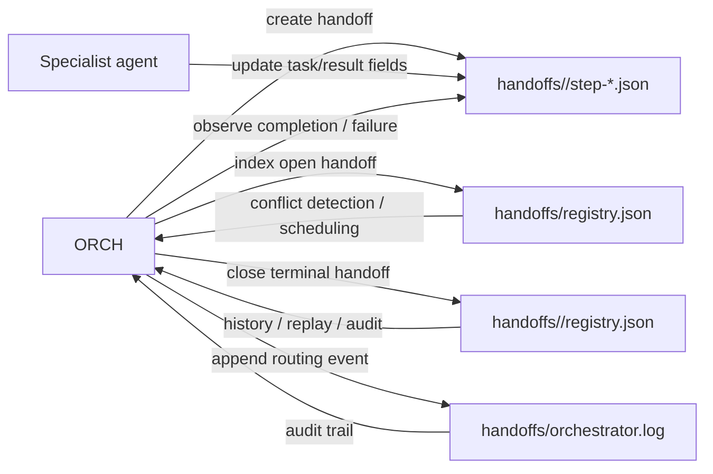
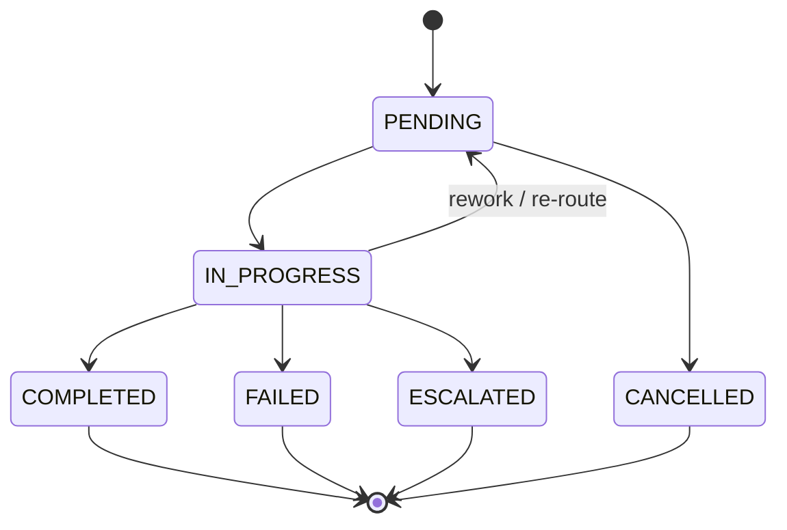

# Module: registry_layout

**Covers:** ORCH handoff registry split and compatibility plan
**Files:** `handoffs/registry.json`, `handoffs/<run_id>/registry.json`, `handoffs/orchestrator.log`, `docs/agents/AGENT_SYSTEM.md`, `docs/agents/ORCHESTRATOR.md`, `docs/agents/functions/fn-create-handoff.md`, `docs/agents/functions/fn-register-handoff.md`

---

## Module purpose

This design splits handoff registry state into two scopes so the system stops treating `handoffs/registry.json` as a single ever-growing history file. `handoffs/registry.json` becomes the small working index for currently open handoffs only, while `handoffs/<run_id>/registry.json` becomes the durable per-run history for completed or otherwise terminal handoffs. The goal is to keep conflict detection and routing fast for ORCH, preserve a complete audit trail for each run, and avoid destructive data movement during migration.

---

## Public interface

### Shared types

```zig
pub const RegistryScope = enum {
    active,
    run_archive,
};

pub const RegistryStatus = enum {
    PENDING,
    IN_PROGRESS,
    COMPLETED,
    FAILED,
    ESCALATED,
    CANCELLED,
};

pub const RegistryEntry = struct {
    handoff_id:  []const u8,
    run_id:      []const u8,
    workflow_id: ?[]const u8,
    step:        []const u8,
    from_agent:  []const u8,
    to_agent:    []const u8,
    file:        []const u8,
    created_at:  []const u8,
    started_at:  ?[]const u8,
    completed_at: ?[]const u8,
    status:      RegistryStatus,
    stage:       ?[]const u8,
};

pub const ActiveRegistryFile = struct {
    schema_version: u8,
    created_at:     []const u8,
    last_updated:   []const u8,
    entries:        []RegistryEntry,
};

pub const RunRegistryFile = struct {
    schema_version: u8,
    run_id:         []const u8,
    created_at:     []const u8,
    last_updated:   []const u8,
    entries:        []RegistryEntry,
};
```

### ORCH-facing operations

```zig
pub const RegistryLayoutError = error{
    RegistryFileMissing,
    RegistryFileInvalid,
    RegistrySchemaMismatch,
    HandoffFileMissing,
    HandoffRecordMissing,
    DuplicateHandoffId,
    DuplicateRunEntry,
    StatusTransitionInvalid,
    AtomicWriteFailed,
    ReconciliationRequired,
};

/// Write or refresh the active registry entry for an open handoff.
/// The active registry is the scheduling index, so it only keeps non-terminal work.
pub fn upsertActiveEntry(
    allocator: std.mem.Allocator,
    active_registry_path: []const u8,
    entry: RegistryEntry,
) RegistryLayoutError!void;

/// Remove a terminal handoff from the active registry and append its final snapshot
/// to the per-run registry archive.
pub fn archiveClosedEntry(
    allocator: std.mem.Allocator,
    active_registry_path: []const u8,
    run_registry_path: []const u8,
    entry: RegistryEntry,
) RegistryLayoutError!void;

/// Rebuild the active registry and per-run registries from handoff files and the log.
/// Used for migration and recovery when one registry is missing or corrupt.
pub fn reconcileRegistries(
    allocator: std.mem.Allocator,
    handoff_root: []const u8,
) RegistryLayoutError!void;
```

These signatures are design-level contracts, not an implementation. The important rule is that ORCH owns both registries; specialist agents never write registry files directly.

---

## Data flow diagram



The handoff file remains the task-level source of truth for the assigned agent. The active registry is only an index of open work. The per-run registry is the historical ledger for that run. The log remains the chronological audit stream.

---

## Ownership rules

- ORCH is the only writer for `handoffs/registry.json` and `handoffs/<run_id>/registry.json`.
- Specialist agents may write only their assigned handoff file and may only update fields allowed by the handoff workflow.
- `handoffs/registry.json` is mutable and intentionally small; it is not the long-term history store.
- `handoffs/<run_id>/registry.json` is append-only history for that run once entries become terminal.
- `handoffs/orchestrator.log` remains append-only and global; this design does not shard the log.

The rule change here is that the active registry is a working index, not an archive. The archive lives beside the run's handoff files.

---

## Status model and transitions

### Active registry membership

Only open handoffs belong in `handoffs/registry.json`. That means entries with statuses such as `PENDING` and `IN_PROGRESS` stay in the active index.

Terminal statuses move the entry out of the active registry and into the per-run registry:

- `COMPLETED`
- `FAILED`
- `ESCALATED`
- `CANCELLED`

### Transition behavior



Operationally:

- While a handoff is open, ORCH updates the active registry entry in place.
- When the handoff reaches a terminal state, ORCH archives the final snapshot to the run registry and removes the entry from the active registry.
- If a failure triggers rework, the handoff remains in the active registry and is not archived until the final terminal outcome is known.

---

## File layout

### Active registry

`handoffs/registry.json`

Proposed root shape:

```json
{
  "schema_version": 2,
  "created_at": "<ISO8601-UTC>",
  "last_updated": "<ISO8601-UTC>",
  "entries": [
    {
      "handoff_id": "<uuid>",
      "run_id": "<run-id>",
      "workflow_id": "<workflow-id or null>",
      "step": "01",
      "from_agent": "ORCH",
      "to_agent": "CODE-DESIGNER",
      "file": "handoffs/<run_id>/step-01-code-designer.json",
      "created_at": "<ISO8601-UTC>",
      "started_at": null,
      "completed_at": null,
      "status": "PENDING",
      "stage": "Stage 1"
    }
  ]
}
```

### Run registry

`handoffs/<run_id>/registry.json`

Proposed root shape:

```json
{
  "schema_version": 1,
  "run_id": "<run-id>",
  "created_at": "<ISO8601-UTC>",
  "last_updated": "<ISO8601-UTC>",
  "entries": [
    {
      "handoff_id": "<uuid>",
      "run_id": "<run-id>",
      "workflow_id": "<workflow-id or null>",
      "step": "01",
      "from_agent": "ORCH",
      "to_agent": "CODE-DESIGNER",
      "file": "handoffs/<run_id>/step-01-code-designer.json",
      "created_at": "<ISO8601-UTC>",
      "started_at": "<ISO8601-UTC>",
      "completed_at": "<ISO8601-UTC>",
      "status": "COMPLETED",
      "stage": "Stage 1"
    }
  ]
}
```

### Compatibility note on `run_id` vs `workflow_id`

The current repo uses `run_id` in handoff files and registry entries, while some docs still refer to `workflow_id`. The split should standardize on `run_id` as the filesystem and registry partition key. `workflow_id` can remain as optional compatibility metadata if a caller still needs the coarse workflow family. The doc updates below should explicitly resolve that naming mismatch instead of letting both forms drift.

---

## Read/write responsibilities

### ORCH responsibilities

- Create the handoff file.
- Add the open handoff to `handoffs/registry.json`.
- Update the active registry while the handoff is open.
- Archive terminal entries into `handoffs/<run_id>/registry.json`.
- Reconcile missing or corrupt registry files from handoff files and log entries.
- Decide whether a failure stays in rework or becomes terminal.

### Specialist agent responsibilities

- Read the handoff file assigned to them.
- Update only the handoff file fields they are responsible for.
- Never write registry files.
- Never rely on the active registry as the source of truth for task content.

### Reader responsibilities

- ORCH uses the active registry for live scheduling, conflict detection, and open-work lookup.
- ORCH and audit tooling use per-run registries for history, replay, and post-run inspection.
- Compatibility readers should look in the active registry first, then fall back to the run registry for historical data.

---

## Backward compatibility and migration strategy

### Compatibility model

1. Keep the current filename `handoffs/registry.json` so existing path assumptions do not break.
2. Change its meaning from global history to active work index.
3. Introduce per-run archives at `handoffs/<run_id>/registry.json` for completed and terminal entries.
4. Update docs so agents and functions never describe the global registry as append-only history again.

### Migration sequence

1. Snapshot the current global registry before any pruning.
2. Group existing entries by `run_id` and write a per-run registry for each run.
3. Preserve every original entry in the corresponding run archive before changing the active registry.
4. Rebuild `handoffs/registry.json` so it contains only non-terminal entries.
5. Validate that the union of all run registries plus the active registry matches the original registry contents.
6. Keep the snapshot until at least one full workflow cycle completes successfully.

### Minimal non-destructive rollout

- First deploy ORCH support for writing both the active index and the run archive.
- Then backfill the historical run registries without deleting the old registry file.
- Only after validation should the active registry be trimmed to open entries.
- No step should delete data before an equivalent copy exists in the run archive.

---

## Failure modes and recovery rules

### 1. Active registry missing

- Symptom: ORCH cannot load `handoffs/registry.json`.
- Recovery: rebuild the active registry from all handoff files whose status is not terminal.
- Escalation: if the rebuilt set conflicts with live handoff files, pause routing for the affected run and surface the inconsistency.

### 2. Run registry missing

- Symptom: `handoffs/<run_id>/registry.json` does not exist for a completed run.
- Recovery: reconstruct it from the run's handoff files and the corresponding orchestrator log entries.
- Escalation: if the handoff file and log disagree on the terminal status, treat the handoff file as the current task record and flag the run for review.

### 3. Registries out of sync

- Symptom: an entry is active and archived at the same time, or the active registry still contains terminal entries.
- Recovery: reconcile by status precedence: handoff file first, then run archive, then active index.
- Escalation: if the same `handoff_id` maps to conflicting terminal outcomes, stop automatic routing and require manual intervention.

### 4. Partial write / crash during archive

- Symptom: the active registry was updated but the run registry was not, or vice versa.
- Recovery: rerun the archive operation idempotently using `handoff_id` as the uniqueness key.
- Prevention: write through a temp file and replace atomically so a crash leaves either the old file or the new file, not a truncated JSON document.

### 5. Duplicate handoff id

- Symptom: two entries claim the same `handoff_id`.
- Recovery: do not auto-merge; this is a data integrity fault.
- Escalation: halt the workflow and request human review.

### 6. Unknown status value

- Symptom: a registry entry contains a status not in the approved enum.
- Recovery: normalize only if the value is a known legacy alias; otherwise reject the file as invalid.
- Escalation: block routing until the registry is repaired.

---

## Dependencies

### Depends on

- `handoffs/<run_id>/step-*.json` handoff files as the task-level source of truth.
- `handoffs/orchestrator.log` for chronological audit and recovery hints.
- The handoff schema defined in `docs/agents/AGENT_SYSTEM.md`.
- The routing procedures in `docs/agents/ORCHESTRATOR.md`.
- The function contracts in `docs/agents/functions/fn-create-handoff.md` and `docs/agents/functions/fn-register-handoff.md`.

### Must not depend on

- Specialist agents writing registry files.
- The global registry remaining append-only.
- A specific agent ordering beyond the handoff's own `next_action`.
- Deleting historical data before the per-run archive exists.

---

## Documentation updates required

1. `docs/agents/AGENT_SYSTEM.md`
   - Replace the single-registry description with active registry plus per-run archive semantics.
   - Update the schema examples to include `run_id` as the partition key.
   - Clarify that only ORCH writes registry files.

2. `docs/agents/ORCHESTRATOR.md`
   - Rewrite the handoff creation procedure so ORCH writes the active registry on create and the run registry on terminal close.
   - Update the routing rules to archive terminal handoffs instead of keeping them in the global registry.
   - Clarify recovery behavior when a registry file is missing.

3. `docs/agents/functions/fn-create-handoff.md`
   - Change step 5 to register the new handoff in the active registry only.
   - Add the terminal archive step as a separate ORCH responsibility.

4. `docs/agents/functions/fn-register-handoff.md`
   - Redefine the function as an active-index update, not a history append.
   - Mention idempotent upsert by `handoff_id`.

5. Any downstream agent instructions that refer to the global registry as append-only history
   - Replace that wording with active-index or per-run archive language.

---

## Open questions

- Should cancelled handoffs be archived in the per-run registry immediately, or should they remain in the active registry until the whole run closes?
- Should `workflow_id` remain a first-class field in new registry files, or should it become compatibility-only metadata once `run_id` is the canonical key?
- Do we want a future follow-up to rename `handoffs/registry.json` to make its new role explicit, or should the filename remain stable indefinitely for compatibility?

---

## Implementation sequence

1. Update the docs and function specs so the new split is the documented behavior before any write-path changes land.
2. Add ORCH logic to write and maintain the active registry as an open-work index.
3. Add ORCH logic to archive terminal entries into `handoffs/<run_id>/registry.json`.
4. Backfill historical per-run registries from the current global registry without deleting the original file.
5. Switch readers to prefer the active index for live routing and the per-run archive for history.
6. Trim the global registry to open entries only after the backfill is verified.
7. Keep a migration snapshot until at least one full workflow completes successfully under the new layout.
