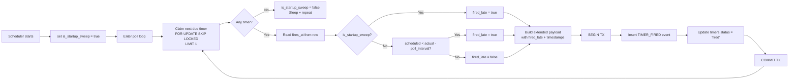

# Module: sch05-missed-timer-recovery

## Module purpose

Extend the existing scheduler polling mechanism (SCH-02) to detect and flag timers that fire later than their scheduled `fire_at` timestamp — whether because the platform was offline (crash/restart) or because of normal processing delays. On startup, the first poll cycle fires ALL due timers with an overdue flag; subsequent cycles flag only timers whose scheduled time has materially passed. The extended TIMER_FIRED event payload carries the overdue metadata so downstream consumers (audit, projections, alerting) can distinguish on-time firings from late recoveries.

This design does **not** introduce a new module. It modifies the existing `src/scheduler/scheduler.zig` and the TIMER_FIRED event schema in the event store. All changes stay within the established `src/scheduler/` boundary.

---

## Public interface

### Existing interface additions

```zig
// src/scheduler/scheduler.zig — additions to Scheduler struct

pub const Scheduler = struct {
    pool: *db.Pool,
    config: SchedulerConfig,
    is_startup_sweep: bool,      // NEW: true until first poll cycle completes

    // Existing init updated to set is_startup_sweep = true
    pub fn init(pool: *db.Pool, config: SchedulerConfig) Scheduler;

    // Existing — signature unchanged; internal overdue detection added
    pub fn pollDueTimers(self: *const Scheduler, allocator: std.mem.Allocator) SchedulerError!PollSummary;
};
```

### New helper functions

```zig
/// Determine whether a timer firing is overdue.
/// On the startup sweep (is_startup_sweep = true) any timer with
/// fires_at <= NOW() is considered overdue.
/// On normal polls, only timers whose fires_at is more than one poll
/// interval in the past are flagged as overdue.
fn isFiredLate(
    scheduled_fire_at_epoch_us: i64,
    actual_fire_at_epoch_us: i64,
    poll_interval_us: u64,
    is_startup_sweep: bool,
) bool;

/// Build the extended TIMER_FIRED JSON payload with overdue metadata.
fn buildTimerFiredPayload(
    allocator: std.mem.Allocator,
    timer_id_text: []const u8,
    scheduled_fire_at_us: i64,
    actual_fire_at_us: i64,
    fired_late: bool,
) (error{OutOfMemory}![]const u8);
```

### No changes to

- `src/scheduler/store.zig` — persist layer unchanged; the overdue flag is a runtime determination, not a stored column.
- `src/engine/transition.zig` — remains pure; receives the extended TIMER_FIRED event like any other event.
- `migrations/007_timers.sql` — no schema changes needed; `fires_at` is already stored.

---

## Data types

No new structs required. The existing `PollSummary` and `PollOutcome` enums are sufficient.

### Extended TIMER_FIRED event payload (JSON)

```
Current payload:  {"timer_id": "<uuid>"}

New payload:
{
  "timer_id":        "<uuid>",
  "fired_late":      true|false,
  "scheduled_fire_at": 1234567890123456,   // epoch microseconds UTC
  "actual_fire_at":    1234567891123456    // epoch microseconds UTC
}
```

Field semantics:

| Field | Type | Description |
|---|---|---|
| `timer_id` | string (UUID) | The timer that fired |
| `fired_late` | boolean | `true` if the timer fired later than its scheduled time |
| `scheduled_fire_at` | integer | The timer's `fires_at` value in epoch microseconds UTC (from the DB row) |
| `actual_fire_at` | integer | The wall-clock time when the fire was committed, in epoch microseconds UTC |

The `fired_late` flag is the primary discriminator for downstream consumers. `scheduled_fire_at` and `actual_fire_at` enable delta computation by the consumer if needed.

---

## Key invariants

1. **Every TIMER_FIRED event includes `fired_late`.** There is no code path that emits TIMER_FIRED without this flag.
2. **No timer is skipped.** The startup sweep processes every `status = PENDING AND fires_at <= NOW()` timer. The existing `FOR UPDATE SKIP LOCKED` + sequential loop guarantees at-most-once but at-least-once-per-poll-cycle semantics.
3. **`is_startup_sweep` transitions exactly once.** After the first `pollDueTimers` call returns, the flag flips to `false`. A subsequent restart resets it to `true`.
4. **Thundering herd is prevented.** The existing sequential processing (one timer per transaction, `while (true)` loop) already serialises all due timers. No parallel fan-out occurs, even on restart.
5. **No new DB columns.** The overdue flag is computed at runtime by comparing `fires_at` (already stored) with `NOW()`. No migration is required.
6. **Cancelled timers are not fired.** The existing poll query already filters `status = 'pending'`. Timers cancelled by SCH-03 do not appear in results.

---

## External dependencies

| Dependency | Type | Usage |
|---|---|---|
| `src/scheduler/scheduler.zig` | Modified | Core overdue detection and extended payload building |
| `src/scheduler/store.zig` | Unchanged | Timer row types remain compatible |
| `src/db/pool.zig` | Unchanged | Connection and transaction primitives |
| `migrations/007_timers.sql` | Unchanged | `fires_at` column already present; no new columns needed |
| Event type registry (ES-05) | Updated | TIMER_FIRED schema version bump to v2 to document the new payload fields |

---

## Overdue detection logic

### Pseudocode

```
fn isFiredLate(scheduled_fire_at, actual_fire_at, poll_interval_us, is_startup_sweep) -> bool:
    if is_startup_sweep:
        // On the very first poll after restart, every due timer is late
        // because the platform was offline. Use exact comparison:
        return scheduled_fire_at < actual_fire_at
    else:
        // Normal poll: flag if the timer was due more than one poll
        // interval in the past (material lateness, not clock-drift).
        // This avoids false positives from sub-interval scheduling jitter.
        const threshold_us = poll_interval_us
        return scheduled_fire_at < (actual_fire_at - threshold_us)
```

### Rationale for threshold approach

- **Startup sweep (is_startup_sweep = true):** All timers with `fires_at <= NOW()` that missed their window due to platform downtime are unconditionally flagged. The comparison `scheduled < actual` catches every overdue timer by at least the sub-microsecond delta between the `SELECT` and the `INSERT`.
- **Normal polls (is_startup_sweep = false):** A timer may become due a few milliseconds before the poll cycle reaches it (normal SCH-02 timing). Using `poll_interval_us` as a threshold (e.g., 5 seconds) eliminates false positives from normal scheduling latency while still catching timers overdue by a material amount.
- **Edge case — zero or negative threshold:** Configuring `poll_interval_us = 0` would mean every timer on every cycle is flagged as late. This is not a supported configuration; the scheduler validates that `poll_interval_ms >= 100` at startup.

### Data flow



---

## Startup sweep vs normal poll comparison

| Aspect | Startup sweep | Normal poll |
|---|---|---|
| Trigger | First `pollDueTimers` call after process start | Every subsequent poll cycle |
| `is_startup_sweep` value | `true` | `false` |
| Overdue threshold | `scheduled < actual` (any delta) | `scheduled < actual - poll_interval` |
| Rationale | Platform was offline; all due timers missed their window | Allow for normal polling latency |
| Termination | Set to `false` when `pollDueTimers` returns | Never resets until next restart |

---

## Poll query change

The existing SCH-02 poll query:

```sql
SELECT id::text, instance_id::text, timer_type, action_config::text
FROM timers
WHERE status = 'pending'
  AND fires_at <= NOW()
ORDER BY fires_at ASC, id ASC
FOR UPDATE SKIP LOCKED
LIMIT 1
```

**Change:** Add `fires_at` to the selected columns so the scheduler can compare it with `NOW()` at fire time.

```sql
SELECT id::text, instance_id::text, timer_type, action_config::text,
       EXTRACT(EPOCH FROM fires_at)::bigint * 1000000 AS fires_at_epoch_us
FROM timers
WHERE status = 'pending'
  AND fires_at <= NOW()
ORDER BY fires_at ASC, id ASC
FOR UPDATE SKIP LOCKED
LIMIT 1
```

The `fires_at_epoch_us` column is returned as a bigint (epoch microseconds) and passed to `buildTimerFiredPayload`. The existing `ORDER BY fires_at ASC` guarantees that the oldest-due timer is processed first, which is the correct prioritisation for overdue recovery.

---

## Idempotency key update

The existing idempotency key for timer firing is:

```
timer-fired:<timer_id>
```

This remains unchanged — it still provides deduplication. The extended payload is part of the TIMER_FIRED event body, and since idempotency deduplication returns the **original** event record, a retry of the same `timer-fired:<timer_id>` key will return the original event (with `fired_late` at its original value). This is correct behaviour: the overdue determination is made at fire time and never changes retroactively.

---

## First-poll-after-restart semantics — analysis

**Question from task:** Is a separate mechanism needed, or does the existing sequential processing of all due timers already satisfy this?

**Answer:** The existing sequential processing already provides the correct runtime behaviour (fires all due timers one at a time, no thundering herd). The only addition needed is:

1. A boolean `is_startup_sweep` on `Scheduler` to distinguish the first poll cycle.
2. The `fires_at` column in the SELECT to enable the overdue comparison.

No separate pre-poll sweep is required. The existing `pollDueTimers` / `processNextDueTimer` loop already exhausts all due timers before returning. Setting `is_startup_sweep = true` before the first call, and flipping it to `false` after the loop ends, gives correct first-poll semantics without a separate code path.

**Why not a separate pre-poll sweep?** A separate sweep would duplicate the same query and processing logic, increasing maintenance surface and creating a risk that the two paths diverge. Using the same code path with a flag is simpler, testable, and provably correct.

---

## Event type registry update (ES-05)

The TIMER_FIRED event type in the registry needs a schema version bump from v1 to v2:

**v1 schema (existing):**
```json
{
  "$schema": "https://json-schema.org/draft-07/schema#",
  "type": "object",
  "required": ["timer_id"],
  "properties": {
    "timer_id": { "type": "string", "format": "uuid" }
  }
}
```

**v2 schema (new):**
```json
{
  "$schema": "https://json-schema.org/draft-07/schema#",
  "type": "object",
  "required": ["timer_id", "fired_late", "scheduled_fire_at", "actual_fire_at"],
  "properties": {
    "timer_id":          { "type": "string", "format": "uuid" },
    "fired_late":        { "type": "boolean" },
    "scheduled_fire_at": { "type": "integer", "minimum": 0 },
    "actual_fire_at":    { "type": "integer", "minimum": 0 }
  }
}
```

Per ES-05 rules, this is a new schema version (v2) registered alongside v1. Existing TIMER_FIRED events with v1 payload remain valid for point-in-time queries (ES-06). New firings use v2.

---

## Error taxonomy

All errors flow through the existing `SchedulerError` set:

| Error | Source | Action |
|---|---|---|
| `SchedulerError.PoolExhausted` | `pool.acquire()` | Retry on next poll cycle |
| `SchedulerError.TransactionFailed` | SQL execution or commit | Rollback; retry on next poll cycle |
| `SchedulerError.OutOfMemory` | Payload `allocPrint` | Propagate; caller decides retry |

No new error variants are needed for overdue detection. Payload building failure (`OutOfMemory`) maps cleanly to `SchedulerError.OutOfMemory`. The idle detection is purely arithmetic and cannot fail.

---

## Dependencies

This module (SCH-05) **extends** the existing scheduler module. It:

- **Calls:** `src/db/pool.zig` (same as SCH-02)
- **Calls:** No new modules beyond what SCH-02 already calls
- **Must not depend on:** `src/engine/transition.zig`, `src/identity/`, `src/api/routes/`
- **Is depended on by:** `src/main.zig` (startup initialises `is_startup_sweep`)

---

## Open questions

1. **v1 vs v2 TIMER_FIRED compatibility:** Existing v1 events in the event log have no `fired_late` field. Should the engine's transition function accept both v1 and v2 payloads, or should a migration backfill v1 events with `fired_late: false`? **Recommendation:** Accept both at the schema level (v1's payload is valid JSON, the engine transition function checks `fired_late` via `obj.get("fired_late") orelse false`). No backfill needed.

2. **Exact poll interval value at runtime:** The threshold calculation needs the actual poll interval in microseconds. The config stores `poll_interval_ms` as a `u64`. Should this be passed as a parameter to `processNextDueTimer`, or stored as a field on `Scheduler`? **Recommendation:** Store on `Scheduler` (already has `config`), compute once in `init`. No parameter plumbing needed.

3. **Monitoring / alerting:** Should `fired_late = true` trigger a log at WARN level, or only INFO? **Recommendation:** WARN on startup sweep (expected but notable), INFO on normal poll (unusual but not critical). This is an operational preference for the operator to decide.

4. **Recurring timer interaction with SCH-07:** If a recurring timer fires late, is the recurrence delay computed from `scheduled_fire_at` or `actual_fire_at`? **Recommendation:** From `actual_fire_at` (the time it actually fired), because the recurrence represents wall-clock elapsed time. Flag for REQ-ANALYST if clarification is needed.
