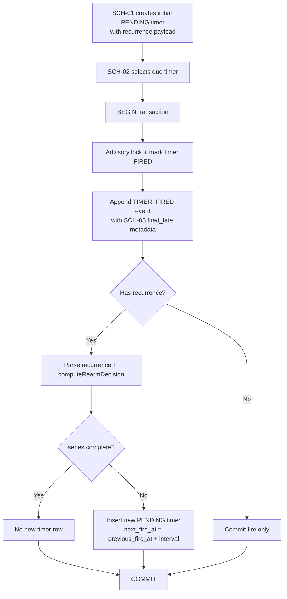

# Module: sch07-recurring-timers

## Module purpose

This module design extends Stage 5 timer behavior with ISO 8601 recurring timers so that a timer can re-arm itself after firing without losing atomicity or crash safety. The design keeps firing and re-arm in one database transaction, supports finite series (for example `R3/PT1H`) and infinite series (`R/PT1H`), and defines how recurring chains interact with cancellation (SCH-03), missed timer recovery (SCH-05), and timer polling cadence (SCH-02/SCH-06).

## Public interface

### Zig interfaces (design contracts)

```zig
// src/scheduler/recurrence.zig (new design module boundary)
pub const RepeatMode = enum {
    finite,
    infinite,
};

pub const RepeatSpec = struct {
    mode: RepeatMode,
    // finite repeat total firings in this series, minimum 1 when finite.
    repeat_total: ?u32,
    interval_us: u64,
    normalized: []const u8, // canonical expression (for example "R3/PT1H")
};

pub const RepeatState = struct {
    repeat_total: ?u32,
    fired_count: u32,
    interval_us: u64,
    // anchor for next scheduling. Always previous scheduled fire time.
    scheduled_fire_at_us: i64,
};

pub const ParseRepeatError = error{
    InvalidFormat,
    InvalidRepeatCount,
    InvalidDuration,
    ZeroInterval,
    Overflow,
};

// Accepts only repeating duration form used by SCH-07: R[n]/P...T...
pub fn parseRepeatExpression(
    allocator: std.mem.Allocator,
    expr: []const u8,
) ParseRepeatError!RepeatSpec;

pub const RearmDecision = union(enum) {
    complete,
    rearm: struct {
        next_fire_at_us: i64,
        next_fired_count: u32,
    },
};

pub const RearmError = error{
    CountOverflow,
    TimestampOverflow,
};

pub fn computeRearmDecision(state: RepeatState) RearmError!RearmDecision;
```

```zig
// src/scheduler/store.zig (extensions used by SCH-02 fire flow)
pub const TimerRecurrenceState = struct {
    expression: []const u8,
    repeat_total: ?u32,
    fired_count: u32,
    interval_us: u64,
};

pub const DueTimer = struct {
    timer_id: Uuid,
    instance_id: Uuid,
    fire_at_us: i64,
    status: TimerStatus,
    action_config_json: []const u8,
    recurrence: ?TimerRecurrenceState,
};

pub const CreateRecurringTimerArgs = struct {
    timer_id: Uuid,
    instance_id: Uuid,
    fire_at_us: i64,
    payload_json: []const u8,
    recurrence: TimerRecurrenceState,
};

pub fn insertRecurringPendingTimerInTx(
    conn: *db.Conn,
    args: CreateRecurringTimerArgs,
) TimerStoreError!void;
```

```zig
// src/scheduler/scheduler.zig (fire + optional re-arm in same transaction)
pub const FireRecurringOutcome = struct {
    fired_timer_id: Uuid,
    fired_late: bool,
    recurring_series_complete: bool,
    rearmed_timer_id: ?Uuid,
};

pub fn fireDueTimerInTx(
    self: *Scheduler,
    allocator: std.mem.Allocator,
    conn: *db.Conn,
    due_timer: store.DueTimer,
    now_us: i64,
) SchedulerError!FireRecurringOutcome;
```

### Recurring timer payload contract

Recurring metadata is carried inside timer payload so SCH-02 can re-arm deterministically:

```json
{
  "schema_version": 1,
  "timer_kind": "scheduled_transition",
  "source": "SCH-01|SCH-07",
  "node_id": "string",
  "event_type_on_fire": "TIMER_FIRED",
  "recurrence": {
    "expression": "R3/PT1H",
    "repeat_total": 3,
    "fired_count": 1,
    "interval_us": 3600000000
  }
}
```

Notes:
- `fired_count` means number of completed firings including the current fired timer.
- `repeat_total = null` means infinite repeat (`R/PT...`).

## Data flow diagram



## Repeat expression parsing strategy

Supported expression grammar in SCH-07:
- `R/PT1H` infinite repeats with ISO 8601 duration interval
- `R3/PT1H` finite repeats with count `3`

Parser contract:
1. Must start with `R`.
2. Optional decimal repeat count follows `R`; if absent, mode is infinite.
3. Mandatory `/` separator.
4. Right segment must be an ISO 8601 duration (only duration form, not date-time start form).
5. Interval must resolve to positive microseconds (`> 0`).
6. Reject unsupported forms (examples: `R3/2026-01-01T00:00:00Z/P1D`, `R-1/PT1H`, `R0/PT1H`).

Normalization rules:
- Store canonical uppercase expression in payload (`normalized`).
- Persist parsed interval in `interval_us` to avoid reparsing for every poll.

## Timer payload and state model

### Persisted model additions

Required new recurrence fields for timer persistence:
- `repeat_expression` (TEXT, nullable)
- `repeat_total` (INTEGER, nullable)
- `fired_count` (INTEGER, nullable)
- `repeat_interval_us` (BIGINT, nullable)

Invariants:
1. All four recurrence fields are null for non-recurring timers.
2. For recurring timers: `repeat_expression` and `repeat_interval_us` are non-null.
3. For recurring timers: `fired_count >= 1` on fired rows, and next re-armed row is inserted with incremented `fired_count`.
4. For finite series: `1 <= fired_count <= repeat_total`.

### Next fire time rule

Always compute next fire as:

$$next\_fire\_at = previous\_scheduled\_fire\_at + interval$$

This avoids cadence drift from processing latency and keeps missed-firing replay deterministic under SCH-05.

## Transaction boundary and atomicity

Re-arm must happen in the exact same transaction as firing (SCH-07 AC1):

1. Lock and read one due timer row.
2. Mark row `FIRED`.
3. Append fired event (including SCH-05 late metadata if overdue).
4. If recurring and not complete, insert next `PENDING` timer row.
5. Commit.

Failure behavior:
- Any parse/re-arm/insert error rolls back the entire fire transaction.
- On rollback, timer remains `PENDING` and is retried by SCH-02.
- No state where a timer is fired without either successful commit or full rollback.

## Integration points

### SCH-01 integration (creation)
- SCH-01 path accepts optional recurrence expression at timer creation points.
- Initial recurring row stores parsed recurrence state with `fired_count = 0` before first fire.
- Existing non-recurring creation path remains unchanged.

### SCH-02 integration (poll + fire)
- Due selection continues using `status = PENDING AND fire_at <= NOW()`.
- Fire loop remains one-row-at-a-time with advisory lock semantics.
- `fireDueTimerInTx` gains recurring re-arm branch.

### SCH-03 integration (cancellation)
- Instance cancellation/completion updates all `PENDING` timers to `CANCELLED`, including recurring rows.
- A cancelled recurring series terminates immediately; no further re-arm.
- Commit-race rule remains unchanged: first commit between cancel and fire wins.

### SCH-05 integration (missed timer recovery)
- Startup sweep still fires all overdue `PENDING` timers in order.
- For recurring timers, each fired overdue timer can re-arm its successor in the same transaction.
- This naturally drains backlogs across polls without skipping occurrences.

### SCH-06 interaction (jitter)
- Jitter affects poll timing only, never recurrence interval or `next_fire_at` formula.
- If interval < effective polling delay, at most one due timer is processed per cycle per lock winner; backlog resolves sequentially.

## Edge-case handling

### Interval shorter than polling period

Scenario: `R/PT1S` with poll interval about 5s.
- Scheduler can fire once per poll cycle per chain.
- Re-arm keeps cadence based on scheduled time (`+1s`), so overdue backlog appears.
- SCH-05/SCH-02 loop processes overdue occurrences in sequence; none are skipped.

### Finite completion

For `R3/PT1H`:
- Fires 1, 2, 3 re-arm according to `fired_count`.
- When `fired_count == repeat_total` after current fire, no new row is created.
- Mark outcome as `recurring_series_complete = true`.

### Infinite termination

For `R/PT1H`:
- Always re-arm while instance is active.
- Termination occurs only via SCH-03 instance terminal transition (`CANCELLED` or `COMPLETED`).

## Error taxonomy

- `InvalidFormat`: recurrence string does not match supported `R[n]/<duration>` form.
- `InvalidRepeatCount`: finite count missing, zero, negative, or out of range.
- `InvalidDuration`: duration parse failure.
- `ZeroInterval`: duration resolves to 0.
- `Overflow`: interval conversion or timestamp arithmetic overflow.
- `SeriesStateInvalid`: persisted recurrence fields are inconsistent.
- `InstanceTerminal`: fire path detects instance already terminal before re-arm write.
- `TransactionFailed`: DB transaction begin/commit/rollback failure.
- `AdvisoryLockUnavailable`: timer skipped because another node owns lock.

## State transitions

```text
NONE --(SCH-01 create recurring timer)--> PENDING
PENDING --(SCH-02 fire + commit)--> FIRED
FIRED --(SCH-07 re-arm branch)--> PENDING (next occurrence)
PENDING --(SCH-03 cancel/complete instance)--> CANCELLED
FIRED --(finite repeat_total reached)--> SERIES_COMPLETE (logical state)
```

`SERIES_COMPLETE` is logical (derived) and does not require a dedicated DB status.

## Dependencies

Depends on:
- src/scheduler/scheduler.zig
- src/scheduler/store.zig
- src/scheduler/recurrence.zig (new design module)
- src/db/pool.zig
- migrations/007_timers.sql (extended by new migration)

Must not depend on:
- src/engine/transition.zig for I/O or persistence logic
- API route handlers for recurrence calculations
- wall-clock randomness for recurrence interval semantics

## DB schema impact and migration needs

Required additive migration (new file, number TBD by BACKEND-DEV):
1. Add nullable recurrence columns to `timers`:
   - `repeat_expression TEXT`
   - `repeat_total INTEGER`
   - `fired_count INTEGER`
   - `repeat_interval_us BIGINT`
2. Add check constraints:
   - Non-recurring: all recurrence fields null.
   - Recurring: expression and interval non-null, `fired_count >= 0`, finite `repeat_total >= 1`.
3. Add/extend index for recurring due selection if needed:
   - existing due index remains valid for base polling.
4. No destructive change; backward compatible with existing non-recurring rows.

## Acceptance-criteria traceability (SCH-07)

| SCH-07 criterion | Design element |
|---|---|
| Re-arm in same transaction as fire | Transaction boundary section and fire flow diagram |
| Finite repeat count stops after N fires | Repeat state model and finite completion rules |
| Infinite repeat continues until instance termination | Infinite termination rules + SCH-03 integration |
| ISO 8601 repeat expression support | Parsing strategy and parse contract |
| Edge case: interval shorter than polling period | Edge-case handling section |
| Integration with SCH-01/SCH-02/SCH-03/SCH-05 | Integration points section |
| DB schema impact listed | DB schema impact and migration needs section |

## Open questions

1. Should SCH-07 accept full ISO 8601 repeating interval forms with explicit start date/time (`R3/2026-01-01T00:00:00Z/P1D`), or only the simplified duration form already shown in requirements (`R3/PT1H`)?
2. Is there a product-level cap for `repeat_total` to avoid unbounded finite series values (for example maximum 1,000,000)?
3. Should timer payload include a stable `series_id` separate from `timer_id` for audit and UI grouping across occurrences?
