# Module: scheduler

## Module purpose

The scheduler design for SCH-01 defines how the platform creates durable timers when process execution arrives at a timer node, while preserving the pure-function boundary in `src/engine/transition.zig` and the DB-03 atomicity rule. The design splits responsibility across the engine, instance execution orchestration, and scheduler polling modules: the engine computes a timer creation intent as pure data, the instance execution layer persists both transition event/state and timer row in one database transaction, and the scheduler poller (SCH-02) later evaluates persisted PENDING timers, including those due immediately (`fire_at <= NOW()`) and those surviving restart.

## Public interface

### Zig interfaces (design contracts)

```zig
// src/engine/transition.zig (pure output extension, no I/O)
pub const TimerIntent = struct {
    timer_id: Uuid,
    instance_id: Uuid,
    node_id: []const u8,
    fire_at_utc: i64, // epoch micros UTC
    payload_json: []const u8,
};

pub const PendingEffect = union(enum) {
    // Existing effects...
    timer_create: TimerIntent,
};

// src/engine/transition.zig (unchanged purity: computes effects only)
pub fn transition(
    allocator: std.mem.Allocator,
    snapshot: graph_mod.DefinitionGraph,
    state: InstanceState,
    event: TransitionEvent,
) TransitionError!InstanceState;
```

```zig
// src/engine/instance.zig (orchestration boundary that owns DB writes)
pub const ExecuteTransitionArgs = struct {
    instance_id: Uuid,
    event: transition_mod.TransitionEvent,
    actor_id: []const u8,
    idempotency_key: []const u8,
};

pub const InstanceExecutionError = error{
    InstanceNotFound,
    InstanceCancelled,
    InvalidTimerNodeConfig,
    InvalidFireAt,
    DuplicateTimerId,
    PoolExhausted,
    TransactionFailed,
    QueryFailed,
};

pub fn executeTransition(
    self: *InstanceStore,
    allocator: std.mem.Allocator,
    args: ExecuteTransitionArgs,
) InstanceExecutionError!ExecutionResult;
```

```zig
// src/scheduler/store.zig (new persistence API)
pub const CreateTimerArgs = struct {
    timer_id: Uuid,
    instance_id: Uuid,
    fire_at: i64, // epoch micros UTC
    payload_json: []const u8,
    status: TimerStatus,
};

pub const TimerStatus = enum {
    PENDING,
    FIRED,
    CANCELLED,
};

pub const TimerStoreError = error{
    InvalidInput,
    InstanceCancelled,
    InstanceNotFound,
    DuplicateTimerId,
    QueryFailed,
};

pub fn insertPendingTimerInTx(
    conn: *db.Conn,
    args: CreateTimerArgs,
) TimerStoreError!void;
```

## Data types

```zig
pub const DurableTimer = struct {
    timer_id: Uuid,
    instance_id: Uuid,
    fire_at: i64,
    status: TimerStatus,
    payload_json: []const u8,
    created_at: i64,
};
```

Timer payload contract for SCH-01:

```json
{
  "node_id": "string",
  "timer_kind": "duration|schedule",
  "source_event_id": "uuid",
  "derived_from": {
    "duration_iso8601": "optional string",
    "schedule_expr": "optional string"
  }
}
```

## Key invariants

1. Timer creation and transition/state persistence are committed atomically in one transaction (DB-03).
2. No timer row is inserted when instance status is terminal CANCELLED.
3. `fire_at` is absolute UTC derived at token arrival time; no local timezone conversion is stored.
4. Newly inserted timers for SCH-01 must start at `PENDING` status.
5. `fire_at <= NOW()` is valid and remains `PENDING`; SCH-02 picks it up on the next poll.
6. `src/engine/transition.zig` performs no I/O and only emits intent/effect data.

## Data flow diagram

```mermaid
flowchart LR
    A[Token arrives at timer node] --> B[engine/transition.zig]
    B -->|emit timer_create effect| C[engine/instance execution orchestrator]
    C --> D[BEGIN transaction]
    D --> E[append transition event]
    E --> F[update instance projection]
    F --> G[insert timers row status=PENDING]
    G --> H[COMMIT]
    H --> I[scheduler poller SCH-02 reads due PENDING timers]
```



## Module and file boundaries

- `src/engine/transition.zig`:
  - Owns pure derivation of timer intent (`timer_id`, `instance_id`, `fire_at`, payload fields).
  - Must not read wall clock directly; receives arrival timestamp/context from caller input.
  - Must not call DB, logger, HTTP, or scheduler modules.
- `src/engine/instance.zig`:
  - Owns execution transaction boundary for event append + projection update + timer insert.
  - Validates instance status guard (`status != CANCELLED`) immediately before insert.
- `src/scheduler/store.zig` (new module boundary):
  - Owns timer table SQL and mapping between domain types and SQL columns.
- `src/scheduler/scheduler.zig`:
  - Poll/read/claim/fire behavior (SCH-02+). SCH-01 dependency: consumes persisted PENDING timers.
- `src/db/pool.zig`:
  - Provides `Conn` and transaction primitives; no scheduler-specific logic.

## Transaction and atomicity strategy

Single transaction owned by `executeTransition`:

1. Acquire DB connection from pool.
2. `BEGIN`.
3. Lock/read instance projection row (`FOR UPDATE`) and reject if status is CANCELLED.
4. Append transition event record.
5. Update instance projection state.
6. For each `timer_create` effect, call `insertPendingTimerInTx` using same `conn`.
7. `COMMIT` on success; `ROLLBACK` on any error.

Failure behavior:

- Any error in steps 3-6 rolls back all writes (no partial event/timer state).
- Duplicate timer id maps to typed error and aborts transaction.
- Pool/query/commit failures map to module error sets and return failure to caller.

## Data model contract and schema mapping

Existing `migrations/007_timers.sql` columns:

- `id` (UUID PK)
- `instance_id` (UUID FK)
- `fires_at` (TIMESTAMPTZ)
- `status` (TEXT default `pending`)
- `action_config` (JSONB)

SCH-01 canonical contract fields:

- `timer_id` (UUID)
- `instance_id` (UUID)
- `fire_at` (absolute UTC timestamp)
- `status = PENDING`
- associated payload

Mapping strategy:

- `timer_id` <-> DB `timers.id`
- `fire_at` <-> DB `timers.fires_at`
- payload <-> DB `timers.action_config`
- `PENDING` domain enum <-> DB `'pending'` text

Required schema deltas for strict SCH-01 alignment:

1. Add uppercase status constraint normalization or explicit enum check to avoid non-canonical values.
2. Add check constraint ensuring status domain includes pending/fired/cancelled only.
3. Ensure `fires_at` is not nullable and indexed for pending lookup (already present via `idx_timer_pending`).
4. Add optional compatibility view or alias naming strategy for `timer_id`/`fire_at` if API/domain contracts require exact field names externally.

No destructive migration is introduced by this design; deltas are additive/constraint-hardening.

## Error taxonomy

- `InstanceNotFound`: instance id not present.
- `InstanceCancelled`: timer creation attempted for terminal CANCELLED instance.
- `InvalidTimerNodeConfig`: malformed or unsupported timer config in node.
- `InvalidFireAt`: computed `fire_at` is not representable UTC timestamp.
- `DuplicateTimerId`: collision on timer primary key insert.
- `PoolExhausted`: cannot acquire DB connection.
- `QueryFailed`: SQL execution failure.
- `TransactionFailed`: begin/commit/rollback failure path.

Error-to-action rules:

- `InstanceCancelled` is a business rejection, no writes committed.
- `InvalidTimerNodeConfig` and `InvalidFireAt` fail before insert; transaction rolled back.
- Infra errors (`PoolExhausted`, `QueryFailed`, `TransactionFailed`) are retriable by caller policy.

## State transitions (timer lifecycle slice)

```text
NONE --(token arrives at timer node + tx commit)--> PENDING
PENDING --(SCH-02 fires timer)--> FIRED
PENDING --(SCH-03 or instance cancellation)--> CANCELLED
```

SCH-01 scope is only `NONE -> PENDING` with durability guarantees.

## External dependencies

Depends on:

- `src/engine/transition.zig` for pure effect generation.
- `src/engine/instance.zig` for transactional orchestration.
- `src/db/pool.zig` for DB connection/transaction primitives.
- `migrations/007_timers.sql` (`timers` table/indexes).
- DB-03 transactional integrity guarantees.

Must not depend on:

- Direct scheduler polling behavior implementation details (SCH-02 internals).
- Wall-clock reads inside `src/engine/transition.zig`.
- HTTP/API route layer for core timer persistence logic.

## Testability plan

Unit tests (no DB):

- Transition computes `timer_create` effect with deterministic `fire_at` from provided arrival context.
- Transition emits no timer effect for non-timer node types.
- Transition returns domain error for invalid timer configuration.

Integration tests (with DB):

- Timer row inserted atomically with transition event and projection update.
- Forced failure after event append but before timer insert leaves no committed event/projection update.
- Restart simulation confirms pending timer remains persisted.
- `fire_at <= NOW()` insertion remains PENDING and appears in due set on next poll query.
- CANCELLED instance path rejects creation and writes no timer row.

## Acceptance-criteria traceability matrix (SCH-01)

| SCH-01 acceptance criterion | Design coverage |
|---|---|
| Timer persisted on timer-node arrival in same tx as transition/state event | Transaction strategy section; boundaries assign ownership to `executeTransition` + `insertPendingTimerInTx` in one `BEGIN/COMMIT` |
| Persist fields timer_id, instance_id, fire_at UTC, status=PENDING, payload | Public types + data model mapping (`timers.id`, `timers.instance_id`, `timers.fires_at`, `timers.status`, `timers.action_config`) |
| fire_at derived at token arrival | Transition interface emits computed timer intent from arrival context |
| PENDING survives restart and picked by SCH-02 | Durability + integration test plan and dependency on scheduler poller reading persisted rows |
| fire_at <= NOW() due immediately next poll | Key invariants and integration test case for due-immediately behavior |
| Reject timer creation for already-CANCELLED instances | Atomic flow step 3 guard + error taxonomy `InstanceCancelled` |

## Open questions

1. Should status canonical form be uppercase in storage (`PENDING`) or lowercase (`pending`) with domain mapping at repository boundaries? Current migration uses lowercase.
2. For schedule-based timers, what expression grammar is authoritative at Stage 5 (`cron`, ISO recurring interval, or fixed timestamp)?
3. Should `timer_id` be generated in transition effect generation (deterministic/idempotent seed) or in persistence layer at insert time?

## Handoff notes for BACKEND-DEV

1. Implement timer creation through the instance execution transaction boundary; do not add DB calls in `src/engine/transition.zig`.
2. Reuse `src/db/pool.zig` transaction primitives and typed errors.
3. Preserve additive migration strategy for any schema hardening required by SCH-01 naming/constraint alignment.
4. Add focused integration tests for rollback atomicity and cancelled-instance rejection paths.
