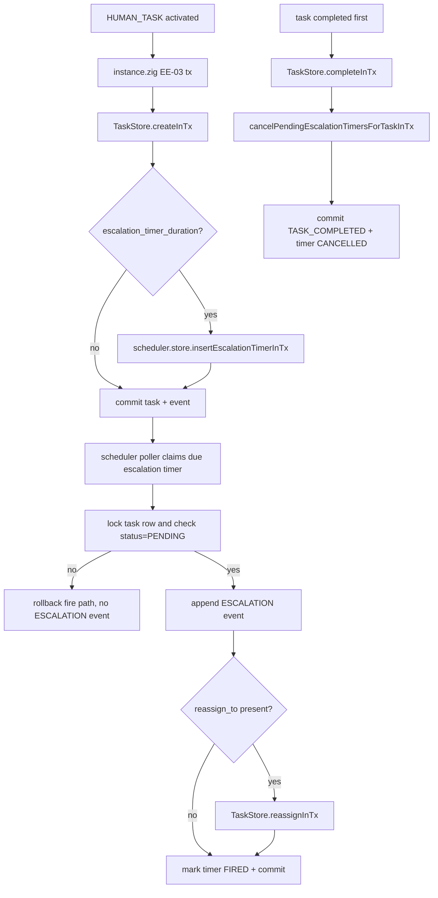

# Module: scheduler

## Module purpose

The scheduler design covers both SCH-01 timer-node timers and SCH-04 human-task escalation timers while preserving the pure-function boundary in `src/engine/transition.zig` and the DB-03 atomicity rule. The design splits responsibility across the engine, task activation orchestration, task mutation, and scheduler polling modules: the engine remains pure and computes only state/event intents, the instance execution layer persists transition state and task rows, the task activation path creates escalation timers in the same transaction as the EE-03 task row, and the scheduler poller (SCH-02) later evaluates persisted PENDING timers, including timers due immediately (`fire_at <= NOW()`) and timers surviving restart.

## Public interface

### Zig interfaces (design contracts)

```zig
// src/engine/transition.zig (pure output extension, no I/O)
pub const TimerIntent = struct {
    timer_id: Uuid,
    instance_id: Uuid,
    node_id: []const u8,
    fire_at_utc: i64, // epoch micros UTC
    payload_json: []const u8,
};

pub const PendingEffect = union(enum) {
    // Existing effects...
    timer_create: TimerIntent,
};

// src/engine/transition.zig (unchanged purity: computes effects only)
pub fn transition(
    allocator: std.mem.Allocator,
    snapshot: graph_mod.DefinitionGraph,
    state: InstanceState,
    event: TransitionEvent,
) TransitionError!InstanceState;
```

```zig
// src/engine/instance.zig (orchestration boundary that owns DB writes)
pub const ExecuteTransitionArgs = struct {
    instance_id: Uuid,
    event: transition_mod.TransitionEvent,
    actor_id: []const u8,
    idempotency_key: []const u8,
};

pub const InstanceExecutionError = error{
    InstanceNotFound,
    InstanceCancelled,
    InvalidTimerNodeConfig,
    InvalidFireAt,
    DuplicateTimerId,
    PoolExhausted,
    TransactionFailed,
    QueryFailed,
};

pub fn executeTransition(
    self: *InstanceStore,
    allocator: std.mem.Allocator,
    args: ExecuteTransitionArgs,
) InstanceExecutionError!ExecutionResult;
```

```zig
// src/scheduler/store.zig (new persistence API)
pub const CreateTimerArgs = struct {
    timer_id: Uuid,
    instance_id: Uuid,
    fire_at: i64, // epoch micros UTC
    payload_json: []const u8,
    status: TimerStatus,
};

pub const TimerStatus = enum {
    PENDING,
    FIRED,
    CANCELLED,
};

pub const TimerStoreError = error{
    InvalidInput,
    InstanceCancelled,
    InstanceNotFound,
    DuplicateTimerId,
    QueryFailed,
};

pub fn insertPendingTimerInTx(
    conn: *db.Conn,
    args: CreateTimerArgs,
) TimerStoreError!void;
```

## Data types

```zig
pub const DurableTimer = struct {
    timer_id: Uuid,
    instance_id: Uuid,
    fire_at: i64,
    status: TimerStatus,
    payload_json: []const u8,
    created_at: i64,
};
```

Timer payload contract for SCH-01:

```json
{
  "node_id": "string",
  "timer_kind": "duration|schedule",
  "source_event_id": "uuid",
  "derived_from": {
    "duration_iso8601": "optional string",
    "schedule_expr": "optional string"
  }
}
```

## Key invariants

1. Timer creation and transition/state persistence are committed atomically in one transaction (DB-03).
2. No timer row is inserted when instance status is terminal CANCELLED.
3. `fire_at` is absolute UTC derived at token arrival time; no local timezone conversion is stored.
4. Newly inserted timers for SCH-01 must start at `PENDING` status.
5. `fire_at <= NOW()` is valid and remains `PENDING`; SCH-02 picks it up on the next poll.
6. `src/engine/transition.zig` performs no I/O and only emits intent/effect data.

## Data flow diagram

```mermaid
flowchart LR
    A[Token arrives at timer node] --> B[engine/transition.zig]
    B -->|emit timer_create effect| C[engine/instance execution orchestrator]
    C --> D[BEGIN transaction]
    D --> E[append transition event]
    E --> F[update instance projection]
    F --> G[insert timers row status=PENDING]
    G --> H[COMMIT]
    H --> I[scheduler poller SCH-02 reads due PENDING timers]
```



## Module and file boundaries

- `src/engine/transition.zig`:
  - Owns pure derivation of timer intent (`timer_id`, `instance_id`, `fire_at`, payload fields).
  - Must not read wall clock directly; receives arrival timestamp/context from caller input.
  - Must not call DB, logger, HTTP, or scheduler modules.
- `src/engine/instance.zig`:
  - Owns execution transaction boundary for event append + projection update + timer insert.
  - Validates instance status guard (`status != CANCELLED`) immediately before insert.
- `src/scheduler/store.zig` (new module boundary):
  - Owns timer table SQL and mapping between domain types and SQL columns.
- `src/scheduler/scheduler.zig`:
  - Poll/read/claim/fire behavior (SCH-02+). SCH-01 dependency: consumes persisted PENDING timers.
- `src/db/pool.zig`:
  - Provides `Conn` and transaction primitives; no scheduler-specific logic.

## Transaction and atomicity strategy

Single transaction owned by `executeTransition`:

1. Acquire DB connection from pool.
2. `BEGIN`.
3. Lock/read instance projection row (`FOR UPDATE`) and reject if status is CANCELLED.
4. Append transition event record.
5. Update instance projection state.
6. For each `timer_create` effect, call `insertPendingTimerInTx` using same `conn`.
7. `COMMIT` on success; `ROLLBACK` on any error.

Failure behavior:

- Any error in steps 3-6 rolls back all writes (no partial event/timer state).
- Duplicate timer id maps to typed error and aborts transaction.
- Pool/query/commit failures map to module error sets and return failure to caller.

## Data model contract and schema mapping

Existing `migrations/007_timers.sql` columns:

- `id` (UUID PK)
- `instance_id` (UUID FK)
- `fires_at` (TIMESTAMPTZ)
- `status` (TEXT default `pending`)
- `action_config` (JSONB)

SCH-01 canonical contract fields:

- `timer_id` (UUID)
- `instance_id` (UUID)
- `fire_at` (absolute UTC timestamp)
- `status = PENDING`
- associated payload

Mapping strategy:

- `timer_id` <-> DB `timers.id`
- `fire_at` <-> DB `timers.fires_at`
- payload <-> DB `timers.action_config`
- `PENDING` domain enum <-> DB `'pending'` text

Required schema deltas for strict SCH-01 alignment:

1. Add uppercase status constraint normalization or explicit enum check to avoid non-canonical values.
2. Add check constraint ensuring status domain includes pending/fired/cancelled only.
3. Ensure `fires_at` is not nullable and indexed for pending lookup (already present via `idx_timer_pending`).
4. Add optional compatibility view or alias naming strategy for `timer_id`/`fire_at` if API/domain contracts require exact field names externally.

No destructive migration is introduced by this design; deltas are additive/constraint-hardening.

## Error taxonomy

- `InstanceNotFound`: instance id not present.
- `InstanceCancelled`: timer creation attempted for terminal CANCELLED instance.
- `InvalidTimerNodeConfig`: malformed or unsupported timer config in node.
- `InvalidFireAt`: computed `fire_at` is not representable UTC timestamp.
- `DuplicateTimerId`: collision on timer primary key insert.
- `PoolExhausted`: cannot acquire DB connection.
- `QueryFailed`: SQL execution failure.
- `TransactionFailed`: begin/commit/rollback failure path.

Error-to-action rules:

- `InstanceCancelled` is a business rejection, no writes committed.
- `InvalidTimerNodeConfig` and `InvalidFireAt` fail before insert; transaction rolled back.
- Infra errors (`PoolExhausted`, `QueryFailed`, `TransactionFailed`) are retriable by caller policy.

## State transitions (timer lifecycle slice)

```text
NONE --(token arrives at timer node + tx commit)--> PENDING
PENDING --(SCH-02 fires timer)--> FIRED
PENDING --(SCH-03 or instance cancellation)--> CANCELLED
```

SCH-01 scope is only `NONE -> PENDING` with durability guarantees.

## External dependencies

Depends on:

- `src/engine/transition.zig` for pure effect generation.
- `src/engine/instance.zig` for transactional orchestration.
- `src/db/pool.zig` for DB connection/transaction primitives.
- `migrations/007_timers.sql` (`timers` table/indexes).
- DB-03 transactional integrity guarantees.

Must not depend on:

- Direct scheduler polling behavior implementation details (SCH-02 internals).
- Wall-clock reads inside `src/engine/transition.zig`.
- HTTP/API route layer for core timer persistence logic.

## Testability plan

Unit tests (no DB):

- Transition computes `timer_create` effect with deterministic `fire_at` from provided arrival context.
- Transition emits no timer effect for non-timer node types.
- Transition returns domain error for invalid timer configuration.

Integration tests (with DB):

- Timer row inserted atomically with transition event and projection update.
- Forced failure after event append but before timer insert leaves no committed event/projection update.
- Restart simulation confirms pending timer remains persisted.
- `fire_at <= NOW()` insertion remains PENDING and appears in due set on next poll query.
- CANCELLED instance path rejects creation and writes no timer row.

## Acceptance-criteria traceability matrix (SCH-01)

| SCH-01 acceptance criterion | Design coverage |
|---|---|
| Timer persisted on timer-node arrival in same tx as transition/state event | Transaction strategy section; boundaries assign ownership to `executeTransition` + `insertPendingTimerInTx` in one `BEGIN/COMMIT` |
| Persist fields timer_id, instance_id, fire_at UTC, status=PENDING, payload | Public types + data model mapping (`timers.id`, `timers.instance_id`, `timers.fires_at`, `timers.status`, `timers.action_config`) |
| fire_at derived at token arrival | Transition interface emits computed timer intent from arrival context |
| PENDING survives restart and picked by SCH-02 | Durability + integration test plan and dependency on scheduler poller reading persisted rows |
| fire_at <= NOW() due immediately next poll | Key invariants and integration test case for due-immediately behavior |
| Reject timer creation for already-CANCELLED instances | Atomic flow step 3 guard + error taxonomy `InstanceCancelled` |

## Open questions

1. Should status canonical form be uppercase in storage (`PENDING`) or lowercase (`pending`) with domain mapping at repository boundaries? Current migration uses lowercase.
2. For schedule-based timers, what expression grammar is authoritative at Stage 5 (`cron`, ISO recurring interval, or fixed timestamp)?
3. Should `timer_id` be generated in transition effect generation (deterministic/idempotent seed) or in persistence layer at insert time?

## Handoff notes for BACKEND-DEV

1. Implement timer creation through the instance execution transaction boundary; do not add DB calls in `src/engine/transition.zig`.
2. Reuse `src/db/pool.zig` transaction primitives and typed errors.
3. Preserve additive migration strategy for any schema hardening required by SCH-01 naming/constraint alignment.
4. Add focused integration tests for rollback atomicity and cancelled-instance rejection paths.

---

## SCH-04 escalation timer extension

### Design goal

SCH-04 extends the existing scheduler design so a HUMAN_TASK with `escalation_timer_duration` creates a durable escalation timer at EE-03 activation time, fires an `ESCALATION` event only while the task is still `PENDING`, and optionally reassigns the same task in the same database transaction as that event append. Completing the task before the escalation fires must cancel the timer in the same completion transaction, reusing the SCH-03 cancellation guarantee without adding I/O to `src/engine/transition.zig`.

### Public interface additions

```zig
// src/scheduler/store.zig
pub const TimerKind = enum {
    scheduled_transition,
    human_task_escalation,
};

pub const EscalationTarget = struct {
    assignee_type: []const u8, // USER | GROUP | ROLE
    assignee_ref: []const u8,
};

pub const EscalationTimerPayload = struct {
    schema_version: u8,
    timer_kind: TimerKind,
    source: []const u8, // "EE-03"
    instance_id: Uuid,
    task_id: Uuid,
    task_node_id: []const u8,
    escalation_duration_iso8601: []const u8,
    task_created_at_utc: i64,
    due_at_utc: i64,
    reassign_to: ?EscalationTarget,
};

pub const CreateEscalationTimerArgs = struct {
    timer_id: Uuid,
    instance_id: Uuid,
    task_id: Uuid,
    task_node_id: []const u8,
    escalation_duration_iso8601: []const u8,
    task_created_at_utc: i64,
    reassign_to: ?EscalationTarget,
};

pub fn insertEscalationTimerInTx(
    allocator: std.mem.Allocator,
    conn: *db.Conn,
    args: CreateEscalationTimerArgs,
) TimerStoreError!void;

pub fn cancelPendingEscalationTimersForTaskInTx(
    allocator: std.mem.Allocator,
    conn: *db.Conn,
    task_id: Uuid,
) TimerStoreError!u64;
```

```zig
// src/tasks/store.zig
pub fn reassignInTx(
    self: *TaskStore,
    allocator: std.mem.Allocator,
    conn: *db.Conn,
    task_id: Uuid,
    assignee_type: []const u8,
    assignee_ref: []const u8,
) AssignError!Task;
```

```zig
// src/scheduler/scheduler.zig
pub const EscalationFireResult = enum {
    fired,
    cancelled_before_fire,
    skipped_locked,
};

fn fireEscalationTimerInTx(
    self: *const Scheduler,
    allocator: std.mem.Allocator,
    conn: *db.Conn,
    timer_row: store_mod.DueTimerRow,
) SchedulerError!EscalationFireResult;
```

### Escalation timer contract

Escalation timers must be distinguishable from existing scheduler timers at both the row-contract level and the JSON payload level.

Row-level distinction:

- `timers.timer_type = 'human_task_escalation'`
- `timers.action_type = 'append_escalation_event'`
- `timers.step_name = <human task node_id>`
- `timers.token_id = NULL` for escalation timers because they are bound to `task_id`, not a parked timer-node token

JSON payload contract stored in `timers.action_config`:

```json
{
  "schema_version": 1,
  "timer_kind": "human_task_escalation",
  "source": "EE-03",
  "instance_id": "uuid",
  "task_id": "uuid",
  "task_node_id": "string",
  "escalation_duration_iso8601": "PT1H",
  "task_created_at_utc": 1716500000000000,
  "due_at_utc": 1716503600000000,
  "reassign_to": {
    "assignee_type": "USER|GROUP|ROLE",
    "assignee_ref": "string"
  }
}
```

Contract rules:

1. `timer_kind` is mandatory and is the primary discriminator used by `src/scheduler/scheduler.zig` when deciding whether to append `TIMER_FIRED` or `ESCALATION`.
2. `task_id` is mandatory for SCH-04 timers and must not be present on existing timer-node timers.
3. `task_created_at_utc` is the anchor for `fire_at = task.created_at + escalation_timer_duration`, satisfying SCH-04 exactly.
4. `reassign_to` is optional; when absent, firing appends only `ESCALATION` and leaves the task assignee unchanged.
5. Existing SCH-01 timers continue using `timer_kind = scheduled_transition` and their existing payload keys.

### Ownership boundaries for SCH-04

- `src/engine/transition.zig`:
  - Remains pure.
  - Does not parse or persist escalation timer configuration.
  - Produces the same HUMAN_TASK state outcome as today: token parked on the human-task node and node added to `pending_task_nodes`.
- `src/engine/instance.zig`:
  - Owns the EE-03 transaction boundary.
  - After `TaskStore.createInTx` returns the DB-created `task_id` and `created_at`, inspects the HUMAN_TASK node definition for `escalation_timer_duration` and optional escalation reassignment metadata.
  - Calls `scheduler.store.insertEscalationTimerInTx` in the same transaction as task creation and event append.
- `src/tasks/store.zig`:
  - Owns task row state changes for completion and reassignment.
  - Exposes transaction-scoped reassignment so the scheduler can mutate the task in the same transaction as `ESCALATION`.
- `src/scheduler/store.zig`:
  - Owns timer row claim, JSON payload decode/encode, task-scoped cancellation queries, and timer status mutation.
- `src/scheduler/scheduler.zig`:
  - Owns due-timer polling and routing by `timer_kind`.
  - For escalation timers, executes the task-still-pending guard and appends `ESCALATION` inside the firing transaction.
- Event store persistence layer:
  - Owns append of the `ESCALATION` event record with a stable idempotency key derived from `timer_id`.

### Activation-time transaction path (EE-03 + SCH-04)

The escalation timer is created during task activation, not by the pure transition function.

Activation transaction sequence:

1. `src/engine/instance.zig` begins the EE-03 transaction.
2. The transition result identifies a newly activated HUMAN_TASK node.
3. `TaskStore.createInTx` inserts the `tasks` row and returns `task_id` plus DB-authored `created_at`.
4. The orchestration layer reads the node attributes already present in the in-memory definition snapshot.
5. If `escalation_timer_duration` is absent, no SCH-04 work is added.
6. If `escalation_timer_duration` is present, the orchestration layer builds `CreateEscalationTimerArgs` with:
   - `task_id` from the inserted task row
   - `task_created_at_utc` from the inserted task row
   - `due_at_utc = task_created_at_utc + escalation_timer_duration`
   - optional `reassign_to` from the node definition
7. `insertEscalationTimerInTx` inserts a `PENDING` timer row using the same DB connection.
8. The transaction commits once the task row, state/event append, and escalation timer row all succeed.

Invariant: if the EE-03 transaction rolls back, no task row and no escalation timer row survive.

### Completion-time cancellation path (EE-04 + SCH-03)

Task completion must cancel the escalation timer atomically in the same completion transaction.

Completion transaction sequence:

1. Lock and update the task row from `PENDING` to `COMPLETED` through `TaskStore.completeInTx`.
2. Append `TASK_COMPLETED` and any downstream transition events.
3. Call `cancelPendingEscalationTimersForTaskInTx(task_id)` before commit.
4. `cancelPendingEscalationTimersForTaskInTx` updates only rows where:
   - `timer_type = 'human_task_escalation'`
   - payload `task_id` matches the completed task
   - `status = 'pending'`
5. Commit the task completion, state changes, and timer cancellation together.

SCH-03 interaction rule:

- Instance-level completion/cancellation continues to cancel all pending timers for the instance.
- Task-level completion adds a narrower cancellation path for the matching escalation timer so SCH-04 does not leave a stale pending timer behind while the instance remains active.

### Escalation firing transaction path

The scheduler must not mark an escalation timer as fired until it has confirmed the task is still `PENDING` and, if configured, the reassignment has succeeded.

Firing transaction sequence:

1. Poll one due `PENDING` timer row `FOR UPDATE SKIP LOCKED`.
2. Decode `action_config` and branch on `timer_kind`.
3. For `human_task_escalation`, lock the target task row by `task_id` in the same transaction.
4. Guard: if the task row is absent or `status != 'PENDING'`, do not append `ESCALATION`.
5. Lock the instance projection row to align event append + projection mutation with the existing scheduler/event-store transaction pattern.
6. Append `ESCALATION` with payload containing `timer_id`, `task_id`, `task_node_id`, and previous assignee.
7. If `reassign_to` exists, call `TaskStore.reassignInTx` using the same DB connection.
8. Update the timer row to `status = 'fired'` and stamp `fired_at = NOW()`.
9. Commit the transaction.

Rollback rules:

- If reassignment fails, the `ESCALATION` event append is rolled back.
- If the task-still-pending guard fails, the transaction rolls back and returns `cancelled_before_fire`; no `ESCALATION` event is emitted.
- The timer row remains `pending` only while the competing completion/cancellation transaction is unresolved. Once the winner commits, the losing transaction re-checks and exits without emitting the event.

### Concurrency and winner rule

To satisfy the SCH-04 edge case where completion and escalation race at the same moment, both paths must serialize on the task row.

Rules:

1. The completion transaction and the escalation firing transaction both acquire a row lock on the same `tasks` row.
2. The transaction that commits first decides the outcome.
3. If completion commits first, the timer is cancelled by the completion path and the scheduler guard sees `status != PENDING`.
4. If escalation commits first, the task remains `PENDING` but now has an `ESCALATION` event (and optional reassignment); any concurrent completion retries against the updated task state in a new transaction.

This preserves the requirement that one transaction wins and the other rolls back without introducing I/O into `src/engine/transition.zig`.

### Error taxonomy additions

- `EscalationPayloadInvalid`: timer payload missing `task_id`, invalid `timer_kind`, or malformed reassignment target.
- `TaskNotPending`: scheduler claimed an escalation timer but the task is no longer `PENDING`.
- `EscalationEventAppendFailed`: event-store append for `ESCALATION` failed.
- `EscalationReassignmentFailed`: task reassignment failed inside the escalation transaction.
- `EscalationTimerCancelFailed`: task completion could not cancel the pending escalation timer.

Error handling rules:

- `TaskNotPending` is treated as a no-op outcome, not a DLQ failure.
- Payload/append/persistence failures are infrastructure or data defects and should surface through existing scheduler retry/DLQ policy.

### Data flow diagram for SCH-04



### Implementation notes for BACKEND-DEV

1. Do not route escalation timer creation through `transition.zig`; task activation already has the data needed after `createInTx` returns `task_id` and `created_at`.
2. Add transaction-scoped task reassignment in `src/tasks/store.zig`; the current public `assign` and `reassign` methods acquire their own connection and cannot participate in the same transaction as `ESCALATION`.
3. Keep escalation discrimination explicit in both SQL columns and `action_config.timer_kind`; avoid heuristics based on missing `token_id` alone.
4. Reuse an idempotency key pattern such as `escalation:<timer_id>` for the `ESCALATION` event append.
5. Ensure task completion cancels the matching escalation timer before commit; do not rely only on instance-level SCH-03 cancellation.

### Implementation notes for TEST-DESIGNER and TEST-RUNNER

1. Add an activation test proving that a HUMAN_TASK with `escalation_timer_duration` creates one `pending` escalation timer with payload `task_id` matching the inserted task.
2. Add a firing test proving that a due escalation timer for a still-pending task appends exactly one `ESCALATION` event.
3. Add a reassignment test proving the task assignee changes in the same transaction as the `ESCALATION` event.
4. Add a completion-race test where completion and escalation compete on the same task; assert that only one outcome commits.
5. Add a cancellation test proving task completion cancels the escalation timer atomically and prevents later scheduler fire.

### Acceptance traceability matrix (SCH-04)

| SCH-04 acceptance criterion | Design coverage |
|---|---|
| HUMAN_TASK activation with `escalation_timer_duration` creates a timer at `task.created_at + duration` | Activation-time transaction path and escalation payload contract define creation after `TaskStore.createInTx` using DB-authored `created_at` |
| Firing appends `ESCALATION` only if the task is still `PENDING` | Escalation firing transaction path step 4 defines the task-still-pending guard before event append |
| Optional reassignment occurs in the same transaction as `ESCALATION` | Escalation firing transaction path steps 6-9 and `reassignInTx` interface place reassignment inside the same DB transaction |
| Completing the task first cancels the timer atomically per SCH-03 | Completion-time cancellation path defines `cancelPendingEscalationTimersForTaskInTx(task_id)` inside the EE-04 transaction |
| Transition purity is preserved | Ownership boundaries explicitly keep escalation timer creation and fire handling out of `src/engine/transition.zig` |

### Open questions

1. The definition spec currently exposes only `escalation_timer_duration` on HUMAN_TASK nodes. If reassignment targets are part of SCH-04, the node schema needs an explicit attribute shape for `reassign_to` so BACKEND-DEV does not infer it ad hoc.
2. The requirement text mentions optional notification, but no notification contract exists in the node spec or current scheduler design. This design scopes SCH-04 to event append plus optional reassignment and leaves notification routing for a separate requirement or schema extension.
