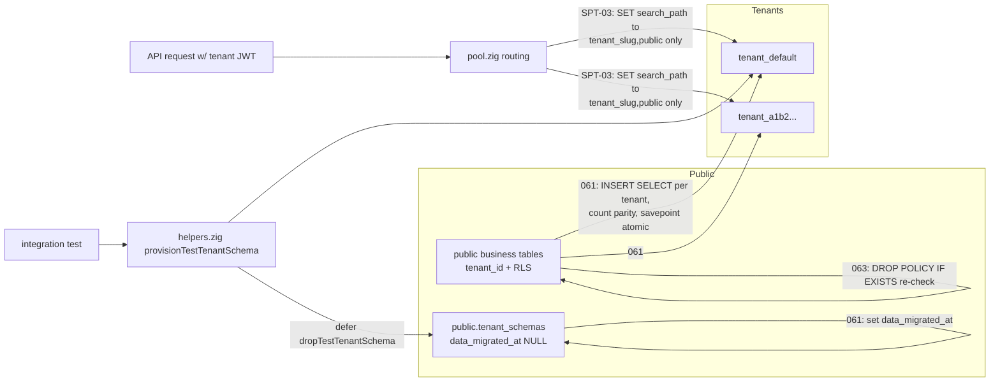

# Module: spt-02-03-04-schema-per-tenant-migration

**Requirement IDs:** SPT-02, SPT-03, SPT-04
**Run ID:** WF02-spt02-04-20260816
**Stage:** Schema-Per-Tenant Migration — data cutover, legacy removal, test-suite rework
**Classification (lego-catalog):** Type E for all three requirements (see §3)

---

## 1. Module purpose

This design completes the schema-per-tenant cutover that SPT-01 (migration 060) and the
ISS-501..504 series only scaffolded. SPT-02 migrates every existing tenant row out of the
`public` schema into per-tenant schemas (migration 061), then strips the legacy row-based
tenancy machinery — `tenant_id` columns, RLS policies, `bpm_effective_tenant_id()`, and
tenant-scoped composite indexes — from every public business table (migrations 062 and 063).
SPT-03 removes the backward-compatibility shims from the Zig codebase: the
`set_config('bpm.tenant_id', ...)` session-variable call in `src/db/pool.zig`, every
`WHERE tenant_id = $N` predicate, `tenant_id` bind parameter, INSERT column reference, and
struct field that targeted the now-dropped business-table columns. SPT-04 rewrites the
integration suite to the schema-isolated model — per-test provisioned schemas via
`provisionTenantSchema()` instead of explicit `tenant_id` rows — and re-runs the ADP-12
default-tenant regression suite against `tenant_default`. The artefact is design-only:
interface shapes, data-flow, error taxonomy, and a per-acceptance-criterion trace. No
implementation code is included; the SQL and Zig sketches below are specifications for
BACKEND-DEV, not executable code.

---

## 2. Verified current state (evidence gathered 2026-08-16)

The design below is grounded in the actual repository state, not the SPT-01 baseline. All
facts were verified by direct inspection.

| # | Fact | Evidence |
|---|---|---|
| F1 | No migrations `061`, `062`, `063` exist; the numeric chain jumps `060` → `069` (`081`–`088` also exist). The `061/062/063` slots are free and ordered after `060`, before `069`. | `migrations/` listing |
| F2 | `src/` carries **972** `tenant_id` references across **66** `.zig` files (the SPT-03 requirement estimated 37 files). | recursive `Select-String` count |
| F3 | `src/db/pool.zig` `applyRequestStorageRouting()` still has a `LEGACY_RLS` branch that executes `SELECT set_config('bpm.tenant_id', $1, false)` (line 298); the `SCHEMA` branch does not. `set_config('bpm.tenant_id'` appears only in `pool.zig` (6 occurrences incl. comments). | `pool.zig` lines 262–316 |
| F4 | `bpm_effective_tenant_id` appears 11× in `src/` Zig files (call sites plus comments). | recursive `Select-String` |
| F5 | `tests/integration/` carries **2369** `tenant_id` matches across **118** `.zig` files (the SPT-04 requirement estimated 2197). | recursive `Select-String` |
| F6 | `migrations/GBL-123_rls_removal.sql` (ISS-503) already drops RLS policies, `tenant_id` columns on public business tables, and `bpm_effective_tenant_id()`, gated by a pre-flight that zero production tenants remain in `LEGACY_RLS`. It does **not** copy data, does **not** cover `tenant_hostnames` (a public routing table that keeps `tenant_id`), and does not explicitly drop composite indexes (Postgres drops them implicitly via `DROP COLUMN`). | `GBL-123_rls_removal.sql` |
| F7 | `ISS-502`'s `executeSptCutover()` (`src/admin/tenant_migration.zig`) is a per-tenant, admin-triggered copy + verify + storage-mode flip. It does **not** satisfy SPT-02's bulk migration 061/062/063 acceptance criteria. | `src/design/iss502_spt_cutover.md` |
| F8 | Migration `087` flips only the default tenant to `SCHEMA`; `086` adds `storage_mode`; `1135` backfills it. `provisioning.zig` promotes every provisioned tenant to `SCHEMA` (Step 6a) and primes the thread-local `tenant_context`. | `migrations/086/087/1135`, `src/db/provisioning.zig` |
| F9 | The SPT-02 table list (`process_instances`, `tenant_hostnames`, `sessions`) does not match the current schema: `process_instances` does not exist (`instance_projections` + `tokens` + `tasks` in `005_instances.sql`); `sessions` has no `tenant_id`; `tenant_hostnames` is a global hostname→tenant routing table that must stay in `public`. | `migrations/005`, `008`, `050` |
| F10 | Migration ordering + scope: numeric files default to `all_schemas`; `GBL-` prefix = public-only with a +1000 order offset; an explicit `-- scope: public` header forces public-only. Per-tenant passes run every `all_schemas`/`tenant_only` migration inside each tenant schema. | `src/db/migrations.zig` `migrationOrder`/`migrationScope` |

---

## 3. Classification against the lego catalog

Selection rules applied in order (lego-catalog §Selection rules); the **first** matching
type wins, and Type E is chosen when none of A–D fits.

| Requirement | Candidate types | Decision | Rationale |
|---|---|---|---|
| SPT-02 | C (migration) | **Type E** | The migration needs a data backfill (DML mixed with DDL), dynamic per-tenant schema iteration, and a cross-tenant atomicity contract — lego-catalog §partial-fit explicitly tips "a data backfill beyond the `sql_setup` fixture mechanism" into Type E. |
| SPT-03 | — | **Type E** | Cross-cutting removal across ~66 `src/` files plus session-variable semantics; no Lego template exists for it. |
| SPT-04 | — | **Type E** | Cross-cutting integration-suite refactor plus a regression gate; no template. |

No Type A/B/C/D parameter files are emitted. `artifacts_out` for this step is a single Type E
prose artefact. CODE-DESIGN-VALIDATOR should lint it with `lint_design_artefact.py` (E-series
checks only — there is no YAML codegen to dry-run).

---

## 4. Table classification: business vs global registry

Every `tenant_id` reference must be classified before the design can say what to copy, what to
drop, and what to keep. The classification rule:

- **Class B — business tables (per-tenant canonical).** These live in the tenant schemas after
  SPT-01 provisioning; their `public` copies still carry a `tenant_id` column and RLS. SPT-02
  copies their rows into the tenant schema and SPT-03 removes every Zig reference to their
  `tenant_id` column. The `public` copies' `tenant_id` column is dropped by migration 062.
- **Class G — global registry tables (public canonical).** These legitimately retain their
  `tenant_id` column (or a tenant-scope column) in `public` forever. SPT-03 does **not** remove
  Zig predicates against them; they are the documented exceptions in §8.

### Class B — copy list for migration 061 (canonical start set)

`process_definitions`, `instance_projections`, `events`, `events_archive`, `tasks`, `timers`,
`tokens`, `audit_entries`, `audit_log`, `users`, `groups`, `group_members`, `roles`,
`user_roles`, `api_tokens`, `webhook_subscriptions`, `webhook_deliveries`,
`dead_letter_items`, `repository_form_schemas`, `instance_sequence`, `event_type_registry`,
`event_retention_policies`, `entity_record_latest`, `entity_record_events`, `promotion_reviews`,
`promotion_assertion_runs`, `solution_pack_installs` (PRM-09), `process_module_catalog`
(PLC-01), `repository_activations` (REPO-07), `artifact_activations` (XC-03).

### Class G — global registry tables that KEEP a tenant-scope column

`tenant`, `tenant_schemas`, `tenant_hostnames`, `tenant_realm_binding`, `schema_migrations`,
`onboarding_registry`, `platform_migrations_control_table`, `service_catalog`
(`owner_tenant_id`), `rate_limit_buckets`, `secrets` (EXP-501, `tenant_id TEXT`),
`tenant_idp_realm_id`, `role_permissions`, `user_roles` (system rows), and the
`users`/`groups`/`roles` tables *only in the registry sense* — see note below.

> **Implementation-time reconciliation (mandatory, F9):** BACKEND-DEV must reconcile the Class B
> list against the live database before writing migration 061: a table belongs in Class B iff it
> (a) exists in the tenant schema (`information_schema.tables` under the tenant schema), (b)
> still has a `tenant_id` column in `public`, and (c) is not in the Class G list. The design list
> is the start set; the `information_schema` reconciliation is authoritative. `process_instances`
> is **not** a real table — do not reference it.

> **Note on `users`/`groups`/`roles`:** these tables carry both per-tenant business rows and the
> system/user registry used by the identity layer. In the target architecture they are Class B
> (their rows are copied per tenant; `tenant_id` is dropped). The identity layer's *principal*
> `tenant_id` (from the JWT claim) is a runtime value, not a column, and is out of scope for
> column removal (see §8).

---

## 5. Migration 061 — data copy into tenant schemas

### 5.1 File and scope

`migrations/061_data_copy_into_tenant_schemas.sql`, header `-- scope: public`. It runs exactly
once in the public pass. It is **not** run per-tenant (it reads the public copies and writes
into tenant schemas).

### 5.2 Marker column

Migration 061 first extends the registry so the migration runner can distinguish "schema
provisioned, migrations applied" from "data copied":

```sql
ALTER TABLE tenant_schemas
    ADD COLUMN IF NOT EXISTS data_migrated_at TIMESTAMPTZ;
```

`tenant_schemas.data_migrated_at IS NOT NULL` means "this tenant's rows are fully copied". This
is the per-tenant detection point required by SPT-02 AC6 ("the partially-migrated tenant's data
is detected via the `public.tenant_schemas` row").

### 5.3 Algorithm (specification)

```
for each distinct tenant_id T present in the Class B public tables
    (and any tenant_schemas row whose tenant_id has no data rows yet):
  SAVEPOINT sp_T
  if tenant_schemas.data_migrated_at IS NOT NULL for T:
      RELEASE sp_T ; continue            # idempotent skip
  ensure tenant schema exists:
      PERFORM bpm_provision_tenant_schema(T)     # idempotent (060)
  for each Class B table tbl:
      EXECUTE format('INSERT INTO %I.%I SELECT * FROM public.%I
                      WHERE tenant_id = $1', schema(T), tbl, tbl) USING T
      row_count(tenant_schema.tbl) == row_count(public.tbl WHERE tenant_id = T)
          else RAISE EXCEPTION   # rolls back to sp_T
  UPDATE tenant_schemas SET data_migrated_at = NOW() WHERE tenant_id = T
  RELEASE sp_T
```

- **Atomicity per tenant:** each tenant's copy is wrapped in a savepoint; a failure inside one
  tenant rolls back only that tenant's work (`ROLLBACK TO SAVEPOINT sp_T`), leaving every other
  tenant untouched. This satisfies SPT-02 AC's "atomic per tenant (all tables for one tenant in
  a single transaction)" — implemented as per-tenant savepoint scopes because a `DO` block cannot
  issue nested `BEGIN`/`COMMIT` (same pattern as migration 069).
- **Idempotency (SPT-02 AC5):** re-running skips tenants whose `data_migrated_at` is set; the
  `CREATE SCHEMA IF NOT EXISTS`, `INSERT ... ON CONFLICT DO NOTHING` and `ADD COLUMN IF NOT
  EXISTS` guards make every statement a no-op on a migrated database.
- **Interruption (SPT-02 AC6):** a crash mid-tenant leaves that tenant's savepoint uncommitted
  (no partial rows) and `data_migrated_at` NULL; the runner re-attempts cleanly. A crash after a
  committed tenant leaves `data_migrated_at` set; the runner skips it. No duplication is possible
  because a row is either fully copied (marker set, same transaction/savepoint) or not at all.
- **Ordering of tenant passes:** migrations 069/070 have already provisioned every tenant schema
  and `runForSchema` has applied the per-tenant migrations, so every Class B table exists and is
  empty inside each tenant schema before 061 runs. The `INSERT ... SELECT *` column sets match
  because both sides derive from the same migration files (F10); `tenant_id` still exists on
  both sides at 061 time (062 drops it later).
- **Not copied:** `schema_migrations` (each tenant schema already carries its own ledger rows from
  `runForSchema`), and every Class G table.

### 5.4 Verification after 061

SPT-02 AC1/AC2: after 061, `tenant_schemas` has exactly N rows and N schemas
(`tenant_<uuid_no_hyphens>` or `tenant_default`) exist, and each tenant schema table contains
exactly the rows that belonged to that tenant in `public` (per-table count parity is enforced
inline during the copy; a post-run integrity check comparing `public` row counts by `tenant_id`
against tenant-schema counts is specified for the migration's integration test).

---

## 6. Migration 062 — remove `tenant_id`, RLS, function, indexes from public

### 6.1 File and scope

`migrations/062_remove_tenant_id_rls_from_public.sql`, header `-- scope: public`.

### 6.2 Pre-flight gate

A `DO` block aborts the migration (RAISE EXCEPTION) if any tenant_schemas row has
`data_migrated_at IS NULL` — i.e. 061 has not fully completed. This mirrors GBL-123's strict
guard and prevents dropping `tenant_id` before the data copy finishes. On a database where 061
already ran, the guard passes and the DDL proceeds (all idempotent).

### 6.3 DDL (specification, per Class B table)

```sql
ALTER TABLE <table> DISABLE ROW LEVEL SECURITY;
DROP POLICY IF EXISTS <policy_name> ON <table>;
ALTER TABLE <table> DROP COLUMN IF EXISTS tenant_id;
```

- Policy names: the known policy names from the RLS migrations (e.g.
  `process_definitions_tenant_policy`, `instance_projections_tenant_policy`,
  `tasks_tenant_policy`, `tokens_tenant_policy`, `audit_entries_tenant_policy`,
  `audit_log_tenant_policy`) plus any policy created by migrations 028/029/033/035/036/051.
  BACKEND-DEV reconciles against `pg_policies` at implementation time.
- **Composite indexes:** `DROP COLUMN tenant_id` implicitly drops every index that references the
  column, including the tenant-scoped composite indexes (`events(tenant_id, ...)`,
  `users(tenant_id, status, ...)`, `audit_entries(tenant_id, ...)`, etc.). As a belt-and-suspenders
  the migration also issues `DROP INDEX IF EXISTS <composite_name>` for the known names so the
  post-state is verifiable even if an index name drifted.
- **Function:** `DROP FUNCTION IF EXISTS bpm_effective_tenant_id() CASCADE;`
- **Relationship to GBL-123:** GBL-123 is a strict ISS-503-guarded superset/subset that already
  performs these drops; 062 re-states them with the *data-migration* pre-flight and explicit
  index drops. Both are idempotent and coexist; 062 is the SPT-canonical migration and GBL-123
  continues to serve the ISS-503 raw-file test (`test_iss503_rls_removal.zig` reads it directly).

---

## 7. Migration 063 — belt-and-suspenders policy drop

### 7.1 File and scope

`migrations/063_rls_policy_idempotency_recheck.sql`, header `-- scope: public`.

### 7.2 Content (specification)

- `DROP POLICY IF EXISTS <policy_name> ON <table>` re-issued for **every** previously-known
  policy name on every affected Class B table (SPT-02 AC4 — the belt-and-suspenders idempotency
  check).
- Re-assert the end state without failing a healthy re-run: a `DO` block that (a) re-issues
  `DROP FUNCTION IF EXISTS bpm_effective_tenant_id() CASCADE;`, and (b) reports via `RAISE
  NOTICE` (not EXCEPTION) if any Class B public table still has a `tenant_id` column or any
  policy still exists — so a re-run on a fully-migrated database exits 0 with the state unchanged
  (SPT-02 AC5), while a genuinely dirty state is surfaced to the operator.

---

## 8. SPT-03 — remove the legacy session variable and `tenant_id` predicates from `src/`

### 8.1 `src/db/pool.zig` — connection routing collapse

After 062, no business table has a `tenant_id` column and no RLS policy reads `bpm.tenant_id`,
so the `LEGACY_RLS` branch of `applyRequestStorageRouting()` is dead. The design collapses the
function to schema-only routing:

```
fn applyRequestStorageRouting(conn: *Conn) PoolError!void:
  tenant_id = currentRequestTenantId()
  if tenant_id.len == 0:
      SET search_path TO public
      return
  schema_name = schemaNameForTenant(tenant_id, buf)
  SET search_path TO <schema_name>,public
  SET bpm.pipeline_run_id = <pipeline_run_id>     # unchanged; not tenancy-related
```

- Removed: `SELECT set_config('bpm.tenant_id', $1, false)` (line 298), the `LEGACY_RLS` branch,
  and the `storage_mode` switch inside routing.
- Kept: `schemaNameForTenant()` (unchanged), the `bpm.pipeline_run_id` set_config (observability,
  unrelated to tenancy), `resetConnectionSearchPath()` (pool hygiene), and the remote-host
  redirect (`maybeRedirectToTenantHost`) which is tenancy-adjacent routing, not RLS.
- `storage_mode` resolution: the column and `resolveAndCacheStorageMode()` remain **only** where
  a non-routing consumer needs them — `provisioning.zig` (writes `SCHEMA`), `tenant_migration.zig`
  (reads it). The routing call site is removed. Whether to delete the resolver entirely is an open
  question (§16 OQ-4) because `iss107_tenant_storage_mode_test` and `tnt_schema_isolation_test`
  still assert routing branches (handled by SPT-04).

### 8.2 `tenant_id` reference triage (SPT-03 AC1/AC2/AC5)

The 972 `src/` references split into four classes; the design removes two and keeps two:

| Class | Meaning | Action |
|---|---|---|
| R1 | `set_config('bpm.tenant_id', ...)` and `bpm.tenant_id` session-variable strings | **Remove** (pool.zig; plus comments) |
| R2 | `bpm_effective_tenant_id()` call sites in Zig (11×) | **Remove** (function dropped by 062; any query relying on it must be re-expressed without the tenant predicate) |
| R3 | `tenant_id` predicates/binds/INSERT columns on **Class B** tables | **Remove** — `definition.zig`, `event_store`/`store.zig`, `engine`/`commands.zig`, `engine`/`projector.zig`, `tasks`, `obs/audit.zig`, `obs/timeline.zig`, `reconstruction.zig`, `registry.zig` user queries, `pack_update.zig`, `assertion_rerun.zig`, `promotion.zig` (tenant-scope rows), `rollback.zig`, `env`-related tenants, `loader.zig`, `onboarding.zig` (`tenant_hostnames` — see R4), `pin_resolver.zig` (tenant-scope rows only) |
| R4 | `tenant_id` predicates on **Class G** registry tables and `owner_tenant_id`/`production_tenant_id` columns | **Keep** — `tenant_schemas` (pool/provisioning/tenant_lifecycle/tenant_migration), `tenant_hostnames` (onboarding/tenant_lifecycle), `tenant_realm_binding` (tenant_lifecycle), `platform_migrations_control_table`, `promotion_assertion_runs` (registry), `service_catalog.owner_tenant_id`, `tenant.production_tenant_id` |

- **Struct fields:** remove `tenant_id` fields from Zig structs whose only purpose was to carry
  the dropped business-table column (AC2 — no unused-field warnings). Keep `tenant_id` on
  principal/JWT/claim structs (`identity/registry.zig` principal, `identity/service.zig`,
  `oidc/*`), which is runtime tenant context, not a DB column. After removing the SQL references,
  run `zig build` and delete any field the compiler flags as unused; do not delete principal
  fields.
- **`DEFAULT_TENANT_ID` constants** (`identity/registry.zig`, `obs/timeline.zig`) are **kept** —
  they are the all-zeros UUID used for `tenant_default` schema naming and default JWT claims.

### 8.3 SPT-03 AC1 — documented scope deviation (open question OQ-1)

The AC's grep `grep -r "bpm\.tenant_id\|set_config.*tenant\|WHERE tenant_id\|tenant_id = \$" src/`
is **unsatisfiable as written**: the Class G registry queries in `pool.zig`, `provisioning.zig`,
`tenant_lifecycle.zig`, and `tenant_migration.zig` legitimately contain `WHERE tenant_id = $N`
against `tenant_schemas`/`tenant_hostnames`/`tenant_realm_binding`, and any `owner_tenant_id = $N`
line contains the substring `tenant_id = $N`. There is no honest reformulation that avoids the
literal substrings while preserving those queries. The design therefore defines the **scoped
interpretation**: the AC is met when (a) no `bpm.tenant_id` / `set_config.*tenant` string remains,
(b) no `tenant_id` predicate/bind/INSERT references any **Class B** table, and (c) every remaining
`tenant_id` predicate targets a **Class G** table in the allow-list of §8.2 R4. This deviation
requires REQ-ANALYST / CODE-DESIGN-VALIDATOR confirmation before BACKEND-DEV implements (see
§16 OQ-1); the verification grep for implementation is `grep -rn "tenant_id" src/` followed by
manual allow-list triage against §8.2.

---

## 9. SPT-04 — test-suite update and ADP-12 regression

### 9.1 Test helper — `tests/integration/helpers.zig`

Add a provision+cleanup wrapper so tests stop inserting explicit `tenant_id` rows:

```zig
pub fn provisionTestTenantSchema(allocator, pool, tenant_id_str, migrations_dir) !void
//  - wraps bpm.provisioning.provisionTenantSchema() (idempotent)
//  - sets api_tenant_context so the pool routes to the new schema
//  - returns after schema tables exist and data_migrated_at is irrelevant (no data copy)

pub fn dropTestTenantSchema(conn, tenant_id_str) !void
//  - SELECT public.bpm_drop_tenant_schema($1)  (069)
//  - DROP SCHEMA <schema> CASCADE if the function row is absent (belt-and-suspenders)
```

Every test that provisions a schema registers `defer dropTestTenantSchema(...)` so the schema
and its `tenant_schemas` row are removed whether the test passes or fails (SPT-04 AC4 — no schema
leakage). The existing `TestHarness` rollback-per-test convention remains the primary isolation;
provisioned schemas are the tenant-context mechanism on top of it.

### 9.2 Suite rework

- Replace every explicit `INSERT ... (tenant_id, ...)` / `WHERE tenant_id = $N` / explicit
  `set_config('bpm.tenant_id', ...)` in the ~118 affected `tests/integration/` files with a
  per-test provisioned schema whose `search_path` supplies isolation (SPT-04 AC1: no residual
  `tenant_id` fixture references).
- Highest-impact files: `adp02_tenant_scope_test.zig` and `adp03_tenant_context_resolution_test.zig`
  (they use `bpm_effective_tenant_id()` and `set_config('bpm.tenant_id', ...)` directly),
  `env02/03/05`, `par06`, `pin01`, `prm01`, `tnt_backfill_export_cleanup_test.zig`,
  `main_test.zig`, plus the two SPT-regression files (`test_iss503_rls_removal.zig` reads
  GBL-123's raw SQL and is adjusted only if 062/063 change the file it reads — they do not change
  GBL-123, so it stays).
- `iss107_tenant_storage_mode_test.zig` and `tnt_schema_isolation_test.zig` assert
  storage-mode routing branches that SPT-03 collapses; these tests are updated to assert
  schema-only routing (see OQ-4).
- Unit suite (`zig build test`) must stay green with no `tenant_id`-related compile fallout from
  the §8 struct-field removals (SPT-04 AC5).

### 9.3 ADP-12 regression

`adp12_default_tenant_regression_test.zig` runs its scenario matrix against the default tenant
(already routed to `tenant_default` via the `00000000-...` context in `makePool`). The design
requires: (a) confirm `tests/integration/support/regression_matrix.zig`,
`response_canonicalizer.zig`, and `migration_window_orchestrator.zig` are schema-agnostic (no
`tenant_id` fixtures), (b) run the full ADP-12 matrix against `tenant_default` after SPT-03 lands,
(c) every scenario PASS with no BLOCKER/MAJOR (SPT-04 AC3).

---

## 10. Public interface

### 10.1 SQL migrations (new files)

| File | Scope header | Effect |
|---|---|---|
| `migrations/061_data_copy_into_tenant_schemas.sql` | `-- scope: public` | Adds `tenant_schemas.data_migrated_at`; per-tenant copy + count parity + marker |
| `migrations/062_remove_tenant_id_rls_from_public.sql` | `-- scope: public` | Pre-flight; drop RLS/tenant_id/composite indexes/`bpm_effective_tenant_id()` on Class B tables |
| `migrations/063_rls_policy_idempotency_recheck.sql` | `-- scope: public` | Re-issue `DROP POLICY IF EXISTS`; NOTICE re-check; idempotent |

All three are run by the existing public-pass runner (`zig build migrate`); no runner change is
needed. They must pass `lint_migration_schema.py` (public scope header present; no unqualified
business-table DDL in a public-only file — the `EXECUTE format(...)` dynamic DDL is exempt by
construction because `%I` interpolation is used, matching migration 069's precedent).

### 10.2 Zig signatures

```zig
// src/db/pool.zig — collapsed routing (signature unchanged, behaviour changed)
fn applyRequestStorageRouting(conn: *Conn) PoolError!void;

// src/db/pool.zig — unchanged
pub fn schemaNameForTenant(tenant_id: []const u8, buf: *[80]u8) []const u8;

// src/db/provisioning.zig — unchanged
pub fn provisionTenantSchema(allocator, pool, tenant_id_str, migrations_dir) ProvisionError!void;

// tests/integration/helpers.zig — new test helpers (specification)
pub fn provisionTestTenantSchema(allocator, pool, tenant_id_str, migrations_dir) !void;
pub fn dropTestTenantSchema(conn, tenant_id_str) !void;
```

### 10.3 Data shape

`tenant_schemas` gains `data_migrated_at TIMESTAMPTZ NULL` (SPT-02 AC6 detection point). No other
schema shape changes are introduced by this design; 062 removes columns, 063 removes policies.

---

## 11. Data flow



---

## 12. State transitions

| Entity | Start (SPT-01/ISS-5xx) | SPT-02 (061–063) | SPT-03 (code) | SPT-04 (tests) |
|---|---|---|---|---|
| `tenant_schemas.data_migrated_at` | absent / NULL | NULL → NOW() per tenant, atomically | — | — |
| public Class B table | has `tenant_id`, RLS on | 062: no `tenant_id`, RLS off | — | — |
| `bpm_effective_tenant_id()` | exists | 062/063: dropped | no Zig call sites | no test call sites |
| `storage_mode` | `LEGACY_RLS`/`SCHEMA` | all `SCHEMA` (pre-flight) | routing no longer branches on it | routing-branch tests updated |
| `pool.zig` routing | branches on storage_mode, sets `bpm.tenant_id` | — | schema-only, no `bpm.tenant_id` | — |
| test fixtures | explicit `tenant_id` rows | — | — | per-test provisioned schemas |

---

## 13. Error taxonomy

| Error | Source | Recovery |
|---|---|---|
| `TenantDataCopyFailed` (061, per-tenant savepoint) | `INSERT ... SELECT` into tenant schema fails (PK/unique/type) | `ROLLBACK TO SAVEPOINT sp_T`; tenant stays `data_migrated_at NULL`; operator reconciles tenant schema, re-run |
| `RowCountMismatch` (061) | copied count ≠ public count for a table | same savepoint rollback; re-run after reconciliation |
| `MissingTenantSchema` (061) | `bpm_provision_tenant_schema` failed (permission/lock) | surfaced as migration failure; runner does not record the file; operator fixes and re-runs |
| `DataMigrationIncomplete` (062 pre-flight) | some `tenant_schemas.data_migrated_at IS NULL` | migration aborts atomically; finish 061 first |
| `ResidualTenantId` (063) | a Class B table still has `tenant_id` or a policy | `RAISE NOTICE` (re-run stays green); operator inspects |
| `PoolError.QueryFailed` (SPT-03 routing) | `SET search_path` fails on checkout | connection marked invalid; reacquired |
| test-harness provisioning failure (SPT-04) | `provisionTenantSchema`/`bpm_drop_tenant_schema` error | per-test failure is reported; `defer` cleanup still runs |
| `MigrationScopeMismatch` (runner, all 061–063) | misdeclared `-- scope:` header vs unqualified table use | fixed in the file before commit; runner refuses to apply |

---

## 14. Dependencies

- **061 depends on:** migration 060 (`tenant_schemas`, `bpm_provision_tenant_schema`), migrations
  069/070 (tenant schemas provisioned), per-tenant migration application (`runForSchema` — tenant
  schema tables exist and are empty), ISS-502 cutover/087 (all tenants routed to SCHEMA before the
  copy).
- **062 depends on:** 061 fully complete (pre-flight reads `data_migrated_at`).
- **063 depends on:** 062 applied (idempotent re-check).
- **SPT-03 depends on:** 062 applied (business tables no longer have `tenant_id`); must not run
  before 062 or the removed predicates would break queries against tables that still carry the
  column.
- **SPT-04 depends on:** SPT-03 compiling (AC5) and the schema-isolated routing; ADP-12 depends on
  `tenant_default` being provisioned (060/069) and the regression matrix being schema-agnostic.
- **Must not depend on:** `process_instances` (does not exist, F9); anything that would re-insert
  `bpm.tenant_id` (the session variable is gone after SPT-03).

---

## 15. Acceptance-criterion traceability

### SPT-02

| AC | Trace |
|---|---|
| AC1 — N distinct tenant IDs → N `tenant_schemas` rows and N schemas | §5.3 iteration over distinct tenant IDs; §5.4 post-copy verification |
| AC2 — each tenant schema table contains exactly that tenant's rows | §5.3 inline count-parity per table; §5.4 integrity check |
| AC3 — after 062 no `tenant_id` column, no function, no RLS, no composite indexes | §6.3 DDL (DROP COLUMN drops composite indexes implicitly; explicit index drops) |
| AC4 — after 063 `DROP POLICY IF EXISTS` for every known policy | §7.2 policy re-check |
| AC5 — full idempotency on re-run | §5.2/§5.3 marker + `IF EXISTS` guards; §6/§7 idempotent DDL |
| AC6 — interrupted copy detected via `tenant_schemas` row, clean retry | §5.2 `data_migrated_at` detection point; §5.3 savepoint atomicity |

### SPT-03

| AC | Trace |
|---|---|
| AC1 — grep finds no `bpm.tenant_id`/`set_config.*tenant`/`WHERE tenant_id`/`tenant_id = $` in `src/` | §8.2 R1–R3 removal + §8.3 scoped interpretation + OQ-1 (literal AC unsatisfiable) |
| AC2 — `zig build` exits 0, no unused `tenant_id` fields | §8.2 struct-field triage; §8.3 verification step |
| AC3 — tenant JWT → correct `current_schema()`, no `bpm.tenant_id` variable | §8.1 schema-only routing; removes the variable entirely |
| AC4 — two concurrent requests isolated via `search_path` | §8.1 per-connection `SET search_path TO <schema>,public`; pool reset on release (unchanged) |
| AC5 — `zig build test` passes | §8.2 field removal followed by full unit run (also SPT-04 AC5) |

### SPT-04

| AC | Trace |
|---|---|
| AC1 — no residual `tenant_id` in `tests/integration/` | §9.2 suite rework (118 files) + §9.1 helper |
| AC2 — `zig build test-integration` passes without skips on MUST coverage | §9.2 reworked fixtures; regression files re-validated |
| AC3 — ADP-12 all scenarios PASS, no BLOCKER/MAJOR | §9.3 ADP-12 run against `tenant_default` |
| AC4 — provisioned schema + `tenant_schemas` row cleaned up | §9.1 `dropTestTenantSchema` + `defer` cleanup |
| AC5 — `zig build test` exits 0 | §9.2 unit-suite guard |

---

## 16. Open questions

These require REQ-ANALYST / CODE-DESIGN-VALIDATOR confirmation before BACKEND-DEV implements.
They do not block the design; each has a documented proposed resolution.

- **OQ-1 (SPT-03 AC1 — scope, MAJOR):** the literal AC grep is unsatisfiable because Class G
  registry queries (`tenant_schemas`, `tenant_hostnames`, `tenant_realm_binding`, ...) and
  `owner_tenant_id` lines necessarily contain `WHERE tenant_id = $N` / `tenant_id = $N`
  substrings. Proposed resolution: re-scope AC1 to "no `bpm.tenant_id`/`set_config.*tenant`
  and no `tenant_id` reference on Class B business tables", with the Class G allow-list of §8.2
  R4 as the documented exception. Needs sign-off.
- **OQ-2 (SPT-02 table list — MAJOR):** the requirement's list (`process_instances`,
  `tenant_hostnames`, `sessions`) does not match the schema (F9). Proposed resolution: use the
  Class B reconciliation of §4 as authoritative. Needs sign-off.
- **OQ-3 (062 vs GBL-123):** GBL-123 already performs most of 062's DDL under an ISS-503 guard.
  Proposed resolution: both coexist (idempotent); 062 adds the data-migration pre-flight and
  explicit composite-index drops. Confirm no consolidation is required.
- **OQ-4 (`storage_mode` after SPT-03):** routing stops branching on `storage_mode`, but the
  column stays for `provisioning.zig`/`tenant_migration.zig` and for ISS-107 tests. Proposed
  resolution: keep the column and its writers/readers, remove only the routing call site;
  `iss107`/`tnt_schema_isolation` tests re-assert schema-only routing (SPT-04). Confirm whether
  the resolver (`resolveAndCacheStorageMode`) should be deleted outright.
- **OQ-5 (migration scope headers):** 061–063 are public-pass migrations that reference business
  tables by unqualified name inside `EXECUTE format(...)` and inside Class B DDL. The runner's
  public-scope misclassification guard (F10) must accept the `-- scope: public` header here
  because the DDL is dynamic `%I`-interpolated (migration 069 precedent). Confirm no runner
  change is needed.
