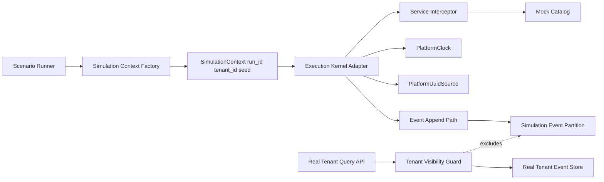

# Module: Stage 11 Simulation Core (SIM-01 through SIM-04)

## Module Purpose

This module defines the simulation execution boundary used by the test runner to execute process scenarios in deterministic isolation. It introduces an internal simulation tenant context, a no-network service call interceptor backed by scenario mock catalogs, a scenario-controlled time source, and a seeded deterministic UUID source. The design guarantees that simulation runs are reproducible and cannot leak events or side effects into real tenant data paths.

---

## Requirement Coverage Matrix

| Requirement | Design Elements | Acceptance Mapping |
|---|---|---|
| SIM-01 Simulation tenant | `simulation/context.zig`, `simulation/tenant_store.zig`, tenant visibility guards in event read paths | Simulation events are persisted only under simulation context and excluded from real tenant event queries |
| SIM-02 Service mocking | `simulation/service_interceptor.zig`, `simulation/mock_catalog.zig` | Service calls resolve from scenario mocks; no outbound network adapter is reachable in simulation mode |
| SIM-03 Time control | `simulation/time_source.zig`, scheduler/test-runner integration via `PlatformClock` | `platform.now()` reads scenario-controlled time; scenario steps can advance time deterministically |
| SIM-04 Deterministic UUIDs | `simulation/uuid_source.zig` seeded generator and run-scope sequence | Identical scenario + seed produces identical UUID sequence across runs |

---

## Module Boundaries

### In Scope

- Simulation-only execution context and run metadata.
- Event storage partitioning for simulation visibility isolation.
- Service call interception and mock response lookup.
- Deterministic time and UUID provider injection into execution paths.

### Out of Scope

- Real tenant runtime behavior outside simulation mode.
- Scenario schema validation (covered by SIM-05).
- Assertion engine semantics (covered by SIM-06).
- Database schema migration details and SQL definitions.

---

## Public Interface

### Zig Interfaces

```zig
pub const SimulationRunId = [16]u8;
pub const TenantId = [16]u8;

pub const SimulationSeed = struct {
    uuid_seed: u64,
    time_epoch_ms: i64,
};

pub const SimulationContext = struct {
    run_id: SimulationRunId,
    simulation_tenant_id: TenantId,
    seed: SimulationSeed,
    now_ms: i64,
};

pub const PlatformClock = struct {
    pub fn nowMs(self: *const PlatformClock) i64;
    pub fn advanceMs(self: *PlatformClock, delta_ms: i64) SimulationError!void;
    pub fn setMs(self: *PlatformClock, absolute_ms: i64) SimulationError!void;
};

pub const PlatformUuidSource = struct {
    pub fn nextUuidV4(self: *PlatformUuidSource) SimulationError![36]u8;
};

pub const ServiceMockCatalog = struct {
    pub fn resolve(
        self: *const ServiceMockCatalog,
        service_key: []const u8,
        request_fingerprint: []const u8,
    ) SimulationError!MockResponse;
};

pub fn beginSimulationRun(
    allocator: std.mem.Allocator,
    seed: SimulationSeed,
    scenario_id: []const u8,
) SimulationError!SimulationContext;

pub fn appendSimulationEvent(
    allocator: std.mem.Allocator,
    ctx: *const SimulationContext,
    event: EventAppendInput,
) SimulationError!EventRecord;

pub fn queryTenantEvents(
    allocator: std.mem.Allocator,
    tenant_id: TenantId,
    filter: EventQueryFilter,
) SimulationError![]EventRecord;

pub fn executeMockedServiceCall(
    allocator: std.mem.Allocator,
    ctx: *const SimulationContext,
    service_key: []const u8,
    request: ServiceRequest,
) SimulationError!MockResponse;
```

### Scenario Runner Integration Contract

```typescript
export interface SimulationRunConfig {
  scenarioId: string;
  uuidSeed: number;
  startTimeMs: number;
  mockCatalogRef: string;
}

export interface SimulationControlApi {
  advanceTimeMs(deltaMs: number): Promise<void>;
  setTimeMs(absoluteMs: number): Promise<void>;
  currentTimeMs(): Promise<number>;
}
```

No function bodies are defined in this design artifact.

---

## Data Types

- SimulationContext: Immutable run identity plus mutable deterministic clocks/sequences owned by a single run.
- ServiceRequest fingerprint: Canonical key derived from service identifier + normalized request payload; used only for mock lookup determinism.
- MockResponse: Structured response payload with status, headers, and body loaded from scenario catalog.
- Simulation visibility flag: Internal partition marker binding simulation events to simulation tenant context.

---

## Input Validation and Failure Responses

All user-provided simulation inputs are validated at module boundaries before any state mutation or side-effect-capable path is entered.

### Input Vectors and Constraints

| Input Vector | Entry Path | Constraints | Failure Error(s) |
|---|---|---|---|
| `scenario_id` | `beginSimulationRun(..., scenario_id)` and `SimulationRunConfig.scenarioId` | Required; UTF-8; length 1..128 bytes; pattern `^[A-Za-z0-9][A-Za-z0-9._:-]{0,127}$`; must resolve to an existing scenario definition visible to simulation runner | `InvalidScenarioId`, `ScenarioNotFound` |
| `uuid_seed` | `SimulationRunConfig.uuidSeed` -> `SimulationSeed.uuid_seed` | Required; unsigned 64-bit integer; must be provided explicitly (no implicit random default in simulation mode) | `DeterministicUuidSeedInvalid` |
| `start_time_ms` / `time_epoch_ms` | `SimulationRunConfig.startTimeMs` -> `SimulationSeed.time_epoch_ms` | Required; signed 64-bit integer; must be within platform timestamp domain; overflow/underflow values rejected | `InvalidSimulationTimeAdvance`, `SimulationTimeOverflow` |
| `mock_catalog_ref` | `SimulationRunConfig.mockCatalogRef` | Required; UTF-8; length 1..256 bytes; canonical catalog identifier format `^[A-Za-z0-9][A-Za-z0-9._:/-]{0,255}$`; must resolve to a readable mock catalog | `MockCatalogMissing`, `ScenarioContractViolation` |
| `service_key` | `executeMockedServiceCall(..., service_key, ...)`, `ServiceMockCatalog.resolve(..., service_key, ...)` | Required; UTF-8; length 1..128 bytes; canonical key format `^[a-z0-9][a-z0-9._-]{0,127}$`; no whitespace; compared as exact key (no case folding) to preserve determinism | `InvalidServiceKey`, `MockResponseNotFound` |
| `request_fingerprint` | `ServiceMockCatalog.resolve(..., request_fingerprint)` | Required; lowercase hex digest; exact length 64 chars; pattern `^[0-9a-f]{64}$`; fingerprint must be computed from canonical request serialization before lookup | `InvalidRequestFingerprint`, `MockResponseNotFound` |

### Failure Behavior Contract

- Validation failures are fail-fast and terminate the active call with a typed `SimulationError`.
- On any validation failure, the module performs no event append, no network call, no clock mutation, and no UUID sequence advancement.
- Unknown `service_key` or unmatched `request_fingerprint` are deterministic misses and return typed mock-resolution errors rather than falling back to real network execution.
- Invalid run-initialization inputs reject run creation and do not allocate a simulation tenant context.

### Error-to-Behavior Mapping

| Error | Trigger | Required Behavior |
|---|---|---|
| `InvalidScenarioId` | `scenario_id` absent/format-invalid | Reject run initialization immediately |
| `ScenarioNotFound` | `scenario_id` syntactically valid but not found | Reject run initialization immediately |
| `InvalidServiceKey` | `service_key` absent/format-invalid | Reject service call before mock lookup |
| `InvalidRequestFingerprint` | fingerprint absent/format-invalid | Reject mock resolve before catalog query |
| `MockResponseNotFound` | valid key+fingerprint not present in catalog | Return deterministic miss; no network fallback |
| `DeterministicUuidSeedInvalid` | seed absent/invalid domain | Reject run initialization |
| `InvalidSimulationTimeAdvance` | invalid time move request (e.g. policy violation) | Reject time mutation; keep previous `now_ms` |
| `SimulationTimeOverflow` | time set/advance exceeds numeric domain | Reject time mutation; keep previous `now_ms` |

---

## Data Flow Diagram



---

## State Transitions

Simulation run lifecycle:

```text
CREATED -> INITIALIZED -> RUNNING -> COMPLETED
                       -> FAILED
```

Rules:

- CREATED: run metadata accepted, seed registered.
- INITIALIZED: simulation tenant context and deterministic providers attached.
- RUNNING: scenario actions execute, events append to simulation partition only.
- COMPLETED: all expected actions/assertions finished.
- FAILED: terminal state for mock miss, invalid time operation, deterministic sequence violations, or unexpected runtime errors.

Time state transitions:

- Time can move only through explicit `advanceMs` or `setMs` calls in simulation mode.
- Wall clock reads are forbidden while simulation context is active.

UUID state transitions:

- Sequence starts at seed-derived initial state on run start.
- Every `nextUuidV4` increments sequence index by one.
- Sequence cannot be reset during RUNNING.

---

## Error Taxonomy

```zig
pub const SimulationError = error{
    InvalidScenarioId,
    ScenarioNotFound,
    InvalidServiceKey,
    InvalidRequestFingerprint,
    InvalidSimulationContext,
    SimulationTenantIsolationViolation,
    SimulationVisibilityViolation,
    MockCatalogMissing,
    MockResponseNotFound,
    NetworkCallForbiddenInSimulation,
    InvalidSimulationTimeAdvance,
    SimulationTimeOverflow,
    DeterministicUuidSeedInvalid,
    DeterministicUuidSequenceExhausted,
    ScenarioContractViolation,
    PersistenceFailure,
    SerializationFailure,
    OutOfMemory,
};
```

Error intent:

- Isolation errors: any attempt to read/write simulation events through non-simulation tenant paths.
- Mocking errors: missing catalog entry or attempted real network usage in simulation.
- Time errors: illegal negative/overflow adjustments when policy forbids them.
- UUID errors: invalid seed material or exhausted deterministic sequence budget.
- Contract errors: scenario input does not satisfy required runtime contract.

---

## Dependencies

### Upstream Dependencies

- Event store append/query abstractions from Stage 1.
- Tenant isolation model from ADP-04 and tenant context resolution from ADP-03.
- Service task invocation path from EXT-01 and Lua service call path from LUA-12.
- Scheduler time consumers from SCH-02.
- UUID consumers in EE-01 instance start path.

### Internal Module Dependencies

- `simulation/context.zig` depends on `simulation/time_source.zig`, `simulation/uuid_source.zig`.
- `simulation/service_interceptor.zig` depends on `simulation/mock_catalog.zig` and service task adapter contracts.
- `simulation/tenant_store.zig` depends on event repository interfaces and tenant visibility guards.

### Must Not Depend On

- Direct HTTP client or socket modules from simulation service call path.
- Wall-clock OS time APIs while simulation context is active.
- Non-deterministic random UUID generation while simulation context is active.

---

## Key Invariants

- Simulation events are never visible in real tenant event queries.
- Simulation mode never performs outbound network calls.
- `platform.now()` in simulation is fully scenario-controlled.
- `platform.uuid()` in simulation is deterministic for the same seed and scenario action order.
- Determinism is per run configuration: same inputs produce byte-equivalent event and UUID sequences.

---

## Open Questions

- Should simulation event partitioning be implemented as a dedicated internal tenant identifier or as a separate physical storage namespace, as long as visibility guarantees remain identical?
- Should deterministic UUID generation guarantee an unbounded stream (counter-based) or a bounded precomputed sequence with explicit exhaustion semantics?
