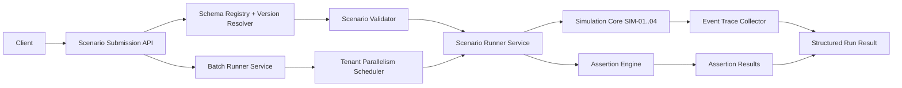

# Module: Stage 11 Scenario Schema and Runner (SIM-05 through SIM-08)

## Module Purpose

This module defines the contract and orchestration model for simulation scenarios in Stage 11. It standardizes scenario payload schema and versioning, defines assertion semantics, and specifies single-run and batch-run execution APIs that produce deterministic and diagnosable test outcomes. The design emphasizes strong submission-time validation, per-assertion verdict reporting, and tenant-safe parallel execution for batch workloads.

---

## Classification Summary (Lego Catalog)

| Requirement | Chosen Type | Why |
|---|---|---|
| SIM-05 Scenario schema | E | Schema lifecycle, versioning, and structured validation errors require custom logic beyond CRUD wiring. |
| SIM-06 Assertion vocabulary | E | Wildcard event matching and negative assertions require a dedicated assertion engine. |
| SIM-07 Scenario runner | E | `POST /test/run` orchestrates validation, execution, and assertion evaluation; not a 1:1 store route. |
| SIM-08 Batch execution | E | Tenant-scoped parallel scheduling and aggregate reporting are orchestration logic, not CRUD. |

No Type A-D parameter file is used because SIM-05..SIM-08 do not satisfy first-fit template rules without masking required logic.

---

## Requirement Coverage Matrix

| Requirement | Design Elements | Acceptance Mapping |
|---|---|---|
| SIM-05 | `ScenarioSchemaRegistry`, `ScenarioValidator`, `SchemaVersionRef`, structured problem response | Versioned schema is enforced on submission; invalid scenarios are rejected with structured validation details. |
| SIM-06 | `AssertionSpec`, `AssertionEngine`, `EventPatternMatcher`, `ForbiddenEventRule` | Covers sequence wildcard assertions, final variables/status, task assignments, and forbidden events with pass/fail outcomes. |
| SIM-07 | `POST /test/run`, `ScenarioRunService.runOne`, `ScenarioRunResult` | Returns per-assertion pass/fail, full event trace, and elapsed time for one scenario. |
| SIM-08 | `POST /test/run-batch`, `BatchRunService.runAll`, `TenantParallelismPolicy` | Supports batch execution with per-tenant parallelism and faster-than-sequential runtime profile. |

---

## Public Interface

### HTTP Contracts

```text
POST /test/run
POST /test/run-batch
POST /test/scenarios/validate
GET  /test/scenarios/schema/:name/:version
```

### Access-Control Contracts (Mandatory)

All endpoints are authenticated and tenant-scoped. Access-control checks are required at both API middleware and service-layer entrypoints.

| Endpoint | AuthN | Required Permission | Tenant Scope Rule |
|---|---|---|---|
| `POST /test/run` | Bearer token required | `simulation:run` | Caller can run only against definitions in caller tenant. |
| `POST /test/run-batch` | Bearer token required | `simulation:run_batch` | All scenarios in batch must belong to caller tenant; mixed-tenant payload is rejected. |
| `POST /test/scenarios/validate` | Bearer token required | `simulation:validate` | Validation uses schema/definition metadata visible to caller tenant only. |
| `GET /test/scenarios/schema/:name/:version` | Bearer token required | `simulation:schema_read` | Schema read allowed only if schema is global-public or mapped to caller tenant. |

Authorization failures return RFC 9457 problem responses:
- `401 Unauthorized` when token is absent/invalid.
- `403 Forbidden` when permission is missing.
- `404 Not Found` for cross-tenant resource probing where tenant isolation requires non-disclosure.

### TypeScript API Shapes

```typescript
export interface SchemaVersionRef {
  name: string;
  version: string;
}

export interface ScenarioSubmission {
  schema: SchemaVersionRef;
  definitionRef: { definitionId: string; version: string };
  initialVariables: Record<string, unknown>;
  actions: ScenarioAction[];
  mocks: ServiceMockSpec[];
  assertions: AssertionSpec[];
}

export type AssertionSpec =
  | EventSequenceAssertion
  | FinalVariablesAssertion
  | FinalInstanceStatusAssertion
  | TaskAssignmentsAssertion
  | ForbiddenEventsAssertion;
```

```typescript
export interface EventSequenceAssertion {
  id: string;
  type: "event_sequence";
  expected: EventPattern[];
}

export interface FinalVariablesAssertion {
  id: string;
  type: "final_variables";
  expected: Record<string, unknown>;
}

export interface FinalInstanceStatusAssertion {
  id: string;
  type: "final_status";
  expected: "RUNNING" | "COMPLETED" | "FAILED" | "CANCELLED";
}
```

```typescript
export interface TaskAssignmentsAssertion {
  id: string;
  type: "task_assignments";
  expected: Array<{ taskKey: string; assigneeType: string; assigneeRef: string }>;
}

export interface ForbiddenEventsAssertion {
  id: string;
  type: "forbidden_events";
  forbidden: EventPattern[];
}

export interface AssertionResult {
  assertionId: string;
  assertionType: AssertionSpec["type"];
  passed: boolean;
  expected?: unknown;
  actual?: unknown;
}
```

```typescript
export interface ScenarioRunResult {
  runId: string;
  passed: boolean;
  elapsedMs: number;
  assertionResults: AssertionResult[];
  eventTrace: ScenarioEventTraceEntry[];
}

export interface BatchRunRequest {
  schema: SchemaVersionRef;
  definitionRef: { definitionId: string; version: string };
  scenarios: ScenarioSubmission[];
  parallelism: { perTenant: number };
}

export interface BatchRunResult {
  batchRunId: string;
  total: number;
  passed: number;
  failed: number;
  elapsedMs: number;
  scenarioResults: ScenarioRunResult[];
}
```

### Zig Service Interfaces

```zig
pub const ScenarioSchemaError = error{
    SchemaNotFound,
    UnsupportedSchemaVersion,
    ScenarioValidationFailed,
    InvalidScenarioPayload,
};

pub const AssertionError = error{
    UnknownAssertionType,
    AssertionEvaluationFailed,
    EventSequenceMismatch,
    FinalStateMismatch,
    ForbiddenEventObserved,
    TaskAssignmentMismatch,
};
```

```zig
pub const RunnerError = error{
    DefinitionNotFound,
    DefinitionVersionNotFound,
  Unauthorized,
  Forbidden,
  TenantAccessDenied,
    InvalidParallelism,
    SimulationExecutionFailed,
    Timeout,
};

pub const ScenarioRunInput = struct {
  actor_user_id: []const u8,
  actor_tenant_id: []const u8,
  actor_permissions: []const []const u8,
    schema_name: []const u8,
    schema_version: []const u8,
    definition_id: []const u8,
    definition_version: []const u8,
    scenario_payload_json: []const u8,
};
```

```zig
pub const BatchRunInput = struct {
  actor_user_id: []const u8,
  actor_tenant_id: []const u8,
  actor_permissions: []const []const u8,
    schema_name: []const u8,
    schema_version: []const u8,
    definition_id: []const u8,
    definition_version: []const u8,
    scenarios_json: []const u8,
    tenant_parallelism: u16,
};

pub fn validateScenarioSubmission(
    allocator: std.mem.Allocator,
    submission: ScenarioRunInput,
) (ScenarioSchemaError || error{OutOfMemory})!void;
```

```zig
pub fn runScenario(
    allocator: std.mem.Allocator,
    input: ScenarioRunInput,
) (ScenarioSchemaError || AssertionError || RunnerError || error{OutOfMemory})!ScenarioRunResult;

pub fn runScenarioBatch(
    allocator: std.mem.Allocator,
    input: BatchRunInput,
) (ScenarioSchemaError || AssertionError || RunnerError || error{OutOfMemory})!BatchRunResult;
```

No implementation bodies are defined in this design artifact.

---

## Data Flow Diagram



---

## State Transitions

### Scenario Submission Lifecycle

```text
RECEIVED -> SCHEMA_RESOLVED -> VALIDATED -> READY_TO_RUN
     \-> REJECTED (schema/version/validation error)
```

### Single Run Lifecycle

```text
PENDING -> EXECUTING -> ASSERTING -> PASSED
                            \-> FAILED
```

### Batch Lifecycle

```text
PENDING -> SCHEDULING -> RUNNING_PARALLEL -> AGGREGATING -> COMPLETED
                                     \-> FAILED
```

Rules:
- Validation rejection occurs before simulation execution begins.
- Single-run failures still include full trace and assertion-level diagnostics.
- Batch-level failure is reserved for orchestration faults; scenario-level failures stay in `scenarioResults`.
- Access-control denial occurs before scenario validation/execution and must not leak cross-tenant existence details.

---

## Error Taxonomy

```zig
pub const SimulationTestError = error{
  Unauthorized,
  Forbidden,
  TenantAccessDenied,
    SchemaNotFound,
    UnsupportedSchemaVersion,
    ScenarioValidationFailed,
    UnknownAssertionType,
    EventSequenceMismatch,
    FinalVariablesMismatch,
    FinalInstanceStatusMismatch,
    TaskAssignmentMismatch,
    ForbiddenEventObserved,
    DefinitionNotFound,
    DefinitionVersionNotFound,
    InvalidParallelism,
    BatchSchedulingFailure,
    SimulationExecutionFailed,
    Timeout,
    SerializationFailure,
    OutOfMemory,
};
```

---

## Dependencies

### Required Dependencies

- Simulation core from SIM-01..SIM-04 (isolated execution context, deterministic time/uuid, service interception).
- Definition repository lookup path from Stage 10 for version resolution.
- Schema registry from REPO-05 for scenario schema name/version retrieval.
- API auth middleware (`auth.zig`) and RBAC middleware (`rbac.zig`) for bearer-token validation and permission checks.
- Tenant-resolution source from authenticated principal context (tenant ID is mandatory input to all runner services).
- Platform Problem Details formatter for structured validation errors.

### Security Boundaries

- API boundary: every endpoint above is protected by auth + RBAC middleware before route handler logic executes.
- Service boundary: `runScenario`, `runScenarioBatch`, and `validateScenarioSubmission` re-check tenant scope and required permissions; middleware-only enforcement is insufficient.
- Data boundary: repository reads for definitions/schemas/results are tenant-filtered using `actor_tenant_id`; cross-tenant IDs must not be dereferenced.
- Scheduler boundary for SIM-08: per-tenant parallelism queues are isolated; one tenant cannot consume another tenant's worker budget.
- Audit boundary: every `simulation:run*` request emits an audit event with actor, tenant, definition version, and run/batch id.

### Must Not Depend On

- Real-tenant execution paths that bypass simulation isolation.
- Unbounded global parallel workers across tenants.
- Wall-clock/random providers inside deterministic simulation runs.

---

## Testability Contract (for TEST-DESIGNER)

- `event_sequence`: wildcard and strict-order pass/fail cases.
- `final_variables`: expected-vs-actual variable map cases.
- `final_status`: status equality pass/fail cases.
- `task_assignments`: tuple matching pass/fail cases.
- `forbidden_events`: negative assertion pass/fail cases.
- Runner output must always include `assertionResults`, `eventTrace`, and `elapsedMs`.
- Batch benchmark compares `parallelism=1` vs `parallelism>1` over the same input set.

---

## Open Questions

- Should batch execution default to `continue_on_failure=true` for per-scenario runtime errors?
- Do event-sequence wildcards allow bounded quantifiers or only unbounded wildcard steps?
- Is schema compatibility exact-version only, or can minor-version fallback be allowed?
