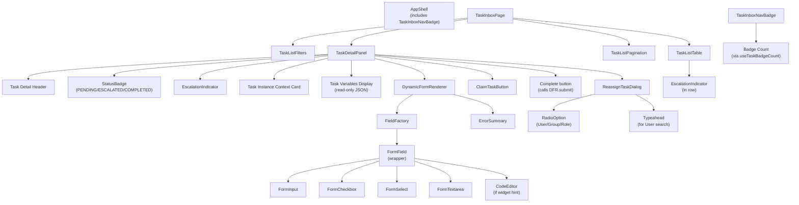
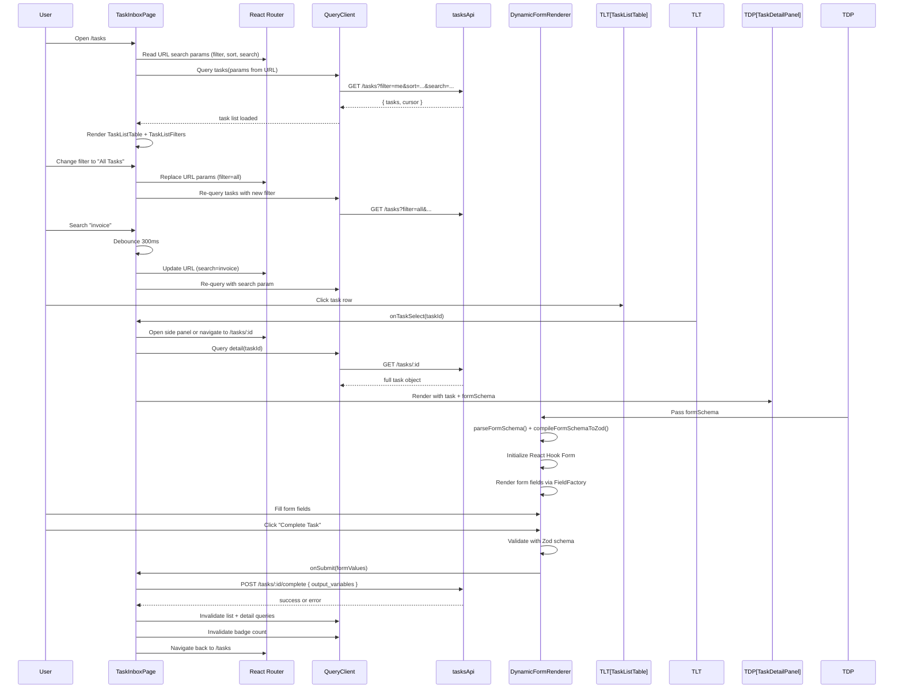

# Design Artefact — Stage F4: Task Inbox Frontend

**Module:** `task-inbox-f4`  
**Requirements:** TK-UI-01, TK-UI-02, TK-UI-03, TK-UI-04, TK-UI-05, TK-UI-06, TK-UI-07, TK-UI-08, TK-UI-09, TK-UI-10  
**Produced by:** CODE-DESIGNER  
**Run:** WF02-f4-task-inbox-20260530  
**Status:** FINAL

---

## 1. Module Purpose

The Task Inbox module provides the operational interface for TASK_WORKER and PROCESS_OPERATOR users to discover, claim, and complete assigned tasks. The design prioritizes:

1. **Discoverable task filtering** — view personal tasks, group tasks, or all tasks (operator-only) with optional sorting and search
2. **Mobile-first task completion** — a detail panel accessible on 375 px viewports that renders JSON Schema-driven forms without horizontal scrolling
3. **Dynamic form rendering** — transform task `form_schema` JSON Schema into type-correct React form fields with client-side validation
4. **Task lifecycle state management** — handle claim, reassign, complete, and escalation states with optimistic updates and rollback
5. **Live badge count** — display pending task count in navigation with 30-second polling

The module makes heavy use of URL-driven state for filters and search, TanStack Query for server-state caching and polling, React Hook Form + Zod for dynamic form schema validation, and React Router for deep-linking and detail navigation. All API calls flow through the `client.ts` auth layer.

---

## 2. Classification (Lego Catalog)

| Requirement | Selected Type | Rationale |
|---|---|---|
| TK-UI-01 (Task inbox list) | Type E | List is standard, but tight coupling to URL-persisted multi-select filters, search query, sort order, and detail navigation exceeds a plain Type B list-page template. Custom interaction logic required. |
| TK-UI-02 (Task detail panel) | Type E | Requires coordinated rendering of form schema, instance context, variable display, and task action buttons on mobile viewports. Non-standard layout logic. |
| TK-UI-03 (Dynamic form rendering) | Type E | JSON Schema to React form field rendering requires custom type coercion, nested object/array support, and client-side validation schema generation. Not a basic form template. |
| TK-UI-04 (Complete task) | Type E | Requires form submission, output variable mapping, optimistic state update, error rollback, and list invalidation on success. Cross-component coordination. |
| TK-UI-05 (Claim task) | Type E | Single-action mutation with immediate list state update and assignee change. Optimistic update pattern ties to task list state management. |
| TK-UI-06 (Reassign task) | Type E | Opens user/group/role search dialog, performs conditional mutation based on selection, updates assignee in list. Modal dialog flow exceeds CRUD template. |
| TK-UI-07 (Task sort & search) | Type E | Requires URL-persisted sort order and free-text search with debounced query updates and result highlighting. Custom filter interaction. |
| TK-UI-08 (Badge count) | Type E | Requires polling hook with separate cadence (30s) from board auto-refresh (10s), visibility-aware pausing, and real-time UI update on navigation item. Singleton state management. |
| TK-UI-09 (Escalation indicator) | Type E | Visual indicator logic tied to task status enum check and icon rendering in both list and detail views. Status-dependent styling. |
| TK-UI-10 (Mobile task completion) | Type E | Responsive layout constraints on form field rendering, button placement, and error message display. Non-standard mobile-first design that affects all form-related components. |

All 10 requirements are Type E due to custom interaction patterns, state coordination, form schema semantics, and mobile constraints.

---

## 3. Files Affected

| File | Action | Purpose |
|---|---|---|
| `web/src/api/tasks.ts` | Create | Task-specific API endpoints (list, detail, complete, claim, reassign) |
| `web/src/api/queryKeys.ts` | Create/Update | Query key factories for task list, detail, and badge count |
| `web/src/hooks/useTasks.ts` | Create | TanStack Query hooks for task operations (list, detail, mutations) |
| `web/src/hooks/useTaskBadgeCount.ts` | Create | Polling hook for task badge count with visibility awareness |
| `web/src/hooks/useDynamicFormSchema.ts` | Create | Transform task `form_schema` (JSON Schema) into Zod validation schema |
| `web/src/hooks/useFormFieldRenderer.ts` | Create | Mapping of JSON Schema field types to React form field components |
| `web/src/types/api.ts` | Update | Add task-related types: `Task`, `TaskFormSchema`, `TaskOperationResult` |
| `web/src/types/forms.ts` | Create | Dynamic form rendering types: `FormField`, `FormValue`, `ValidationError` |
| `web/src/components/forms/DynamicFormRenderer.tsx` | Create | JSON Schema to form field renderer with Zod schema binding |
| `web/src/components/forms/FormField.tsx` | Create | Field wrapper for all primitive types + nested object/array support |
| `web/src/components/forms/FieldFactory.tsx` | Create | Factory function: JSON Schema field → React field component |
| `web/src/components/tasks/TaskListTable.tsx` | Create | Paginated table of tasks with status, assignee, created time, and row actions |
| `web/src/components/tasks/TaskDetailPanel.tsx` | Create | Side panel (desktop) / detail page (mobile) with form, instance context, variables |
| `web/src/components/tasks/TaskListFilters.tsx` | Create | Filter bar: task type (My/Group/All), sort order, search box with debounce |
| `web/src/components/tasks/ClaimTaskButton.tsx` | Create | Claim action button with confirmation; disabled if already assigned to user |
| `web/src/components/tasks/ReassignTaskDialog.tsx` | Create | Modal: user/group/role search + submit with confirmation |
| `web/src/components/tasks/EscalationIndicator.tsx` | Create | Amber warning icon; shown in list and detail when task is escalated |
| `web/src/components/layout/TaskInboxNavBadge.tsx` | Create | Navigation badge component displaying pending task count |
| `web/src/pages/tasks/TaskInboxPage.tsx` | Create | Main task inbox page: list + filter bar + pagination |
| `web/src/pages/tasks/TaskDetailPage.tsx` | Create | Mobile-specific detail page route (on large screens, use side panel instead) |
| `web/src/utils/formSchemaParser.ts` | Create | Parse JSON Schema, extract field metadata, apply type coercion rules |
| `web/src/utils/jsonSchemaToZod.ts` | Create | Compile JSON Schema constraints into Zod validation schema |
| `web/src/utils/taskStatusHelper.ts` | Create | Task status enum parsing, badge styling, escalation check |

---

## 4. New / Updated Types

### 4.1 `Task`

Located in `web/src/types/api.ts`.

```typescript
// Design type — no implementation
export interface Task {
  id: string;                        // task UUID
  nodeId: string;                    // definition graph node ID
  nodeName: string;                  // human-readable node name
  
  instanceId: string;                // process instance UUID
  definitionId: string;              // process definition UUID
  definitionName: string;            // definition display name
  definitionVersion: string;         // semantic version string
  correlationKey: string | null;     // optional user-supplied key
  
  status: "PENDING" | "ESCALATED" | "COMPLETED";  // current task status
  assigneeType: "USER" | "GROUP" | "ROLE" | null;  // null = unassigned
  assigneeRef: string | null;        // user ID / group name / role name
  assigneeName?: string;             // resolved display name (if available)
  
  formSchema: Record<string, unknown> | null;  // JSON Schema object or null if no form
  outputVariables: Record<string, unknown>;    // completed form values (null if PENDING)
  
  createdAt: string;                 // ISO 8601 UTC
  updatedAt: string;                 // ISO 8601 UTC
  escalationTime?: string;           // ISO 8601 UTC when escalation timer fires
  
  // Computed flags for UI logic
  isAssignedToMe?: boolean;          // convenience: current user = assigneeRef
  isClaimable?: boolean;             // convenience: assigneeType = GROUP|ROLE and not assigned to me
  isEscalated?: boolean;             // convenience: status = "ESCALATED"
}
```

### 4.2 `TaskFormSchema`

Located in `web/src/types/forms.ts` (new file).

```typescript
// Design type — no implementation
export interface TaskFormField {
  name: string;
  type: "string" | "number" | "boolean" | "date" | "select" | "object" | "array";
  title?: string;
  description?: string;
  required: boolean;
  
  // Type-specific metadata
  enum?: string[] | number[];          // for select fields
  minLength?: number;                  // for string
  maxLength?: number;
  pattern?: string;                    // regex string
  minimum?: number;                    // for number
  maximum?: number;
  multipleOf?: number;
  format?: "date" | "date-time" | "time" | "email" | "uri";  // for string
  
  // Nested structures
  properties?: Record<string, TaskFormField>;  // for object
  items?: TaskFormField;                       // for array
  additionalProperties?: boolean;
  
  // UI hints
  placeholder?: string;
  widget?: "textarea" | "code-editor" | "rich-text";  // non-standard field rendering hints
}

export interface ValidationError {
  field: string;  // dot-path: "firstName", "address.street", "items.0.name"
  message: string;
}

export interface DynamicFormValue {
  [key: string]: string | number | boolean | Date | DynamicFormValue | DynamicFormValue[] | null;
}
```

### 4.3 `TaskListRow` (API view model)

Located in `web/src/types/api.ts`.

```typescript
// Design type — no implementation
export interface TaskListRow {
  id: string;
  nodeName: string;
  instanceId: string;
  definitionName: string;
  status: "PENDING" | "ESCALATED" | "COMPLETED";
  assigneeType: "USER" | "GROUP" | "ROLE" | null;
  assigneeName?: string;
  createdAt: string;
  isEscalated: boolean;
}

export interface TaskListResponse {
  tasks: TaskListRow[];
  total: number;
  cursor?: string;  // for pagination
}
```

### 4.4 `TaskFilterParams`

Located in `web/src/types/api.ts`.

```typescript
// Design type — no implementation
export interface TaskFilterParams {
  filter: "me" | "group" | "all";      // My Tasks / My Group Tasks / All (operator)
  sortBy?: "created" | "-created";     // asc/desc created time; default = "-created"
  search?: string;                      // free-text search on nodeName or correlationKey
  cursor?: string;                      // pagination cursor
  pageSize?: number;                    // default 25
}

export interface TaskBadgeCountResponse {
  count: number;
}
```

### 4.5 Updated `AuthContextValue`

From previous stage. Task Inbox adds a computed role-check method:

```typescript
// Design method — no implementation (added to AuthContextValue)
isOperator(): boolean {
  // returns true if roles include PROCESS_OPERATOR or PLATFORM_ADMIN
  return this.session?.roles?.includes("PROCESS_OPERATOR") ||
         this.session?.roles?.includes("PLATFORM_ADMIN");
}
```

---

## 5. Public Function Signatures

### 5.1 `parseFormSchema(jsonSchema: Record<string, unknown>): TaskFormField`

Located in `web/src/utils/formSchemaParser.ts`.

```typescript
// Design signature — no implementation
export function parseFormSchema(jsonSchema: Record<string, unknown>): TaskFormField
```

**Purpose:** Transform a raw JSON Schema object into a structured `TaskFormField` tree.

**Algorithm:**
1. If `jsonSchema` is null or `{ }`, return a synthetic root field with `type: "object"` and no properties.
2. Recursively walk the schema tree:
   - Extract `type`, `properties`, `items`, `required`, `minLength`, `maxLength`, `minimum`, `maximum`, `enum`, `pattern`, `format`.
   - For each property in `properties`, recurse.
   - For array `items`, recurse on the item schema.
3. Return normalized `TaskFormField` tree.

**Error handling:** Return a safe default (root object with no fields) if JSON Schema structure is malformed. Log no output.

### 5.2 `compileFormSchemaToZod(field: TaskFormField): z.ZodSchema`

Located in `web/src/utils/jsonSchemaToZod.ts`.

```typescript
// Design signature — no implementation
export function compileFormSchemaToZod(field: TaskFormField): z.ZodSchema
```

**Purpose:** Emit a Zod validation schema from a `TaskFormField` tree to enforce client-side validation in React Hook Form.

**Algorithm:**
1. Create a base validator per field type:
   - `"string"` → `z.string()`
   - `"number"` → `z.number()`
   - `"boolean"` → `z.boolean()`
   - `"date"` → `z.coerce.date()` (parse ISO 8601 strings or Date objects)
   - `"select"` → `z.enum([...enum values])`
   - `"object"` → `z.object({ ... })` recursively
   - `"array"` → `z.array(...)` of items schema
2. Apply constraints:
   - `required: true` → no `.optional()`, `false` → `.optional()`
   - String: `.min(minLength)`, `.max(maxLength)`, `.regex(pattern)` if present
   - Number: `.min(minimum)`, `.max(maximum)`, `.multipleOf(multipleOf)` if present
3. Return compiled schema.

**Error handling:** If compilation fails, throw `Error` with message "Failed to compile form schema: <reason>". Caller (DynamicFormRenderer) catches and displays error in UI.

### 5.3 `renderFormField(field: TaskFormField, value: any, isRequired: boolean): React.ReactNode`

Located in `web/src/components/forms/FieldFactory.tsx`.

```typescript
// Design signature — no implementation
export function renderFormField(field: TaskFormField, value: any, isRequired: boolean): React.ReactNode
```

**Purpose:** Map a single JSON Schema field onto a React form component.

**Logic:**
- `"string"` → `<FormInput type="text" />` unless `widget` or `format` hint overrides:
  - `widget: "textarea"` → `<FormTextarea />`
  - `widget: "code-editor"` → `<CodeEditor language="json" />`
  - `format: "email"` → `<FormInput type="email" />`
  - `format: "uri"` → `<FormInput type="url" />`
  - `format: "date"` → `<FormInput type="date" />`
  - `format: "date-time"` → `<FormInput type="datetime-local" />`
  - `enum` present → `<FormSelect options={enum} />`
- `"number"` → `<FormInput type="number" />`
- `"boolean"` → `<FormCheckbox />`
- `"date"` → `<FormInput type="date" />`
- `"select"` → `<FormSelect options={field.enum} />`
- `"object"` → `<NestedObjectFields properties={field.properties} />`
- `"array"` → `<ArrayFieldList items={value} itemSchema={field.items} />`

### 5.4 `useTaskBadgeCount(): { count: number; isLoading: boolean; error?: ApiError }`

Located in `web/src/hooks/useTaskBadgeCount.ts`.

```typescript
// Design signature — no implementation
export function useTaskBadgeCount(): {
  count: number;
  isLoading: boolean;
  error?: ApiError;
}
```

**Purpose:** Poll for pending task count every 30 seconds, pausing when the page is hidden (visibility API).

**Behavior:**
1. Use TanStack Query with `queryKey: taskKeys.badgeCount()`.
2. Query function calls `GET /tasks/count?filter=me` (returns `{ count: number }`).
3. Set `staleTime: 29000` ms (query data is considered fresh for 29 seconds).
4. On visibility change: pause the query when document is hidden, resume when visible.
5. Return `{ count, isLoading, error? }`.

**Error handling:** If count fetch fails, return previous count (stale) and non-blocking error. Error does not interrupt the hook.

### 5.5 `useTasks(params: TaskFilterParams): { tasks: TaskListRow[]; isLoading: boolean; hasMore: boolean; nextCursor?: string; error?: ApiError }`

Located in `web/src/hooks/useTasks.ts`.

```typescript
// Design signature — no implementation
export function useTasks(params: TaskFilterParams): {
  tasks: TaskListRow[];
  isLoading: boolean;
  hasMore: boolean;
  nextCursor?: string;
  error?: ApiError;
}
```

**Purpose:** Fetch paginated task list with URL-persisted filters.

**Behavior:**
1. Use TanStack Query with `queryKey: taskKeys.list(params)` (canonicalize params).
2. Query function calls `GET /tasks?filter=<me|group|all>&sortBy=<field>&search=<query>&cursor=<cursor>&pageSize=<size>`.
3. Parse response `{ tasks, total, cursor }` and return.
4. On params change, query is invalidated and re-fetched.

**Error handling:** Return `{ tasks: [], hasMore: false, error }` on fetch failure. Caller displays error toast.

### 5.6 `useTaskDetail(taskId: string): { task?: Task; isLoading: boolean; error?: ApiError }`

Located in `web/src/hooks/useTasks.ts`.

```typescript
// Design signature — no implementation
export function useTaskDetail(taskId: string): {
  task?: Task;
  isLoading: boolean;
  error?: ApiError;
}
```

**Purpose:** Fetch full task detail with form schema and variables.

**Behavior:**
1. Use TanStack Query with `queryKey: taskKeys.detail(taskId)`.
2. Query function calls `GET /tasks/:id`.
3. Return full `Task` object.
4. Stale time: 5 seconds (detail pages refresh more frequently than list).

### 5.7 `useClaimTask(): { mutate: (taskId: string) => Promise<void>; isLoading: boolean; error?: ApiError }`

Located in `web/src/hooks/useTasks.ts`.

```typescript
// Design signature — no implementation
export function useClaimTask(): {
  mutate: (taskId: string) => Promise<void>;
  isLoading: boolean;
  error?: ApiError;
}
```

**Purpose:** Claim a task (assign to current user) with optimistic update.

**Behavior:**
1. Use `useMutation` on `POST /tasks/:id/assign`.
2. On `onMutate`: cancel detail query, optimistically set `task.assigneeRef` to current user ID in detail cache.
3. On error: rollback to previous detail state.
4. On settle: invalidate task list and detail queries.

### 5.8 `useCompleteTask(): { mutate: (taskId: string, formValues: DynamicFormValue) => Promise<void>; isLoading: boolean; error?: ApiError }`

Located in `web/src/hooks/useTasks.ts`.

```typescript
// Design signature — no implementation
export function useCompleteTask(): {
  mutate: (taskId: string, formValues: DynamicFormValue) => Promise<void>;
  isLoading: boolean;
  error?: ApiError;
}
```

**Purpose:** Submit task completion with form output variables.

**Behavior:**
1. Use `useMutation` on `POST /tasks/:id/complete` with request body `{ output_variables: formValues }`.
2. On `onMutate`: optimistically remove task from list cache.
3. On error: restore task to list.
4. On settle: invalidate list and badge count queries; navigate away from detail view.

### 5.9 `useReassignTask(): { mutate: (taskId: string, assigneeType: string, assigneeRef: string) => Promise<void>; isLoading: boolean; error?: ApiError }`

Located in `web/src/hooks/useTasks.ts`.

```typescript
// Design signature — no implementation
export function useReassignTask(): {
  mutate: (taskId: string, assigneeType: string, assigneeRef: string) => Promise<void>;
  isLoading: boolean;
  error?: ApiError;
}
```

**Purpose:** Reassign task to user, group, or role with optimistic update.

**Behavior:**
1. Use `useMutation` on `POST /tasks/:id/reassign` with request body `{ assignee_type: assigneeType, assignee_ref: assigneeRef }`.
2. On `onMutate`: optimistically update task assignee in detail and list caches.
3. On error: rollback both caches.
4. On settle: invalidate queries.

### 5.10 `DynamicFormRenderer` component

Located in `web/src/components/forms/DynamicFormRenderer.tsx`.

```typescript
// Design component — no implementation
export interface DynamicFormRendererProps {
  formSchema: Record<string, unknown> | null;  // raw JSON Schema from task.formSchema
  onSubmit: (values: DynamicFormValue) => Promise<void>;
  submitLabel?: string;                         // default "Complete Task"
  isSubmitting?: boolean;
  submitError?: ApiError;
  isRequired?: boolean;                         // if true, all fields marked required on error
  requirementsContext?: {
    instanceId: string;
    variables: Record<string, unknown>;
  };
}

export function DynamicFormRenderer(props: DynamicFormRendererProps): React.ReactNode
```

**Behavior:**
1. Parse `formSchema` via `parseFormSchema()`.
2. Compile Zod schema via `compileFormSchemaToZod()`.
3. Initialize React Hook Form with compiled schema and default values (empty/null).
4. For each top-level field, render via `renderFormField()` wrapped in `FormField` (label + description + error message).
5. On submit: call `onSubmit(values)` with form output. Display `submitError` inline if present.
6. On validation error: display per-field error messages below each field.
7. Mobile constraint (TK-UI-10): ensure form fields do not require horizontal scrolling on 375 px viewport (no `width: 100% + padding` trap; use `overflow: hidden` on form container).

### 5.11 `TaskDetailPanel` component

Located in `web/src/components/tasks/TaskDetailPanel.tsx`.

```typescript
// Design component — no implementation
export interface TaskDetailPanelProps {
  taskId: string;
  onClose: () => void;
  isMobile?: boolean;  // if true, render as full-page; if false, render as side panel
}

export function TaskDetailPanel(props: TaskDetailPanelProps): React.ReactNode
```

**Layout (desktop):**
1. Side panel, right-aligned, 40% width, 100% height.
2. Header: task node name, close button.
3. Status badge (PENDING / ESCALATED / COMPLETED).
4. Escalation indicator icon (if escalated).
5. Instance context card: definition name, instance ID, correlation key, created time.
6. Variables display: collapsible section showing all instance variables as read-only JSON.
7. Dynamic form renderer (if `task.formSchema` is present).
8. Action buttons row:
   - If assigneeType = GROUP|ROLE and not assigned to me: "Claim" button.
   - If assigned to me and status = PENDING: "Complete" button (enabled only if form valid).
   - If operator: "Reassign" button (opens dialog).
9. Footer: "Go back to inbox" link.

**Layout (mobile):**
- Full page, vertically stacked sections as above.
- Buttons at bottom with `position: sticky`.
- Form fields use 100% width with appropriate padding.

**Behavior:**
1. Load task detail via `useTaskDetail(taskId)`.
2. On load: display loading skeleton.
3. On error: display error message with "Back" button.
4. On success: render all sections.
5. Complete form submission:
   - Validate form via Zod schema.
   - Call `useCompleteTask().mutate(taskId, values)`.
   - On success: display success toast, navigate to inbox.
   - On error: display error message inline (red text below form).
6. Claim/Reassign: disable form submission while mutation in flight.

### 5.12 `TaskListFilters` component

Located in `web/src/components/tasks/TaskListFilters.tsx`.

```typescript
// Design component — no implementation
export interface TaskListFiltersProps {
  onFilterChange: (filter: "me" | "group" | "all") => void;
  onSortChange: (sort: "created" | "-created") => void;
  onSearchChange: (query: string) => void;
  currentFilter: "me" | "group" | "all";
  currentSort: "created" | "-created";
  currentSearch: string;
  isOperator: boolean;  // show "All Tasks" filter only if true
}

export function TaskListFilters(props: TaskListFiltersProps): React.ReactNode
```

**Layout:**
1. Horizontal filter bar with three control groups:
   - Filter tabs (My Tasks | My Group Tasks | [All Tasks if operator]) — visual tabs, one selected.
   - Sort dropdown: "Newest first" / "Oldest first" — default Newest.
   - Search field: text input with placeholder "Search by task name or key..." with debounce 300 ms.
2. On change: call handler immediately (tabs/dropdown); call with debounce for search.
3. Update URL search params on every change (so filters survive page reload).

### 5.13 `TaskListTable` component

Located in `web/src/components/tasks/TaskListTable.tsx`.

```typescript
// Design component — no implementation
export interface TaskListTableProps {
  tasks: TaskListRow[];
  isLoading: boolean;
  onTaskSelect: (taskId: string) => void;
  isOperator: boolean;
}

export function TaskListTable(props: TaskListTableProps): React.ReactNode
```

**Columns:**
1. Task name (nodeName) — left-aligned, click opens detail panel/page.
2. Instance ID (truncated to 8 chars, tooltip shows full ID) — secondary text.
3. Status (PENDING / ESCALATED / COMPLETED) — status badge (green/amber/gray).
4. Assignee (assigneeName or "Unassigned") — secondary text.
5. Created time (formatted in local browser time) — right-aligned.
6. Escalation indicator: if `isEscalated`, show amber ⚠ icon in row.

**Behavior:**
1. Display up to 25 rows per page.
2. If `tasks.length === 0`: show "No tasks found" message.
3. On row click: call `onTaskSelect(taskId)` (parent opens detail panel).
4. If `isLoading`: display skeleton rows or spinner.
5. Row hover: subtle background highlight.

### 5.14 `ReassignTaskDialog` component

Located in `web/src/components/tasks/ReassignTaskDialog.tsx`.

```typescript
// Design component — no implementation
export interface ReassignTaskDialogProps {
  taskId: string;
  isOpen: boolean;
  onClose: () => void;
  onConfirm: (assigneeType: string, assigneeRef: string) => Promise<void>;
  isSubmitting?: boolean;
}

export function ReassignTaskDialog(props: ReassignTaskDialogProps): React.ReactNode
```

**Layout:**
1. Modal dialog: "Reassign Task".
2. Select control: "Assign to" with three radio buttons:
   - "User" → user typeahead search (calls `/users?q=<query>`, display name + email).
   - "Group" → group dropdown (calls `/groups`, display name).
   - "Role" → role dropdown (fixed list: TASK_WORKER, PROCESS_OPERATOR, PLATFORM_ADMIN).
3. Confirm button (disabled until selection made).
4. Cancel button.

**Behavior:**
1. On user/group typeahead change: debounce 300 ms, fetch matching users/groups, display dropdown.
2. On selection: populate the "Assign to" control and enable confirm.
3. On confirm: call `onConfirm(assigneeType, assigneeRef)` with selected type and ID.
4. On error: display error message in dialog (red text).
5. On success: close dialog (parent closes via `onClose`).

### 5.15 `EscalationIndicator` component

Located in `web/src/components/tasks/EscalationIndicator.tsx`.

```typescript
// Design component — no implementation
export interface EscalationIndicatorProps {
  isEscalated: boolean;
  escalationTime?: string;  // ISO 8601 UTC
}

export function EscalationIndicator(props: EscalationIndicatorProps): React.ReactNode
```

**Behavior:**
- If `isEscalated === false`: render nothing.
- If `isEscalated === true`: render amber ⚠ icon (size 16px) with tooltip showing `escalationTime` formatted in local browser time.

---

## 6. Component Hierarchy



---

## 7. Data Flow



---

## 8. State and Query Model

### Query key contracts

```typescript
// In web/src/api/queryKeys.ts
export const taskKeys = {
  all: ["tasks"] as const,
  list: (params: TaskFilterParams) => [...taskKeys.all, "list", params] as const,
  detail: (id: string) => [...taskKeys.all, "detail", id] as const,
  badgeCount: () => [...taskKeys.all, "badge-count"] as const,
};
```

**Key design decisions:**
1. **List query params are canonicalized** — sort order and search query are part of the key, so changing filters produces a new query (not just a refetch).
2. **Badge count is singleton** — all components share the same polling query; visibility pausing applies globally.
3. **Detail queries are keyed by task ID only** — the task object includes instance context, so no separate instance query needed.
4. **No local component state for filters** — all filter state is in URL search params, so filters survive page reload and deep links work.

### Form rendering state

```typescript
// In DynamicFormRenderer component
const [formSchema, setFormSchema] = useState<TaskFormField | null>(null);
const [validationSchema, setValidationSchema] = useState<z.ZodSchema | null>(null);

// React Hook Form manages form values and validation
const form = useForm<DynamicFormValue>({
  resolver: zodResolver(validationSchema),
  mode: "onChange",  // real-time validation
});

// On formSchema prop change:
// 1. Parse via parseFormSchema()
// 2. Compile via compileFormSchemaToZod()
// 3. Reset form with new schema
```

### Mutation optimistic updates

**Claim task:**
1. `onMutate`: Set `task.assigneeRef = currentUserId` in detail cache (assume success).
2. `onError`: Restore previous task object.
3. `onSettled`: Invalidate detail and list queries (full refetch).

**Complete task:**
1. `onMutate`: Remove task from list cache (assume it moved to COMPLETED state).
2. `onError`: Restore task to list.
3. `onSettled`: Invalidate list, detail, and badge count queries.

**Reassign task:**
1. `onMutate`: Update `task.assigneeType` and `task.assigneeRef` in all caches.
2. `onError`: Restore previous assignee.
3. `onSettled`: Invalidate queries.

---

## 9. Error Taxonomy

| Error case | Source | HTTP Status | UX behavior | Recovery |
|---|---|---|---|---|
| **Unauthorized** | client auth interceptor | 401 | Redirect to login page, preserve intended deep link | Re-authenticate and return |
| **Forbidden** (not operator) | GET /tasks with filter=all | 403 | Show "Access denied" inline; hide All Tasks filter option | Request operator role |
| **Validation error** (form field) | DynamicFormRenderer Zod schema | n/a (client-side) | Per-field error message below field | Correct field value and resubmit |
| **Schema compilation error** | compileFormSchemaToZod() | n/a (client-side) | Display error banner: "Unable to render form schema"; show raw JSON | Contact admin; use workaround (export schema) |
| **Form submission error** | POST /tasks/:id/complete | 400/422 | Display inline error below form: `error.message` + field-level errors if provided | Correct values and resubmit |
| **Claim task conflict** | POST /tasks/:id/assign | 409 | Display toast: "Task was claimed by another user"; remove from list (optimistic update already done) | Acknowledge and return to list |
| **Reassign not allowed** | POST /tasks/:id/reassign | 403 | Display dialog error: "You do not have permission to reassign this task" | Acknowledge; close dialog |
| **Task not found** | GET /tasks/:id (detail navigation) | 404 | Show "Task no longer exists" message with "Back to list" button | Return to inbox |
| **Rate limited** | any endpoint | 429 | Toast: "Too many requests. Please retry in X seconds." with auto-dismiss | Wait and retry manually or auto-retry after Retry-After |
| **Network timeout** | any endpoint | TIMEOUT | Toast: "Connection timeout. Please check your network." Persistent form content (no clear on error). | Manual retry button on toast |
| **Server error** | any endpoint | 5xx | Toast: "Server error. Please try again later." with retry button | Manual retry or contact admin |

---

## 10. Component State Transitions

### TaskInboxPage

| State | Condition | Display |
|---|---|---|
| **Initializing** | Page mount, reading URL params | Loading spinner |
| **Loading** | Fetching task list from API | Skeleton table rows |
| **Ready** | Task list loaded successfully | Table + filters + pagination |
| **FilterChanged** | User changed filter/sort/search | Re-fetch list (visual state remains Ready) |
| **DetailOpen** | User clicked task row | Side panel (desktop) or detail page (mobile) |
| **DetailError** | Detail panel failed to load | Error message in panel + close button |
| **ListError** | Task list fetch failed | Error banner + retry button |

### TaskDetailPanel

| State | Condition | Display |
|---|---|---|
| **Loading** | Panel opened, fetching task detail | Skeleton content |
| **Ready** | Task detail loaded | Form + context + variables |
| **Submitting** | Form submitted, POST in flight | Spinner on Complete button; form disabled |
| **SubmitSuccess** | Task completed | Success toast; navigate to list |
| **SubmitError** | Form submission failed | Error message below form; form re-enabled |
| **ClaimInFlight** | Claim button clicked | Spinner on Claim button; disabled |
| **Closed** | User clicked close / navigated away | Panel removed from DOM |

### DynamicFormRenderer

| State | Condition | Display |
|---|---|---|
| **Parsing** | formSchema prop provided | Empty form container |
| **SchemaError** | parseFormSchema() threw | Error banner with schema JSON |
| **FormReady** | Schema parsed, Zod compiled | Form fields rendered |
| **FieldValidationError** | User blurred field with invalid value | Error message below field |
| **FormValidationError** | User submitted with required fields empty | Error summary + per-field errors |
| **Submitting** | onSubmit() promise in flight | Spinner on submit button |
| **SubmitError** | onSubmit() rejected | Error message below form |

---

## 11. Dependencies

### Direct dependencies
- `web/src/api/client.ts` for auth-aware request behavior and normalized API errors.
- `web/src/api/tasks.ts` for list, detail, complete, claim, reassign operations (to be created).
- `web/src/api/queryKeys.ts` for query key factories.
- TanStack Query for server-state caching, polling, and invalidation.
- React Router v7 for URL-driven filter state and detail navigation.
- React Hook Form + Zod for dynamic form schema validation.
- Existing UI primitives: `Button`, `Badge`, `Dialog`, `Input`, `Textarea`, `Select`, `Card`, `StatusBadge` from `web/src/components/ui/`.
- Existing form components: `FormField`, `FormInput`, `FormCheckbox`, `FormSelect`, `FormTextarea` from `web/src/components/forms/`.
- (Optional) CodeMirror or Monaco for code-editor widget if `widget: "code-editor"` is used.

### Must-not dependencies
- No direct `fetch` or `axios` calls from components.
- No global mutable singleton for task filters (use URL params + React Router).
- No mock HTTP endpoints or MSW.
- No hardcoded task status strings — use enum or constant from API response.

---

## 12. Mobile-First Responsiveness (TK-UI-10)

### 375 px viewport constraints

1. **Form fields:**
   - `width: 100%` within form container.
   - Container has `padding: 1rem`.
   - No horizontal scrolling — `overflow: hidden` on root form element.
   - Field labels stack vertically above input (not left-aligned).
   - Select/dropdown max-height with scroll if options exceed 4 items.

2. **Task detail panel:**
   - On mobile (< 768 px width), render as full-page route `/tasks/:id` instead of side panel.
   - Router configuration: detect viewport and route conditionally (or use single route that changes layout based on window size).
   - Instance context, variables, form all vertically stacked.

3. **Buttons:**
   - `width: 100%` in mobile view.
   - Sticky footer with padding (e.g. `position: sticky; bottom: 0; padding: 1rem`).
   - All buttons visible without scrolling (primary action at top, secondary below).

4. **Error messages:**
   - Render inline below offending field, not in separate modal.
   - Font size 14px minimum.
   - Color: `#d32f2f` (red) with icon.

5. **Status badges & indicators:**
   - Icon size 16px, text size 14px.
   - No text overflow — truncate with ellipsis if needed.

### Desktop (≥ 1024 px) layout

1. **Side panel:**
   - Right-aligned, 40% width, 100% height.
   - Fixed position relative to viewport.
   - Smooth slide-in/out animation.

2. **Form fields:**
   - Max-width 500px (centered in panel).
   - Label and input can be side-by-side if space allows.

3. **Buttons:**
   - Horizontal button group at bottom of panel.
   - Primary action (Complete) on right.

---

## 13. Requirement Coverage Mapping

| Requirement | Covered design sections | Implementation focus |
|---|---|---|
| **TK-UI-01** (Task inbox list) | §3 Files, §5.5 useTasks hook, §5.13 TaskListTable, §7 Data flow, §8 State | Paginated list, filtering, navigation |
| **TK-UI-02** (Task detail panel) | §5.11 TaskDetailPanel, §12 Mobile layout | Side panel + full-page layout, form rendering, context display |
| **TK-UI-03** (Dynamic form rendering) | §5.1-5.4 Form types, §5.10 DynamicFormRenderer, §5.2 Zod compilation, §6 Component hierarchy | JSON Schema parsing, field type mapping, client-side validation |
| **TK-UI-04** (Complete task) | §5.8 useCompleteTask mutation, §5.11 TaskDetailPanel submit, §9 Error handling | Form validation, output variable mapping, optimistic update, list invalidation |
| **TK-UI-05** (Claim task) | §5.7 useClaimTask mutation, §5.12 ClaimTaskButton | Single-action mutation, optimistic update, assignee change |
| **TK-UI-06** (Reassign task) | §5.9 useReassignTask mutation, §5.14 ReassignTaskDialog | Modal dialog, user/group/role search, conditional mutation |
| **TK-UI-07** (Task sort & search) | §5.5 useTasks params, §5.12 TaskListFilters, §8 URL state | Debounced search, sort order toggle, URL persistence |
| **TK-UI-08** (Badge count) | §5.4 useTaskBadgeCount, §3 TaskInboxNavBadge component | 30-second polling, visibility-aware pause, nav item integration |
| **TK-UI-09** (Escalation indicator) | §5.15 EscalationIndicator component, §5.13 TaskListTable (row), §5.11 TaskDetailPanel (detail) | Status check, icon rendering, tooltip with time |
| **TK-UI-10** (Mobile task completion) | §12 Mobile constraints, §5.11 TaskDetailPanel layout, §5.10 DynamicFormRenderer field sizing | 375 px viewport support, no horizontal scroll, sticky buttons |

---

## 14. Open Questions

1. **Form schema source**: Is `task.formSchema` already populated by the backend when the task is retrieved, or must the frontend fetch it separately from the node definition?

2. **Nested form support**: Does the JSON Schema support nested objects (e.g. `type: "object", properties: { address: { type: "object", properties: { street, city } } }`) and arrays (e.g. `type: "array", items: { type: "object" }`), or only flat field structures?

3. **Output variable shape**: When a task is completed, does the form renderer send output variables as a flat object matching the schema structure, or as a nested object with the form schema structure?

4. **Escalation time**: Is the `escalationTime` provided in the task object, or must we calculate it from `createdAt + escalation_timer_duration` (which would require definition details)?

5. **Reassign permissions**: Can a TASK_WORKER reassign a task they own, or only PROCESS_OPERATOR+? Does reassignment to a group/role clear the personal assignee?

6. **Badge count filtering**: Should the badge count include escalated tasks, or only PENDING? Should it be "me" only or "me + my groups"?

7. **Form field widget hints**: Are custom widget hints (e.g. `widget: "code-editor"`, `widget: "rich-text"`) part of the JSON Schema spec, or should we use `"ui"` or `"x-"` extension properties?

8. **Readonly variables display**: Should the instance variables displayed in task detail be read-only in the UI, or should the form allow editing them before submission?

---

## 15. API Contract Summary

| Endpoint | Method | Input | Output | Used by |
|---|---|---|---|---|
| `/tasks` | GET | `filter`, `sort`, `search`, `cursor`, `pageSize` | `{ tasks[], cursor?, total }` | useTasks |
| `/tasks/:id` | GET | path param | `Task` object | useTaskDetail |
| `/tasks/count` | GET | `filter` | `{ count: number }` | useTaskBadgeCount |
| `/tasks/:id/complete` | POST | `{ output_variables: {} }` | `{ success: boolean }` | useCompleteTask |
| `/tasks/:id/assign` | POST | body (current user implied) | `{ success: boolean }` | useClaimTask |
| `/tasks/:id/reassign` | POST | `{ assignee_type, assignee_ref }` | `{ success: boolean }` | useReassignTask |
| `/users` | GET | `?q=<search>` | `{ users[] }` | ReassignTaskDialog typeahead |
| `/groups` | GET | (no params) | `{ groups[] }` | ReassignTaskDialog dropdown |

---

## 16. Implementation Notes

- **No implementation code** in this document; all signatures are designs only.
- **Form field rendering is semantic HTML**: use `<input type="...">`, `<select>`, `<textarea>` with proper labels and ARIA attributes (WCAG 2.1 AA per FNFR-03).
- **Dates are always ISO 8601 UTC on the wire**; convert to browser locale in display via `Intl.DateTimeFormat` or date library.
- **Task status is immutable from client perspective**: only the backend can change status via PENDING → ESCALATED → COMPLETED state machine.
- **No caching strategy for form schema** beyond TanStack Query's default staleTime (5 seconds for detail queries); if the schema never changes during a task's lifetime, this is fine.
- **Error messages from API** (RFC 9457 Problem Details) are parsed by `client.ts` and exposed as `ApiError.detail` or field-level validation errors; pass these directly to UI (no i18n assumed).
