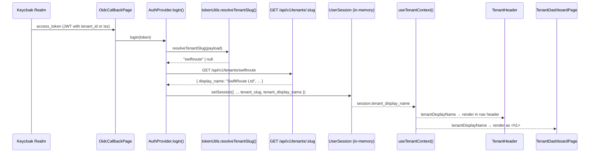

# Design: Tenant Dashboard UI

**Requirements:** TD-UI-01, TD-UI-02, TD-UI-03  
**Module:** `web/src` — tenant context, dashboard page, shell header  
**Type:** E (novel / cross-cutting)

---

## Module Purpose

After a successful OIDC login via a tenant Keycloak realm, the frontend must
immediately display the authenticated user's company workspace — specifically
the tenant's `display_name` — as a prominent heading on the landing page and
persistently in the global navigation header on every authenticated route.
This module adds a tenant-context layer (hook + types) on top of the existing
`AuthContext`, a new `/dashboard` landing page (`TenantDashboardPage`), a
`TenantHeader` component integrated into `AppShell`, and the route wiring
that makes `/dashboard` the first post-login destination.

The design resolves three unknowns from the handoff:

1. **Where does `display_name` come from?** The JWT issued by Keycloak contains
   `tenant_id` via the OIDC-13 protocol mapper. If the claim is absent,
   `AuthProvider` falls back to extracting the realm slug from the `iss`
   claim (last path segment after `/realms/`, stripping the `bpm-` prefix).
   After extracting the slug, `AuthProvider.login()` calls
   `GET /api/v1/tenants/{slug}` and stores `tenant_display_name` in
   `UserSession`.

2. **Where is tenant state stored?** `UserSession` gains two fields:
   `tenant_slug` and `tenant_display_name`. The new `useTenantContext` hook
   reads these from `useAuth()` — no separate React context tree is required.

3. **What changes in the router?** The root index route changes from
   `<InstanceBoardPage />` to `<TenantDashboardPage />`. The existing
   `/instances` path is unchanged.

---

## Public Interface

### Type extensions — `web/src/types/api.ts`

```ts
export interface JwtPayload {
  // … existing fields unchanged …
  tenant_id?: string      // added by OIDC-13 Keycloak protocol mapper
}

export interface UserSession {
  token: string
  display_name: string
  roles: string[]
  loginSource: 'oidc' | null
  tenant_slug: string | null          // NEW — slug of the authenticated tenant
  tenant_display_name: string | null  // NEW — human-readable name; null = unresolved
}
```

### Hook — `web/src/auth/useTenantContext.ts`

```ts
export interface TenantContextValue {
  tenantSlug: string | null
  tenantDisplayName: string        // always a string; falls back to 'Unknown workspace'
  isUnknown: boolean               // true when display_name could not be resolved
}

export function useTenantContext(): TenantContextValue
```

Behaviour:
- Calls `useAuth()` and reads `session.tenant_slug` / `session.tenant_display_name`.
- If `tenant_display_name` is `null`, `tenantDisplayName` returns `'Unknown workspace'`
  and `isUnknown` is `true`.
- Does not make any API calls — resolution happens in `AuthProvider.login()`.

### Helper — `web/src/auth/tokenUtils.ts` (addition)

```ts
/**
 * Extract the tenant slug from the JWT payload.
 * Priority: payload.tenant_id claim → realm segment from payload.iss.
 * Returns null if neither is available.
 */
export function resolveTenantSlug(payload: JwtPayload): string | null
```

Extraction rule for `iss` fallback:
- `iss` = `http://localhost:8081/realms/bpm-swiftroute`
- realm segment = `bpm-swiftroute`
- strip `bpm-` prefix → slug = `swiftroute`
- If the segment does not start with `bpm-`, return the full segment as-is
  (defensive: non-standard realm names pass through unchanged).

### AuthProvider change — `web/src/auth/AuthProvider.tsx`

`login(token: string)` gains an async tenant-resolution step after JWT decode:

```ts
// After validating roles:
const tenantSlug = resolveTenantSlug(payload)
let tenantDisplayName: string | null = null
if (tenantSlug) {
  try {
    const tenant = await tenantsApi.getBySlug(tenantSlug)
    tenantDisplayName = tenant.display_name
  } catch {
    console.error('[AuthProvider] Could not resolve tenant display name', tenantSlug)
    // tenantDisplayName stays null → rendered as 'Unknown workspace'
  }
}
setSessionState({
  token,
  display_name: resolveDisplayName(payload),
  roles: payload.roles,
  loginSource: 'oidc',
  tenant_slug: tenantSlug,
  tenant_display_name: tenantDisplayName,
})
```

The E2E `tryRestoreE2eSession()` must also be extended to accept and propagate
`tenant_slug` / `tenant_display_name` from the session-storage blob written by
the Playwright test runner.

### Component — `web/src/components/layout/TenantHeader.tsx`

```ts
export function TenantHeader(): JSX.Element
```

Props: none — reads `useTenantContext()` directly.

Renders:
- The tenant `tenantDisplayName` as a styled text node with
  `data-testid="tenant-display-name"`.
- When `isUnknown` is `true`, renders the fallback text `'Unknown workspace'` with
  `data-testid="tenant-display-name-unknown"`.
- Must not render on unauthenticated routes (placement in AppShell ensures this).

### Page — `web/src/pages/dashboard/TenantDashboardPage.tsx`

```ts
export default function TenantDashboardPage(): JSX.Element
```

Props: none — reads `useTenantContext()` and `useAuth()`.

Renders:
- An `<h1>` heading containing `tenantDisplayName` with
  `data-testid="tenant-dashboard-heading"`.
- Three data tiles (each using `useQuery`):
  - **Recent definitions** — last 5 from `GET /api/v1/definitions?page_size=5`
  - **Active instances** — count from `GET /api/v1/instances?status=ACTIVE&page_size=1`
  - **Pending tasks** — count from `GET /api/v1/tasks?status=PENDING&page_size=1`
- Data tiles use the authenticated token (already set in `api/client.ts`), so
  all results are implicitly tenant-scoped by the backend.
- If `isUnknown` is `true`, a non-blocking warning banner is shown above the
  tiles: "Tenant name could not be loaded. Contact your administrator."
- Loading state: tiles show skeleton placeholders (no spinner blocking the `<h1>`).

---

## Data Flow Diagram



Component tree after login (authenticated shell):

```
AuthProvider
  └── ProtectedRoute
        └── ErrorBoundary
              └── AppShell
                    ├── Sidebar
                    │     ├── TenantHeader          ← NEW (tenant name)
                    │     ├── NavLinks
                    │     └── UserFooter (display_name, roles, logout)
                    └── <Outlet />
                          └── TenantDashboardPage   ← NEW (index route)
```

---

## Error Taxonomy

| Error condition | Source | Behaviour |
|---|---|---|
| JWT decode fails | `decodeTokenPayload` returns `null` | Existing handling in `login()` — throws 400, login aborted |
| JWT has no roles | `payload.roles` empty | Existing handling — throws 400, login aborted |
| `tenant_id` claim absent AND `iss` claim absent | `resolveTenantSlug` returns `null` | `tenant_slug = null`, `tenant_display_name = null`; session created; shell shows "Unknown workspace" |
| `GET /api/v1/tenants/:slug` network error | `tenantsApi.getBySlug` throws | Logged to console; `tenant_display_name = null`; session created; shell shows "Unknown workspace" (no crash) |
| `GET /api/v1/tenants/:slug` returns 404 | Tenant slug from JWT refers to non-existent tenant | Same as network error — fallback to "Unknown workspace" |
| `iss` realm segment does not start with `bpm-` | Non-standard realm | Slug passed through as-is; API call attempted; failure falls back to "Unknown workspace" |
| PLATFORM_ADMIN user (cross-tenant) | Token may lack a `tenant_id` claim | `tenant_slug = null`; dashboard still renders with fallback name; admin navigation unaffected |

No error condition must crash the application or prevent the authenticated shell
from rendering. All tenant-resolution failures are recoverable and non-blocking.

---

## State Transitions

```
OidcCallback received
       │
       ▼
  login(token)
       │
  ┌────┴─────┐
  │ decode   │ fails → AUTH_ERROR (existing)
  │ JWT      │
  └────┬─────┘
       │ ok
  ┌────┴──────────────────┐
  │ resolveTenantSlug()   │ returns null → slug = null
  └────┬──────────────────┘
       │ slug present
  ┌────┴──────────────┐
  │ tenantsApi        │ fails → tenant_display_name = null
  │ .getBySlug(slug)  │
  └────┬──────────────┘
       │ ok
  tenant_display_name = response.display_name
       │
  setSession(...)
       │
  router.navigate('/dashboard')   ← index route renders TenantDashboardPage
```

On logout: `clearToken()` + `setSessionState(null)`. `TenantHeader` unmounts
(AppShell only renders inside `ProtectedRoute`). No tenant name persists.

---

## Router Changes

In `web/src/router.tsx`, within the root authenticated route children array:

- The existing `{ index: true, element: <InstanceBoardPage /> }` entry is
  replaced with `{ index: true, element: <TenantDashboardPage /> }`.
- A named `{ path: 'dashboard', element: <TenantDashboardPage /> }` route is
  added as an alias (supports direct navigation and bookmarking).
- The `/instances` path and all other routes are unchanged.
- `TenantDashboardPage` is imported from `@/pages/dashboard/TenantDashboardPage`.

The `OidcCallbackPage` OIDC redirect target (`VITE_OIDC_REDIRECT_URI`) already
points to the callback URL; after exchange the callback page calls
`navigate('/')` which lands on the index route (now `TenantDashboardPage`).
No changes to `OidcCallbackPage` or `VITE_OIDC_REDIRECT_URI` are required.

---

## AppShell Changes

`AppShell.tsx` sidebar header currently hardcodes `"BPM Platform"` as a `<div>`.
It is replaced with a stacked layout:

- Top line: `"BPM Platform"` (unchanged branding text, `color: #f1f5f9`)
- Second line: `<TenantHeader />` — tenant `display_name`, smaller font,
  `color: #94a3b8`, `data-testid="tenant-display-name"`

The `<TenantHeader />` import is added to `AppShell.tsx`.
No other changes to `AppShell` are required.
The user footer block (`user-display-name`, `user-roles`, logout) is unchanged.

---

## Dependencies

**This module calls:**
- `web/src/auth/AuthContext.tsx` — `useAuth()` (read-only)
- `web/src/auth/tokenUtils.ts` — adds `resolveTenantSlug()`
- `web/src/api/tenants.ts` — `tenantsApi.getBySlug()` (existing, no changes)
- `web/src/api/queryKeys.ts` — existing query key factories
- `web/src/api/client.ts` — existing authenticated HTTP client

**This module must NOT depend on:**
- Any other page or feature module (no circular imports)
- Any admin-only API (tenants list endpoint is public to all authenticated users)
- MSW or any HTTP mock layer (TD-UI tests are E2E against real backend)

**Downstream consumers:**
- `AppShell` — imports `TenantHeader`
- `router.tsx` — imports `TenantDashboardPage`
- Test files — use `useTenantContext()` via rendered component tree; no direct mock

---

## Open Questions

None. All design decisions are resolved by the requirement text, existing
architecture, and the prescribed data-flow in the handoff.
