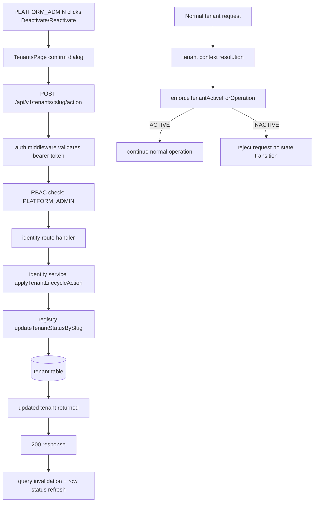

# Module: Stage F8 Batch2 — Tenant Lifecycle Controls

**Requirements covered:** TM-04, TM-05
**Classification:** Type E (novel/cross-cutting)

## Classification decision

TM-04 and TM-05 are classified as Type E, not Type A/C, because the change is not a simple 1-to-1 CRUD route:

- deactivation/reactivation must be idempotent action endpoints with status-transition semantics,
- tenant activity policy must be enforced across authentication and normal operations,
- frontend behavior includes confirmation UX and state-driven actions,
- identity and tenant-context layers must reject inactive-tenant normal-operation flows.

No Type A/B/C/D parameter file is emitted for this handoff.

## Module purpose

This module introduces explicit tenant lifecycle actions for PLATFORM_ADMIN users so that a tenant can be moved between ACTIVE and INACTIVE without changing tenant identity metadata. The design defines two admin action endpoints, state-transition invariants, and a tenant-activity policy gate that blocks normal tenant operations while the tenant is INACTIVE. The same policy gate is released when reactivation returns the tenant to ACTIVE.

## Public interface

### Backend interfaces (Zig)

Files affected:
- src/identity/registry.zig
- src/identity/identity_service.zig
- src/api/routes/identity.zig
- src/api/middleware/auth.zig (policy check integration)

```zig
pub const TenantLifecycleAction = enum {
    deactivate,
    reactivate,
};

pub const UpdateTenantStatusInput = struct {
    slug: []const u8,
    target_status: TenantStatus, // .ACTIVE | .INACTIVE
};

pub const UpdateTenantStatusError = error{
    InvalidTenantSlug,
    InvalidLifecycleAction,
    InvalidLifecyclePayload,
    TenantNotFound,
    Forbidden,
    InvalidTransition,
    PersistenceFailed,
    PoolExhausted,
    OutOfMemory,
};
```

```zig
/// Idempotent status write by slug.
pub fn updateTenantStatusBySlug(
    self: *Registry,
    allocator: std.mem.Allocator,
    input: UpdateTenantStatusInput,
) RegistryError!Tenant;

/// PLATFORM_ADMIN-only action wrapper around updateTenantStatusBySlug.
pub fn applyTenantLifecycleAction(
    allocator: std.mem.Allocator,
    actor: auth_mod.AuthPrincipal,
    registry: *registry_mod.Registry,
    slug: []const u8,
    action: TenantLifecycleAction,
) UpdateTenantStatusError!registry_mod.Tenant;
```

```zig
/// POST /api/v1/tenants/:slug/deactivate
pub fn handleDeactivateTenant(
    allocator: std.mem.Allocator,
    principal: auth_mod.AuthPrincipal,
    registry: *registry_mod.Registry,
    slug: []const u8,
) routes.HandlerResult;

/// POST /api/v1/tenants/:slug/reactivate
pub fn handleReactivateTenant(
    allocator: std.mem.Allocator,
    principal: auth_mod.AuthPrincipal,
    registry: *registry_mod.Registry,
    slug: []const u8,
) routes.HandlerResult;

/// Resolve + enforce tenant activity policy for normal operations.
/// Returns error.TenantInactive when status is INACTIVE.
pub fn enforceTenantActiveForOperation(
    allocator: std.mem.Allocator,
    registry: *registry_mod.Registry,
    principal: auth_mod.AuthPrincipal,
) error{TenantInactive, TenantNotFound, PersistenceFailed, PoolExhausted, OutOfMemory}!void;
```

### API contracts

#### Deactivate tenant

- Method: POST
- Path: /api/v1/tenants/:slug/deactivate
- AuthZ: PLATFORM_ADMIN only
- Request body: empty object only (`{}`) when present
- Success 200 response:

```json
{
  "slug": "acme",
  "status": "INACTIVE",
  "display_name": "Acme Corp",
  "idp_realm_id": "realm-acme",
  "created_at": "2026-06-01T12:34:56Z"
}
```

#### Reactivate tenant

- Method: POST
- Path: /api/v1/tenants/:slug/reactivate
- AuthZ: PLATFORM_ADMIN only
- Request body: empty object only (`{}`) when present
- Success 200 response:

```json
{
    "slug": "acme",
    "status": "ACTIVE",
    "display_name": "Acme Corp",
    "idp_realm_id": "realm-acme",
    "created_at": "2026-06-01T12:34:56Z"
}
```

## Input validation and canonicalization rules

Validation is applied at the HTTP boundary before any registry/provider call. Invalid input returns deterministic error codes and performs no persistence side effects.

### 1) Tenant slug path parameter (`:slug`)

Canonical slug form:
- Character set: lowercase ASCII `a-z`, digits `0-9`, and hyphen `-` only.
- Length bounds: minimum 3, maximum 63 characters.
- Shape constraints: must start and end with alphanumeric; hyphen allowed only in the middle.

Normalization/canonicalization policy:
- URL percent-decoding is performed exactly once.
- Canonicalization is validation-only (no mutation). The request slug MUST already be in canonical form.
- Uppercase, whitespace, underscore, non-ASCII, or malformed percent-encoding are rejected.

Reject behavior:
- Status: 400
- Error code: `invalid_tenant_slug`
- No DB call, no lifecycle action evaluation.

### 2) Lifecycle action input

Allowed actions:
- `deactivate` and `reactivate` only.

Route-to-action mapping:
- `POST /api/v1/tenants/:slug/deactivate` maps to action enum `.deactivate`.
- `POST /api/v1/tenants/:slug/reactivate` maps to action enum `.reactivate`.
- Any non-matching action token (including malformed route variants) is rejected.

Reject behavior for invalid action token:
- Status: 400
- Error code: `invalid_lifecycle_action`

### 3) Request-body constraints for lifecycle endpoints

Payload contract:
- Request body is optional.
- If a JSON body is provided, it MUST be an empty object `{}`.
- Any non-object JSON, unknown keys, or non-empty object is rejected.

Reject behavior for invalid payload:
- Status: 422
- Error code: `invalid_lifecycle_payload`

### 4) Duplicate/redundant action handling

Redundant lifecycle requests are idempotent, not validation failures:
- `deactivate` on already `INACTIVE` tenant returns 200 with unchanged record.
- `reactivate` on already `ACTIVE` tenant returns 200 with unchanged record.
- Response body remains the authoritative current tenant state.

### Frontend interfaces (TypeScript)

Files affected:
- web/src/api/tenants.ts
- web/src/pages/admin/tenants/TenantsPage.tsx
- web/src/api/queryKeys.ts

```ts
export type TenantStatus = 'ACTIVE' | 'INACTIVE';

export interface Tenant {
  slug: string;
  display_name: string;
  idp_realm_id: string | null;
  status: TenantStatus;
  created_at: string;
}

export function deactivateTenant(slug: string): Promise<Tenant>;

export function reactivateTenant(slug: string): Promise<Tenant>;
```

## Data flow diagram



## State transitions

Tenant lifecycle states are constrained to ACTIVE and INACTIVE for this batch.

| Current state | Action | Next state | Semantics |
|---|---|---|---|
| ACTIVE | deactivate | INACTIVE | state change applied |
| INACTIVE | deactivate | INACTIVE | idempotent no-op |
| INACTIVE | reactivate | ACTIVE | state change applied |
| ACTIVE | reactivate | ACTIVE | idempotent no-op |

Operational invariant:
- If tenant status is INACTIVE, normal tenant operations (authentication-derived tenant access, API business operations, process execution, task actions) must fail policy enforcement before committing new business state.

## Error taxonomy

| Error variant | HTTP status | Error code | Meaning |
|---|---|---|---|
| InvalidTenantSlug | 400 | invalid_tenant_slug | Slug path parameter is non-canonical or outside allowed charset/length/shape |
| InvalidLifecycleAction | 400 | invalid_lifecycle_action | Action token is not `deactivate` or `reactivate` |
| InvalidLifecyclePayload | 422 | invalid_lifecycle_payload | Lifecycle request body is non-empty or has unsupported shape |
| Forbidden | 403 | forbidden | Caller is not PLATFORM_ADMIN |
| TenantNotFound | 404 | tenant_not_found | Target slug does not exist |
| TenantInactive | 403 | tenant_inactive | Normal operation blocked by tenant-activity policy |
| InvalidTransition | 422 | invalid_transition | Reserved for future invalid lifecycle transitions |
| PoolExhausted | 503 | service_unavailable | DB pool unavailable |
| PersistenceFailed | 500 | internal_error | DB failure |
| OutOfMemory | 500 | internal_error | allocator failure |

Idempotency rule:
- Repeating deactivate on INACTIVE or reactivate on ACTIVE returns 200 with unchanged tenant record and no side effects.

## Authorization rules

- Deactivate/reactivate endpoints: PLATFORM_ADMIN only.
- Any non-PLATFORM_ADMIN caller receives 403.
- Tenant-scoped business roles cannot alter tenant lifecycle state.

## Effect on login and usage behavior

Policy boundary:
- The tenant lifecycle gate is applied to normal tenant operations after authentication and tenant-context resolution.
- For INACTIVE tenants, requests are rejected with tenant_inactive and no new business-state transition is written.

Scope of blocked operations:
- Process start and process execution transitions.
- Human task completion and assignment actions.
- Tenant-scoped write APIs.
- Tenant-scoped read APIs that represent normal operations under tenant context.

Administrative exception:
- PLATFORM_ADMIN tenant-management endpoints remain reachable to allow reactivation.

## Frontend interaction model

Tenant list row actions:
- ACTIVE row shows Deactivate action.
- INACTIVE row shows Reactivate action.
- Only one lifecycle action is visible at a time based on current status.

Interaction sequence:
1. User clicks lifecycle action.
2. Confirmation dialog explains impact and asks for explicit confirmation.
3. On confirm, UI triggers corresponding mutation.
4. On 200, invalidate tenant list query and re-render row status.
5. On error, show inline error banner/toast with mapped message.

UI visibility rules:
- Lifecycle action controls are rendered only for PLATFORM_ADMIN.
- Non-admin users do not see action buttons in DOM.

Error-to-message mapping:
- invalid_tenant_slug -> "Tenant identifier is invalid. Use lowercase letters, digits, and hyphens only."
- invalid_lifecycle_action -> "Unsupported tenant lifecycle action."
- invalid_lifecycle_payload -> "This action does not accept request fields."
- tenant_not_found -> "This tenant no longer exists."
- tenant_inactive (for blocked normal operations) -> "This tenant is inactive. Contact a platform administrator."
- forbidden -> "You are not authorized to manage tenant lifecycle."
- fallback -> "An unexpected error occurred. Please try again."

## Dependencies

Depends on:
- src/identity/registry.zig for tenant status persistence.
- src/identity/provider/interface.zig only for existing tenant metadata context (no new provider side effects required for status toggle).
- src/api/middleware/auth.zig and RBAC helpers for role enforcement.
- src/design/adp-03-tenant-context-resolution-api.md for tenant resolution flow.
- src/design/tenant-management.md for existing list and edit contracts.

Must not depend on:
- src/engine/transition.zig for lifecycle policy decisions (policy check is middleware/service boundary concern).

## Open questions

1. Tenant-inactive response code: should blocked normal operations use 403 (policy forbidden) or 423 (locked)? This design uses 403 for alignment with existing authorization-style denials.
2. Login-path behavior when tenant is INACTIVE: should token issuance be blocked at identity-provider boundary, or should tokens still issue while application APIs enforce tenant_inactive? This design assumes API-layer enforcement is authoritative for this batch.
3. Read-only tenant APIs for diagnostics: should any tenant-scoped read endpoints remain accessible during INACTIVE state for support use-cases, or should all normal tenant-context routes be blocked uniformly?
