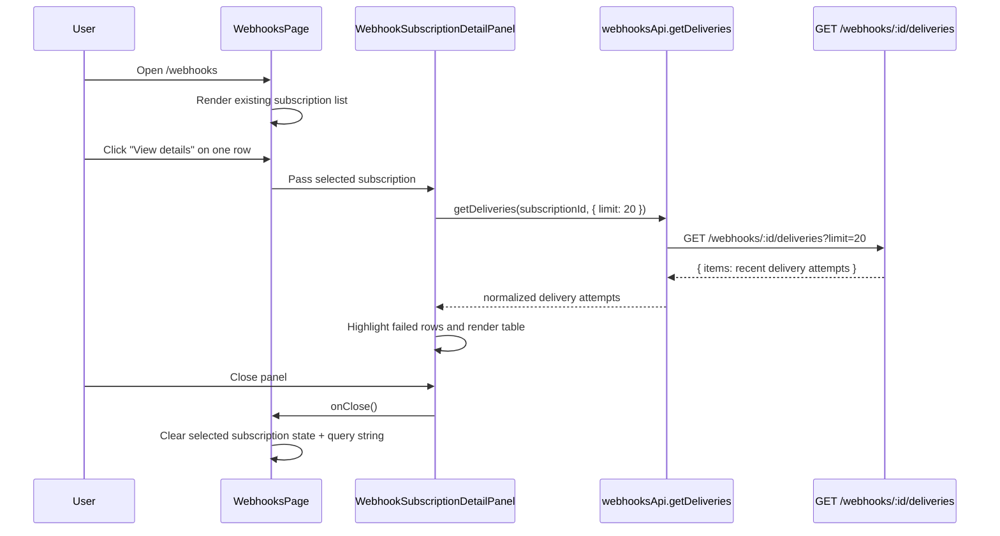

# Module: wh-ui-04 — Webhook subscription delivery log

**Covers:** WH-UI-04
**Files:** `web/src/pages/dlq/WebhooksPage.tsx` (extend list page with detail access),
          `web/src/components/webhooks/WebhookSubscriptionDetailPanel.tsx` (new),
          `web/src/components/webhooks/WebhookDeliveryAttemptsTable.tsx` (new),
          `web/src/api/dlq.ts` (extend webhook API surface),
          `web/src/api/queryKeys.ts` (add detail and deliveries query keys),
          `web/src/types/api.ts` (add delivery-attempt response types),
          `web/tests/e2e/f6-webhooks.e2e.spec.ts` (extend coverage for WH-UI-04)
**Status:** DRAFT

---

## Module purpose

Add a subscription-detail inspection flow under the existing F6 webhook surface so
an operator can open a subscription from the `/webhooks` list and review recent
delivery attempts. The detail view must show the selected subscription context and
render a compact delivery-attempt table with clear failure emphasis, using a
dedicated API read path rather than overloading the list endpoint.

---

## Classification rationale

**Type E** — This requirement extends an existing list page with a custom detail
interaction, asynchronous dependent data loading, and row-level visual treatment
for failed attempts. It does not match the Type B pattern because the primary new
behaviour is not a standalone admin list page; it is a detail subview attached to
the existing webhook management page.

---

## Public interface

### 3.1 Delivery-attempt types

Located in `web/src/types/api.ts`.

```typescript
export type WebhookDeliveryAttemptStatus = 'SUCCESS' | 'FAILED'

export interface WebhookDeliveryAttempt {
  delivery_id: string
  subscription_id: string
  event_type: string
  status: WebhookDeliveryAttemptStatus
  http_status_code: number | null
  attempted_at: string
  attempt_count: number
  max_attempts: number
  last_error?: string | null
}

export interface WebhookDeliveryAttemptListResponse {
  items: WebhookDeliveryAttempt[]
}
```

**Contract notes:**
1. `attempted_at` is the timestamp the UI renders in the delivery-log table.
2. The backend returns a normalized `status` field so the UI does not derive
   success/failure from nullable DB columns.
3. `http_status_code` may be `null` for transport failures or timeouts.

### 3.2 API client contract

Located in `web/src/api/dlq.ts`.

```typescript
export interface WebhooksApiContract {
  list(): Promise<{ items: WebhookSubscription[] }>
  getDeliveries(
    subscriptionId: string,
    params?: { limit?: number },
  ): Promise<WebhookDeliveryAttemptListResponse>
}
```

**Route contract:** `getDeliveries` reads from API-07 `GET /webhooks/:id/deliveries`.

**Design notes:**
1. The client module remains the only place that knows how the shared API base
   path is prefixed.
2. The delivery-log view depends only on the route contract above, not on a
   concrete request-library implementation.

### 3.3 Query-key additions

Located in `web/src/api/queryKeys.ts`.

```typescript
export interface WebhookQueryKeyFactory {
  all: readonly ['webhooks']
  list(): readonly unknown[]
  detail(id: string): readonly unknown[]
  deliveries(id: string, limit?: number): readonly unknown[]
}
```

**Contract notes:**
1. The factory must reserve distinct cache slots for the subscription list, the
   selected subscription detail context, and the deliveries feed.
2. The deliveries key must vary by both `subscriptionId` and `limit` so the
   detail panel does not alias differently sized delivery-log reads.

### 3.4 Detail-panel component

Located in `web/src/components/webhooks/WebhookSubscriptionDetailPanel.tsx`.

```typescript
interface WebhookSubscriptionDetailPanelProps {
  subscription: WebhookSubscription
  isOpen: boolean
  onClose: () => void
}

export function WebhookSubscriptionDetailPanel(
  props: WebhookSubscriptionDetailPanelProps,
): JSX.Element
```

**Behaviour:**
1. Opens from the existing `/webhooks` page without navigating away from the F6
   surface.
2. Shows subscription summary fields at the top: target URL, current status,
   subscribed event types, and created timestamp.
3. Starts a dependent query for recent deliveries only when `isOpen` is `true`.
4. Renders loading, empty, and error states inside the panel.
5. Closes via explicit close button and Escape key.

### 3.5 Delivery-attempt table component

Located in `web/src/components/webhooks/WebhookDeliveryAttemptsTable.tsx`.

```typescript
interface WebhookDeliveryAttemptsTableProps {
  attempts: WebhookDeliveryAttempt[]
}

export function WebhookDeliveryAttemptsTable(
  props: WebhookDeliveryAttemptsTableProps,
): JSX.Element
```

**Rendered columns:**
1. `Status` — badge or text label with `SUCCESS` / `FAILED`.
2. `HTTP code` — numeric code or `—` when request failed before response.
3. `Timestamp` — localized display of `attempted_at`.
4. `Event type` — helpful secondary context for the operator.
5. `Attempt` — `attempt_count / max_attempts` to explain repeated failures.

### 3.6 Page-level selection state

Located in `web/src/pages/dlq/WebhooksPage.tsx`.

```typescript
interface SelectedWebhookDetailState {
  subscriptionId: string | null
}
```

**Behaviour:**
1. Each subscription row gains a `View details` action.
2. Clicking the action sets the selected subscription id in component state and
   mirrors it into the URL query string as `?subscription=<id>` so refresh keeps
   the same detail panel open.
3. Closing the panel clears both local selection state and the query-string value.

---

## Data flow



---

## State transitions

### Detail access state

- `none -> opening` when the operator clicks `View details`.
- `opening -> loaded` when the subscription summary is present and the delivery
  query returns successfully.
- `opening -> empty` when the API returns zero recent attempts.
- `opening -> error` when the delivery query fails.
- `loaded | empty | error -> none` when the operator closes the panel.

### Delivery-row visual state

- `success` rows render with neutral background and success badge styling.
- `failed` rows render with a warning/danger-tinted background plus stronger text
  contrast on the status cell.
- Highlighting is based on the normalized `status` value from the API, not on
  client-side inference from the HTTP code alone.

---

## Error taxonomy

| Error | Cause | UI behaviour |
|---|---|---|
| `WebhookDeliveryLogLoadFailed` | `GET /deliveries` returns 5xx or network failure | Show inline recoverable error panel in the detail view with retry action |
| `WebhookDeliveryLogUnauthorized` | session expired or role no longer valid | Existing client auth handling redirects through the shared API client |
| `WebhookDeliveryLogNotFound` | selected subscription was deleted before detail load | Close panel and show transient error message on the list page |
| `WebhookDeliveryLogContractMismatch` | API omits `status`, `attempted_at`, or `items` | Render contract error state; do not silently swallow malformed rows |
| `WebhookDeliveryLogEmpty` | no attempts exist yet for the selected subscription | Show an empty-state message: `No delivery attempts recorded yet.` |

---

## Key invariants

1. The webhook list remains the source of subscription summary data; opening the
   detail panel does not trigger a second list fetch.
2. The delivery-log request is read-only and scoped to the selected subscription.
3. Failed attempts are visually emphasized at the row level, not just by a badge,
   to satisfy the requirement for failed-row highlighting.
4. The panel must remain usable even when a delivery has no HTTP response code
   because the request failed before a response was received.
5. Refreshing `/webhooks?subscription=<id>` re-opens the same detail panel if the
   subscription still exists in the list payload.

---

## Dependencies

### Calls into

- `web/src/pages/dlq/WebhooksPage.tsx` for row actions and selected-subscription state.
- `web/src/api/dlq.ts` for the new deliveries endpoint.
- `web/src/api/queryKeys.ts` for stable TanStack Query cache keys.
- `web/src/types/api.ts` for delivery-attempt response modeling.
- `web/tests/e2e/f6-webhooks.e2e.spec.ts` for WH-UI-04 visual verification.

### Must not depend on

- Direct `fetch` or ad hoc request code in page/components.
- A brand-new top-level route when the requirement only needs detail access under
  the existing webhook surface.
- Inferring failure highlighting solely from missing `delivered_at` or nullable
  DB fields in the client.

---

## Required test-surface updates

`web/tests/e2e/f6-webhooks.e2e.spec.ts` must add WH-UI-04 coverage with real
backend fixtures and screenshots after each significant action:

1. `TC-WH-UI-04-01`: opening `View details` from a subscription row shows the
   selected subscription summary and a delivery table with `Status`, `HTTP code`,
   and `Timestamp` columns.
2. `TC-WH-UI-04-02`: when a subscription has at least one failed delivery, the
   failed row is visibly highlighted and still shows its HTTP code or `—`.
3. `TC-WH-UI-04-03`: when a subscription has no attempts yet, the detail panel
   shows the empty-state copy instead of a broken or blank table.

Fixture setup should continue to use real API calls and database-backed webhook
delivery behaviour; no HTTP mocking is introduced.

---

## Coverage matrix

| Requirement area | Design coverage |
|---|---|
| Subscription detail access | Row-level `View details` action plus query-string-backed selection state |
| Recent delivery attempts table | `WebhookDeliveryAttemptsTable` component and `getDeliveries` API contract |
| Failed-row highlighting | Row visual state and invariant requiring tinting based on normalized `status` |
| API dependency | Explicit API-07 `GET /webhooks/:id/deliveries` client contract and delivery-log query-key surface |

---

## Open questions

None.